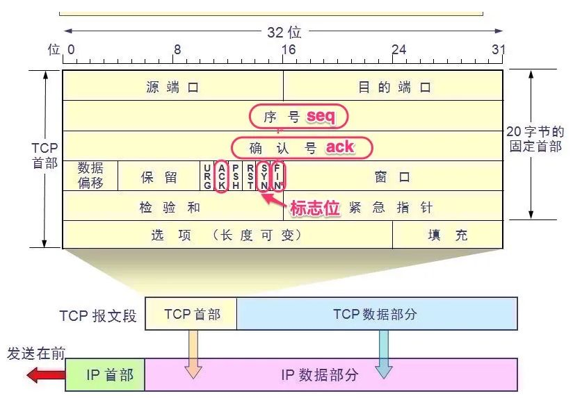
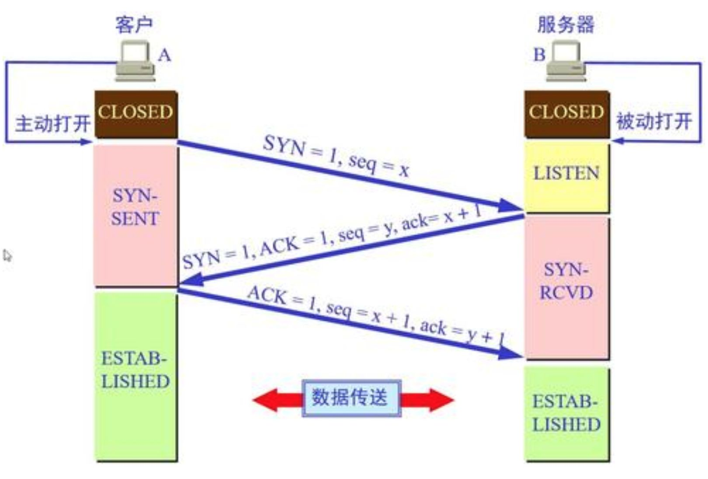
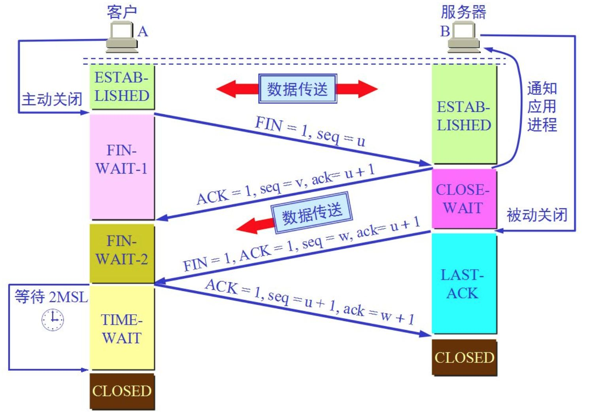
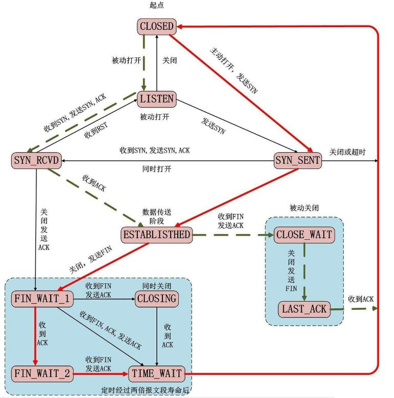

**TCP (Transmission Control Protocol)** 是一种面向连接的、可靠的、基于字节流的传输层协议。为了在不可靠的 IP 层上提供可靠的服务，TCP 设计了一套复杂的头部结构和有限状态机 (FSM)
# TCP 协议简介
TCP之所以可以自动进行数据包的丢失重传、自动充足、保证有序，甚至可以对网络拥塞做出自动调整数据发送量，原因是TCP有一个表征了所有这些信息的头部，即所谓的TCP协议头，它被装载到每一个TCP数据段上相比于 UDP 简单的 8 字节头部，TCP 的头部至少为 20 字节，包含了大量的控制信息

## 核心字段详解
- **源端口 (Source Port) 与 目的端口 (Destination Port)**
    - 各占 16 位（2字节）。
    - **作用**：标识通信双方的应用程序（进程）。IP 地址决定了数据发给哪台机器，而端口决定了发给机器上的哪个程序。
- **序号 (Sequence Number, seq)**
    - 占 32 位。
    - **作用**：TCP 是面向字节流的，该字段标记了本报文段发送的数据的**第一个字节**在整个数据流中的相对位置。
    - **初始值**：在建立连接时（SYN 包），序号并非从 0 开始，而是由系统随机生成一个初始序列号 (**ISN**)，以防止网络攻击。
- **确认号 (Acknowledgment Number, ack)**
    - 占 32 位。
    - **作用**：表示**期望**收到对方下一个报文段的第一个数据字节的序号。
    - **含义**：若确认号为 $N$，则表明序号 $N-1$ 为止的所有数据都已正确收到。
- **数据偏移 (Data Offset) / 首部长度**
    - 占 4 位。
    - **作用**：指出 TCP 报文段的数据起始处距离 TCP 报文段的起始处有多远。
    - **单位**：以 **4 字节**为单位。例如该字段值为 5，则表示头部长度为 $5 \times 4 = 20$ 字节（标准长度）；最大值为 15，即头部最长 $15 \times 4 = 60$ 字节。
- **保留 (Reserved)**
    - 占 6 位，保留为今后使用，目前应置为 0。
- **标志位 (Control Flags)**
- **窗口 (Window)**
    - 占 16 位。
    - **作用**：**流量控制**的核心。它告诉对端：“我目前的接收缓冲区还有多少空余空间”。发送方根据这个值来控制发送速度，防止接收方来不及处理而丢包。
- **校验和 (Checksum)**
    - 占 16 位。
    - **作用**：强制校验。覆盖了 TCP 头部、伪头部和数据部分，用于检测数据在传输过程中是否发生变化（如比特翻转）。
    - **扩展**：如果校验失败，接收方会直接丢弃该包，且不发送 ACK（等待发送方超时重传）。
- **紧急指针 (Urgent Pointer)**
    - 占 16 位。
    - **作用**：只有当 `URG` 标志置 1 时有效。它是一个偏移量，指向紧急数据（OOB）的最后一个字节。
## 六大标志位 (Control Flags)
TCP 使用 6 个比特位来控制连接的状态流转，理解它们是掌握网络编程调试的关键

| **标志位** | **全称**          | **含义与扩展解析**                                                                                 |
| ------- | --------------- | ------------------------------------------------------------------------------------------- |
| **URG** | Urgent          | **紧急**。置 1 时表示紧急指针有效，告诉系统此报文段中有紧急数据，应尽快传送（相当于高优先级数据）。                                       |
| **ACK** | Acknowledgment  | **确认**。置 1 时确认号字段有效。**重要规则**：除了最初建立连接的 SYN 包之外，TCP 通信过程中所有数据包的 ACK 位都必须置 1。                 |
| **PSH** | Push            | **推送**。置 1 时，接收方收到数据后应立即提交给应用层，而不是在缓冲区排队等待填满。常用于交互式应用（如 Telnet）。                            |
| **RST** | Reset           | **复位**。置 1 时表示连接出现严重差错（如主机崩溃、端口未监听），必须释放连接并重新建立。收到 RST 的一方通常会报错 "Connection reset by peer"。 |
| **SYN** | Synchronization | **同步**。用于在连接建立时同步序号。`SYN=1, ACK=0` 表示这是一个连接请求报文。                                            |
| **FIN** | Finish          | **终止**。用来释放一个连接。置 1 表明发送方的数据已发送完毕，并要求释放传输连接。                                                |


# TCP 连接的生命周期
TCP 是全双工协议，其连接的建立和断开过程严谨而复杂。
## 三次握手 (Three-Way Handshake)

建立连接的过程实质上是双方交换初始序列号 (ISN) 并确认接收能力的过程。
1. **第一次握手 (Client -> Server)**
    - **动作**：客户端调用 `connect()`，发送 `SYN=1`，随机产生序列号 $seq=x$。
    - **状态**：客户端进入 **`SYN_SENT`** 状态。
    - **注意**：此时如果服务端未监听端口，会回复 RST 包，客户端报错 "Connection refused"
2. **第二次握手 (Server -> Client)**
    - **动作**：服务端收到 SYN，必须确认客户的 SYN（$ack=x+1$），同时自己也发送一个 SYN ($seq=y$)。即发送 `SYN=1, ACK=1`。
    - **状态**：服务端进入 **`SYN_RCVD`** 状态。
3. **第三次握手 (Client -> Server)**
    - **动作**：客户端收到 SYN+ACK，向服务端发送确认包 `ACK=1`，确认号 $ack=y+1$，序列号 $seq=x+1$。
    - **状态**：客户端进入 **`ESTABLISHED`**（连接已建立）。服务端收到 ACK 后，也进入 **`ESTABLISHED`**。
    - **扩展**：服务端收到 ACK 后，将连接从半连接队列移入**全连接队列 (Accept Queue)**，等待应用层调用 `accept()` 取出。
        
> **注意**：`SYN` 包不携带数据，但必须消耗一个序号，因此下一次发送时的 seq 必须 +1。
## 四次挥手 (Four-Way Wave)
由于 TCP 是全双工的（A 可以发给 B，B 也可以发给 A），断开连接时需要关闭两个方向的通道，这就导致了“四次挥手”。

1. **第一次挥手 (主动方发送 FIN)**
    - **场景**：客户端（主动方）数据发送完毕，调用 `close()`。
    - **动作**：发送 `FIN=1`，序号 $seq=u$。
    - **状态**：客户端进入 **`FIN_WAIT_1`**。
    - **含义**：客户端宣告“我没数据发给你了，但我还可以收数据”（半关闭状态）。
2. **第二次挥手 (被动方回应 ACK)**
    - **动作**：服务端收到 FIN，回复 `ACK=1`，确认号 $ack=u+1$。
    - **状态**：服务端进入 **`CLOSE_WAIT`**（等待关闭）。客户端收到 ACK 后进入 **`FIN_WAIT_2`**。
    - **注意**：**`CLOSE_WAIT` 是最容易出问题的状态**。如果服务器收到了 FIN 但没有代码逻辑去调用 `close()`，服务器就会一直卡在 `CLOSE_WAIT`，导致资源泄漏。
3. **第三次挥手 (被动方发送 FIN)**
    - **场景**：服务端处理完剩余数据后，也调用 `close()`。
    - **动作**：发送 `FIN=1`，序号 $seq=w$，确认号 $ack=u+1$。
    - **状态**：服务端进入 **`LAST_ACK`**。
4. **第四次挥手 (主动方回应 ACK)**
    - **动作**：客户端收到 FIN，回复 `ACK=1`，确认号 $ack=w+1$。
    - **状态**：服务端收到后进入 `CLOSED`。客户端进入 **`TIME_WAIT`**，等待 2MSL 后才进入 `CLOSED`。
# TCP 状态机 (State Machine)

TCP 的状态流转图展示了连接从建立到断开的所有可能路径。理解这些状态对于排查网络问题（如 `netstat` 命令结果分析）至关重要。

## 状态分类
- 主动发起连接者 (客户端) 路径：
    CLOSED -> SYN_SENT -> ESTABLISHED -> FIN_WAIT_1 -> FIN_WAIT_2 -> TIME_WAIT -> CLOSED。
- 被动接受连接者 (服务端) 路径：
    CLOSED -> LISTEN -> SYN_RCVD -> ESTABLISHED -> CLOSE_WAIT -> LAST_ACK -> CLOSED。
## 关键状态解析
- **LISTEN**：服务端调用 `listen()` 后处于此状态，等待连接。
- **ESTABLISHED**：代表数据传输通道已打开，可以进行 `read/write`。
- **CLOSE_WAIT**：表示“对方已经关了，在等我关”。大量 `CLOSE_WAIT` 通常意味着**服务端代码有 Bug**（忘记调用 close）。
    

# TIME_WAIT 状态
在实际的高并发服务器开发中，`TIME_WAIT` 是最常遇到的“坑”。
## 什么是 TIME_WAIT？
它是**主动关闭连接的一方**在发送最后一个 ACK 后进入的状态。此时连接并未彻底释放，而是保持了一段时间。
## 为什么必须等待 2MSL？
**MSL (Maximum Segment Lifetime)** 指报文最大生存时间（Linux 默认 60秒，2MSL 即 2 分钟）。等待的原因有两个：
1. **确保可靠关闭**：如果主动方回复的最后一个 ACK 丢失，服务端会超时重发 FIN。如果主动方直接 CLOSED，收到重发的 FIN 会回 RST，导致服务端报错。处于 `TIME_WAIT` 可以让主动方重发 ACK。
2. **防止“脏数据”干扰**：确保本次连接中产生的所有数据包都在网络中消亡。防止新的连接（使用相同 IP 和端口）收到了上一个连接的延迟数据包，导致数据错乱。
## 带来的问题
`TIME_WAIT` 状态下的套接字会占用本地端口。
- **场景**：如果服务器异常重启（由于它是主动关闭方），或者服务器作为客户端高频请求下游服务。
- **后果**：端口被占满，重启服务器时无法绑定端口，报错 `Address already in use`；或者无法建立新的对外连接。
## 解决方案：地址复用
在 Linux 网络编程中，可以通过设置套接字选项 `SO_REUSEADDR` 来解决服务器重启时的绑定失败问题。
**代码实现**：
```c
int sockfd = socket(AF_INET, SOCK_STREAM, 0);

// 必须在 bind 之前设置
int on = 1;
// 允许重用处于 TIME_WAIT 状态的地址和端口
if (setsockopt(sockfd, SOL_SOCKET, SO_REUSEADDR, &on, sizeof(on)) < 0) {
    perror("setsockopt");
    exit(1);
}

bind(sockfd, ...);
```

这段代码告诉内核：如果端口处于 `TIME_WAIT` 状态，请允许我直接绑定并使用它，不要报错。

```dataviewjs
await dv.view("90 - 系统文件/92 - 插件配置/Scripts/nav")
```