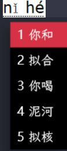
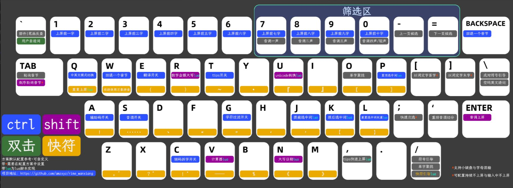

本文档详细记录了基于 Weasel（小狼毫）框架部署 **万象拼音** 输入方案的方法，通过本配置指南，将摆脱云端词库的依赖与束缚，掌握一套完全本地运行、逻辑自洽且功能强大的中文输入体系
## 安装部署与方案导入
### 1. 下载与安装小狼毫 (Weasel)
- **获取安装包**：访问 [RIME 官网](https://rime.im/) 下载最新版小狼毫安装包，双击运行并完成安装
- **初始化设置**：安装完毕后，在任务栏右下角找到“小狼毫”图标，右键单击并选择【程序文件夹】随后双击运行 `Whistle Setup`（或在右键菜单中选择【安装选项】）
- **用户文件夹设定**：在此界面，建议**自定义用户文件夹的位置**（例如设置在非系统盘），以便于日后备份与管理配置文件
### 2. 获取万象拼音方案
- 前往万象拼音的 [GitHub](https://github.com/amzxyz/rime_wanxiang?tab=readme-ov-file) 或 CNB 仓库 Release 页面
- **下载核心文件**（需下载以下两类）：
    1. **方案压缩包**（`rime-wanfang-base.zip`）：新手强烈建议下载带有 `base` 后缀的“标准版”该版本已内置词库，开箱即用，能充分满足日常输入需求且上手难度低
    2. **语法模型文件**（`wanfang-lts-zh-hans.gram`）：直接下载该文件备用
### 3. 导入输入方案
- **定位目录**：右键点击任务栏的小狼毫图标，选择【用户文件夹】打开配置目录
- **文件植入**：将解压后的**方案文件**以及下载好的**语法模型文件**，全部拖入打开的用户文件夹根目录中
- **激活方案**：
    1. 右键点击小狼毫图标，选择【输入法设定】
    2. 在弹出的方案列表中勾选“万象拼音”，同时取消勾选其他暂不需要的方案
    3. 点击“中”按钮，耐心等待后台部署完成
---

## 基础配置与模式切换

万象拼音默认采用**全拼**模式如果您是**双拼**用户（如自然码、小鹤双拼等），请按照以下推荐方式进行切换
### 1. 自动化指令切换
这是最安全、便捷的切换方式，系统会自动生成并管理配置文件，避免因软件更新导致配置丢失
- **操作方法**：在中文输入状态下，直接键入对应的切换指令
- **后续步骤**：输入指令后，右键点击小狼毫图标选择【重新部署】，即可生效
**常用切换指令表：**
```Plaintext
/flypy    → 切换至：小鹤双拼
/mspy     → 切换至：微软双拼
/zrm      → 切换至：自然码
/sogou    → 切换至：搜狗双拼
/znabc    → 切换至：智能ABC
/pinyin   → 切换至：全拼模式
```
### 2. 声调辅助筛选功能
万象拼音内置了高效的声调筛选机制，利用数字键精确定位同音字：
- **操作逻辑**：输入拼音后，追加数字键 `7`、`8`、`9`、`0`
- **对应关系**：分别对应一声、二声、三声、四声（含轻声）
---
## 进阶深度定制

**核心原则**：所有个性化修改建议在 `custom`（补丁）文件中进行，**每次修改完成后，务必执行【重新部署】操作方可生效**

### 1. 调整候选词数量
- **文件路径**：打开用户目录下的万象拼音 `custom` 配置文件（通常命名为 `wanxiang_pinyin.custom.yaml`）
- **修改参数**：找到 `menu/page_size` 字段
    ```YAML
    menu/page_size: 5  # 建议值
    ```

- **注意事项**：默认情况下，键盘数字键的后四位（7890）被预留给声调筛选功能因此，若将候选词数量设置超过 6，将会占用这些键位，导致声调筛选功能失效
### 2. 启用或禁用模糊音
- **定位配置**：在 `custom` 文件的底部，通常预置了一块模糊音配置区域
- **启用模糊音**：将对应规则行首的 `#` 注释符号删除
- **关闭模糊音**：在不需要的规则行首添加 `#` 注释符号
### 3. 自定义翻页快捷键
默认翻页键为 `+` 和 `-`若您习惯使用逗号 `,` 和句号 `.` 翻页，需在 `custom` 文件中添加以下 `patch` 代码：
```YAML
patch:
  key_binder/bindings:
    # 方案1：减号(-) 和 等号(=) 翻页
    - { when: has_menu, accept: minus, send: Page_Up }
    - { when: has_menu, accept: equal, send: Page_Down }

    # 方案2：逗号(,) 和 句号(.) 翻页
    - { when: has_menu, accept: comma, send: Page_Up }
    - { when: has_menu, accept: period, send: Page_Down }

    # 方案3：方括号 [ 和 ] 翻页
    - { when: has_menu, accept: bracketleft, send: Page_Up }
    - { when: has_menu, accept: bracketright, send: Page_Down }

    # 方案4：Tab 键翻页
    - { when: has_menu, accept: Tab, send: Page_Down }
    - { when: has_menu, accept: "Shift+Tab", send: Page_Up }
```
### 4. 优化“数字+标点”上屏体验
Rime 默认允许使用逗号/句号作为数字的分隔符（如 3.14 或 1,000），这会导致输入数字后按逗号无法立即上屏
- **解决方案**：通过以下补丁将数字分隔符设为空，实现数字后标点直接上屏
```YAML
patch:
  # 彻底解决数字后标点无法直接上屏的问题
  punctuator/digit_separators: ""
```
### 5. 外观定制：更换皮肤与字体
**注意**：外观配置需修改 `weasel.custom.yaml` 文件（不同于输入方案的配置文件）
- **应用皮肤**：修改 `style/color_scheme` 字段，填入目标皮肤的 ID（例如 `summer_red_dark`）
- **推荐配置（夏日三原色）**：直接将此文本复制到 weasel. yaml 文件下
- 
```YAML
patch:
  style:
    color_scheme: summer_red_dark       # 在此处修改当前使用的皮肤ID
    
    # 全局字体设置
    font_face: "霞鹜文楷, Segoe UI Emoji, Microsoft YaHei, SF Pro, Noto Color Emoji"
    label_font_face: "Microsoft YaHei"
    comment_font_face: "Microsoft YaHei"
    font_point: 13
    label_font_point: 13
    comment_font_point: 12
    
    # 界面布局微调
    inline_preedit: true
    preedit_type: composition
    fullscreen: false
    horizontal: false
    vertical_text: false
    vertical_text_left_to_right: false
    vertical_text_with_wrap: false
    vertical_auto_reverse: false
    label_format: " %s"
    mark_text: ""
    ascii_tip_follow_cursor: false
    enhanced_position: true
    display_tray_icon: false
    antialias_mode: default
    candidate_abbreviate_length: 30
    hover_type: semi_hilite
    paging_on_scroll: true
    click_to_capture: false
    
    layout:
      align_type: left
      max_height: 2800
      max_width: 1400
      min_height: 0
      min_width: 80
      border_width: 0
      border: 0
      margin_x: 0
      margin_y: 0
      spacing: 0
      candidate_spacing: 4
      hilite_spacing: 5
      hilite_padding: 8
      hilite_padding_y: 6
      hilite_padding_x: 5
      shadow_offset_x: "-8"
      shadow_offset_y: "8"
      shadow_radius: 8
      corner_radius: 0
      round_corner: 0

  preset_color_schemes:
    # 1. 夏日·红 (Summer Red)
    summer_red:
      name: "夏日·红 / Summer Red"
      author: "User Custom"
      back_color: 0xffffff
      border_color: 0xffffff
      shadow_color: 0x20000000
      hilited_back_color: 0x4531D7
      hilited_candidate_back_color: 0x4531D7
      text_color: 0x424242
      candidate_text_color: 0x3c3c3c
      label_color: 0x3c3c3c
      comment_text_color: 0x999999
      hilited_text_color: 0xffffff
      hilited_candidate_text_color: 0xffffff
      hilited_label_color: 0xffffff
      hilited_comment_text_color: 0xffffff
      hilited_mark_color: 0x00000000

    summer_red_dark:
      name: "夏日·红暗 / Summer Red Dark"
      author: "User Custom"
      back_color: 0x000000
      border_color: 0x000000
      shadow_color: 0x40000000
      hilited_back_color: 0x4531D7
      hilited_candidate_back_color: 0x4531D7
      text_color: 0xffffff
      candidate_text_color: 0xffffff
      label_color: 0xffffff
      comment_text_color: 0xffffff
      hilited_text_color: 0xffffff
      hilited_candidate_text_color: 0xffffff
      hilited_label_color: 0xffffff
      hilited_comment_text_color: 0xffffff
      hilited_mark_color: 0x00000000

    # 2. 夏日·绿 (Summer Green)
    summer_green:
      name: "夏日·绿 / Summer Green"
      author: "User Custom"
      back_color: 0xffffff
      border_color: 0xffffff
      shadow_color: 0x20000000
      hilited_back_color: 0x31753E
      hilited_candidate_back_color: 0x31753E
      text_color: 0x424242
      candidate_text_color: 0x3c3c3c
      label_color: 0x3c3c3c
      comment_text_color: 0x999999
      hilited_text_color: 0xffffff
      hilited_candidate_text_color: 0xffffff
      hilited_label_color: 0xffffff
      hilited_comment_text_color: 0xffffff
      hilited_mark_color: 0x00000000

    summer_green_dark:
      name: "夏日·绿暗 / Summer Green Dark"
      author: "User Custom"
      back_color: 0x000000
      border_color: 0x000000
      shadow_color: 0x40000000
      hilited_back_color: 0x31753E
      hilited_candidate_back_color: 0x31753E
      text_color: 0xffffff
      candidate_text_color: 0xffffff
      label_color: 0xffffff
      comment_text_color: 0xffffff
      hilited_text_color: 0xffffff
      hilited_candidate_text_color: 0xffffff
      hilited_label_color: 0xffffff
      hilited_comment_text_color: 0xffffff
      hilited_mark_color: 0x00000000

    # 3. 夏日·蓝 (Summer Blue)
    summer_blue:
      name: "夏日·蓝 / Summer Blue"
      author: "User Custom"
      back_color: 0xffffff
      border_color: 0xffffff
      shadow_color: 0x20000000
      hilited_back_color: 0xCE6617
      hilited_candidate_back_color: 0xCE6617
      text_color: 0x424242
      candidate_text_color: 0x3c3c3c
      label_color: 0x3c3c3c
      comment_text_color: 0x999999
      hilited_text_color: 0xffffff
      hilited_candidate_text_color: 0xffffff
      hilited_label_color: 0xffffff
      hilited_comment_text_color: 0xffffff
      hilited_mark_color: 0x00000000

    summer_blue_dark:
      name: "夏日·蓝暗 / Summer Blue Dark"
      author: "User Custom"
      back_color: 0x000000
      border_color: 0x000000
      shadow_color: 0x40000000
      hilited_back_color: 0xCE6617
      hilited_candidate_back_color: 0xCE6617
      text_color: 0xffffff
      candidate_text_color: 0xffffff
      label_color: 0xffffff
      comment_text_color: 0xffffff
      hilited_text_color: 0xffffff
      hilited_candidate_text_color: 0xffffff
      hilited_label_color: 0xffffff
      hilited_comment_text_color: 0xffffff
      hilited_mark_color: 0x00000000
```

---

## 日常交互与实用功能
### 1. 方案选单控制
- **快捷热键**：按下 `Ctrl + Grave`（即键盘左上角 `Esc` 下方的 `~` 波浪号键）

- **功能详解**：此选单可用于快速切换“简/繁体输出”、“Emoji 表情开关”、“中/英文模式”等系统会自动记忆您的选择，即使重启电脑后，这些设置依然保持生效
### 2. 特色增强功能
- 超级提示：
    万象拼音具备智能联想功能当您输入特定编码时，候选框尾部会浮现出特殊提示（如化学分子式、当前时间、车牌代码等）使用方向键选中对应候选词时，提示内容会实时同步更新
- 符号引导与包裹：
    支持通过预设的引导键（可在配置文件中查看 trigger 字段设定）快速调用特殊符号，或将选中的文字自动包裹在括号、书名号等符号中，大幅提升排版效率
---

**最后提醒**：完成上述任何一项修改操作后，请务必右键点击任务栏的小狼毫图标，选择**【重新部署】**只有在部署进度条走完之后，您的最新配置才会正式生效

## 进阶交互
### 1. 多维输入模式与指令系统
万象拼音内置了丰富的“以字导意”功能，通过特定的引导键，无需切换软件即可完成日期、计算、大写数字等输入

| **功能分类**     | **触发指令 / 操作方式**          | **应用场景示例**                                      |
| ------------ | ------------------------ | ----------------------------------------------- |
| **日期快输**     | 输入 `/rq` (日期) 或 `orq`    | 直接上屏：`2025年6月12日`                               |
| **数字日期**     | `N` + 年月日 (Shift+N)      | 输入 `N20250723` → 可选 `2025年7月23日` 或 `2025-07-23` |
| **数学计算**     | `V` + 算式 (Shift+V)       | 输入 `V1+2*3/4` → 候选框直接显示计算结果                     |
| **大写数字**     | `R` + 数字 (Shift+R)       | 输入 `R1234` → 候选显示 `壹仟贰佰叁拾肆` (金额大写利器)            |
| **Emoji 表情** | 输入 `/bq`                 | 呼出 Emoji 候选面板 (如 😀 等)                          |
| **特殊符号**     | 输入 `/fh` 或直接查看 `symbols` | 呼出各类数学、单位等特殊符号                                  |
| **版本查询**     | 输入 `/wx`                 | 查看当前方案版本 (如：增强版 v9.2.1)                         |

> [!tip]
> 上述表格中的“Shift+字母”操作，是指在中文输入状态下直接按下大写字母键引导（例如按 `Shift+v` 会直接显示 `V` 并进入计算模式）

### 2. 方案选单与关键开关详解
按下 `Ctrl + Grave` (`~` 键) 或 `F4` 唤出的方案选单是控制输入法行为的中枢以下是几个核心开关的深度解析：
- **小字集 vs. 大字集 (Character Sets)**
    - **小字集 (默认)**：仅收录《通用规范汉字表》中的 8105 个汉字优势在于候选词纯净，重码率低，翻页少，适合绝大多数日常聊天和办公
    - **大字集**：解锁繁体、异体及大量生僻字（如“苝”、“磺”、“叡”等）
    - **选择建议**：如果您从事生物化工、历史文学创作，或地名中包含生僻字，请开启大字集否则，建议保持“小字集”以获得最高效的选词体验
- **简体 vs. 繁体转换**
    - RIME 的繁简转换基于 OpenCC 引擎
    - **通繁**：转换为 OpenCC 标准繁体（不特定于某地区）
    - **港繁/臺繁**：针对香港或台湾地区的用字习惯进行精准转换（如“软件”转为“軟體”）
- **编码显示模式 (原编码/有声调)**
    - 此功能改变输入框（Preedit）的视觉反馈
    - **有声调/无声调模式**：会将您输入的双拼编码（如 `ulpb`）实时翻译为汉语拼音显示（如 `shuang pin`）在此模式下，按下 `Shift + Enter` 可直接上屏拼音串，非常适合教学或标注拼音
### 3. 独特的交互特性
如果您是初次接触 RIME 或万象，以下特性设计可能会让您感到新奇：
- **Emoji 的“超级提示”设计**
    - **现象**：输入英文单词（如 `happy`）或特定编码时，Emoji 会显示在候选词的**右侧提示区**，而不是占用候选词的主位置
    - **操作**：默认按下 **逗号 (`,`)** 即可将右侧提示的 Emoji 上屏（旧版本可能是句号）
- **智能调频 vs. 肌肉记忆**
    - **Base 标准版**：默认开启调频输入法会“记住”您最常打的词，并将其提前
    - **Pro 辅助码版**：默认关闭调频词序固定，利于培养长期的“肌肉记忆”和盲打能力
### “魔法”引导功能：快符与包裹
这是万象拼音极具特色的两个功能，掌握后排版效率倍增
#### 5.1 快速符号
打破了传统“分号+字符”的旧习惯，采用更顺手的 **“字符 + `/`”** 逻辑
- **操作逻辑**：输入 `[任意字符]` + `/`
- **示例**：您可以设置输入 `a/` 自动上屏 `α`，或输入 `q/` 自动上屏 `?`
- **如何自定义**：在 `custom` 配置文件中修改，将您高频使用的符号绑定到顺手的字母上
#### 5.2 成对符号包裹
想要给刚才打出的字快速加上书名号或括号？无需移动光标，一键搞定
- **操作逻辑**：输入内容（未上屏状态） -> 按下 `\` (反斜杠) -> 按下 `[引导字符]`
- **示例**
    1. 输入文字 `三体`（停留在候选框，不要回车）
    2. 按下 `\` 键（进入包裹模式）
    3. 按下 `b` (假设 b 绑定了书名号)
    4. 结果：屏幕上显示 `《三体》`