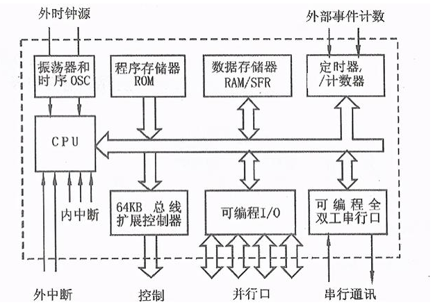

# 51单片机概述
## 一、概述

51单片机（亦称8051单片机）最初指1980年Intel公司推出的**8位微控制器系列**，如今已成为所有兼容该指令集架构的微控制器的统称。这类芯片凭借其**精简的硬件设计**和**成熟的生态体系**，在嵌入式领域占据了长达四十余年的重要地位。


从架构层面看，51单片机采用了经典的**哈佛架构**，将程序存储器和数据存储器在物理上分开，这种设计使得指令读取和数据访问可以并行进行，显著提升了执行效率。上图展示了其典型的内部结构，包含CPU核心、存储器、定时器、中断系统和I/O端口等模块。



引脚分布方面，51单片机通常采用**DIP40**或**PLCC44**等封装形式，上图展示了常见的引脚排列。需要特别注意的是**P0口**在作为普通I/O时需要外接上拉电阻，而**P3口**的每个引脚都具备第二功能，如串口通信、外部中断等。

### 核心资源概览

- **存储器配置**
  - **ROM（程序存储器）**：容量范围从基础的4KB到扩展的64KB，用于存储固化后的应用程序代码。早期型号采用Mask ROM或EPROM，现代型号普遍使用可反复擦写的Flash存储器。
  - **RAM（数据存储器）**：容量通常为128B至256B，用于程序运行时的变量存储和堆栈操作。虽然容量有限，但通过巧妙的存储管理，足以应对多数控制任务。
  - **外部扩展能力**：通过地址总线可扩展至**64KB外部ROM**和**64KB外部RAM**，满足更复杂应用的需求。

- **I/O端口系统**
  标准51单片机提供**4个8位双向I/O口**（P0、P1、P2、P3），共计32根I/O线。每个端口都可以独立配置为输入或输出模式，其中：
  - P0口作为**真正的双向口**，内部无上拉电阻，需要外部上拉才能输出高电平
  - P1口是**准双向口**，内部有弱上拉，可直接驱动LED等负载
  - P2口在访问外部存储器时用作**高8位地址线**
  - P3口每个引脚都有**第二功能**，包括串行通信、外部中断、定时器输入等

- **定时器/计数器模块**
  标准配置包含**2个16位定时器/计数器**（Timer0和Timer1），增强型型号可能增加第三个定时器（Timer2）。这些定时器可以工作在多种模式：
  1. **定时器模式**：对内部机器周期计数，实现精确延时
  2. **计数器模式**：对外部引脚输入的脉冲计数
  3. **自动重装载模式**：简化周期性中断的配置
  4. **波特率发生器模式**：为串口通信提供精确的时钟源

- **串行通信接口**
  内置**1个全双工UART**（Universal Asynchronous Receiver/Transmitter），支持异步串行通信。通信参数可通过定时器灵活配置，波特率范围从几百到数万bps，足以满足多数低速设备间的数据交换需求。

- **中断系统**
  提供**5~7个中断源**，包括：
  - 2个外部中断（INT0、INT1）
  - 2个定时器中断（TF0、TF1）
  - 1个串口中断（RI/TI）
  - 增强型可能增加更多中断源
  
  中断优先级分为**2个可编程级别**，高优先级中断可打断低优先级中断的执行，为实时性要求不同的任务提供了灵活的调度机制。

## 二、51单片机的发展历史

### (1) 起源（1980年）：Intel 8051的诞生

1980年，Intel公司正式推出**8051单片机**，确立了8位微控制器的经典架构。初代产品采用**HMOS工艺**，集成4KB ROM、128B RAM、32个I/O口、2个16位定时器和1个全双工串行口。其**哈佛架构**设计在当时具有先进性，程序存储器和数据存储器的分离使得指令执行效率明显高于当时的其他8位微控制器。

> [!TIP] 架构优势
> 哈佛架构的优势在于程序和数据总线分离，允许同时进行指令取指和数据访问，避免了冯·诺依曼架构的"冯·诺依曼瓶颈"。这种设计在处理器需要频繁访问数据的同时执行指令的控制应用中尤为有利。

### (2) 普及与扩展（1980年代-1990年代）：多厂商生态形成

随着8051架构的开放授权，**Philips（现NXP）、Siemens、AMD、Atmel**等多家半导体厂商纷纷推出自己的兼容产品。这一时期的主要发展包括：
- **工艺改进**：从HMOS发展到CMOS，功耗显著降低
- **功能增强**：增加看门狗定时器、电源管理单元、ADC转换器等外设
- **封装多样化**：提供DIP、PLCC、QFP等多种封装形式
- **速度提升**：工作频率从最初的12MHz逐步提升到33MHz

### (3) 技术进步（1990年代-2000年代）：Flash存储器的革命

1990年代，Atmel公司推出的**AT89系列**率先采用**Flash存储器**替代传统ROM，这一变革彻底改变了51单片机的开发流程：
- **在线编程**：无需紫外擦除，可直接通过编程器更新程序
- **开发效率**：缩短了产品开发周期，支持快速迭代
- **成本降低**：Flash工艺成熟后，成本大幅下降

同期，针对便携式设备的需求，各厂商推出了**低功耗型号**，工作电流从mA级降至μA级，休眠模式下的功耗甚至低于1μA，极大扩展了在电池供电设备中的应用范围。

### (4) 现代发展（2000年代至今）：集成化与专业化

进入21世纪，51单片机继续演进，主要体现在：
- **高度集成**：集成USB控制器、CAN总线、以太网MAC、LCD驱动器等复杂外设
- **性能提升**：单周期指令执行、流水线技术引入，最高频率可达100MHz
- **中国市场崛起**：**STC（宏晶科技）** 等中国厂商推出高性价比产品，如STC89C52RC系列，以优异的抗干扰能力和丰富的资源受到市场欢迎

尽管面临**ARM Cortex-M**等32位架构的激烈竞争，51单片机凭借**极低的成本**、**成熟的工具链**和**海量的现有代码**，在消费电子、工业控制、家电等领域仍保持稳固地位。

### (5) 未来趋势：物联网时代的角色

在物联网浪潮中，51单片机找到了新的定位：
- **边缘节点**：在传感器数据采集、简单控制等边缘计算场景中发挥成本优势
- **低功耗应用**：在电池供电的无线传感器网络中，其低功耗特性具有竞争力
- **教育市场**：作为嵌入式入门的首选平台，培养了大量工程师

厂商通过**工艺优化**和**设计改进**持续提升性能功耗比，同时保持价格竞争力，确保在特定细分市场的持续生命力。

## 三、主要特点

> [!IMPORTANT] 核心优势
> 51单片机的长期生命力源于其在成本、功耗、可靠性和易用性之间取得的平衡。

1. **低成本优势**
   - **芯片成本**：大批量采购单价可低至1元人民币以下
   - **开发成本**：开发工具简单廉价，甚至可用串口直接编程
   - **学习成本**：资料丰富、社区活跃，初学者容易上手

2. **低功耗设计**
   - **多种省电模式**：空闲模式（Idle）和掉电模式（Power Down）
   - **动态频率调整**：可根据任务需求调整工作频率
   - **外围模块独立控制**：可单独关闭未使用的外设时钟

3. **高可靠性**
   - **工业级设计**：工作温度范围宽（-40℃~85℃）
   - **强抗干扰能力**：ESD保护、电源波动容忍度强
   - **长期稳定性**：经过数十年市场验证，故障率极低

4. **易开发性**
   - **完善工具链**：Keil C51、SDCC等成熟编译器
   - **丰富仿真器**：Proteus、硬件仿真器支持
   - **海量资源**：开源代码、教程、论坛问答丰富

## 四、应用领域

### 家用电器控制
在洗衣机、微波炉、空调等家电中，51单片机负责**程序控制**、**用户界面**和**传感器数据处理**。其稳定性和低成本是大规模家电生产的理想选择。

### 工业自动化
作为PLC的I/O模块、传感器接口、电机驱动器等工业控制节点，51单片机的**抗干扰能力**和**可靠性**得到充分验证。在Modbus等工业通信协议中也有广泛应用。

### 汽车电子系统
从早期的发动机控制单元（ECU）到现代的车身控制模块（BCM），51单片机在汽车电子中扮演重要角色。车窗控制、雨刷控制、仪表盘显示等子系统都能见到其身影。

### 消费电子产品
遥控器、电子玩具、计算器、小型游戏机等消费电子产品大量采用51单片机。其**低功耗特性**特别适合电池供电的便携设备。

## 五、常见型号对比

| 型号 | 厂商 | Flash容量 | RAM容量 | 主要特点 |
|------|------|-----------|---------|----------|
| **AT89C51** | Atmel | 4KB | 128B | 经典型号，兼容原始8051 |
| **STC89C52RC** | STC | 8KB | 512B | 中国主流，增强RAM，ISP编程 |
| **P89V51RD2** | NXP | 64KB | 1KB+ | 大容量，支持在应用编程 |

> [!NOTE] 选型建议
> 对于学习和小型项目，**STC89C52RC**是最佳选择，价格低廉且资源充足。对于需要大程序空间的商业项目，可考虑**P89V51RD2**等大容量型号。

## 六、开发工具链

### 编译器选择
- **Keil C51**：商业编译器，优化效果好，调试功能强大
- **SDCC**：开源免费，支持多平台，适合学习和开源项目
- **IAR Embedded Workbench**：商业工具，代码效率高

### 仿真与调试
- **Proteus**：电路仿真与代码调试一体化，适合学习阶段
- **Keil µVision Debugger**：硬件仿真支持，可设置断点、查看寄存器
- **STC-ISP**：STC专用下载工具，包含串口调试功能

### 编程器/下载器
- **专用编程器**：如TL866等通用编程器，支持多种芯片
- **ISP下载线**：通过串口或USB直接编程，成本极低
- **JTAG调试器**：高级调试功能，可实时跟踪程序执行

## 七、编程语言选择

### 汇编语言：硬件级控制
汇编语言直接操作硬件寄存器，**执行效率最高**，代码尺寸最小。适合对时序要求极其严格的场合，如高速PWM生成、精确延时等。但开发效率低，可移植性差。

```assembly
; 示例：延时子程序
DELAY:  MOV R7, #200
LOOP1:  MOV R6, #250
LOOP2:  DJNZ R6, LOOP2
        DJNZ R7, LOOP1
        RET
```

### C语言：工程开发主流
C语言在51单片机开发中占据绝对主流，平衡了**开发效率**和**执行效率**。Keil C51编译器提供了针对51架构的优化扩展，如bit类型、sfr关键字等。

```c
#include <reg52.h>

void delay_ms(unsigned int ms) {
    unsigned int i, j;
    for(i = 0; i < ms; i++)
        for(j = 0; j < 114; j++);
}

void main() {
    while(1) {
        P1 = 0x00;  // LED全亮
        delay_ms(500);
        P1 = 0xFF;  // LED全灭
        delay_ms(500);
    }
}
```

> [!TIP] 开发建议
> 初学者建议从C语言开始，掌握基本编程后再学习汇编以理解底层原理。实际项目中，**98%的代码用C编写**，关键时序部分用汇编优化。

## 总结与展望

51单片机历经四十余年发展，已从单纯的微控制器演变为**完整的生态系统**。其在成本敏感型应用中的优势依然明显，特别适合以下场景：
- **教育市场**：嵌入式入门的最佳平台
- **传统产业升级**：替代机械式控制的理想选择
- **物联网边缘设备**：简单数据采集和控制任务