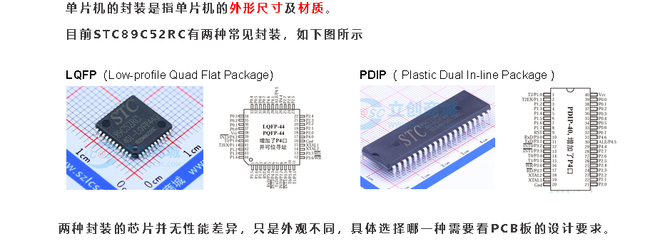
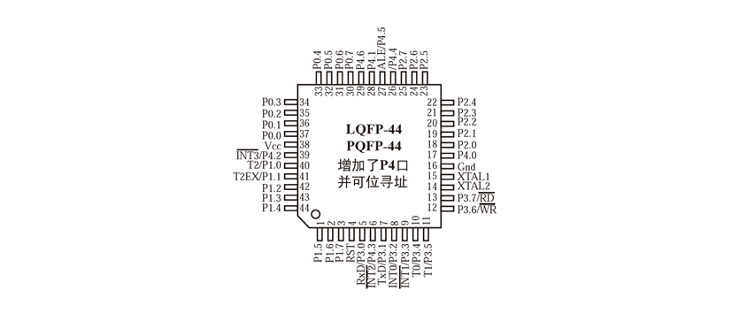
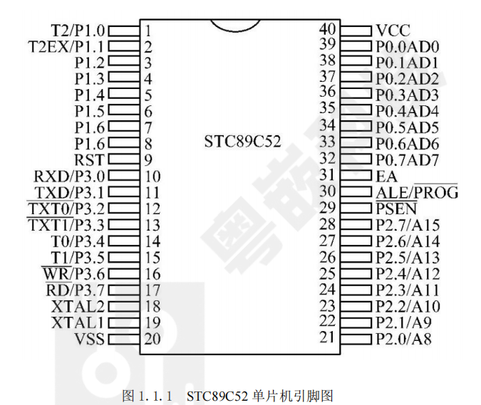
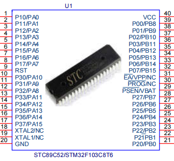
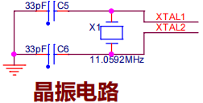
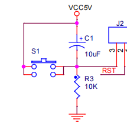
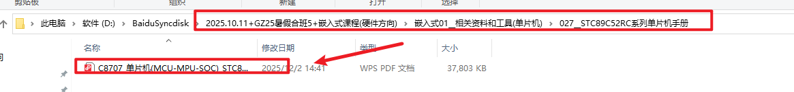
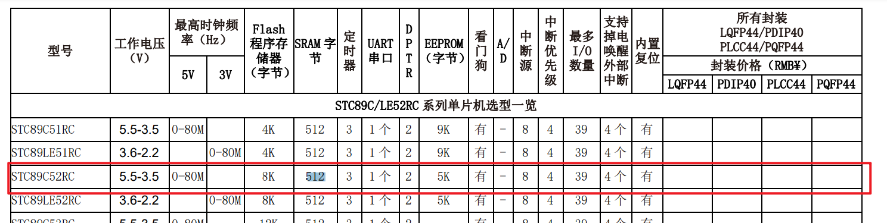
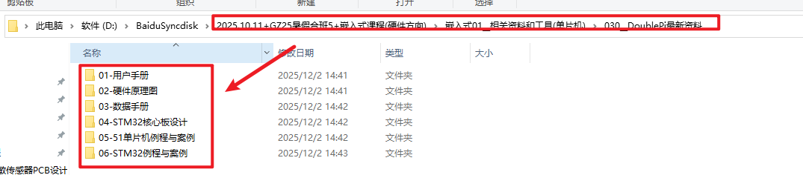

# STC89C52RC芯片
## 一、概述：STC89C52RC的定位与特点

STC89C52RC是**宏晶科技（STC Micro）** 推出的一款基于经典8051架构的**8位微控制器**，在中国嵌入式市场占据重要地位。作为STC89系列的代表型号，它在保持与标准8051指令集完全兼容的同时，进行了多项实用化增强。

上图展示了STC89C52RC的典型封装外观。该芯片采用**CMOS工艺**制造，工作电压范围为3.3V~5.5V，兼容大多数数字电路系统。与原始Intel 8051相比，STC89C52RC在以下方面进行了显著改进

### 核心增强特性

1. **Flash存储器容量**：内置**8KB**可重复擦写Flash，支持**在系统编程（ISP）**，无需专用编程器即可通过串口更新程序。
2. **RAM容量扩展**：提供**512B**内部RAM，是标准8051（128B）的4倍，为复杂应用提供了更充裕的数据存储空间。
3. **EEPROM数据存储器**：集成**2KB**独立EEPROM，用于存储需要掉电保存的配置参数和用户数据。
4. **工作频率范围**：支持**0Hz~40MHz**的宽频率范围，可通过软件动态调整，平衡性能与功耗。
5. **增强型外设**：
   - 3个16位定时器/计数器（Timer0、Timer1、Timer2）
   - 1个全双工UART串行通信接口
   - 8路10位ADC（部分型号）
   - 4路PWM输出
   - 看门狗定时器（WDT）

> [!TIP] 选型优势
> STC89C52RC在**成本**、**资源**和**易用性**之间取得了良好平衡，特别适合教育、原型开发和中小批量生产。

## 二、引脚功能

### LQFP-44封装引脚布局

STC89C52RC-40I-LQFP44封装提供**44个引脚**，采用表面贴装技术，适合空间受限的紧凑型设计。

LQFP封装的引脚按功能可分为以下几类：

1. **电源引脚组**
   - **VCC**：主电源输入，+5V或+3.3V
   - **GND**：电源地
   - **AVCC**：模拟电源（ADC使用时需要）
   - **AGND**：模拟地

2. **时钟与复位引脚**
   - **XTAL1**：外部晶振输入或外部时钟源输入
   - **XTAL2**：外部晶振输出
   - **RST**：复位输入，高电平有效

3. **I/O端口引脚**
   - **P0.0~P0.7**：8位准双向I/O口，开漏输出，需外接上拉电阻
   - **P1.0~P1.7**：8位准双向I/O口，内部弱上拉
   - **P2.0~P2.7**：8位准双向I/O口，访问外部存储器时输出高8位地址
   - **P3.0~P3.7**：8位准双向I/O口，每个引脚都有第二功能

4. **控制信号引脚**
   - **ALE/PROG**：地址锁存使能/编程脉冲输入
   - **PSEN**：外部程序存储器读选通信号
   - **EA/VPP**：外部访问使能/编程电压输入

### DIP-40封装引脚布局

开发板常用的**DIP-40**封装提供了更便捷的手工焊接和原型验证能力。

DIP封装与LQFP封装在引脚功能上完全对应，只是物理排列不同。两种封装的主要对比如下：

| 特性 | DIP-40 | LQFP-44 |
|------|--------|---------|
| **引脚数量** | 40 | 44 |
| **封装尺寸** | 较大，适合手工焊接 | 紧凑，适合自动化生产 |
| **散热性能** | 一般 | 较好（有裸露焊盘） |
| **安装方式** | 通孔插装 | 表面贴装 |
| **适用场景** | 开发板、实验板 | 产品PCB |

> [!IMPORTANT] 引脚使用注意事项
> 1. **P0口**作为普通I/O时**必须外接上拉电阻**（通常4.7kΩ~10kΩ）
> 2. **P3口第二功能**优先级高于普通I/O功能，使用时需注意配置
> 3. **EA引脚**必须接高电平（VCC）才能执行内部Flash中的程序
> 4. **未使用的I/O口**建议设置为输出模式并输出低电平，减少功耗

## 三、最小系统电路设计

最小系统是指单片机能够正常工作的**最基本电路配置**，包括电源、时钟、复位和必要的滤波电路。

上图展示了STC89C52RC最小系统的核心部分。一个完整的最小系统必须包含以下四个关键电路：

### (1) 晶振电路

晶振电路为单片机提供精确的**工作时钟基准**，决定了指令执行速度和系统时序精度。

**电路组成与参数选择：**
- **晶振频率**：常用**11.0592MHz**或**12MHz**
  - **11.0592MHz**：特别适合串口通信，可产生精确的波特率（如9600bps）
  - **12MHz**：通用选择，每个机器周期1μs，便于计时计算
- **负载电容C1、C2**：通常为**15pF~33pF**，具体值参考晶振规格书
- **匹配电阻R**（可选）：串联**100Ω~1kΩ**电阻可改善波形，减少谐波

**设计要点：**
1. **布局紧凑**：晶振应尽量靠近XTAL1和XTAL2引脚，走线尽量短
2. **接地隔离**：晶振下方应铺地铜，避免数字信号干扰
3. **电源滤波**：VCC到晶振电路的电源线应加**0.1μF**退耦电容

### (2) 复位电路

复位电路确保单片机上电时从**确定的状态**开始执行程序，并在系统异常时提供恢复机制。

**电路工作原理：**
- **上电复位**：电容C3通过R1充电，在RST引脚产生**高电平脉冲**
- **复位时间**：τ = R1 × C3，通常设计为**10ms~100ms**
- **手动复位**：按下S1按钮，强制RST引脚接地，实现手动复位

**典型参数配置：**
- **R1**：10kΩ（常用值）
- **C3**：10μF电解电容
- **复位时间计算**：τ = 10kΩ × 10μF = 100ms

> [!WARNING] 复位电路注意事项
> 1. 复位时间**不能过短**，否则可能无法完成内部初始化
> 2. 电解电容有极性，**正极接VCC**，负极接RST引脚
> 3. 在强干扰环境中，可在RST引脚对地加**0.1μF**电容增强抗干扰

### (3) 电源电路
电源电路设计同样关键：

1. **电源滤波**：
   - VCC与GND之间并联**10μF**电解电容和**0.1μF**陶瓷电容
   - 电容应尽量靠近芯片电源引脚

2. **退耦电容**：
   - 每个电源引脚附近放置**0.1μF**退耦电容
   - 有效抑制高频噪声和电流突变

3. **电源指示**：
   - 可选LED加限流电阻（如5V电源用220Ω~1kΩ）

### (4) 编程接口

STC89C52RC支持**串口ISP编程**，无需专用编程器：

1. **串口连接**：P3.0（RXD）和P3.1（TXD）连接至USB转串口芯片
2. **冷启动**：编程时需要**断电再上电**，STC-ISP软件自动检测并进入编程模式
3. **波特率自适应**：支持多种波特率，自动匹配

## 四、技术资料与开发资源

### (1) 官方资源平台

- **STC单片机官网**：[https://www.stcaimcu.com/](https://www.stcaimcu.com/)
  - 提供最新数据手册、技术文档、开发工具下载
  - 包含应用笔记、参考设计、常见问题解答

- **元器件采购渠道**：
  - STC89C52RC-40I-LQFP44购买链接：[https://item.szlcsc.com/9213.html](https://item.szlcsc.com/9213.html)
  - 立创商城、淘宝等平台均有销售

### (2) 核心数据手册

数据手册是开发过程中最重要的参考资料，包含：
- **电气特性**：工作电压、电流消耗、温度范围
- **时序参数**：时钟频率、复位时间、读写时序
- **外设规格**：ADC精度、PWM频率、串口波特率
- **封装信息**：引脚定义、尺寸图纸、焊接建议

### (3) 开发板资源

常见开发板通常包含以下资源：
1. **基础外设**：LED、按键、蜂鸣器、数码管
2. **通信接口**：USB转串口、I2C、SPI
3. **扩展接口**：排针引出所有I/O口
4. **电源管理**：USB供电、稳压电路、电源开关
