# 51单片机开发环境搭建
## 一、硬件环境

51单片机开发需要**硬件平台**和**软件工具**的协同工作。硬件环境为程序提供了物理执行载体，而软件环境则负责代码的编写、编译和调试。

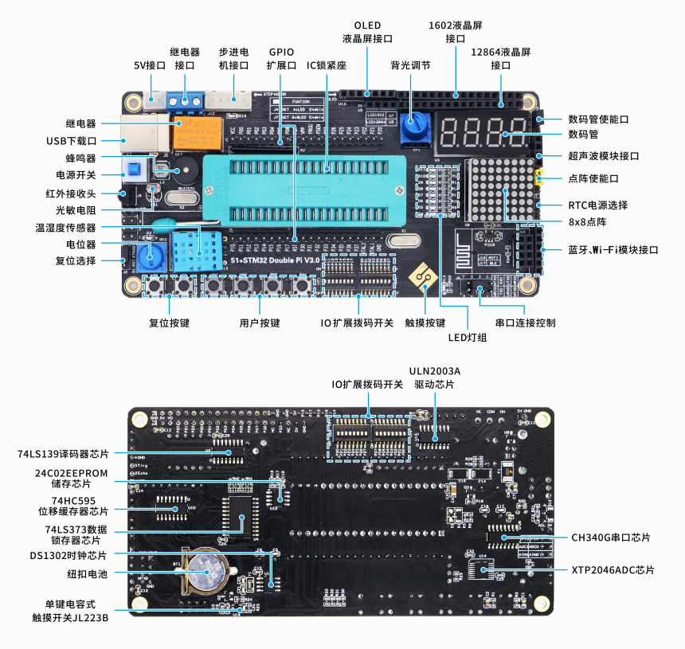

上图展示了典型的51单片机开发硬件环境，主要包括以下组成部分：

### 核心硬件组件

1. **开发板/目标板**
   - **STC89C52RC开发板**：包含单片机最小系统、外设接口和调试接口
   - **电源电路**：提供稳定的5V或3.3V供电，通常包含USB接口和稳压芯片
   - **外设模块**：LED、按键、数码管、蜂鸣器等基础外设
   - **扩展接口**：排针引出所有I/O口，便于连接外部模块

2. **编程/调试工具**
   - **USB转串口模块**：CH340G、CP2102等芯片，连接电脑与开发板
   - **JTAG调试器**（可选）：支持高级调试功能，如断点、单步执行
   - **逻辑分析仪**（可选）：用于信号时序分析和调试

3. **辅助设备**
   - **万用表**：测量电压、电流、电阻等参数
   - **示波器**（可选）：观察信号波形和时序
   - **电源供应器**：提供可调稳压电源

## 二、软件环境：开发工具链的构建

51单片机软件开发需要完整的**工具链支持**，从代码编辑到程序烧录的每个环节都需要专用工具。


上图展示了51单片机开发的完整软件工具链，主要包括：

### (1) 开发工具概述

#### **Keil µVision IDE**
Keil µVision是**ARM公司**推出的集成开发环境，专门针对51架构的**C51编译器**提供完整支持。其主要功能包括：
- **代码编辑器**：语法高亮、代码补全、错误检查
- **项目管理器**：组织源文件、头文件、库文件
- **编译器/汇编器**：将C/汇编代码转换为机器码
- **链接器**：合并目标文件，生成可执行文件
- **调试器**：支持软件仿真和硬件调试

#### **Keil C51编译器**
C51编译器是Keil工具链的核心组件，专门针对8051架构优化：
- **扩展数据类型**：支持`bit`、`sfr`、`sbit`等51特有类型
- **内存模型优化**：提供SMALL、COMPACT、LARGE三种内存模型
- **代码效率**：生成高度优化的机器码，充分利用51架构特性
- **兼容性**：完全兼容ANSI C标准，同时提供51专用扩展

> [!NOTE] 官方文档资源
> Keil C51 Compiler用户指南：[https://developer.arm.com/documentation/101655/0961/Cx51-User-s-Guide?lang=en](https://developer.arm.com/documentation/101655/0961/Cx51-User-s-Guide?lang=en)
> 这份官方文档详细介绍了编译器的所有特性和使用方法。

#### **STC-ISP编程工具**
STC-ISP是**宏晶科技**为STC系列单片机提供的专用编程工具：
- **串口ISP编程**：通过串口直接烧录程序，无需专用编程器
- **自动波特率**：自动检测并匹配目标芯片的通信速率
- **加密功能**：支持程序代码加密保护
- **EEPROM操作**：可读写芯片内部EEPROM数据
- **串口助手**：内置串口调试功能

### (2) Keil µVision安装与配置

#### **1. 获取安装包**

安装包可通过以下途径获取：
- **官方网站**：[https://www.keil.com](https://www.keil.com)

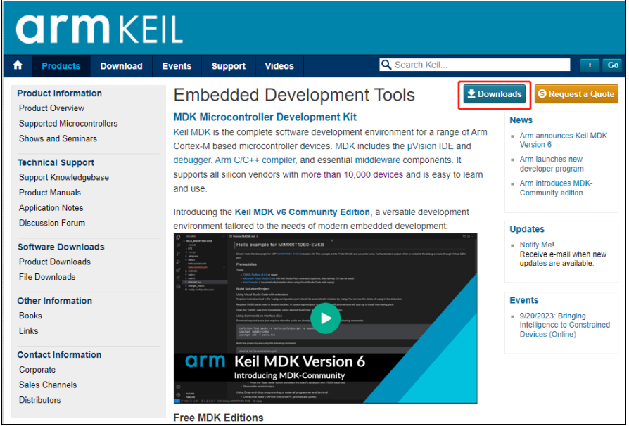

访问Keil官网后，需要选择正确的产品版本：

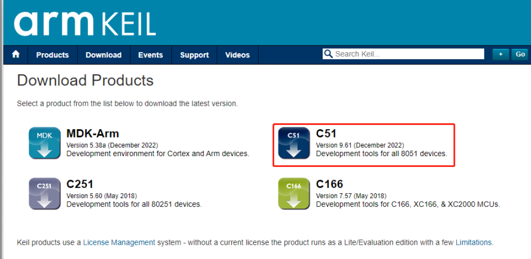

**必须选择C51版本**，这是专门为8051架构设计的开发工具。MDK-ARM版本适用于ARM Cortex-M系列，不兼容51单片机。

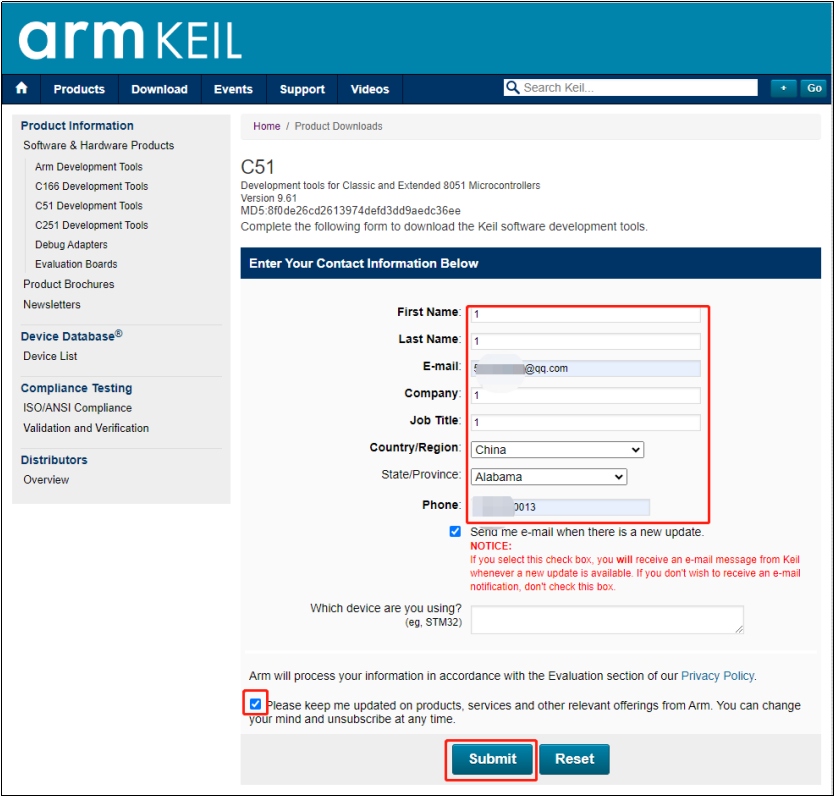

填写必要的联系信息后，系统会发送包含下载链接的邮件到指定邮箱。

#### **2. 安装Keil µVision**

**步骤a：启动安装程序**
双击下载的安装包文件（如`C51V961.EXE`），开始安装过程。

**步骤b：接受许可协议**
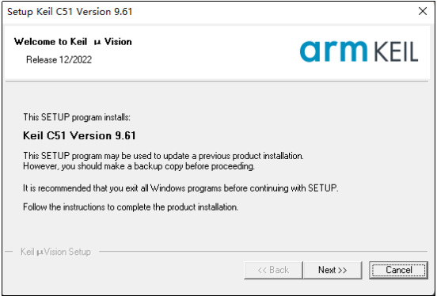

点击"Next"按钮后，进入许可协议页面：

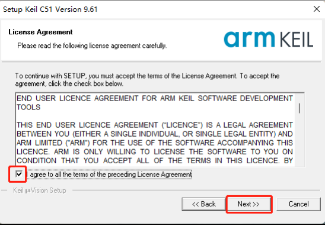

**必须勾选"I agree to all the terms of the preceding License Agreement"**，然后点击"Next"。

**步骤c：选择安装路径**
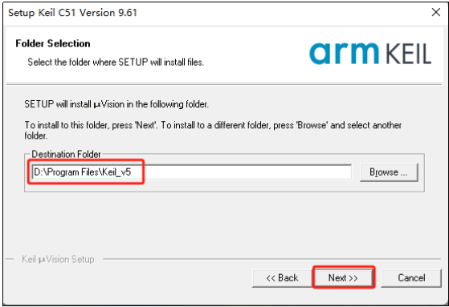

建议使用默认安装路径`C:\Keil_v5\`，避免路径中包含中文或特殊字符。如果需要更改，确保新路径**简短且无空格**。

**步骤d：填写用户信息**
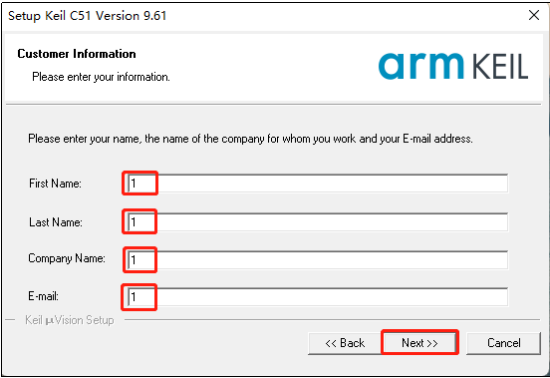

在相应字段输入任意字符（First Name、Last Name、Company Name、E-mail），这些信息仅用于安装标识，不会影响软件功能。

**步骤e：等待安装完成**
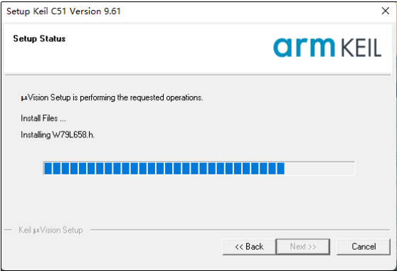

安装过程通常需要**30秒到2分钟**，具体时间取决于系统性能。安装过程中不要进行其他磁盘密集型操作。

**步骤f：完成安装**
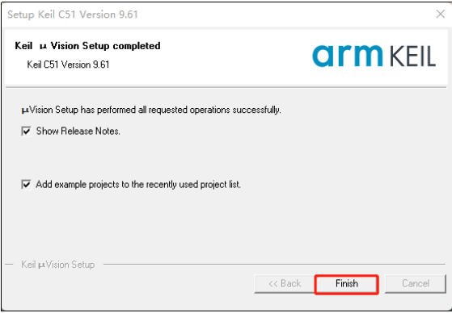

点击"Finish"按钮完成安装。桌面上会生成Keil µVision的快捷方式：


#### **3. Keil许可证激活**

> [!WARNING] 版权声明
> 商业使用请购买正版许可证。以下内容仅供学习参考，建议支持正版软件。

默认安装的Keil有**代码大小限制**（通常为2KB），超过限制需要激活许可证。

**步骤a：关闭安全软件**
由于注册机可能被误报为病毒，需要暂时关闭安全防护：


在开始菜单搜索"安全中心"，进入病毒和威胁防护设置：

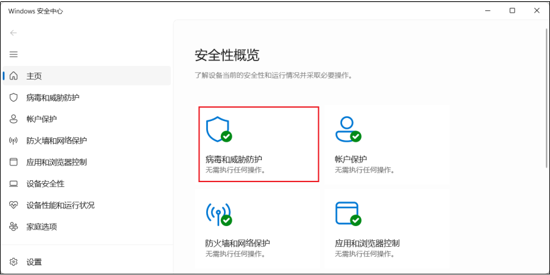

点击"病毒和威胁防护设置"下的"管理设置"：

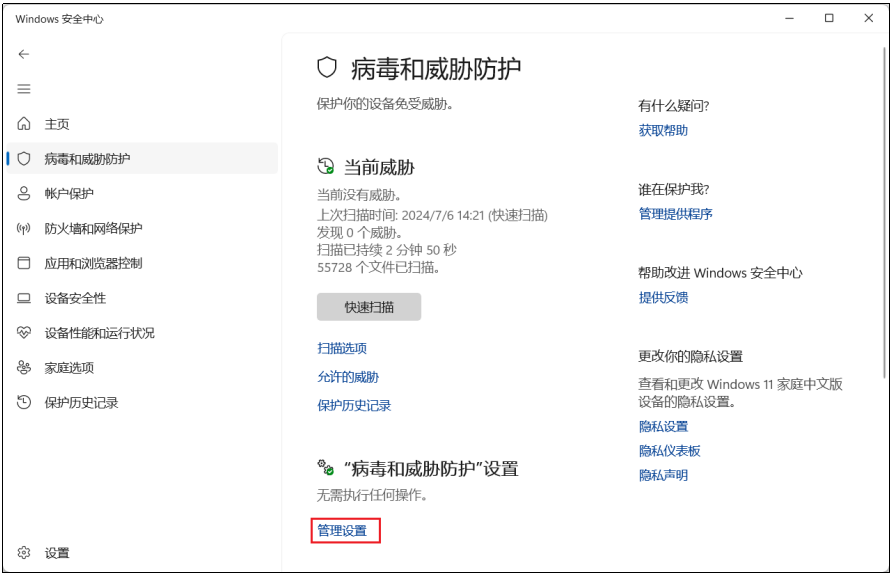

**关闭"实时保护"**，操作完成后记得重新开启：

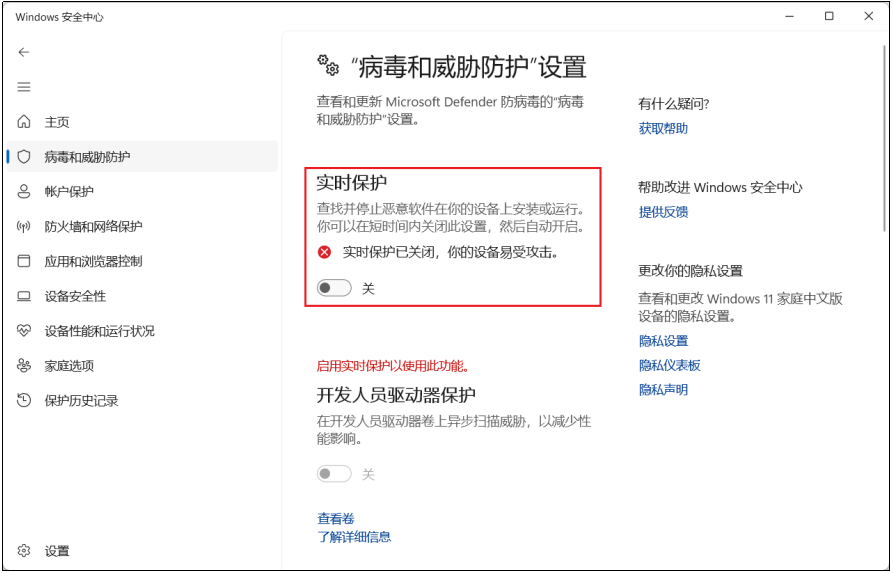

**步骤b：启动注册机和管理员权限的Keil**
注册机通常位于课程资料的特定路径：

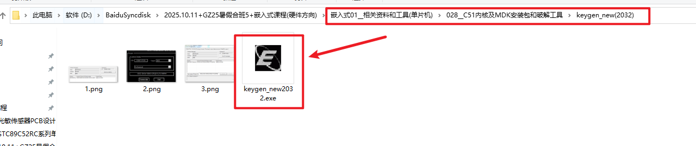

**以管理员身份运行注册机**：

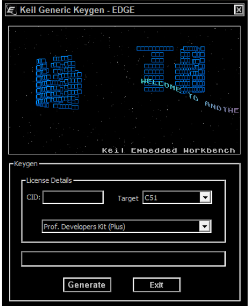

**同时以管理员身份运行Keil µVision**，这是关键步骤，否则可能出现权限问题。

**步骤c：获取CID并生成许可证**
在Keil中点击"File" → "License Management"：

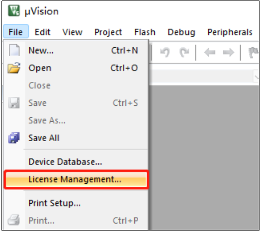

在弹出的对话框中复制**CID**（Computer ID）：

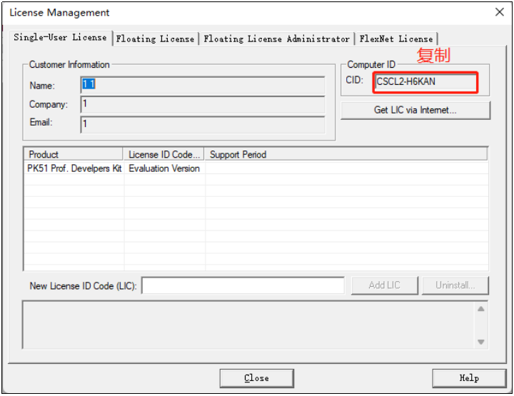

将CID粘贴到注册机的相应字段，选择"C51"作为目标，点击"Generate"生成许可证密钥：

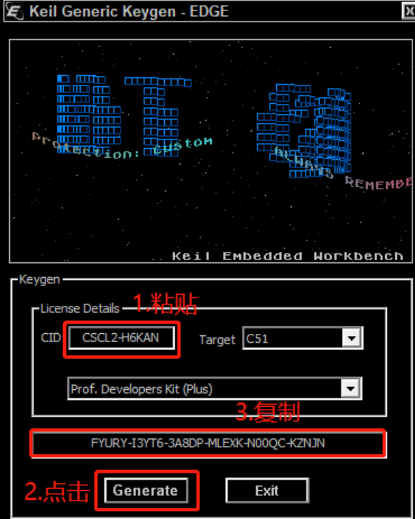

**步骤d：添加许可证**
将生成的许可证密钥复制到Keil的"New License ID Code"字段，点击"Add LIC"：

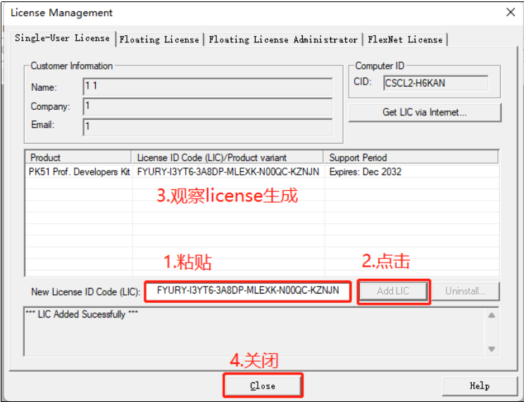

成功添加后，会显示"LIC Added Successfully"消息，许可证有效期通常到2032年。

### (3) STC-ISP软件安装与使用

#### **1. 获取安装包**

STC-ISP是绿色软件，无需安装，解压即可使用：
- **官方网站**：[http://www.stcmcudata.com/STCISP/stc-isp-15xx-v6.92A.zip](http://www.stcmcudata.com/STCISP/stc-isp-15xx-v6.92A.zip)

建议下载最新版本，STC官网会定期更新工具软件。

#### **2. 软件启动与界面**

双击`stcai-isp-v6.94H.exe`（版本号可能不同）启动软件：

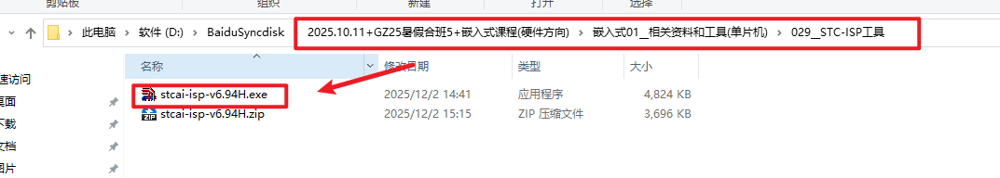

软件主界面包含多个功能区域：

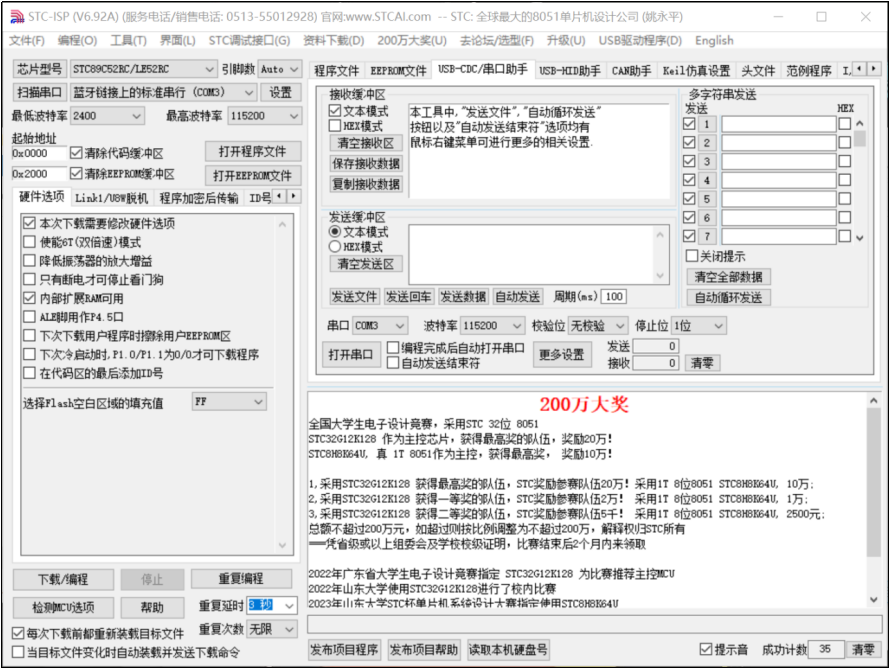

**主要功能区域说明：**
1. **芯片选择**：下拉菜单选择目标芯片型号（如STC89C52RC）
2. **串口设置**：选择正确的COM端口和波特率
3. **打开程序文件**：加载编译生成的HEX或BIN文件
4. **编程选项**：设置加密、EEPROM操作等参数
5. **下载/编程**：开始烧录程序的按钮
6. **串口助手**：内置的串口调试工具

#### **3. STC-ISP核心功能**
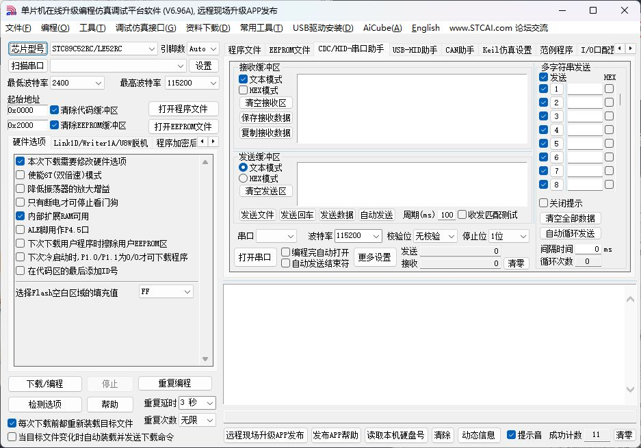
**a. 芯片型号选择**
- 必须选择与目标板完全一致的型号
- STC89C52RC有多个子型号，注意区分工作频率（如40I表示40MHz）

**b. 串口配置**
- **COM端口**：通过设备管理器查看USB转串口芯片分配的端口号
- **波特率**：通常使用默认的"最低波特率"或"最高波特率"
- **校验位/停止位**：保持默认设置（无校验、1位停止位）

**c. 程序文件加载**
- 支持HEX、BIN两种格式
- HEX文件包含地址信息，由Keil编译生成
- 点击"打开程序文件"按钮选择编译输出的HEX文件

**d. 编程选项配置**
- **硬件选项**：设置复位引脚、时钟源等硬件参数
- **加密设置**：保护程序代码不被读取
- **EEPROM操作**：可同时烧录程序和数据

**e. 下载操作流程**
1. 点击"下载/编程"按钮
2. **给目标板断电再上电**（冷启动）
3. 软件自动检测芯片并开始编程
4. 进度条显示烧录进度，完成后显示成功消息

> [!IMPORTANT] 下载注意事项
> 1. **冷启动必需**：STC芯片需要在下载瞬间断电再上电
> 2. **波特率自适应**：软件会自动尝试多种波特率建立连接
> 3. **驱动安装**：确保USB转串口芯片驱动正确安装
> 4. **端口占用**：关闭其他可能占用串口的软件

## 三、开发环境配置优化

### 1. Keil工程模板创建

为提升开发效率，建议创建标准的工程模板：

```c
/* main.c - 工程模板 */
#include <reg52.h>

// 系统时钟频率定义（单位：MHz）
#define FOSC 11059200L
#define FOSC_MHZ (FOSC / 1000000)

// 常用延时函数
void delay_ms(unsigned int ms) {
    unsigned int i, j;
    for(i = 0; i < ms; i++)
        for(j = 0; j < 123; j++);  // 针对11.0592MHz校准
}

// 系统初始化
void System_Init(void) {
    // 关闭所有中断
    EA = 0;
    
    // 初始化I/O口
    P0 = 0xFF;  // P0口设置为高电平（需外接上拉）
    P1 = 0xFF;
    P2 = 0xFF;
    P3 = 0xFF;
    
    // 初始化定时器（如有需要）
    // TMOD = 0x01;  // 定时器0模式1
    
    // 初始化串口（如有需要）
    // SCON = 0x50;  // 模式1，允许接收
    
    // 清除中断标志
    // 配置中断优先级
    
    // 开启总中断
    // EA = 1;
}

// 主函数
void main(void) {
    // 系统初始化
    System_Init();
    
    // 主循环
    while(1) {
        // 应用程序代码
    }
}
```

### 2. 编译输出配置

在Keil中正确配置编译输出：
1. 右键点击"Target 1" → "Options for Target 'Target 1'"
2. **Output标签**：勾选"Create HEX File"
3. **C51标签**：选择合适的内存模型（通常用SMALL）
4. **Debug标签**：配置软件仿真或硬件调试选项

### 3. 常见问题排查

| 问题现象                 | 可能原因     | 解决方案                                  |
| -------------------- | -------- | ------------------------------------- |
| **Keil编译错误**         | 头文件路径错误  | 在"Options for Target" → "C51"中添加头文件路径 |
| **HEX文件生成失败**        | 输出配置未启用  | 勾选"Create HEX File"选项                 |
| **STC-ISP无法连接**      | 串口驱动未安装  | 安装CH340/CP2102驱动                      |
| **下载时卡在"正在检测目标单片机"** | 冷启动未执行   | 给开发板断电再上电                             |
| **程序运行不正常**          | 晶振频率设置错误 | 检查Keil中XTAL频率设置                       |


## 五、进阶工具与技巧

### 1. 版本控制集成
- 使用Git管理源代码
- 在Keil工程目录初始化Git仓库
- 忽略编译生成的中间文件（`*.obj`、`*.lst`等）

### 2. 自动化构建脚本
- 编写批处理脚本自动编译和下载
- 集成到CI/CD流程中（如Jenkins、GitLab CI）

### 3. 调试技巧
- **软件仿真**：使用Keil的软件仿真功能调试基础逻辑
- **串口调试**：通过串口输出调试信息
- **IO口调试**：用LED或逻辑分析仪观察信号

### 4. 性能优化
- 使用Keil的代码大小优化选项
- 合理选择内存模型平衡性能和资源
- 利用51特有优化（如`using`关键字指定寄存器组）
