# 51单片机工程搭建与程序烧录
## 一、Keil工程创建：从零构建开发项目

创建规范的Keil工程是51单片机开发的**第一步**，也是确保后续开发顺利进行的基础。一个结构清晰的工程能够有效管理源代码、配置文件和编译输出。

### (1) 启动Keil并创建新工程

打开Keil µVision IDE，通过菜单栏选择"Project" → "New µVision Project"：

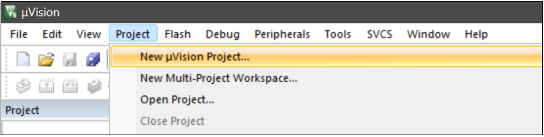

> [!TIP] 工程管理建议
> 建议为每个项目创建独立的文件夹，避免多个项目文件混杂。文件夹名称应具有描述性，如"LED_Blink_Project"。

### (2) 设置工程路径和名称

在弹出的对话框中，选择合适的项目目录并输入项目名称：

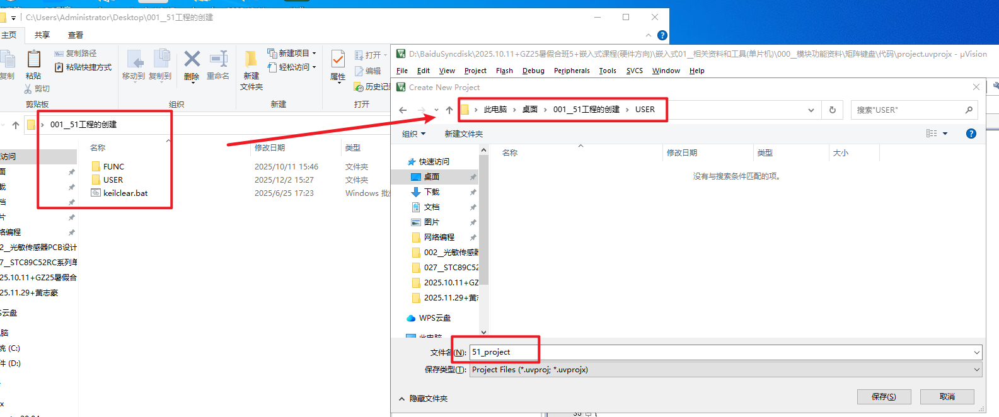

**路径选择要点：**
1. **避免中文路径**：Keil对中文路径支持不佳，可能导致编译错误
2. **路径简洁**：避免过深的目录层级，便于文件管理
3. **专用目录**：为每个项目创建独立目录，包含所有相关文件

### (3) 芯片型号选择与STC数据库集成

项目保存后，Keil会弹出芯片选择对话框。但**标准Keil安装不包含STC芯片数据库**，需要手动添加：

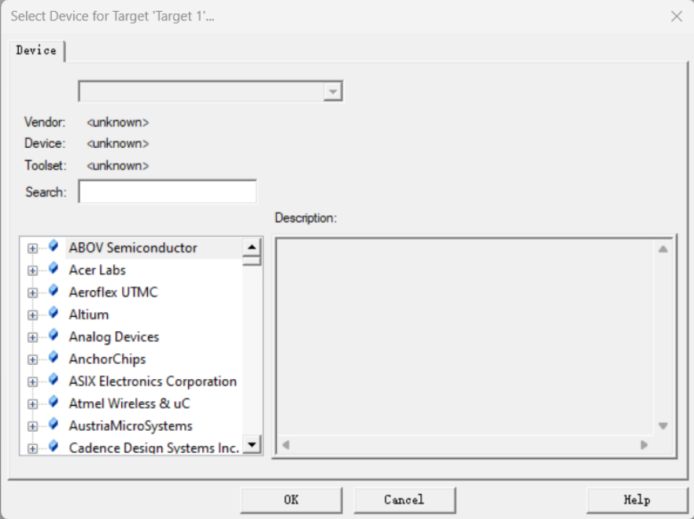

> [!IMPORTANT] 数据库缺失处理
> 如果找不到STC89C52RC，说明Keil的芯片数据库未包含STC型号，需要按照以下步骤添加。

### (4) 通过STC-ISP添加芯片数据库

关闭Keil软件，打开STC-ISP编程工具，按照图示步骤操作：

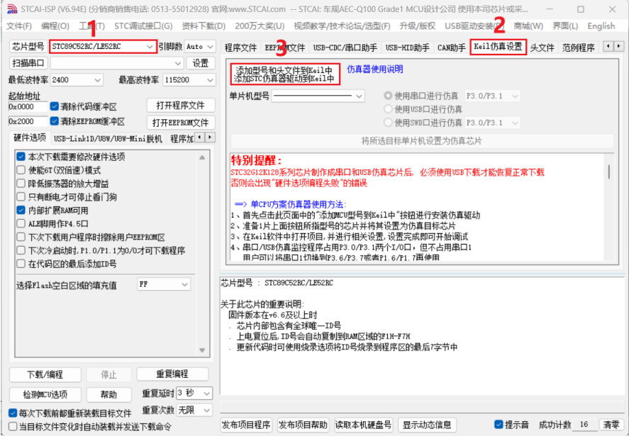

**具体操作步骤：**
1. 在STC-ISP界面中找到"Keil仿真设置"标签页
2. 点击"添加型号和头文件到Keil中"
3. 在弹出的文件选择对话框中，**导航到Keil的安装目录**
   - 默认路径：`C:\Keil_v5\`
   - 如果自定义了安装路径，选择相应的Keil根目录

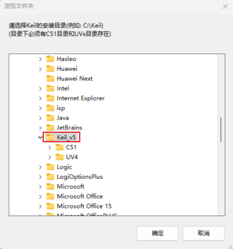

4. 点击"确定"后，STC-ISP会自动将STC芯片数据库添加到Keil中
5. 添加成功后会有提示信息

### (5) 重新创建工程并选择正确芯片型号

重启Keil软件，重新执行工程创建流程。这次在芯片选择对话框中就能看到STC系列：

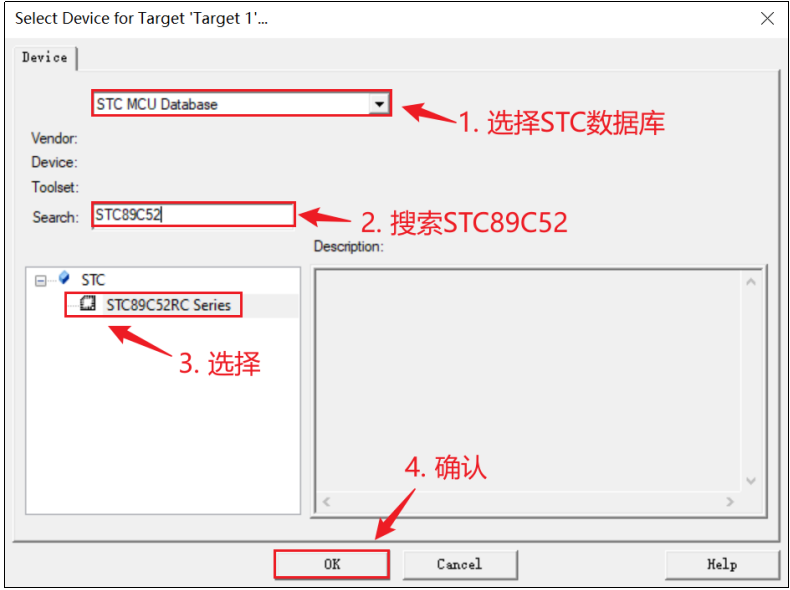

**芯片选择注意事项：**
- 展开"STC MCU Database"节点
- 选择"STC89C52RC"（注意后缀RC表示增强型）
- 确认右侧描述信息与目标芯片一致

### (6) 确认添加启动文件

选择芯片后，Keil会询问是否添加启动文件：

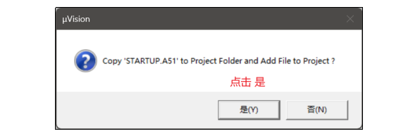

**必须点击"Yes"**，添加标准的启动文件`STARTUP.A51`。这个文件负责：
- 初始化堆栈指针
- 清除数据存储器
- 调用main()函数
- 处理中断向量表

### (7) 工程创建成功

完成上述步骤后，工程创建成功，界面显示如下：

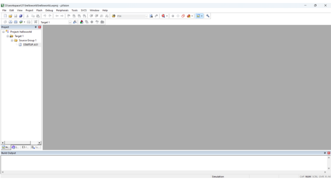

左侧的"Project"窗口显示了工程的基本结构：
- **Target 1**：工程目标，可配置编译选项
- **Source Group 1**：源代码组，用于组织源文件
- **STARTUP.A51**：启动文件，已自动添加

### (8) 工程结构整理与优化

良好的工程结构能提升开发效率。建议按以下方式组织：

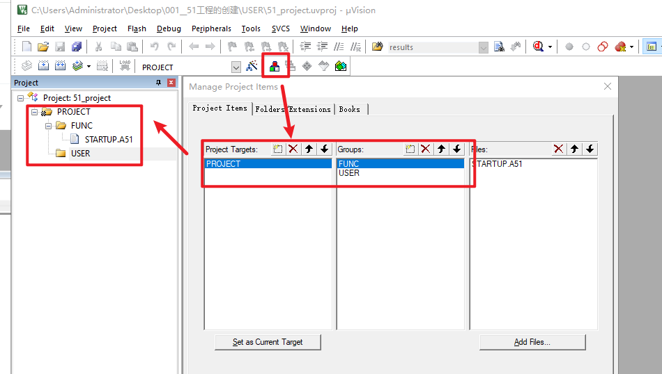

**推荐的文件组织结构：**
```
Project_Folder/
├── Source/           # 源代码目录
│   ├── main.c       # 主程序文件
│   ├── driver/      # 驱动程序
│   └── utils/       # 工具函数
├── Include/         # 头文件目录
├── Library/         # 库文件目录
├── Objects/         # 编译输出（自动生成）
└── Project.uvproj   # Keil工程文件
```

**在Keil中创建文件夹结构的方法：**
1. 在"Project"窗口中右键点击"Target 1"
2. 选择"Manage Project Items"
3. 在"Groups"区域添加新的组（如"Driver"、"Utils"）
4. 将相应文件添加到对应组中

## 二、程序编写：从简单代码开始

### (1) 创建主程序文件

在"Project"窗口中，右键点击"Source Group 1"（或自定义的组名），选择"Add New Item to Group"：

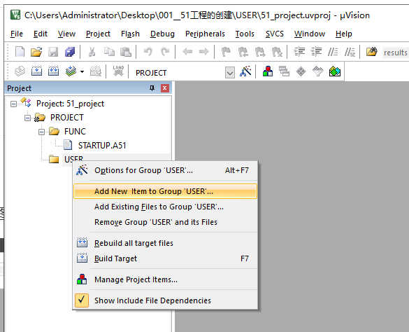

在弹出的对话框中选择"C File (.c)"，命名为`main.c`：

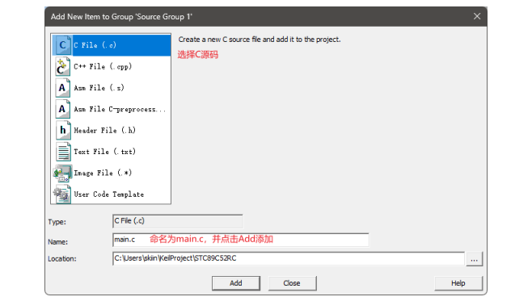

**文件命名规范：**
- 使用小写字母和下划线
- 名称应反映文件功能
- 主程序文件通常命名为`main.c`

### (2) 编写基础代码

在`main.c`文件中输入以下代码：

```c
#include <STC89C5xRC.H> // 包含STC89C52的头文件

// 主函数
int main(void)
{
    // 让P00引脚输出低电平
    P00 = 0;
    
    // 死循环卡住单片机，让它不要继续往下执行
    while (1);
}
```

**代码解析：**
1. **头文件包含**：`#include <STC89C5xRC.H>`包含了STC89C52系列的所有寄存器定义
2. **主函数定义**：`int main(void)`是程序的入口点
3. **引脚控制**：`P00 = 0;`将P0口的第0位设置为低电平（0V）
4. **无限循环**：`while (1);`使程序在此处循环，防止执行到未定义的内存区域

> [!NOTE] 引脚命名约定
> 在STC头文件中，`P00`表示P0口的第0位，`P10`表示P1口的第0位，依此类推。这种命名方式比传统的`sbit LED = P1^0;`更简洁。

### (3) 配置字符集支持中文注释

Keil默认使用**ANSI字符集**，不支持中文显示。需要修改编码设置：

**步骤1：打开编辑配置**
点击"Edit" → "Configuration"：

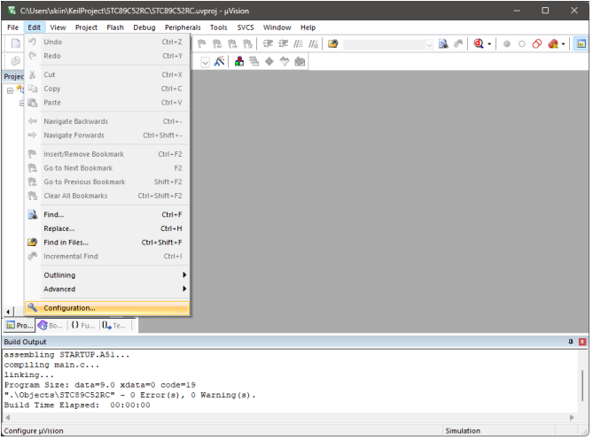

**步骤2：修改编码设置**
在"Editor"标签页中，将"Encoding"改为"Chinese GB2312 (Simplified)"：

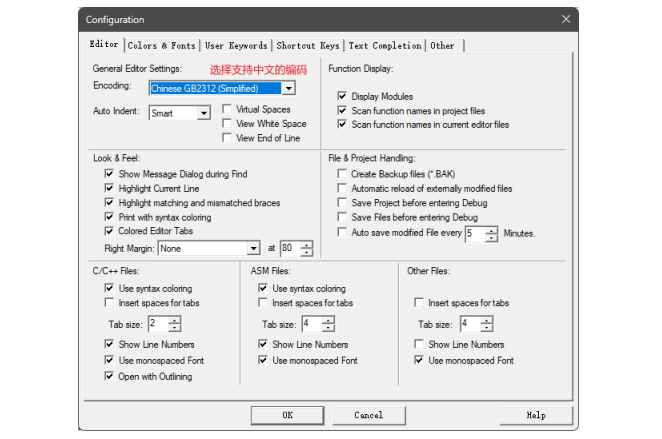

**修改后需要重新粘贴代码**，中文注释才能正常显示。

> [!WARNING] 编码兼容性
> 修改编码后，之前输入的中文可能显示为乱码。建议先修改编码设置，再编写或粘贴带中文注释的代码。

## 三、程序编译

### (1) 配置编译器生成HEX文件

Keil默认不生成HEX文件，需要手动配置：

**步骤1：打开工程配置**
右键点击"魔法棒"：

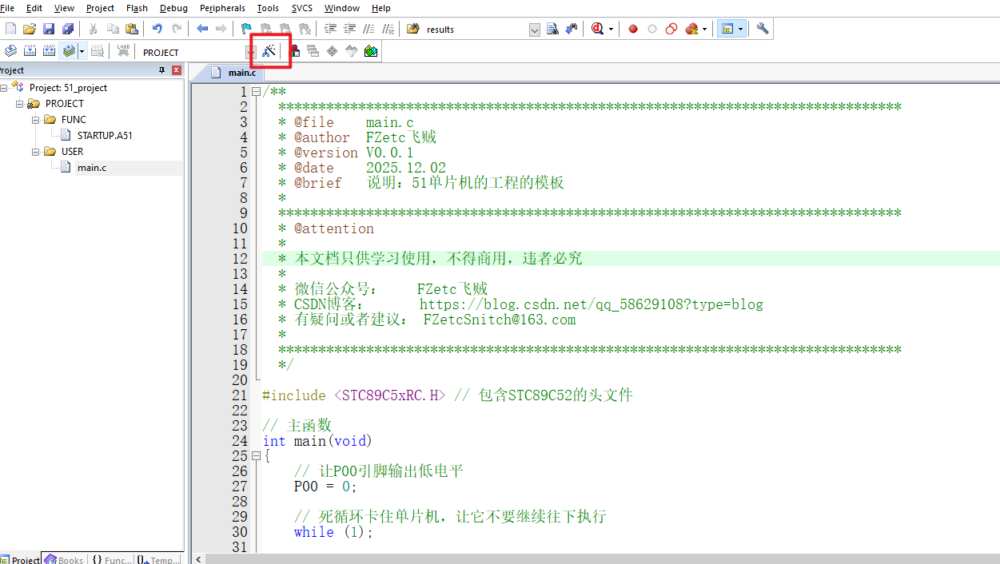

**步骤2：配置输出选项**
切换到"Output"标签页，勾选"Create HEX File"：

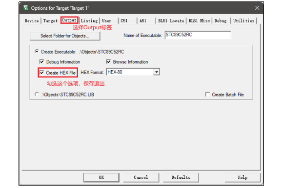

**其他重要输出配置：**
- **Name of Executable**：可执行文件名称，通常与工程名一致
- **Create Library**：是否创建库文件（通常不勾选）
- **Debug Information**：包含调试信息（建议勾选）
- **Browse Information**：包含浏览信息（建议勾选）

### (2) 执行编译操作

点击工具栏上的编译按钮：

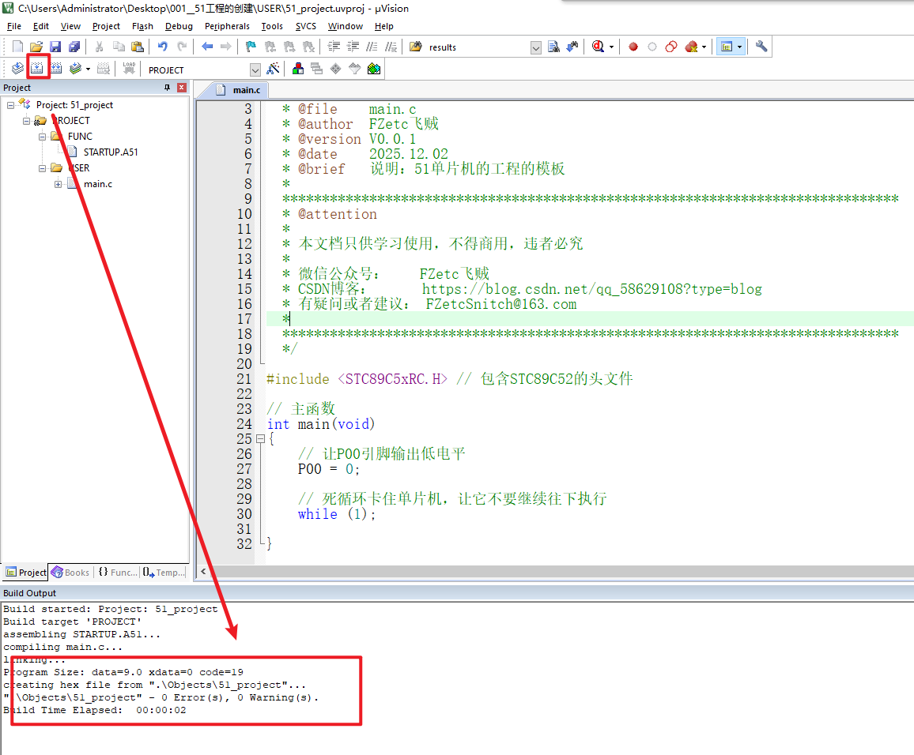

**编译按钮功能说明：**

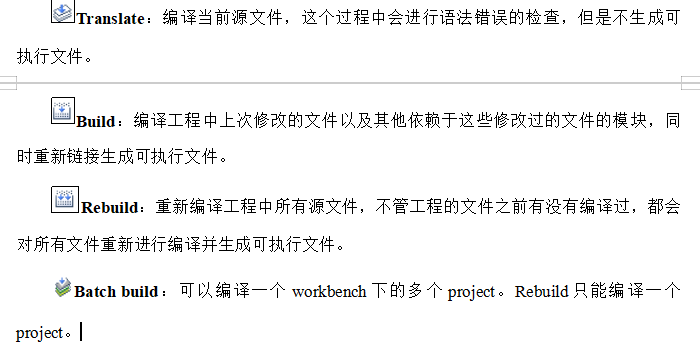

| 按钮图标 | 功能 | 说明 |
|---------|------|------|
| **🔨** | Translate | 翻译当前文件，检查语法错误 |
| **🔨🔨** | Build | 编译修改过的文件，生成目标文件 |
| **🔄** | Rebuild | 重新编译所有文件，完全重建 |
| **▶️** | Stop Build | 停止编译过程 |

**编译过程输出解读：**
- **"0 Error(s), 0 Warning(s)"**：编译成功，无错误和警告
- **错误（Error）**：必须修复的问题，阻止生成可执行文件
- **警告（Warning）**：潜在问题，建议修复但不阻止编译

### (3) 验证生成的HEX文件

编译成功后，在工程目录的`Objects`子文件夹中查看生成的HEX文件：

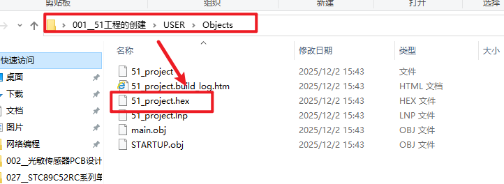

**HEX文件特性：**
- **文件格式**：Intel HEX格式，包含地址和校验信息
- **文件内容**：文本格式，每行代表一个数据记录
- **文件用途**：用于编程器烧录到单片机Flash中
- **文件大小**：通常比二进制文件稍大，因为包含格式信息

## 四、程序烧录

### (1) 硬件连接与检查

程序烧录前必须确保硬件连接正确：

#### 1. 连接开发板到电脑
使用USB数据线将开发板连接到电脑USB端口：

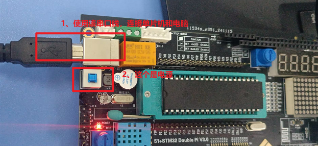

#### 2. 验证串口驱动安装
在设备管理器中检查CH340驱动是否正确安装：

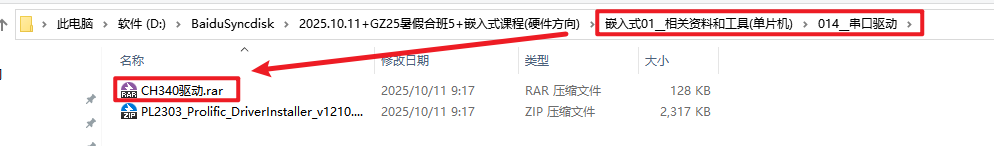

**驱动安装验证：**
- 端口（COM和LPT）下应显示"USB-SERIAL CH340"
- 括号内为分配的COM端口号（如COM3）
- 无黄色感叹号或问号表示驱动正常

#### 3. 配置跳线帽连接
使用跳线帽连接开发板上的3-5和4-6引脚：

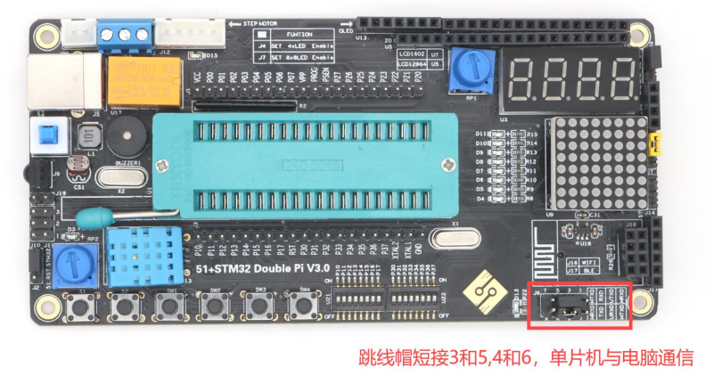

**跳线帽作用：**
- **3-5连接**：将单片机的TXD引脚连接到USB转串口的RXD
- **4-6连接**：将单片机的RXD引脚连接到USB转串口的TXD
- 实现单片机与电脑的串口通信

#### 4. 设置电源开关
将拨码开关拨到"ON"位置，为单片机供电：

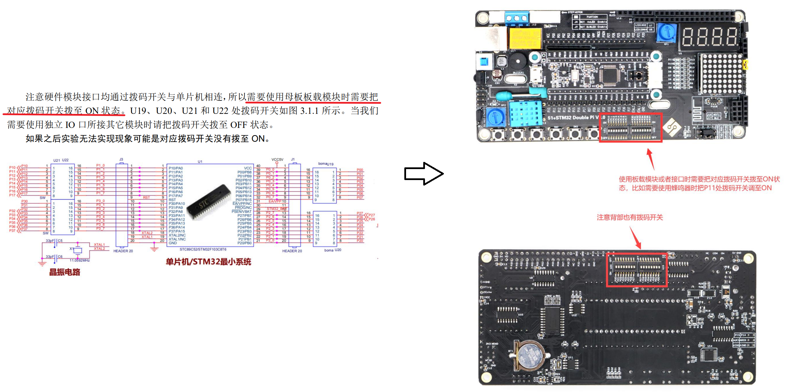

#### 5. 确认芯片型号和位置
检查开发板上的单片机型号和安装方向：

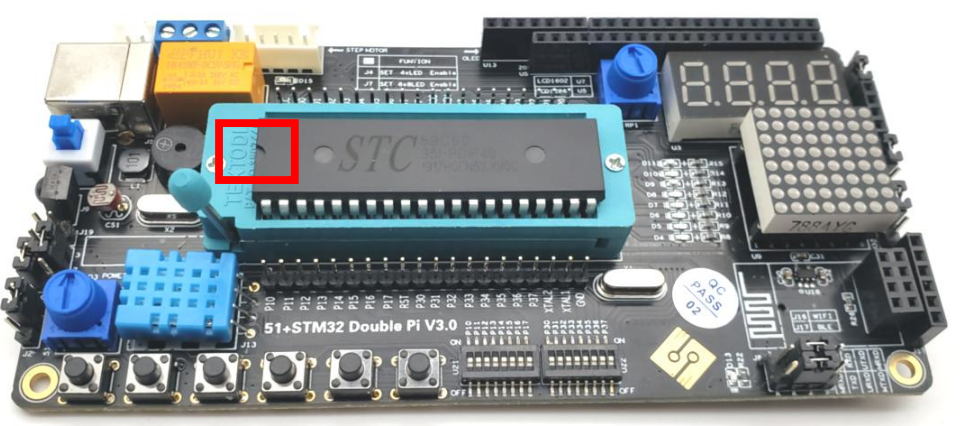

**关键检查点：**
- 芯片型号：**STC89C52RC**（注意后缀）
- 芯片方向：缺口或圆点标记朝向正确
- 芯片座：引脚完全插入，无弯曲

### (2) STC-ISP软件配置

打开STC-ISP软件，进行烧录前配置：

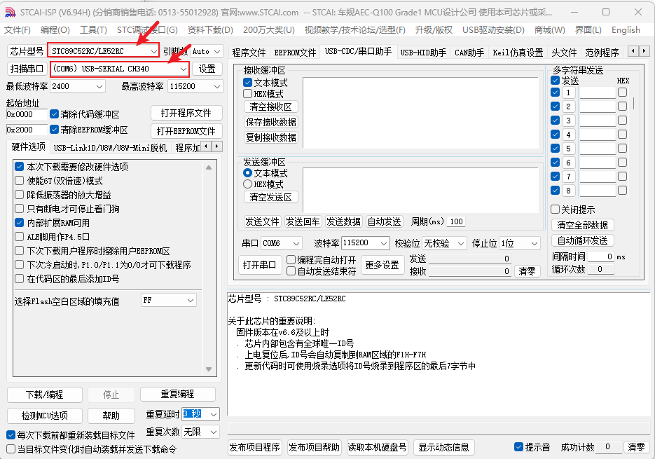

**配置步骤：**
1. **选择芯片型号**：下拉菜单中选择"STC89C52RC"
2. **选择串口号**：选择设备管理器中显示的COM端口
3. **波特率设置**：通常使用"最低波特率"或"最高波特率"
4. **其他选项**：保持默认，除非有特殊需求

### (3) 加载HEX程序文件

点击"打开程序文件"按钮，选择Keil生成的HEX文件：

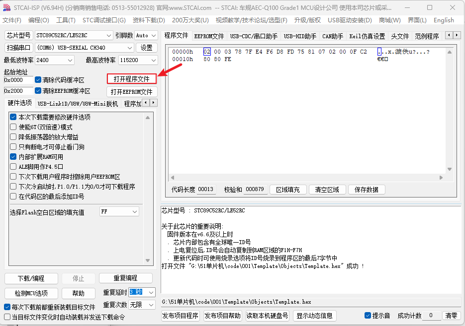

浏览到工程目录的`Objects`文件夹，选择`.hex`文件：

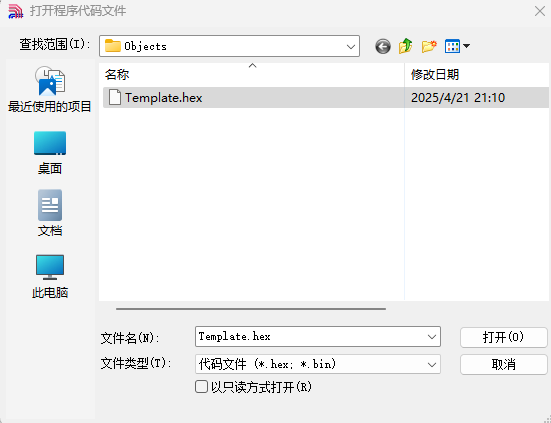

成功加载后，可以查看文件内容：

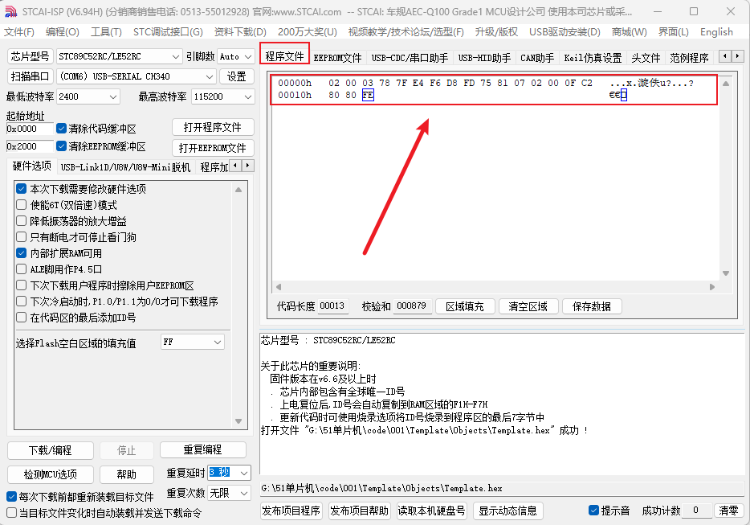

**HEX文件信息验证：**
- 文件大小：应与程序大小匹配
- 数据内容：应包含有效的机器码
- 地址范围：应从0x0000开始（程序起始地址）

### (4) 执行程序下载

**关键步骤：冷启动下载**
STC单片机采用冷启动方式下载程序：

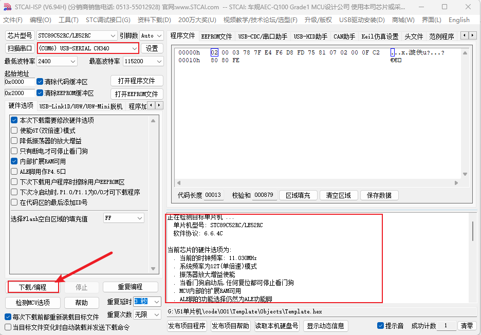

**下载操作流程：**
1. **点击"下载/编程"按钮**
2. **立即给开发板断电**（拔掉USB线或关闭电源开关）
3. **等待1-2秒后重新上电**（插回USB线或打开电源开关）
4. **观察STC-ISP界面**，显示"正在检测目标单片机..."
5. **检测成功后自动开始编程**，显示进度条
6. **编程完成**，显示"操作成功！"

**成功下载的标志：**
- 进度条从0%到100%完整走完
- 显示"程序下载完成，校验成功"
- 开发板上的LED可能开始闪烁（取决于程序功能）

## 五、常见问题与解决方案

### 问题1：单片机选型错误

如果烧录时出现型号不匹配错误：

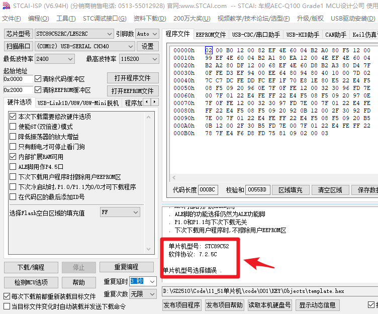

**问题分析：**
- 实际芯片型号与STC-ISP中选择的型号不一致
- 常见情况：芯片是**STC89C52**（无RC后缀），但选择了**STC89C52RC**

**解决方案：**
在STC-ISP中重新选择正确的芯片型号：

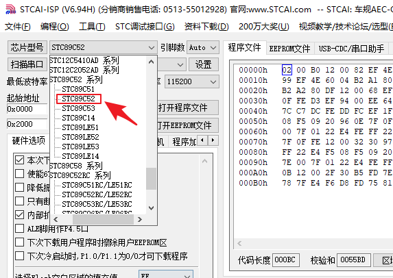

**型号区分要点：**
- **STC89C52**：基础型号，8KB Flash，512B RAM
- **STC89C52RC**：增强型号，8KB Flash，512B RAM，增加EEPROM
- 其他变体：工作频率、封装形式不同

### 问题2：串口连接失败

**可能原因及排查：**
1. **驱动未安装**：重新安装CH340驱动
2. **COM端口被占用**：关闭其他串口软件
3. **线缆故障**：更换USB数据线
4. **跳线帽未连接**：检查3-5、4-6跳线帽
5. **电源未打开**：确认拨码开关在ON位置

### 问题3：冷启动不成功

**改进方法：**
1. **延长断电时间**：断电后等待3-5秒再上电
2. **使用复位按钮**：有些开发板有专用复位按钮
3. **手动控制电源**：使用带开关的USB线或电源模块

### 问题4：程序运行异常

**调试步骤：**
1. **验证硬件**：用万用表测量电源电压（应为5V±0.25V）
2. **检查晶振**：用示波器观察晶振引脚波形（应为正弦波）
3. **简化程序**：编写最简单的LED闪烁程序测试
4. **查看编译输出**：确认无编译警告，代码大小合理

## 六、进阶技巧与最佳实践

### 1. 工程模板创建
创建标准工程模板，包含：
- 预配置的编译选项
- 常用的头文件和库
- 标准化的目录结构
- 版本控制忽略文件

### 2. 自动化脚本
编写批处理脚本自动化编译和下载：
```batch
@echo off
REM 编译工程
"C:\Keil_v5\UV4\UV4.exe" -b "%~dp0Project.uvproj" -o "%~dp0build_log.txt"

REM 检查编译结果
findstr "0 Error" "%~dp0build_log.txt" >nul
if %errorlevel% equ 0 (
    echo 编译成功，开始下载...
    REM 调用STC-ISP命令行下载
    "C:\STC-ISP\stc-isp.exe" -chip STC89C52RC -port COM3 -hex "%~dp0Objects\Project.hex"
) else (
    echo 编译失败，请查看日志
    notepad "%~dp0build_log.txt"
)
```

### 3. 版本控制集成
使用Git管理工程：
- 初始化Git仓库：`git init`
- 添加.gitignore文件，忽略中间文件：
  ```
  Objects/
  Listings/
  *.uvgui.*
  *.uvopt
  *.bak
  ```
- 定期提交代码变更

### 4. 调试技巧
- **软件仿真**：使用Keil的软件仿真调试逻辑错误
- **串口输出**：通过串口输出调试信息
- **IO状态**：用LED或逻辑分析仪观察引脚状态
- **内存查看**：使用Keil的Memory窗口查看变量值

## 七、实验验证：完整流程测试

### 实验目标
验证从工程创建到程序烧录的完整流程，确保开发环境正常工作。

### 实验步骤
1. **创建测试工程**：按照本文步骤创建新工程
2. **编写测试程序**：修改代码使P1.0控制的LED闪烁
3. **编译生成HEX**：确认编译成功且无警告
4. **硬件连接检查**：按照第四部分检查所有硬件连接
5. **程序烧录**：使用STC-ISP下载程序到开发板
6. **功能验证**：观察LED是否按预期闪烁

### 测试程序示例
```c
#include <STC89C5xRC.H>
#include <intrins.h>

void delay_ms(unsigned int ms) {
    unsigned int i, j;
    for(i = 0; i < ms; i++)
        for(j = 0; j < 123; j++);
}

int main(void) {
    P10 = 1;  // 初始化为高电平（LED灭）
    
    while(1) {
        P10 = ~P10;  // LED状态翻转
        delay_ms(500);  // 延时500ms
    }
}
```

### 预期结果
- LED以1Hz频率闪烁（亮500ms，灭500ms）
- 程序稳定运行，无异常复位
- 验证完整的开发流程正常工作
