# 51单片机GPIO应用
## 一、GPIO概述

GPIO（General Purpose Input Output）即**通用输入输出端口**，是单片机与外部设备进行数据交换和控制的基本接口。通过程序控制GPIO的输入输出状态，单片机能够实现数据采集、设备控制和通信交互等功能。

> [!TIP] GPIO的通俗理解
> 可以将GPIO简单理解为单片机芯片的**引脚**，就像人的手指一样，既能感知外部信息（输入），又能对外施加动作（输出）。

### STC89C52RC引脚分类

我们所使用的STC89C52RC芯片共有40个引脚，按照功能可以分为以下几类：

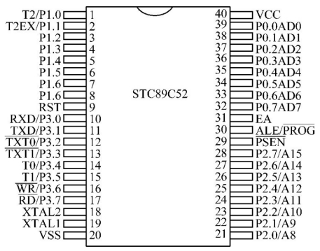

**引脚功能分类：**

1. **电源引脚（2个）**
   - **VCC**：主电源输入，+5V
   - **GND**：电源地

2. **晶振引脚（2个）**
   - **XTAL1：外部晶振输入
   - **XTAL2**：外部晶振输出

3. **复位引脚（1个）**
   - **RST**：复位输入，高电平有效

4. **下载引脚（2个）**
   - **P3.0**：串行数据接收
   - **P3.1**：串行数据发送

1. **GPIO引脚**
   - **P0口**：P0.0~P0.7
   - **P1口**：P1.0~P1.7
   - **P2口**：P2.0~P2.7
   - **P3口**：P3.0~P3.7

> [!IMPORTANT] 电流驱动能力
> STC89C52RC的5V单片机**P0口的灌电流最大为12mA**，**其他I/O口的灌电流最大为6mA**。设计电路时需确保负载电流不超过此限制。

## 二、STC89C52并行I/O端口

STC89C52系列单片机的所有I/O口均有**3种工作类型**，但不同端口在结构和功能上存在差异。理解这些差异是正确使用GPIO的关键。

### (1) P0口：多功能双向端口

P0口是一个**双功能的8位并行端口**，字节地址为`80H`，位地址为`80H`～`87H`。其电路结构具有独特的设计：

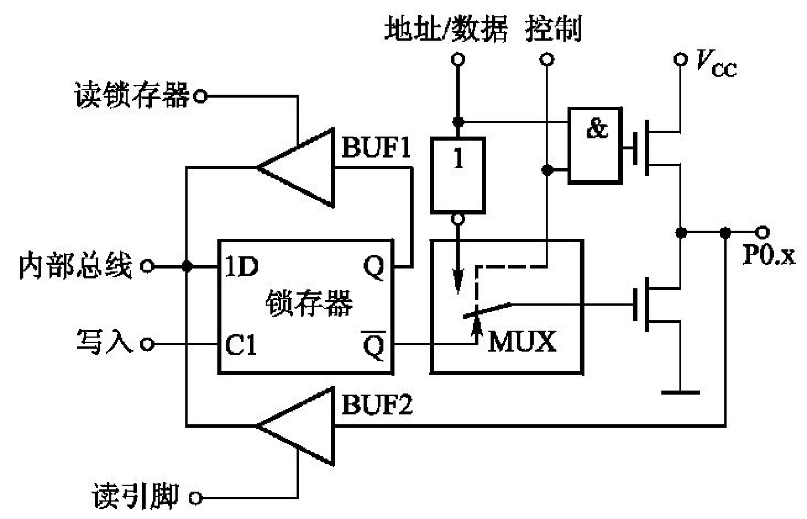

#### P0口工作原理分析

**1. 作为地址/数据总线使用**
当STC89C52外部扩展存储器或I/O时，P0口作为**复用的地址/数据总线**：
- "控制"信号为1，转接开关MUX接通反相器输出
- "与门"处于开启状态，实现地址/数据输出
- **输出1时**：上方场效应管导通，下方截止，引脚输出高电平
- **输出0时**：上方场效应管截止，下方导通，引脚输出低电平

**关键特性：**
- 此时P0口是**真正的双向口**
- 输出低8位地址和输入/输出8位数据
- 无需外接上拉电阻

**2. 作为通用I/O口使用**
当P0口用作普通I/O时：
- 各引脚**必须在片外接上拉电阻**（通常4.7kΩ~10kΩ）
- 端口不存在高阻抗悬浮状态，是**准双向口**
- 内部无上拉电阻，开漏输出结构

> [!WARNING] P0口使用注意事项
> 作为通用I/O时**必须外接上拉电阻**，否则无法输出高电平。这是P0口与其他端口的最大区别。

### (2) P1口：标准通用I/O端口

P1口为**通用I/O端口**，字节地址为`90H`，位地址为`90H`～`97H`。其电路结构相对简单：

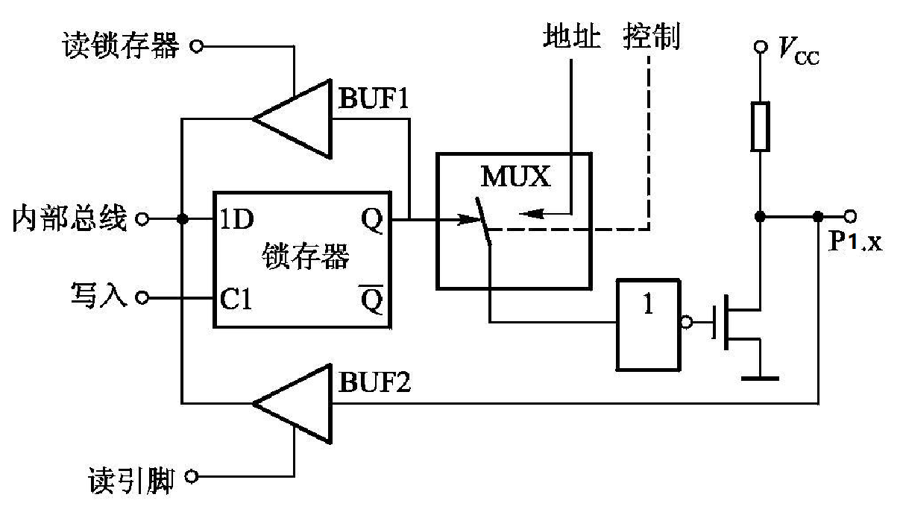

#### P1口工作原理分析

**1. 作为输出口**
- **CPU输出1**：Q=1，Q̄=0，场效应管截止，引脚输出高电平
- **CPU输出0**：Q=0，Q̄=1，场效应管导通，引脚输出低电平

**2. 作为输入口**
分为两种读取方式：
- **读锁存器**：锁存器输出端Q的状态经输入缓冲器BUF1进入内部总线
- **读引脚**：先向锁存器写1，使场效应管截止，引脚电平经BUF2进入内部总线

**P1口关键特性：**
- 内部有上拉电阻，**无需外接上拉电阻**
- 不存在高阻抗输入状态，是**准双向口**
- "读引脚"输入时，**必须先向锁存器写入1**

### (3) P2口：高8位地址总线端口

P2口是**双功能口**，字节地址为`A0H`，位地址为`A0H`～`A7H`。其电路结构支持地址总线功能：

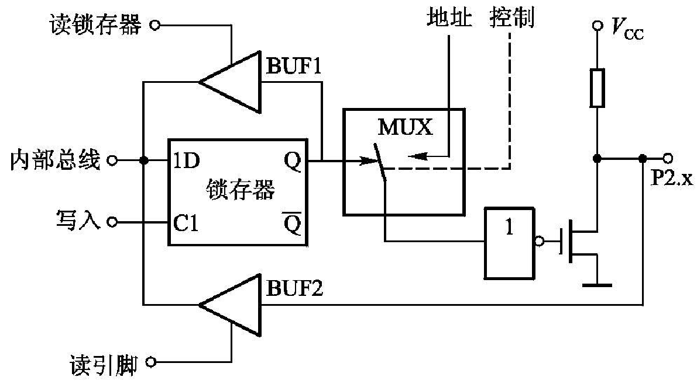

#### P2口工作原理分析

**1. 作为高8位地址总线**
- MUX与"地址"接通
- "地址"线为0：场效应管导通，引脚输出低电平
- "地址"线为1：场效应管截止，引脚输出高电平

**2. 作为通用I/O口**
- MUX与锁存器的Q端接通
- 输入时同样分为"读锁存器"和"读引脚"两种方式

**P2口应用要点：**
- 作为高8位地址总线时，输出外部存储器或I/O的高8位地址
- 与P0口输出的低8位地址构成**16位地址**，寻址64KB空间
- 作为通用I/O口时，功能与P1口相同，是**准双向口**
- 一般情况下优先作为地址总线使用

### (4) P3口：多功能复用端口

P3口在基本I/O功能基础上增加了**第二功能**，字节地址为`B0H`，位地址`B0H`～`B7H`：

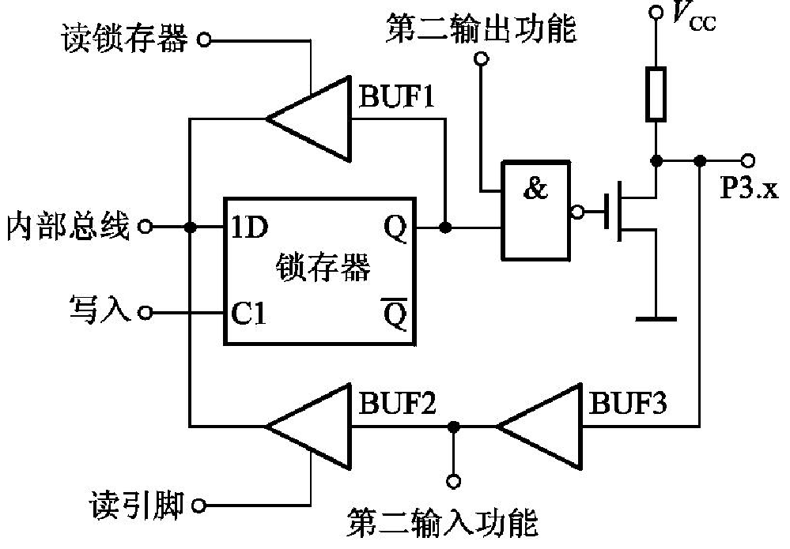

#### P3口工作原理分析

**1. 第二功能使用**
- **第二输出功能**：锁存器置1，使"与非门"开启
- **第二输入功能**：锁存器和第二输出功能端均置1，场效应管截止

**2. 第一功能（通用I/O）**
- 输出时："第二输出功能"端保持高电平
- 输入时：输出锁存器和"第二输出功能"端均应置1

**P3口第二功能对应关系：**

| 引脚 | 第二功能 | 说明 |
|------|----------|------|
| P3.0 | RXD | 串行数据接收 |
| P3.1 | TXD | 串行数据发送 |
| P3.2 | INT0 | 外部中断0 |
| P3.3 | INT1 | 外部中断1 |
| P3.4 | T0 | 定时器0外部输入 |
| P3.5 | T1 | 定时器1外部输入 |
| P3.6 | WR | 外部数据存储器写选通 |
| P3.7 | RD | 外部数据存储器读选通 |

**P3口特性总结：**
- 内部有上拉电阻，是**准双向口**
- 功能切换由指令自动控制，用户无需手动设置
- 输入部分有两个缓冲器，分别用于第一功能和第二功能

## 三、LED控制

### (1) LED电路原理分析

LED（Light Emitting Diode）是最基础的外设，通过控制GPIO电平实现开关：

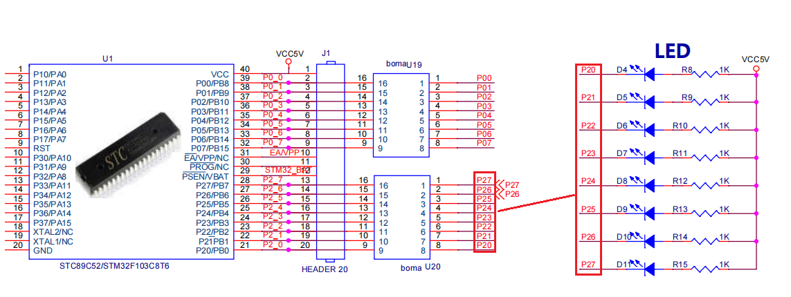

**电路分析：**
1. **电源路径**：VCC → 限流电阻R → LED → GPIO引脚
2. **控制逻辑**：
   - **GPIO输出低电平（0V）**：LED两端有压差，电流流过，LED亮
   - **GPIO输出高电平（5V）**：LED两端无压差，无电流，LED灭
3. **限流电阻计算**：
   - 假设LED正向压降2V，工作电流10mA
   - 电阻值 R = (5V - 2V) / 0.01A = 300Ω
   - 实际常用220Ω~1kΩ，根据亮度需求调整

**硬件配置要求：**
1. **拨码开关设置**：U20拨码开关拨到ON处

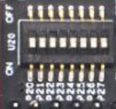

2. **电平控制规则**：**低电平亮，高电平灭**

### (2) LED控制代码实现

#### 案例1：LED全亮控制

```c
#include <STC89C5xRC.H> // 包含STC89C52的头文件

void main()
{
    // D4~D11全亮（P2口控制8个LED）
    P20 = 0;  // LED D4亮
    P21 = 0;  // LED D5亮
    P22 = 0;  // LED D6亮
    P23 = 0;  // LED D7亮
    P24 = 0;  // LED D8亮
    P25 = 0;  // LED D9亮
    P26 = 0;  // LED D10亮
    P27 = 0;  // LED D11亮
    
    // 死循环卡住单片机，防止程序跑飞
    while (1);
}
```

**代码解析：**
- 使用P2口的8个引脚分别控制8个LED
- 输出0（低电平）使LED点亮
- `while (1);`无限循环，保持输出状态

#### 案例2：LED闪烁控制

```c
#include <STC89C5xRC.H> // 包含STC89C52的头文件
#include <INTRINS.H>

void Delay1ms(unsigned int ms)  // @11.0592MHz
{
    unsigned char data i, j;

    while(ms > 0)
    {
        _nop_();
        i = 2;
        j = 199;
        do
        {
            while (--j);
        } while (--i);
        
        ms--;
    }
}

void main()
{
    while (1)
    {
        // 对LED不断取反，实现亮灭转换
        P20 = ~P20;
        
        // 延时500ms
        Delay1ms(500);
    }
}
```

**关键改进：**
1. **引入延时函数**：控制LED亮灭的时间间隔
2. **取反操作**：`~P20`将当前状态取反，简化代码
3. **循环结构**：实现持续的闪烁效果

#### 案例3：流水灯效果实现

```c
#include <STC89C5xRC.H> // 包含STC89C52的头文件
#include <INTRINS.H>

#define LED_DB  P2  // 定义LED端口宏

void Delay1ms(unsigned int ms)  // @11.0592MHz
{
    unsigned char data i, j;

    while(ms > 0)
    {
        _nop_();
        i = 2;
        j = 199;
        do
        {
            while (--j);
        } while (--i);
        
        ms--;
    }
}

void main()
{
    unsigned char tmp = 1;  // 初始模式：0000 0001
    
    while (1)
    {
        // 取反后输出，因为LED低电平亮
        LED_DB = ~tmp;
        
        // 左移一位，实现流水效果
        tmp <<= 1;
        
        // 如果移出8位，重新开始
        if(tmp == 0)
            tmp = 1;
        
        // 延时100ms控制流水速度
        Delay1ms(100);
    }
}
```

**流水灯算法解析：**
1. **初始状态**：`tmp = 0x01`（二进制0000 0001）
2. **取反输出**：`~tmp = 0xFE`（二进制1111 1110），只有P2.0为低电平
3. **左移操作**：`tmp <<= 1`变为0x02（0000 0010）
4. **循环检测**：当`tmp == 0`时重新赋值为1
5. **效果**：LED依次点亮，形成流水效果

## 四、精确延时函数的实现

在嵌入式系统中，精确的延时控制至关重要。51单片机通过指令循环实现延时，其精度取决于**时钟频率**和**指令周期**。

### 使用STC-ISP生成精确延时

STC-ISP软件提供了方便的延时计算工具：

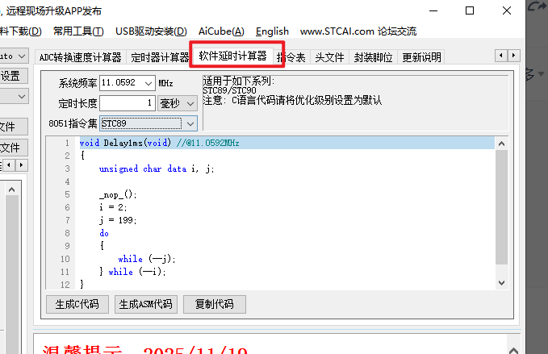

**生成步骤：**
1. 打开STC-ISP，选择"软件延时计算器"标签
2. 设置系统频率：11.0592MHz（常用值）
3. 选择指令集：STC89
4. 输入延时时间：1ms
5. 点击生成代码，复制到工程中使用

### 延时原理

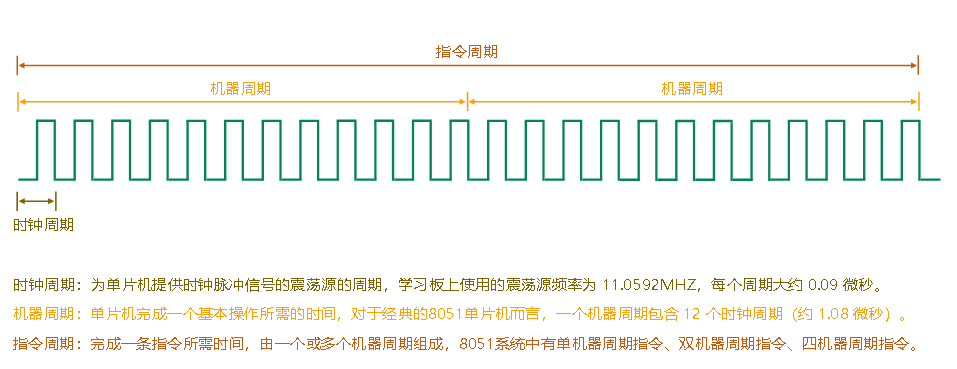

**关键概念：**
1. **机器周期**：51单片机的基本时间单位
   - 标准51：1个机器周期=12个时钟周期
   - 增强型（如STC89C52）：1个机器周期=1个时钟周期
   
2. **时钟频率与机器周期关系**：
   - 11.0592MHz时钟：机器周期 = 1/11.0592μs ≈ 0.0904μs
   - 12MHz时钟：机器周期 = 1/12μs ≈ 0.0833μs

3. **指令执行时间**：
   - 单周期指令：1个机器周期
   - 双周期指令：2个机器周期
   - 四周期指令：4个机器周期

### `_nop_()`函数的作用

生成的延时函数中调用了`_nop_()`函数，该函数定义在`INTRINS.H`头文件中：

```c
void _nop_(void);
```

**功能**：执行一个空操作，消耗1个机器周期的时间。

**作用**：
1. **提高延时精度**：填补循环中的时间间隙
2. **避免编译器优化**：防止空循环被优化掉
3. **标准化延时**：确保不同优化级别下延时一致

### 自定义延时函数设计

理解原理后，可以手动设计延时函数：

```c
// 基于11.0592MHz的精确延时函数
void Delay_us(unsigned int us)  // 微秒级延时
{
    while(us--)
    {
        _nop_(); _nop_(); _nop_(); _nop_();
        _nop_(); _nop_(); _nop_(); _nop_();
        _nop_(); _nop_();  // 共10个_nop_，约0.9μs
    }
}

void Delay_ms(unsigned int ms)  // 毫秒级延时
{
    unsigned int i;
    while(ms--)
    {
        for(i = 0; i < 1100; i++)  // 经验值调整
        {
            _nop_();
        }
    }
}
```

> [!NOTE] 延时校准
> 实际延时需要根据具体时钟频率和编译器优化级别进行校准，可通过示波器测量实际输出进行微调。

## 五、蜂鸣器控制：声音报警的实现

### (1) 蜂鸣器电路原理分析

蜂鸣器分为**有源**和**无源**两种类型，开发板通常使用有源蜂鸣器：

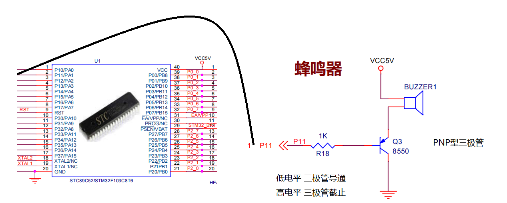

**电路分析：**
1. **驱动方式**：三极管驱动，增强电流驱动能力
2. **控制逻辑**：
   - **GPIO输出低电平**：三极管导通，蜂鸣器两端有电压，发声
   - **GPIO输出高电平**：三极管截止，蜂鸣器无电压，静音
3. **基极电阻**：限制基极电流，保护GPIO引脚

**硬件配置要求：**
1. **拨码开关设置**：U21拨码开关拨到ON处


2. **电平控制规则**：**低电平响，高电平不响**

### (2) 蜂鸣器控制代码实现

```c
#include <STC89C5xRC.H> // 包含STC89C52的头文件
#include <INTRINS.H>

void Delay1ms(unsigned int ms)  // @11.0592MHz
{
    unsigned char data i, j;

    while(ms > 0)
    {
        _nop_();
        i = 2;
        j = 199;
        do
        {
            while (--j);
        } while (--i);
        
        ms--;
    }
}

void main()
{
    while (1)
    {
        // 蜂鸣器低电平响（短促提示音）
        P11 = 0;
        Delay1ms(50);
        
        // 蜂鸣器高电平不响（长间隔）
        P11 = 1;
        Delay1ms(1000);
    }
}
```

**代码功能分析：**
1. **发声阶段**：`P11 = 0`持续50ms，产生短促提示音
2. **静音阶段**：`P11 = 1`持续1000ms，长间隔
3. **循环效果**：每1.05秒发出一次短促提示音

**应用场景扩展：**
- **报警提示**：连续短促响声
- **状态指示**：不同频率的响声表示不同状态
- **音乐播放**：通过PWM控制频率（需无源蜂鸣器）

## 六、按键输入

### (1) 按键电路原理

按键是最基础的人机交互设备，通过检测电平变化判断按键状态：

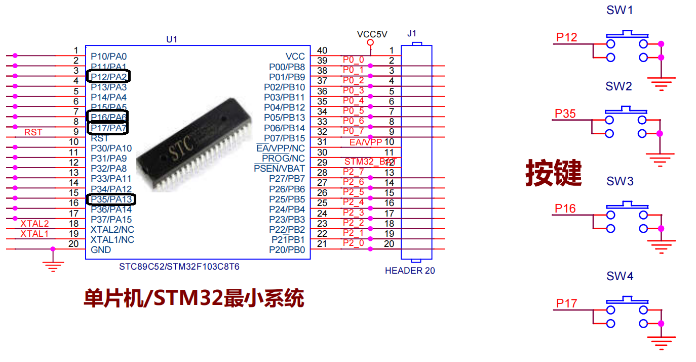

**电路分析：**
1. **按键按下**：引脚直接接地，变为低电平
2. **按键松开**：通过上拉电阻恢复到高电平

**硬件配置要求：**
1. **拨码开关设置**：U21、U22拨码开关拨到ON处

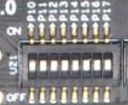

2. **电平状态**：**按键松开时高电平，按键按下时低电平**

### (2) 按键检测代码实现

```c
#include <STC89C5xRC.H> // 包含STC89C52的头文件
#include <INTRINS.H>

void Delay1ms(unsigned int ms)  // @11.0592MHz
{
    unsigned char data i, j;
    
    while(ms > 0)
    {
        _nop_();
        i = 2;
        j = 199;
        do
        {
            while (--j);
        } while (--i);
        
        ms--;
    }
}

// 定义外设引脚宏
#define BEEP  P11  // 蜂鸣器
#define LED4  P20  // LED D4

// 四个按键定义
#define SW1   P12  // 按键1
#define SW2   P35  // 按键2
#define SW3   P16  // 按键3
#define SW4   P17  // 按键4

// 按键检测主函数
void main()
{
    while (1)
    {
        // 检测按键1是否按下
        if(SW1 == 0)
        {
            Delay1ms(15);  // 延时消抖
            
            // 等待按键释放（消耗低电平时间）
            while(SW1 == 0);
            
            // 按键动作：LED4状态翻转
            LED4 = ~LED4;
        }
    }
}
```

### (3) 按键消抖

机械按键在按下和松开时会产生**抖动现象**，通常持续5-20ms：

**消抖方法对比：**

| 方法 | 原理 | 优点 | 缺点 |
|------|------|------|------|
| **硬件消抖** | RC滤波电路 | 效果稳定 | 增加成本，响应慢 |
| **软件延时消抖** | 检测到按键后延时再检测 | 简单易实现 | 占用CPU时间 |
| **状态机消抖** | 检测稳定状态变化 | 实时性好 | 实现复杂 |

**软件消抖实现优化：**

```c
// 改进的按键检测函数
unsigned char Key_Scan(void)
{
    static unsigned char key_state = 0;  // 按键状态
    unsigned char key_press = 0;         // 按键按下标志
    
    // 状态机实现消抖
    switch(key_state)
    {
        case 0:  // 等待按键按下
            if(SW1 == 0)
            {
                Delay1ms(10);  // 延时消抖
                if(SW1 == 0)   // 确认按下
                {
                    key_state = 1;
                    key_press = 1;  // 返回按键按下事件
                }
            }
            break;
            
        case 1:  // 等待按键释放
            if(SW1 == 1)
            {
                Delay1ms(10);  // 延时消抖
                if(SW1 == 1)   // 确认释放
                {
                    key_state = 0;  // 回到初始状态
                }
            }
            break;
    }
    
    return key_press;
}

void main()
{
    while(1)
    {
        if(Key_Scan())  // 检测到按键按下事件
        {
            LED4 = ~LED4;  // LED状态翻转
            BEEP = 0;      // 蜂鸣器短响提示
            Delay1ms(50);
            BEEP = 1;
        }
    }
}
```

## 七、综合应用

### 综合实验：按键控制LED和蜂鸣器

```c
#include <STC89C5xRC.H>
#include <INTRINS.H>

// 延时函数
void Delay1ms(unsigned int ms)
{
    unsigned char data i, j;
    while(ms--)
    {
        _nop_();
        i = 2;
        j = 199;
        do { while(--j); } while(--i);
    }
}

// 外设定义
#define ALL_LEDS P2
#define BEEP     P11
#define SW1      P12
#define SW2      P35
#define SW3      P16
#define SW4      P17

// 按键检测函数（带消抖）
unsigned char Key_Check(unsigned char key_pin)
{
    if(key_pin == 0)
    {
        Delay1ms(10);
        if(key_pin == 0)
        {
            while(key_pin == 0);  // 等待释放
            return 1;
        }
    }
    return 0;
}

void main()
{
    unsigned char mode = 0;  // 工作模式
    
    while(1)
    {
        // 按键1：模式切换
        if(Key_Check(SW1))
        {
            mode = (mode + 1) % 4;  // 4种模式循环
            BEEP = 0;  // 模式切换提示音
            Delay1ms(100);
            BEEP = 1;
        }
        
        // 根据模式执行不同功能
        switch(mode)
        {
            case 0:  // 模式0：全灭
                ALL_LEDS = 0xFF;
                break;
                
            case 1:  // 模式1：全亮
                ALL_LEDS = 0x00;
                break;
                
            case 2:  // 模式2：流水灯
                {
                    static unsigned char led_pattern = 0xFE;
                    ALL_LEDS = led_pattern;
                    led_pattern = (led_pattern << 1) | 0x01;
                    if(led_pattern == 0xFF) led_pattern = 0xFE;
                    Delay1ms(200);
                }
                break;
                
            case 3:  // 模式3：呼吸灯效果
                {
                    static unsigned char pwm_duty = 0;
                    static signed char pwm_dir = 1;
                    
                    // PWM控制LED亮度
                    if(pwm_duty > 0) ALL_LEDS = 0x00;
                    Delay1ms(pwm_duty);
                    ALL_LEDS = 0xFF;
                    Delay1ms(20 - pwm_duty);
                    
                    // 更新PWM占空比
                    pwm_duty += pwm_dir;
                    if(pwm_duty >= 20 || pwm_duty <= 0)
                        pwm_dir = -pwm_dir;
                }
                break;
        }
        
        // 按键2：紧急停止（所有LED灭，蜂鸣器报警）
        if(Key_Check(SW2))
        {
            ALL_LEDS = 0xFF;  // 所有LED灭
            while(1)
            {
                BEEP = ~BEEP;  // 蜂鸣器急促报警
                Delay1ms(100);
                if(Key_Check(SW3)) break;  // 按键3解除报警
            }
            BEEP = 1;  // 停止报警
        }
    }
}
```

## 八、工程实践

### 1. GPIO使用最佳实践

- **初始化配置**：上电后明确设置每个GPIO的初始状态
- **电流限制**：确保负载电流不超过端口驱动能力
- **上拉电阻**：P0口作为输出时必须外接上拉电阻
- **输入准备**：读取引脚前先向锁存器写1

### 2. 外设驱动优化

- **延时精度**：根据实际时钟频率校准延时函数
- **消抖处理**：机械按键必须进行消抖处理
- **状态管理**：使用状态机管理复杂外设行为
- **资源节省**：合理使用宏定义和函数封装

### 3. 调试技巧

- **分段测试**：先测试单个功能，再组合测试
- **信号测量**：使用万用表测量电平，示波器观察时序
- **仿真调试**：利用Keil软件仿真验证逻辑
- **日志输出**：通过串口输出调试信息（如有串口）

### 4. 常见问题排查

| 问题现象 | 可能原因 | 解决方案 |
|---------|---------|---------|
| **LED不亮** | 电流不足/方向错误 | 检查限流电阻，确认LED方向 |
| **按键响应异常** | 消抖不足/上拉电阻问题 | 增加消抖时间，检查上拉电阻 |
| **蜂鸣器不响** | 驱动电路故障 | 检查三极管和基极电阻 |
| **程序运行不稳定** | 电源噪声/复位电路问题 | 增加电源滤波，检查复位时间 |
