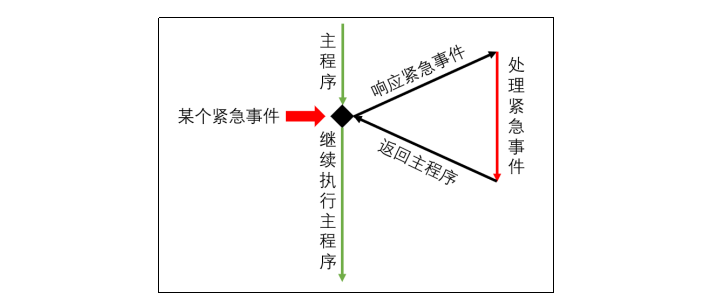
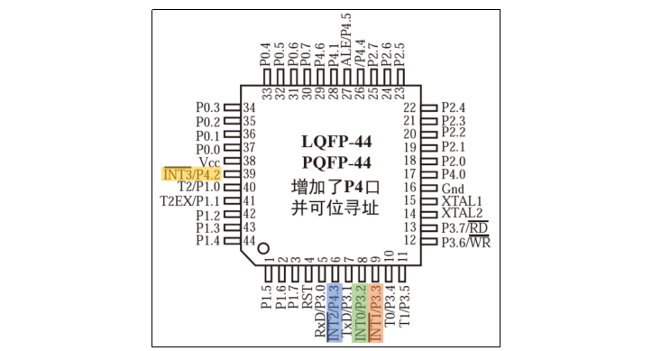
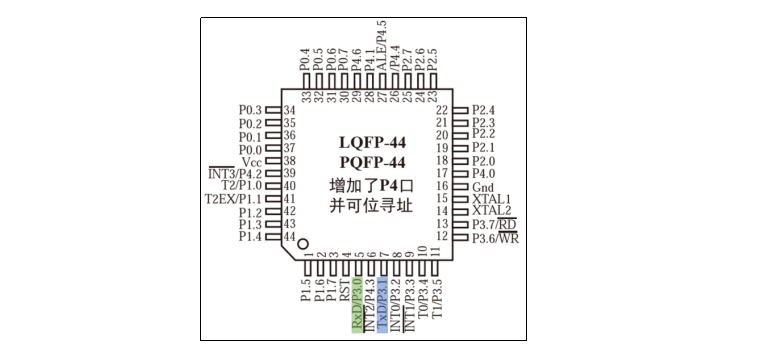
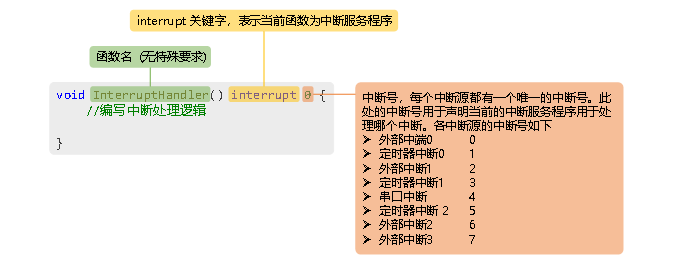

# 51单片机中断

## 一、概述

中断系统是单片机用于处理外部紧急事件的核心机制，它使单片机能够**实时响应外部事件**，显著提高了系统的灵活性和响应能力。中断系统的工作流程遵循一个清晰的逻辑：当CPU正在执行某项任务时，外部发生了某个紧急事件，此时CPU会**暂停当前的工作**，转而去处理这个紧急事件，处理完成之后，再回到原来被中断的位置，继续执行原来的任务。


这种机制类似于操作系统中的任务调度，但中断的触发是**异步且不可预测**的，这使得单片机能够及时响应外部环境的变化。在嵌入式系统中，中断是实现实时性的关键技术之一，广泛应用于按键检测、定时任务、通信接口等场景。

## 二、中断相关概念

### (1) 中断源

中断源是指能够引发中断的事件或信号源。在STC89C52RC单片机中，中断源可以分为三类：外部中断、定时器中断和串口中断。每个中断源都有其特定的触发条件和应用场景，理解不同中断源的特点对于设计可靠的嵌入式系统至关重要。

### (2) 中断标志位

中断标志位是中断系统的**状态指示器**，用于标识某个中断是否已经发生。每个中断源都有一个与之对应的中断标志位，当某个中断发生时，相应的中断标志位就会置为1。CPU通过**周期性地检测这些标志位**来判断是否有中断需要处理。

> [!IMPORTANT]
> 中断标志位的复位机制需要特别注意：有些中断源的标志位会在CPU处理完中断后**自动复位**，而有些则需要开发者**手动复位**。在使用中断时，必须仔细查阅芯片手册，明确每个中断标志位的复位方式，否则可能导致中断无法正常响应或重复触发。

### (3) 中断服务程序

中断服务程序是处理中断事件的**具体逻辑代码**。当某个中断标志位置1时，CPU会自动跳转到对应的中断服务程序入口地址开始执行。中断服务程序的设计需要遵循几个重要原则：

1. **执行时间尽可能短**，避免影响其他中断的响应
2. **避免在中断服务程序中执行复杂的计算或阻塞操作**
3. **正确处理中断标志位的复位**
4. **注意保护现场和恢复现场**，确保中断返回后程序能正确继续执行

### (4) 中断优先级

中断优先级定义了在多个中断同时发生时，单片机响应中断的**先后顺序**。STC89C52RC支持中断优先级机制，并且高优先级的中断可以打断低优先级的中断，这种机制称为**中断嵌套**。

中断优先级的设置需要根据系统的实时性要求进行合理规划。通常，响应时间要求最严格的中断应该设置为最高优先级，而可以容忍一定延迟的中断可以设置为较低优先级。

## 三、STC89C52RC中断源

STC89C52RC单片机共有8个中断源，这些中断源可以分为3大类，每类中断都有其特定的应用场景和配置方式。

### (1) 外部中断

外部中断是由单片机外部的紧急事件触发的中断，通过向单片机的特定引脚发送特定的信号来触发。STC89C52RC提供了4个外部中断引脚，分别是：

- **INT0**：外部中断0
- **INT1** ：外部中断1  
- **INT2** ：外部中断2
- **INT3** ：外部中断3



51单片机的外部中断支持两种触发方式：

1. **低电平触发**：当外部引脚保持低电平时，中断持续有效
2. **下降沿触发**：当外部引脚出现从高电平到低电平的跳变时，触发一次中断

选择触发方式需要考虑实际应用场景。低电平触发适合需要持续响应的场景，但需要注意防止中断重复触发；下降沿触发适合需要精确计数的场景，每个下降沿只触发一次中断。

### (2) 定时器中断

定时器中断是由单片机内部的定时器模块触发的中断。定时器是大多数单片机都具备的功能模块，用于实现**精确的定时任务**和**时间测量**。

定时器的基本工作原理是：设置一个初始计数值，然后开始**向上或向下计数**，当计数值达到预设的阈值时，触发定时器中断。开发者可以在中断服务程序中编写需要定时执行的任务逻辑。

STC89C52RC共有三个定时器：

- **Timer0**：8位/16位可配置定时器
- **Timer1**：8位/16位可配置定时器，通常用于串口波特率发生器
- **Timer2**：16位自动重装载定时器，功能更强大

每个定时器都有多种工作模式，包括定时器模式、计数器模式、自动重装载模式等，可以根据具体需求进行配置。

### (3) 串口中断

串口中断是由单片机串口通信模块触发的中断。串口是单片机用于**异步串行通信**的重要接口，广泛应用于设备间的数据交换。

当单片机通过串口**接收到数据**或者**发送完数据**后，都会触发相应的中断。串口中断使单片机能够及时处理通信数据，而无需通过轮询方式检查串口状态，提高了通信效率。

STC89C52RC的串口引脚为：
- **TxD** (P3.1)：发送数据引脚
- **RxD** (P3.0)：接收数据引脚



串口通信需要配置波特率、数据位、停止位、校验位等参数，这些参数需要在通信双方保持一致。STC89C52RC的串口支持多种波特率，可以通过定时器1或定时器2作为波特率发生器。

### (4) 中断服务程序声明

中断服务程序是处理中断的具体代码实现。STC89C52RC共有8个中断源，开发者需要为每个使用的中断源声明相应的中断服务程序。

中断服务程序的声明语法遵循特定的格式：



关键要点：
1. 使用 `interrupt` 关键字声明中断服务程序
2. 每个中断源有固定的**中断号**，必须正确指定
3. 中断服务程序通常声明为 `void` 类型，无参数无返回值
4. 在Keil C51编译器中，中断服务程序会自动保存和恢复现场

例如，外部中断0的中断服务程序声明为：
```c
void EXTI0_IRQHandler(void) interrupt 0
{
    // 中断处理逻辑
    // 清除中断标志位
}
```

### (5) 中断优先级与嵌套

STC89C52RC支持**四个中断优先级**，每个中断源都可以单独设置优先级。中断优先级的设置通过特定的寄存器完成，需要仔细配置以确保系统按预期工作。

中断优先级规则：
1. **优先级高的中断优先处理**：若多个中断同时发生，优先级高的会被优先处理
2. **中断号决定同优先级顺序**：若两个中断的优先级相同，则根据其中断号决定处理顺序，中断号越小越优先
3. **支持中断嵌套**：高优先级的中断可以打断低优先级的中断

中断嵌套机制允许高优先级的中断及时得到响应，即使CPU正在处理低优先级的中断。STC89C52RC支持**两级中断嵌套**，这意味着在一个中断服务程序中，只能被更高优先级的中断打断一次。

> [!NOTE]
> 中断嵌套虽然提高了系统的实时性，但也增加了系统的复杂性。在使用中断嵌套时，需要特别注意**资源竞争**和**重入问题**，避免出现数据不一致或死锁等情况。

## 四、中断系统设计

在实际的嵌入式系统开发中，合理使用中断系统需要考虑以下几个关键点：

### 中断响应时间优化
- 保持中断服务程序尽可能简短
- 避免在中断服务程序中调用耗时函数
- 合理设置中断优先级，确保关键任务及时响应

### 中断资源共享与保护
- 使用临界区保护共享资源
- 考虑使用信号量或队列进行中断与主程序间的通信
- 注意中断服务程序中的变量作用域和生命周期

### 中断调试技巧
- 使用GPIO引脚输出调试信号，测量中断响应时间
- 利用串口输出调试信息，但要注意避免在中断中频繁使用串口输出
- 使用逻辑分析仪或示波器观察中断触发时序

### 功耗与中断
- 在低功耗应用中，合理配置中断唤醒源
- 注意中断触发方式对功耗的影响
- 在休眠模式下，确保必要的中断能够唤醒系统

