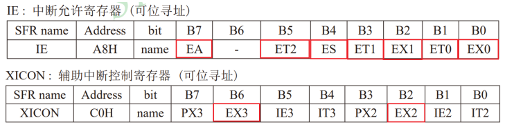
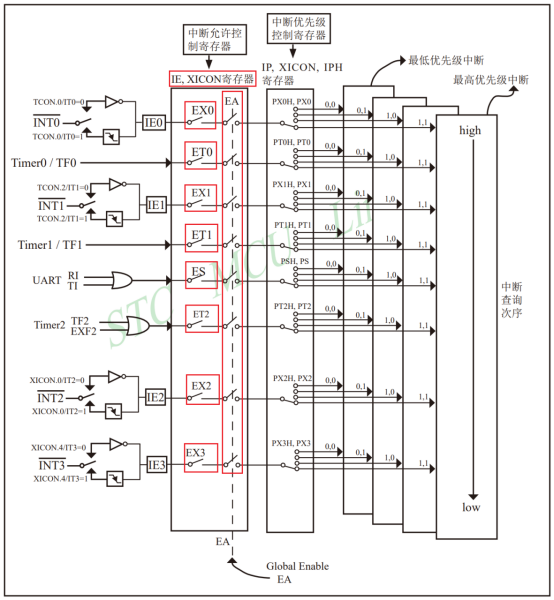
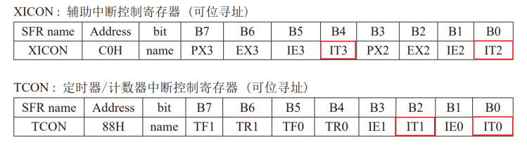
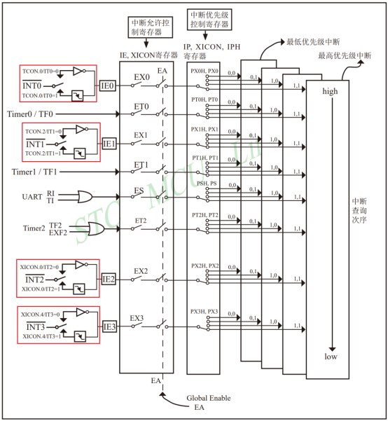
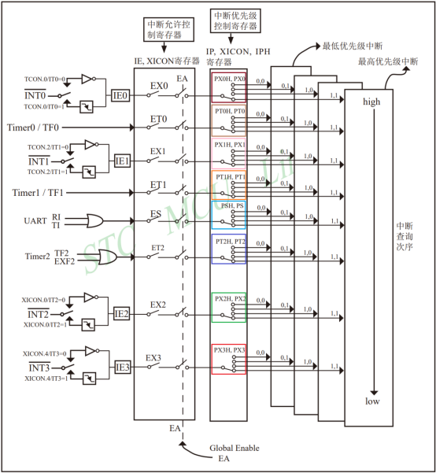

# 51单片机外部

## 概述

外部中断是单片机响应外部事件的重要机制，相比轮询方式检测按键状态，中断方式具有**响应及时**、**CPU占用率低**的优势。在实际的嵌入式系统中，外部中断广泛应用于按键检测、传感器信号采集、通信接口事件处理等场景。

## 硬件设计

### 硬件连接

STC89C52RC单片机的外部中断引脚配置取决于芯片封装类型：
- **DIP-40封装**：仅提供**两个外部中断引脚** - P3.2(INT0) 和 P3.3(INT1)
- **其他封装**：可能提供四个外部中断引脚 - INT0~INT3

DoublePI教学开发板采用的是DIP-40封装的STC89C52RC芯片，因此只有**INT0和INT1**两个外部中断引脚可用。然而，开发板上的四个按键并未直接连接到这两个中断引脚，这给外部中断实验带来了硬件限制。

### 软件模拟

为了解决硬件连接限制，本实验采用了一种**软件模拟**的解决方案：
1. 将按键连接到普通GPIO引脚（如P1.2）
2. 通过代码检测按键状态
3. 当按键按下时，**手动控制INT1引脚**产生下降沿信号
4. 下降沿信号触发外部中断1


这种方法的优点在于可以在硬件资源有限的情况下学习外部中断的配置和使用，但需要注意的是，在实际产品设计中，应尽量将需要快速响应的事件直接连接到外部中断引脚。

## 外部中断配置流程

### 启用中断系统

默认情况下，CPU会**屏蔽所有中断请求**，这意味着CPU不会响应任何中断。要使用中断功能，必须首先启用中断系统。

STC89C52系列单片机的中断启用通过两个关键寄存器控制：

1. **IE (Interrupt Enable) 寄存器** - 中断使能寄存器
2. **XICON 寄存器** - 扩展中断控制寄存器（用于INT2和INT3）



这两个寄存器各有8位，每位对应一个中断源的控制位。STC89C52系列的中断系统采用**两级控制机制**：

1. **EA (Global Interrupt Enable)** - 总中断使能位，必须置1才能启用任何中断
2. **各中断源独立使能位** - 如EX0、EX1等，控制特定中断源的启用



从结构图可以看出，中断请求需要同时通过**总开关(EA)** 和 **分开关(EXx)** 才能到达CPU，这种设计提供了灵活的中断控制能力。

### 配置外部中断触发方式

STC89C52系列的外部中断支持两种触发方式：

1. **低电平触发** - 当外部引脚保持低电平时，中断持续有效
2. **下降沿触发** - 当外部引脚出现从高电平到低电平的跳变时，触发一次中断



触发方式的配置通过**TCON寄存器**的低4位完成：
- **IT0** - 控制外部中断0的触发方式
- **IT1** - 控制外部中断1的触发方式  
- **IT2** - 控制外部中断2的触发方式
- **IT3** - 控制外部中断3的触发方式



> [!IMPORTANT]
> 触发方式的选择需要根据具体应用场景决定：
> - **下降沿触发**适合需要**精确计数**的场景，每个下降沿只触发一次中断
> - **低电平触发**适合需要**持续响应**的场景，但需要注意防止中断重复触发
> 
> 对于按键检测，通常推荐使用**下降沿触发**，因为低电平触发会在按键持续按下期间不断触发中断，可能导致程序异常。

### 配置中断优先级（可选）

STC89C52系列的中断系统支持**四个优先级级别**，每个中断源的优先级需要通过2个控制位进行配置。8个中断源共需要16个控制位，这些控制位分布在三个寄存器中：

1. **IP (Interrupt Priority) 寄存器** - 中断优先级寄存器
2. **IPH (Interrupt Priority High) 寄存器** - 中断优先级高字节寄存器
3. **XICON 寄存器** - 扩展中断控制寄存器


优先级控制位的具体作用如下图所示：



中断优先级规则：
1. 优先级高的中断优先处理
2. 同优先级中断按**中断号顺序**处理
3. 高优先级中断可以打断低优先级中断（中断嵌套）

> [!TIP]
> 在简单的单任务系统中，可以省略优先级配置，所有中断使用默认优先级。但在复杂的多任务系统中，合理设置中断优先级对于确保关键任务的及时响应至关重要。

### 定义中断服务程序

中断服务程序是处理中断事件的具体代码。STC89C52的外部中断有固定的中断号：
- **外部中断0** - 中断号 0
- **外部中断1** - 中断号 2  
- **外部中断2** - 中断号 6
- **外部中断3** - 中断号 7

以外部中断0为例，其中断服务程序应定义为：

```c
void INT0_Handler() interrupt 0
{
    // 中断处理逻辑
    // 注意：中断服务程序应尽可能简短
}
```

中断服务程序的编写需要遵循几个重要原则：
1. **执行时间短** - 避免影响其他中断的响应
2. **避免复杂操作** - 不要在中断中执行耗时计算或阻塞操作
3. **正确处理标志位** - 根据需要清除中断标志
4. **保护现场** - 如果修改了重要寄存器，需要先保存后恢复

## 软件设计与实现

### 启用外部中断1

启用外部中断1需要两个步骤：打开总中断开关和打开外部中断1开关。

```c
// 打开中断总开关 - 必须首先启用
EA = 1;

// 打开外部中断1开关
EX1 = 1;
```

> [!NOTE]
> `EA = 1` 是启用任何中断的**前提条件**。如果EA为0，即使单独中断使能位为1，CPU也不会响应中断。

### 配置外部中断1的触发方式

本实验选择**下降沿触发**方式，这是按键检测的常用配置。

```c
// 配置外部中断1为下降沿触发
IT1 = 1;
```

选择下降沿触发的原因：
1. **避免重复触发**：按键按下时，如果使用低电平触发，中断会不断被触发
2. **精确响应**：每个按键动作只触发一次中断，便于事件计数
3. **防抖处理**：结合软件防抖，可以提高按键检测的可靠性

### 中断服务程序实现

中断服务程序需要根据具体需求编写。本实验的需求是在中断触发时切换LED状态。

```c
void INT1_Func() interrupt 2
{
    // 中断中切换LED0状态
    LED0 = ~LED0;
}
```

中断服务程序的关键点：
1. **interrupt 2** 指定这是外部中断1的服务程序
2. **LED0 = ~LED0** 实现LED状态翻转
3. 中断服务程序应尽可能简短，避免影响系统性能

### 完整代码

```c
#include <STC89C5xRC.H> // 包含STC89C52的头文件

#define LED0   P20      // LED0连接到P2.0

sbit SW1 = P1^2;        // 按键连接到P1.2

// 外部中断1初始化函数
void Init_INT1()
{
    // 打开中断总开关
    EA = 1;

    // 打开外部中断1开关
    EX1 = 1;

    // 配置外部中断为下降沿触发
    IT1 = 1;
}

/******************延时函数***********************/
void delayms(unsigned int x)
{
    unsigned int i;
    while(x--)
    {
        for(i=0;i<113;i++);
    }
}

/******************按键扫描函数***********************/
int Key_Scan1(void)
{
    delayms(10);  // 简单防抖
    
    /* 检测是否有按键按下 */
    if(SW1 == 0)
    {
        /* 等待按键释放 */
        while(SW1 == 0);
        return 0;  // 返回按键按下标志
    }
    else
    {
        return 1;  // 返回无按键按下标志
    }
}

void main()
{
    Init_INT1();  // 初始化外部中断1
    
    while (1)
    {
        // 检测按键状态
        if(Key_Scan1() == 0)
        {
            // 手动产生下降沿触发外部中断1
            P33 = 1;        // 先将P3.3(INT1)拉高
            delayms(100);   // 保持高电平一段时间
            P33 = 0;        // 再将P3.3(INT1)拉低，产生下降沿
            delayms(100);   // 保持低电平一段时间
        }
    }
}

/**
 * @brief 外部中断1服务程序
 * 
 * interrupt 2表示外部中断1触发时执行该函数
 * 中断号对应关系：0-外部中断0, 2-外部中断1, 6-外部中断2, 7-外部中断3
 */
void INT1_Func() interrupt 2
{
    // 中断中切换LED0状态
    LED0 = ~LED0;
}
```

## 注意事项

### 软件模拟中断触发

本实验的核心技术是通过**软件控制GPIO引脚**模拟外部中断信号：

```c
P33 = 1;    // 产生高电平
delayms(100);
P33 = 0;    // 产生低电平，形成下降沿
```

这种方法的**优点**是可以在硬件资源有限的情况下学习中断机制，但**缺点**是响应速度受软件执行时间影响，不如硬件直接触发及时。

### 中断服务程序的设计原则

- **保持简短**：中断服务程序执行时间应尽可能短
- **避免阻塞**：不要在中断中调用可能阻塞的函数
- **及时返回**：处理完必要逻辑后立即返回
- **保护数据**：如果访问共享数据，需要考虑同步机制

### 调试技巧

- 使用**GPIO引脚输出调试信号**，测量中断响应时间
- 在中断服务程序开始和结束处设置不同的电平，用示波器观察
- 使用**串口输出调试信息**，但要注意避免在中断中频繁使用串口
- 检查**中断标志位**是否正确清除

## 总结

本实验深入了解了51单片机外部中断的**配置流程**、**触发方式**和**服务程序编写**。虽然实验采用了软件模拟的方式触发中断，但这种方法完整地展示了外部中断的工作原理。

关键知识点总结：
1. **中断启用需要两级控制**：EA总开关和EXx分开关
2. **触发方式选择很重要**：下降沿触发适合按键检测
3. **中断服务程序要简短**：避免影响系统性能
4. **优先级配置可选**：简单系统可以省略

外部中断是单片机实现**实时响应**的关键技术，掌握其原理和应用对于嵌入式系统开发至关重要。在实际项目中，应根据具体需求合理设计中断系统，平衡响应速度和系统复杂度。
