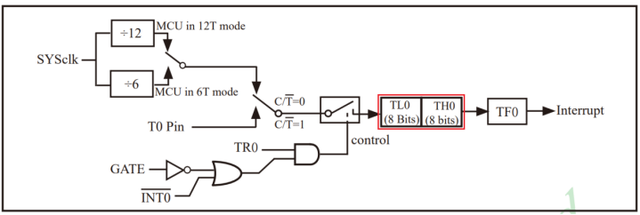
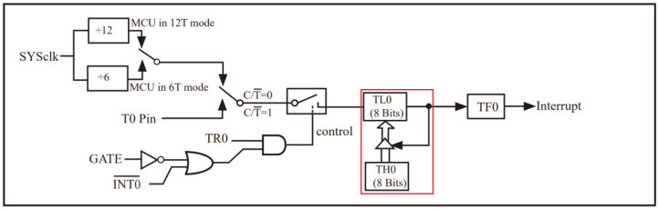
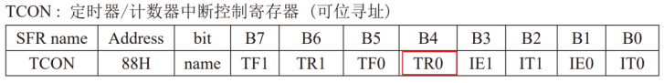
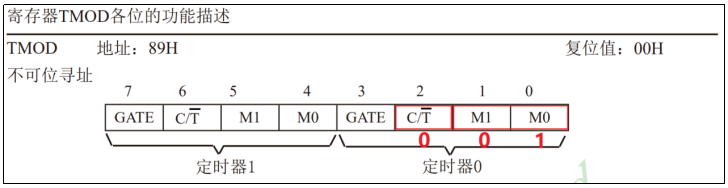
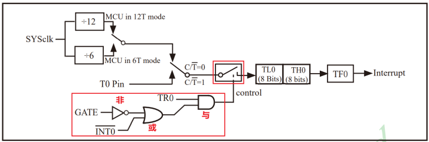

# 51单片机定时器中断

## 一、概述

定时器是单片机系统中实现**精确时间控制**的核心模块，它通过脉冲计数器对时钟信号进行计数，当计数值达到预设阈值时触发中断，从而实现定时任务。在嵌入式系统中，定时器中断广泛应用于**周期性任务调度**、**时间测量**、**PWM波形生成**、**通信波特率控制**等场景。

定时器的基本工作原理是：使用一个n位的脉冲计数器对时钟信号的脉冲进行计数，每个时钟脉冲使计数器加1。当脉冲计数器达到最大值（2^n）时发生**溢出**，此时触发定时器中断。根据这一原理，定时时间主要受三个因素影响：

1. **脉冲计数器的位数** - 决定最大计数值和定时范围
2. **脉冲计数的初始值** - 控制具体的定时时长
3. **时钟信号的频率** - 决定每个计数脉冲的时间间隔

理解这三个影响因素对于精确控制定时时间至关重要。在实际应用中，需要根据系统时钟频率和定时需求，合理计算计数器的初始值。

## 二、定时器使用

### (1) 启用定时器中断

STC89C52系列单片机共有**三个定时器**：Timer0、Timer1和Timer2。每个定时器都有对应的中断使能控制位，这些控制位位于**IE（Interrupt Enable）寄存器**中。


启用定时器0中断需要两个步骤：

```c
// 中断总开关 - 必须首先启用
EA = 1;

// 定时器0中断开关
ET0 = 1;
```

> [!NOTE]
> 启用任何中断都必须先设置 `EA = 1`，这是中断系统的**总开关**。如果EA为0，即使单独的中断使能位为1，CPU也不会响应中断。

### (2) 选择定时器工作模式

STC89C52系列的定时器支持多种工作模式，以适应不同的应用场景。工作模式的选择主要通过**TMOD（Timer Mode）寄存器**进行配置。

#### 1. 计数/定时方式选择

定时器可以工作在两种基本方式下：

1. **定时方式** - 对系统时钟信号进行计数，用于时间测量和定时任务
2. **计数方式** - 对外部引脚输入的脉冲进行计数，用于频率测量和事件计数


两种方式的本质相同，都是使用脉冲计数器对脉冲进行计数。区别在于脉冲信号的来源：
- **定时方式**：脉冲信号来自系统时钟（内部信号）
- **计数方式**：脉冲信号来自单片机外部引脚（外部信号）


选择定时方式时，应将C/T控制位设置为0。需要注意的是，大多数定时应用都使用**定时方式**，而计数方式主要用于特殊场景如转速测量、脉冲计数等。

#### 2. 工作模式

STC89C52的定时器支持四种工作模式，通过TMOD寄存器的M1和M0位进行选择：

| M1  | M0  | 工作模式         | 计数器位数 | 特点                |
| --- | --- | ------------ | ----- | ----------------- |
| 0   | 0   | 模式0（13位）     | 13位   | 最大计数8192，兼容早期8051 |
| 0   | 1   | 模式1（16位）     | 16位   | 最大计数65536，最常用     |
| 1   | 0   | 模式2（8位自动重装载） | 8位    | 自动重装载，适合精确周期任务    |
| 1   | 1   | 模式3（双8位）     | 2×8位  | 将Timer0拆分为两个8位定时器 |


##### a. 模式0 - 13位定时/计数器

模式0使用**13位脉冲计数器**，最大计数值为8192（2^13）。该模式下，TL0寄存器只使用低5位，TH0使用全部8位。


> [!TIP]
> 模式0主要是为了兼容早期的8051单片机，在现代应用中较少使用，因为13位的计数范围有限，且配置相对复杂。

##### b. 模式1 - 16位定时/计数器

模式1使用**16位脉冲计数器**，最大计数值为65536（2^16）。这是**最常用的工作模式**，TL0和TH0各使用8位，共同组成16位计数器。



模式1的优点是计数范围大，配置简单，适合大多数定时应用。缺点是需要**手动重装载**初始值，在中断服务程序中需要重新设置TL0和TH0。

##### c. 模式2 - 8位自动重装载

模式2使用**8位脉冲计数器**，最大计数值为256。该模式的特点是**自动重装载**：TL0用于存储当前计数值，TH0用于存储重装载值。当TL0溢出时，TH0的值会自动重新装入TL0。



模式2特别适合需要**精确周期性任务**的场景，如串口通信的波特率生成。由于自动重装载，中断服务程序不需要重新设置计数器初始值，减少了代码复杂度和执行时间。

##### d. 模式3 - 双8位定时/计数器

模式3将Timer0拆分为**两个独立的8位定时器**：TL0作为一个8位定时器，TH0作为另一个8位定时器。每个定时器都有独立的控制位和中断。


模式3在需要多个短定时器的场景中非常有用，但需要注意的是，Timer0工作在模式3时，Timer1不能用作定时器，只能用作串口波特率发生器。

### (3) 设置脉冲计数器初始值

51单片机的定时器在**计数器溢出时触发中断**，因此定时时间的长短需要通过设置计数器的初始值来控制。计算初始值需要三个步骤：

#### 1. 明确每个计数脉冲的时间

根据定时器的结构，传递给脉冲计数器的信号是系统时钟信号经过分频后得到的。STC89C52支持两种分频方式：**12分频**和**6分频**，默认是12分频。


假设系统时钟频率为11.0592MHz（11059200Hz），使用12分频，则：
- 计数脉冲频率 = 11059200 / 12 = 921600 Hz
- 每个计数脉冲的时间 = 12 / 11059200 ≈ 1.085μs

#### 2. 计算所需脉冲个数

根据期望的定时时长计算所需的脉冲个数。例如，需要定时1ms：
- 所需脉冲个数 = 定时时间 / 每个脉冲时间
- 1ms需要的脉冲个数 = 0.001 / (12/11059200) ≈ 921.6 ≈ 922个脉冲

#### 3. 计算脉冲计数器初始值

对于16位定时器（模式1），最大计数值为65536。初始值计算公式为：
- 初始值 = 65536 - 所需脉冲个数

对于1ms定时：
- 初始值 = 65536 - 922 = 64614

将初始值分别赋给TL0（低8位）和TH0（高8位）：

```c
TL0 = 64614;        // 低8位
TH0 = 64614 >> 8;   // 高8位，右移8位获取高字节
```

> [!IMPORTANT]
> 实际计算时需要考虑整数舍入问题。更精确的计算公式是：
> ```c
> #define FOSC 11059200      // 晶振频率
> #define NT 12              // 分频系数
> #define T1MS (65536 - FOSC / NT / 1000)  // 1ms定时初始值
> ```

### (4) 启动定时器

完成配置后，需要启动定时器才能开始工作。定时器的启动受两个因素控制：

1. **内部控制位TR0** - 软件控制
2. **外部引脚INT0** - 硬件控制（可选）


控制逻辑由**GATE位**决定：
- **GATE=0**：外部引脚无效，仅由TR0控制。TR0=1启动，TR0=0停止
- **GATE=1**：需要TR0=1且INT0引脚为高电平方能启动

GATE控制位位于TMOD寄存器：


TR0控制位位于TCON寄存器：



大多数应用中将GATE设为0，仅通过TR0控制定时器启停：

```c
TR0 = 1;  // 启动定时器0
```

### (5) 定义中断服务程序

定时器0的中断号为1，中断服务程序应定义为：

```c
void Timer0_Handler() interrupt 1
{
    // 编写定时任务逻辑
    // 注意：中断服务程序应尽可能简短
}
```

中断服务程序的关键职责：
1. **重新装载计数器初始值**（模式0和模式1需要）
2. **执行定时任务逻辑**
3. **处理中断标志位**（某些情况下需要手动清除）

## 三、编程思路

### 实验目标：实现LED1每秒闪烁一次

具体需求是让LED1每隔0.5秒改变一次状态，实现每秒闪烁一次的效果。这是一个典型的**周期性定时任务**。

### (1) 启用定时器0中断

```c
// 中断总开关
EA = 1;

// 定时器0中断开关
ET0 = 1;
```

### (2) 选择定时器0工作模式

根据需求分析：
- 需要**定时方式**而非计数方式（C/T=0）
- 需要**16位计数器**以获得较大定时范围（模式1：M1=0, M0=1）
- 仅通过软件控制启停（GATE=0）



配置代码：

```c
// 清空TMOD的低4位（Timer0相关位）
TMOD &= 0xF0;

// 设置Timer0为模式1（16位定时器），定时方式，GATE=0
// 二进制：0000 0001，即0x01
TMOD |= 0x01;
```

### (3) 设置脉冲计数器的初始值

定时需求分析：
- 期望定时：0.5秒改变LED状态
- 问题：0.5秒需要的脉冲个数 = 0.5 / (12/11059200) ≈ 460800
- 16位计数器最大计数值：65536 < 460800

解决方案：**使用短定时+计数法**
1. 设置定时器为较短的时间（如1ms）
2. 每次中断记录一次
3. 累计500次1ms中断即达到500ms（0.5秒）

1ms定时初始值计算：
- 系统时钟：11.0592MHz
- 12分频：计数脉冲频率 = 11059200/12 = 921600 Hz
- 1ms所需脉冲数 = 0.001 × 921600 = 921.6 ≈ 922
- 初始值 = 65536 - 922 = 64614

```c
#define FOSC 11059200      // 晶振频率
#define NT 12              // 分频系数
#define T1MS (65536 - FOSC / NT / 1000)  // 1ms定时初始值

TL0 = T1MS;        // 低8位
TH0 = T1MS >> 8;   // 高8位
```

### (4) 启动定时器

由于GATE已设置为0，只需设置TR0即可启动定时器：



```c
// 启动定时器0
TR0 = 1;
```

### (5) 定义中断服务程序

中断服务程序需要完成两个任务：
1. 重新装载脉冲计数器（模式1需要手动重装载）
2. 统计中断次数，每500次改变LED状态

```c
void Timer0_Handler() interrupt 1
{
    // 定义静态局部变量，保持值在多次调用间不变
    static unsigned int count = 0;
    
    // 重新装载脉冲计数器（模式1需要手动重装载）
    TL0 = T1MS;
    TH0 = T1MS >> 8;
    
    // 统计中断次数，每500次（500ms）改变LED状态
    if (count++ >= 500) {
        LED1 = ~LED1;  // 翻转LED状态
        count = 0;     // 重置计数器
    }
}
```

> [!NOTE]
> 使用`static`关键字声明变量，使变量在多次函数调用间保持其值不变。这是中断服务程序中常用的技巧，用于在中断间传递状态信息。

## 四、完整代码

```c
#include <STC89C5xRC.H> // 包含STC89C52的头文件

// 系统参数定义
#define FOSC    11059200  // 晶振频率：11.0592MHz
#define NT      12        // 单片机工作周期：12T模式
#define T1MS    (65536 - FOSC / NT / 1000)  // 1ms定时初始值

// 硬件定义
#define LED1    P20       // LED1连接到P2.0

/**
 * @brief 定时器0初始化函数
 * 
 * 配置定时器0为模式1（16位定时器），1ms定时
 * 启用定时器中断，启动定时器
 */
void Timer0_Init()
{
    // 中断总开关
    EA = 1;
    
    // 定时器0中断开关
    ET0 = 1;
    
    // 配置定时器0工作模式
    // TMOD低4位：GATE=0, C/T=0, M1=0, M0=1 (模式1)
    TMOD &= 0xF0;   // 清空低4位
    TMOD |= 0x01;   // 设置为模式1
    
    // 设置1ms定时初始值
    TL0 = T1MS;     // 低8位
    TH0 = T1MS >> 8; // 高8位
    
    // 启动定时器0
    TR0 = 1;
}

/**
 * @brief 主函数
 * 
 * 初始化定时器后进入空循环，所有工作由中断处理
 */
void main()
{
    Timer0_Init();  // 初始化定时器0
    
    while (1)
    {
        // 主循环为空，所有工作由定时器中断处理
        // 在实际应用中，这里可以放置其他任务
    }
}

/**
 * @brief 定时器0中断服务程序
 * 
 * interrupt 1表示定时器0中断
 * 每1ms触发一次，累计500次（500ms）翻转LED状态
 */
void Timer0_Handler() interrupt 1
{
    // 静态局部变量，在多次中断调用间保持值不变
    static unsigned int count = 0;
    
    // 重新装载脉冲计数器（模式1需要手动重装载）
    TL0 = T1MS;
    TH0 = T1MS >> 8;
    
    // 统计中断次数，每500次（500ms）改变LED状态
    if (count++ >= 500) {
        LED1 = ~LED1;  // 翻转LED状态
        count = 0;     // 重置计数器
    }
}
```

## 五、关键技术与优化建议

### 1. 定时精度优化

影响定时精度的主要因素：
- **晶振频率误差**：选择精度高的晶振
- **计算舍入误差**：使用浮点数计算后取整
- **中断响应延迟**：保持中断服务程序简短

优化建议：
```c
// 更精确的初始值计算，避免整数除法舍入误差
#define T1MS (65536UL - (FOSC * 1000UL / NT / 1000))
```

### 2. 长定时实现策略

当需要的定时时间超过计数器最大范围时，可以采用以下策略：

1. **短定时+计数法**（本实验采用）
   - 优点：实现简单，适用范围广
   - 缺点：占用CPU时间较多

2. **定时器级联法**
   - 使用两个定时器级联
   - 一个定时器中断控制另一个定时器
   - 优点：精度高，CPU占用少
   - 缺点：占用多个定时器资源

3. **软件计数器法**
   - 在中断中维护一个软件计数器
   - 适合非常长的定时（几秒到几分钟）

### 3. 中断服务程序优化

- **保持简短**：中断服务程序执行时间应小于定时间隔
- **避免复杂操作**：不要在中断中进行浮点运算或函数调用
- **使用静态变量**：用于在中断间传递状态
- **及时清除标志**：根据需要清除中断标志位

### 4. 实际应用扩展

定时器中断在实际项目中的应用：

1. **多任务调度**：使用多个定时器实现简单RTOS
2. **PWM生成**：通过定时器中断控制占空比
3. **按键扫描**：定时扫描按键状态，避免阻塞
4. **数据采集**：定时采集传感器数据
5. **通信超时**：检测通信超时和重传

## 六、总结

定时器中断是51单片机实现**精确时间控制**的核心技术。通过本实验，我们掌握了：

1. **定时器工作原理**：基于脉冲计数和溢出中断
2. **工作模式选择**：四种模式的特点和适用场景
3. **初始值计算**：根据系统时钟和定时需求精确计算
4. **长定时实现**：短定时+计数法的实际应用
5. **中断服务程序设计**：保持简短，正确处理状态

关键要点回顾：
- **模式1最常用**：16位计数器，适用范围广
- **初始值计算关键**：`初始值 = 65536 - 所需脉冲数`
- **中断服务程序要简短**：避免影响定时精度
- **长定时用计数法**：短定时累计实现长定时