# 51单片机串口中断

## 一、通信基础

理解和使用UART（Universal Asynchronous Receiver/Transmitter，通用异步收发器）通信，需要先掌握一些通信领域的基础术语。这些概念是理解串口通信工作原理的基石。

### (1) 串行通信与并行通信

串行通信和并行通信是数据传输的两种基本方式，它们在数据传输机制上存在本质区别：

- **串行通信**：数据位**逐位顺序传输**，只需要一条数据线（或一对差分线）。优点是线路简单、成本低、传输距离远，缺点是传输速度相对较慢。
- **并行通信**：数据位**同时并行传输**，需要多条数据线（通常是8条、16条或32条）。优点是传输速度快，缺点是线路复杂、成本高、传输距离有限。

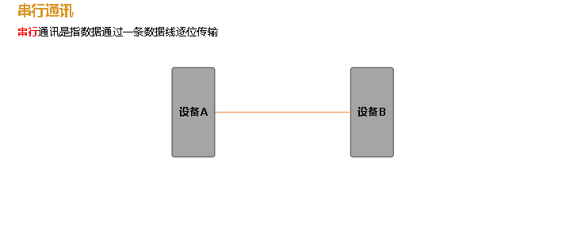

在嵌入式系统中，**串行通信**因其简单性和可靠性而被广泛使用。UART、SPI、I2C等都是常见的串行通信协议。

### (2) 单工通信与双工通信

单工和双工描述了通信双方数据传输的方向性：

- **单工通信**：数据只能**单向传输**，通信一方固定为发送端，另一方固定为接收端。如广播、电视信号。
- **双工通信**：数据可以**双向传输**，又分为两种：
  - **半双工**：同一时间只能单向传输，需要切换方向。如对讲机。
  - **全双工**：可以同时双向传输。如电话通信。

UART通信是**全双工通信**，这意味着它可以同时发送和接收数据，发送和接收使用独立的物理线路（TxD和RxD）。

### (3) 同步通信与异步通信

同步和异步通信的区别在于数据传输的时序协调方式：

- **同步通信**：通信双方使用**共同的时钟信号**进行数据同步。发送方和接收方在时钟信号的协调下进行数据传输。如SPI、I2C协议。
- **异步通信**：通信双方**没有共同的时钟信号**，依靠数据帧内的起始位和停止位进行同步。如UART协议。

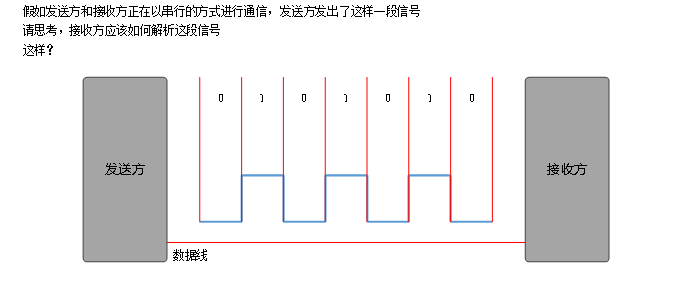

UART是典型的**异步通信协议**，它不需要时钟线，仅通过数据线即可完成通信，这简化了硬件连接，但要求通信双方必须预先约定相同的通信参数。

## 二、UART通信协议

### (1) 数据帧格式

在UART通信中，数据是以**帧（Frame）** 为单位进行传输的。每个数据帧包含以下几个部分：

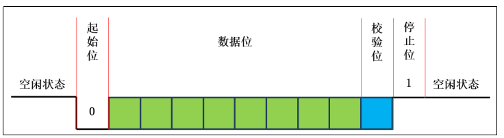

#### 1. 空闲状态

协议规定，在**没有数据传输**时，通信线路应保持**高电平**状态。这个高电平状态称为空闲状态，它为检测起始位提供了参考基准。

#### 2. 起始位

起始位表示一个数据帧的开始，它是一个**低电平**信号（与空闲状态的高电平形成对比）。起始位的下降沿通知接收方：一个新的数据帧即将开始。

#### 3. 数据位

数据位是传输的实际内容，位于起始位之后。数据位的长度可以是5到9位，但**最常用的是8位**（一个字节）。在数据位中：
- **低电平**表示二进制0
- **高电平**表示二进制1

数据位的传输顺序通常是**从最低有效位（LSB）到最高有效位（MSB）**。

#### 4. 校验位（可选）

校验位用于检测数据传输过程中是否出现错误。常见的校验方式有：

- **奇校验（Odd Parity）**：数据位中1的个数加上校验位，使总数为奇数
- **偶校验（Even Parity）**：数据位中1的个数加上校验位，使总数为偶数
- **无校验**：不进行校验，节省传输时间

校验位是可选的，在实际应用中，如果通信环境良好，可以省略校验位以提高传输效率。

#### 5. 停止位

停止位表示数据帧的结束，通常为**1位或2位高电平**。停止位确保接收方有足够的时间处理当前帧，并为下一帧的起始位检测做好准备。

### (2) 通信参数约定

为保证UART通信正常工作，通信双方必须预先约定以下参数：

#### 1. 波特率（Baud Rate）

波特率表示**每秒钟传输的符号数**（包括起始位、数据位、校验位和停止位）。常见的波特率有：4800、9600、19200、38400、57600、115200等。

> [!IMPORTANT]
> **波特率与比特率的区别**：
> - **波特率**：每秒钟传输的符号数
> - **比特率**：每秒钟传输的二进制位数
> 
> 对于无校验、8位数据、1位停止位的UART通信，比特率 = 波特率 × 10（因为每个字节需要10个符号：1起始位 + 8数据位 + 1停止位）

#### 2. 数据位长度

发送方和接收方必须明确数据位的位数，通常是8位。

#### 3. 校验方式

双方需要明确是否使用校验位，以及使用哪种校验算法（奇校验或偶校验）。

#### 4. 停止位长度

双方需要明确停止位的位数，通常是1位或2位。

## 三、STC89C52单片机UART模块

STC89C52系列单片机内部集成了一个功能强大的**全双工串行通信口**，相关引脚如下：

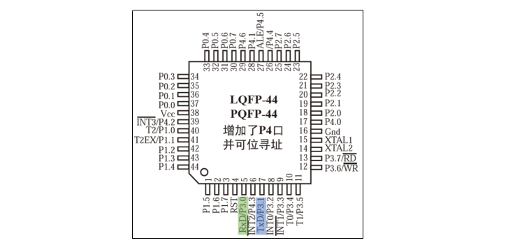

- **TxD（P3.1）**：串行数据发送引脚
- **RxD（P3.0）**：串行数据接收引脚

### UART工作模式

STC89C52的UART支持四种工作模式：

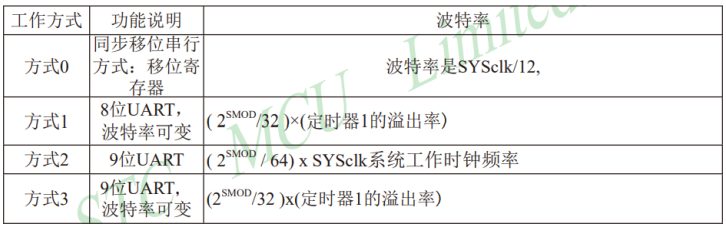

#### 模式分析：

1. **模式0**：同步通信模式
   - TxD作为时钟信号线，RxD作为数据信号线
   - 只能实现**半双工通信**
   - 主要用于扩展I/O口

2. **模式1**：经典UART模式（最常用）
   - 数据帧：1起始位 + 8数据位 + 1停止位
   - **波特率可变**，由定时器1控制
   - 支持全双工异步通信

3. **模式2**：固定波特率UART模式
   - 数据帧：1起始位 + 8数据位 + 1校验位 + 1停止位
   - 波特率固定为系统时钟的1/32或1/64
   - 支持全双工异步通信

4. **模式3**：可变波特率UART模式（带校验）
   - 数据帧：1起始位 + 8数据位 + 1校验位 + 1停止位
   - 波特率可变，由定时器1控制
   - 支持全双工异步通信

> [!NOTE]
> **模式1是最常用的UART工作模式**，因为它提供了8位数据位和可配置的波特率，满足了大多数通信需求。模式2和模式3增加了校验位，适用于对数据可靠性要求较高的场景。

### (1) 设置工作模式

工作模式通过**SCON（Serial Control）寄存器**进行配置：

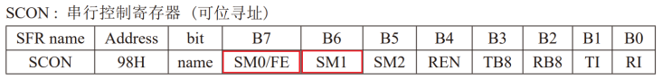

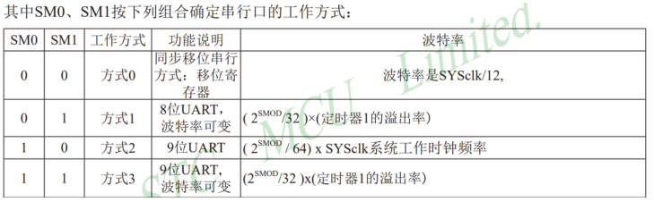

如果使用模式1，需要将SM0置为0，SM1置为1：
```c
SM0 = 0;
SM1 = 1;
```

### (2) 设置波特率

模式1的波特率由两个因素决定：
1. **SMOD控制位**：波特率加倍控制
2. **定时器1的溢出频率**：提供基准时钟

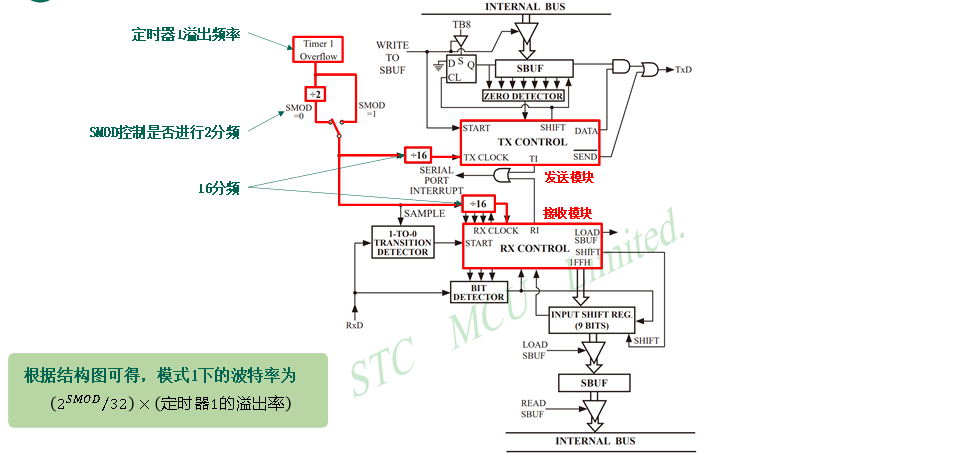

#### 1. 设置SMOD控制位

SMOD控制位位于**PCON（Power Control）寄存器**的最高位：

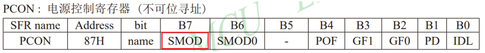

- **SMOD = 0**：波特率 = 定时器1溢出频率 / 32
- **SMOD = 1**：波特率 = 定时器1溢出频率 / 16（波特率加倍）

对于9600波特率，通常设置SMOD = 0。

#### 2. 配置定时器1

定时器1在UART通信中作为**波特率发生器**使用，不产生中断。

##### a. 选择定时器工作模式

定时器1的工作模式通过TMOD寄存器配置：

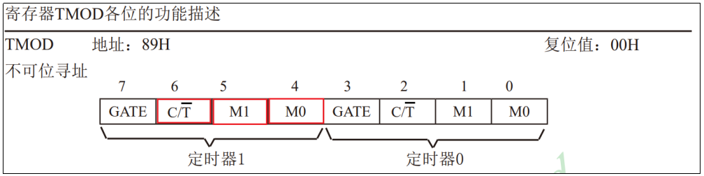

- **C/T位**：设置为0，选择定时模式（对系统时钟计数）
- **M1和M0位**：选择工作模式

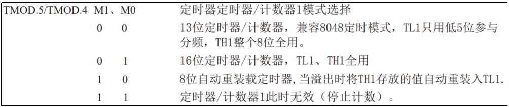

对于UART波特率生成，推荐使用**模式2（8位自动重装载）**，原因如下：
1. 不需要在中断中重新装载初始值
2. 提供稳定的波特率基准
3. 简化了代码实现

##### b. 计算脉冲计数器初始值

模式2使用8位计数器，最大计数值为256。定时器1的溢出频率计算公式为：

- 12T模式：溢出频率 = SYSclk / 12 / (256 - TH1)
- 6T模式：溢出频率 = SYSclk / 6 / (256 - TH1)

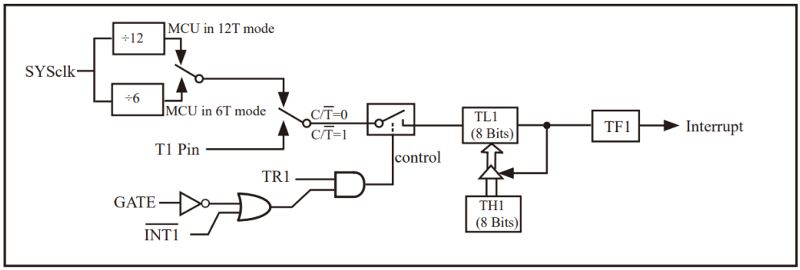

最终波特率计算公式（SMOD=0，12T模式）：
```
波特率 = SYSclk / 12 / (256 - TH1) / 32
```

假设系统时钟频率为11.0592MHz（11059200Hz），目标波特率为9600：
```
9600 = 11059200 / 12 / (256 - TH1) / 32
```

解方程得：
```
256 - TH1 = 11059200 / 12 / 32 / 9600 = 3
TH1 = 256 - 3 = 253
```

因此，TH1应设置为253（0xFD）。

##### c. 启动定时器1

定时器1的启动控制：
- **GATE位**：设置为0，不使用外部引脚控制
- **TR1位**：设置为1，启动定时器

```c
TR1 = 1;  // 启动定时器1
```

### (3) 发送数据流程

STC89C52的串口发送模块结构如下：

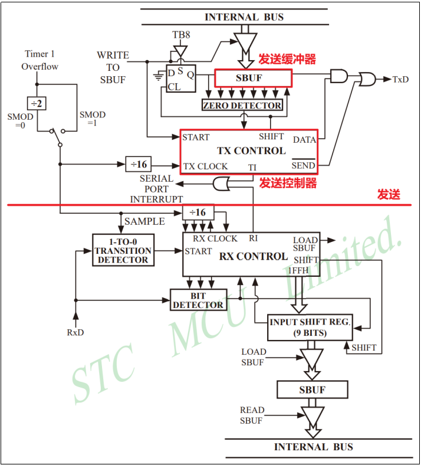

数据发送流程：
1. 将待发送的8位数据写入**SBUF（Serial Buffer）寄存器**
2. 硬件自动将数据从SBUF加载到发送移位寄存器
3. 在波特率时钟控制下，数据逐位从TxD引脚发送
4. 发送完成后，**TI（Transmit Interrupt）标志位置1**
5. 如果串口中断已启用，触发串口中断

> [!TIP]
> **SBUF寄存器是双缓冲的**：写入SBUF的数据立即进入发送缓冲区，程序可以继续写入下一个数据到SBUF，而不会影响当前发送。这提高了发送效率。

### (4) 接收数据流程

STC89C52的串口接收模块结构如下：

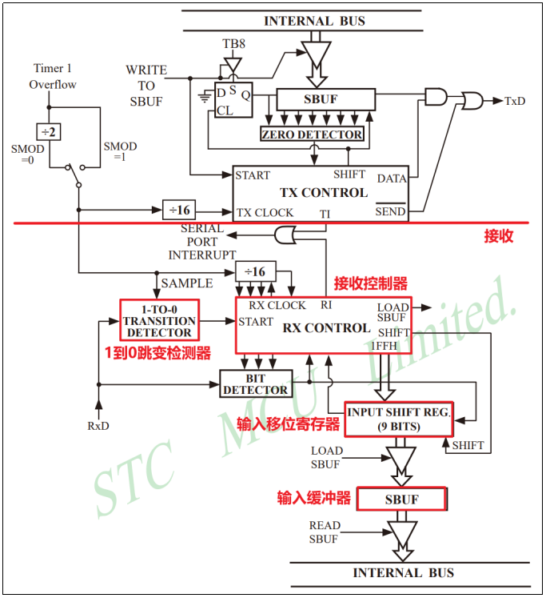

数据接收流程：
1. 将**REN（Receive Enable）位置1**，使能接收功能
2. 检测到起始位（RxD引脚从高变低）
3. 在波特率时钟控制下，逐位接收数据到接收移位寄存器
4. 接收完成后，数据加载到SBUF，**RI（Receive Interrupt）标志位置1**
5. 如果串口中断已启用，触发串口中断


接收数据的条件检查：
接收完成后，硬件会检查以下条件，只有满足条件才会将数据加载到SBUF并置位RI：

#### 1. 停止位正常

可以通过**SM2控制位**配置是否检测停止位的有效性：
- **SM2 = 0**：不检测停止位，任何情况下都接收数据
- **SM2 = 1**：只接收停止位为1的数据帧

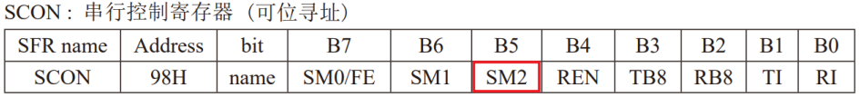

#### 2. 读取中断标志位为复位状态

**RI标志位必须为0**，表示上一帧数据已被读取或处理完毕。如果RI为1（上一帧数据未处理），当前接收的数据帧会被丢弃。

> [!WARNING]
> 这是一个重要的防错机制：如果程序没有及时读取SBUF中的数据，新接收的数据会丢失。这强调了在中断服务程序中及时处理接收数据的重要性。

### (5) 串口中断处理注意事项

串口中断有一个特殊之处：**发送完成和接收完成共享同一个中断**（中断号为4）。

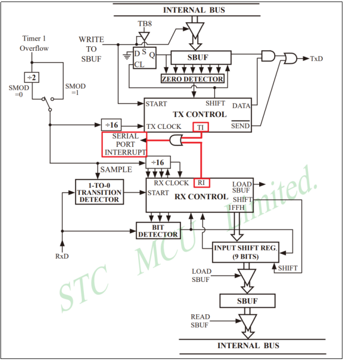

这意味着在串口中断服务程序中，必须判断中断是由发送还是接收触发的：

```c
void UART_Handler() interrupt 4
{
    /* 检查接收中断标志位RI */
    if (RI == 1) {
        // 处理接收数据
        RI = 0;  // 必须手动清除RI标志
    }
    
    /* 检查发送中断标志位TI */
    if (TI == 1) {
        // 处理发送完成
        TI = 0;  // 必须手动清除TI标志
    }
}
```

> [!IMPORTANT]
> **RI和TI标志位必须手动清除**！与某些自动清除的中断标志不同，串口中断的RI和TI标志位需要程序显式清除。如果忘记清除，会导致中断不断触发。

## 四、UART实战：PC控制LED

### (1) 需求分析

通过UART实现PC与单片机的通信，PC发送命令控制LED的亮灭：
- 发送字符'A'：点亮LED
- 发送字符'B'：熄灭LED
- 发送其他字符：回复错误信息

### (2) 硬件设计

现代PC通常不再提供串口，需要使用**USB转串口芯片**（如CH340、CP2102等）实现PC与单片机的连接：

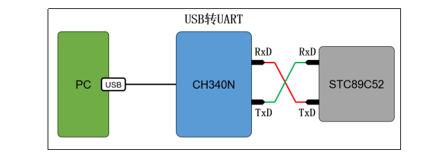

连接注意事项：
1. PC的TxD连接单片机的RxD（P3.0）
2. PC的RxD连接单片机的TxD（P3.1）
3. 共地连接（GND）
4. 通常不需要连接VCC，单片机独立供电

### (3) 软件设计

#### 1. 串口初始化配置

##### a. 选择串口工作模式

选择模式1（8位数据，无校验，1停止位）：
```c
SM0 = 0;
SM1 = 1;
```

##### b. 设置波特率

设置9600波特率：
```c
// 设置SMOD=0
PCON &= 0x7F;  // 或 PCON &= ~0x80;

// 配置定时器1为模式2（8位自动重装载）
TMOD &= 0x0F;  // 清空高4位（定时器1相关位）
TMOD |= 0x20;  // 设置定时器1为模式2

// 设置定时器1初值（9600波特率，11.0592MHz晶振）
TH1 = 0xFD;    // 253
TL1 = 0xFD;    // 253

// 启动定时器1
TR1 = 1;
```

##### c. 串口接收配置

```c
REN = 1;   // 使能接收
SM2 = 0;   // 不检测停止位
```

##### d. 启用串口中断

```c
EA = 1;    // 开启总中断
ES = 1;    // 开启串口中断
RI = 0;    // 清除接收中断标志
TI = 0;    // 清除发送中断标志
```

#### 2. 数据缓冲区设计

为了避免在中断服务程序中执行复杂操作，通常使用**环形缓冲区**或**简单缓冲区**来暂存接收到的数据：

```c
char uart_buffer;  // 单字节缓冲区
static bit is_sending = 0;  // 发送状态标志
```

## 五、完整代码实现

### uart.h - 串口驱动头文件

```c
#ifndef __UART_H
#define __UART_H

#include <STC89C5xRC.H> // 包含STC89C52的头文件

// 系统参数定义
#define FOSC    11059200  // 晶振频率：11.0592MHz
#define NT      12        // 工作模式：12T

/**
 * @brief 串口初始化函数
 * 
 * 配置串口为模式1，9600波特率
 * 启用串口中断，准备接收数据
 */
void UART_Init();

/**
 * @brief 通过串口发送一个字符
 * 
 * @param ch 要发送的字符
 */
void UART_SendChar(char ch);

/**
 * @brief 通过串口发送一个字符串
 * 
 * @param str 要发送的字符串（以'\0'结尾）
 */
void UART_SendStr(char *str);

/**
 * @brief 从串口接收一个字符（非阻塞）
 * 
 * @param p_ch 接收字符的指针
 * @return bit 1:成功接收到字符，0:无字符可接收
 */
bit UART_RecvChar(char *p_ch);

#endif
```

### uart.c - 串口驱动实现

```c
#include "uart.h"

// 波特率相关计算
#define BAUD_RATE   9600
#define T1_INIT     (256 - (FOSC / NT / 32 / BAUD_RATE))  // 计算定时器1初值

// 全局变量
char uart_buffer = 0;          // 接收数据缓冲区
static bit is_sending = 0;     // 发送状态标志：1-正在发送，0-空闲

/**
 * @brief 串口初始化
 */
void UART_Init()
{
    // 1. 设置串口工作模式为模式1
    SM0 = 0;
    SM1 = 1;
    
    // 2. 设置波特率为9600
    // 2.1 设置SMOD=0（波特率不加倍）
    PCON &= ~0x80;
    
    // 2.2 配置定时器1为模式2（8位自动重装载）
    TMOD &= 0x0F;      // 清空高4位（定时器1相关位）
    TMOD |= 0x20;      // 设置定时器1为模式2
    
    // 2.3 设置定时器1初值（9600波特率计算值）
    TH1 = T1_INIT;     // 高字节初值
    TL1 = T1_INIT;     // 低字节初值（模式2下TL1也会被使用）
    
    // 2.4 启动定时器1
    TR1 = 1;
    
    // 3. 串口接收配置
    REN = 1;   // 使能接收
    SM2 = 0;   // 不检测停止位
    
    // 4. 启用中断
    EA = 1;    // 开启总中断
    ES = 1;    // 开启串口中断
    
    // 5. 清除中断标志位
    TI = 0;
    RI = 0;
    
    // 6. 初始化状态变量
    is_sending = 0;
    uart_buffer = 0;
}

/**
 * @brief 发送一个字符
 * 
 * @param ch 要发送的字符
 */
void UART_SendChar(char ch)
{
    // 等待当前发送完成
    while (is_sending);
    
    // 设置发送状态
    is_sending = 1;
    
    // 将数据写入发送缓冲区，启动发送
    SBUF = ch;
}

/**
 * @brief 发送一个字符串
 * 
 * @param str 要发送的字符串（以'\0'结尾）
 */
void UART_SendStr(char *str)
{
    while (*str) {
        UART_SendChar(*str);
        str++;
    }
}

/**
 * @brief 接收一个字符（非阻塞）
 * 
 * @param p_ch 接收字符的指针
 * @return bit 1:成功，0:失败
 */
bit UART_RecvChar(char *p_ch)
{
    // 检查缓冲区是否有数据
    if (uart_buffer != 0) {
        *p_ch = uart_buffer;  // 读取数据
        uart_buffer = 0;      // 清空缓冲区
        return 1;             // 返回成功
    }
    
    return 0;  // 无数据可读
}

/**
 * @brief 串口中断服务程序
 * 
 * interrupt 4表示串口中断
 * 注意：发送完成和接收完成共享此中断
 */
void UART_Handler() interrupt 4
{
    // 接收中断处理
    if (RI == 1) {
        uart_buffer = SBUF;  // 读取接收到的数据到缓冲区
        RI = 0;              // 必须手动清除接收中断标志
    }
    
    // 发送中断处理
    if (TI == 1) {
        is_sending = 0;  // 发送完成，更新状态
        TI = 0;          // 必须手动清除发送中断标志
    }
}
```

### main.c - 主程序

```c
#include <STC89C5xRC.H> // 包含STC89C52的头文件
#include "uart.h"

// 硬件定义
#define LED1    P20  // LED1连接到P2.0

/**
 * @brief 主函数
 */
void main()
{
    char command;  // 命令缓冲区
    
    // 初始化串口
    UART_Init();
    
    // 主循环
    while (1) {
        // 检查是否接收到命令
        if (UART_RecvChar(&command)) {
            // 根据命令执行相应操作
            if (command == 'A') {
                // 点亮LED
                LED1 = 0;
                UART_SendStr("OK: LED is ON\r\n");
            }
            else if (command == 'B') {
                // 熄灭LED
                LED1 = 1;
                UART_SendStr("OK: LED is OFF\r\n");
            }
            else {
                // 未知命令
                UART_SendStr("ERROR: Unknown command\r\n");
            }
        }
        
        // 这里可以添加其他任务
        // 如按键检测、传感器读取等
    }
}
```

## 六、关键技术

### 1. 波特率计算优化

使用宏定义计算波特率相关参数，提高代码可维护性：

```c
// 更精确的波特率计算（避免整数除法误差）
#define CALC_BAUD(baud) (256 - (FOSC / NT / 32 / baud + 0.5))
```

### 2. 缓冲区设计

单字节缓冲区可能丢失数据，建议使用**环形缓冲区**：

```c
#define UART_BUF_SIZE 32

typedef struct {
    char buffer[UART_BUF_SIZE];
    unsigned char head;
    unsigned char tail;
    unsigned char count;
} RingBuffer;

bit RingBuffer_Put(RingBuffer *buf, char data);
bit RingBuffer_Get(RingBuffer *buf, char *data);
```

### 3. 错误处理增强

增加通信错误检测和处理：

```c
// 在中断服务程序中添加错误检测
if (RI == 1) {
    // 检查帧错误、溢出错误等
    if (SM2 == 0 || RB8 == 1) {  // 检查停止位或校验位
        uart_buffer = SBUF;
    }
    RI = 0;
}
```

### 4. 流量控制

对于高速通信，可以添加**硬件流控制**（RTS/CTS）或**软件流控制**（XON/XOFF）。

### 5. 调试支持

添加调试输出功能，便于问题排查：

```c
void UART_Debug(const char *format, ...)
{
    char buffer[64];
    // 实现简单的格式化输出
    // ...
    UART_SendStr(buffer);
}
```

## 七、常见问题

### 1. 通信乱码

**可能原因**：
- 波特率不匹配
- 晶振频率误差
- 地线未连接

**解决方案**：
- 检查双方波特率设置
- 使用更精确的晶振
- 确保共地连接

### 2. 数据丢失

**可能原因**：
- 接收缓冲区溢出
- 中断响应不及时
- 波特率过高

**解决方案**：
- 增大接收缓冲区
- 优化中断服务程序
- 降低波特率

### 3. 通信不稳定

**可能原因**：
- 线路干扰
- 电源噪声
- 距离过远

**解决方案**：
- 使用屏蔽线
- 添加滤波电容
- 缩短通信距离或使用RS232/RS485转换

## 八、总结

串口通信是单片机与外部设备通信的**基础且重要的方式**。通过本实验，我们掌握了：

1. **UART通信原理**：异步、全双工、串行通信
2. **数据帧结构**：起始位、数据位、校验位、停止位
3. **STC89C52串口配置**：工作模式、波特率设置、中断处理
4. **实战应用**：PC通过串口控制单片机LED

关键要点回顾：
- **模式1最常用**：8位数据，可配置波特率
- **波特率计算关键**：`TH1 = 256 - FOSC/(12×32×波特率)`
- **中断处理特殊**：发送和接收共享同一中断
- **标志位需手动清除**：RI和TI必须程序清除

> [!TIP]
> 建议读者进一步探索：
> 1. 实现**环形缓冲区**提高数据接收可靠性
> 2. 添加**校验位**提高通信可靠性
> 3. 实现**多字节命令协议**（如Modbus简化版）
> 4. 结合定时器实现**通信超时检测**
> 5. 使用**DMA（如果支持）** 提高通信效率

掌握串口通信技术是嵌入式系统开发的重要基础，它为设备间数据交换提供了可靠、灵活的解决方案。