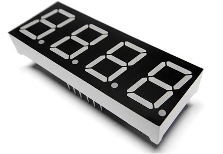
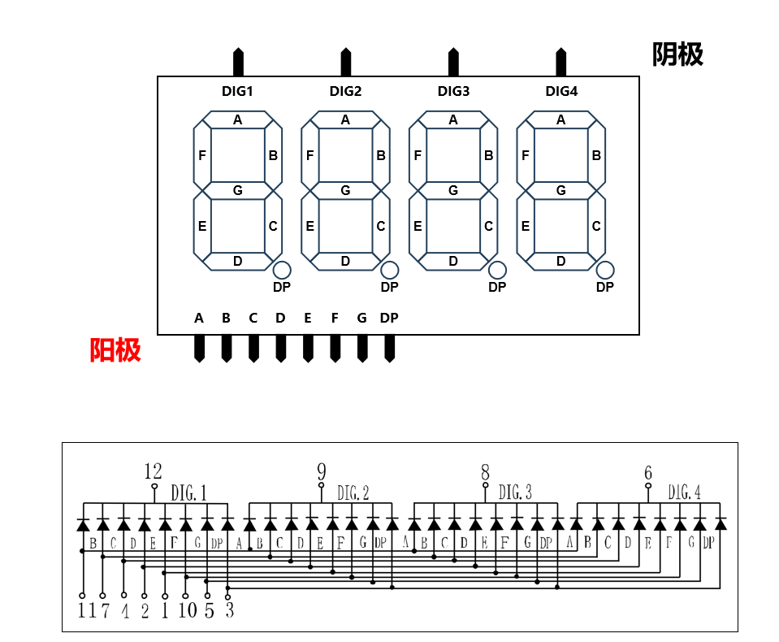
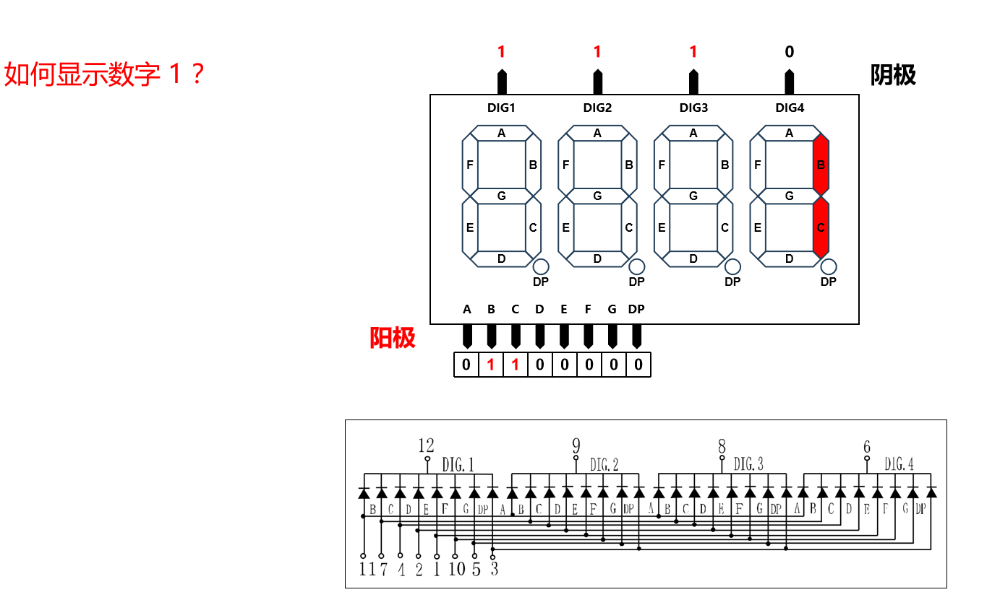
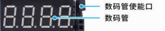
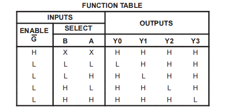
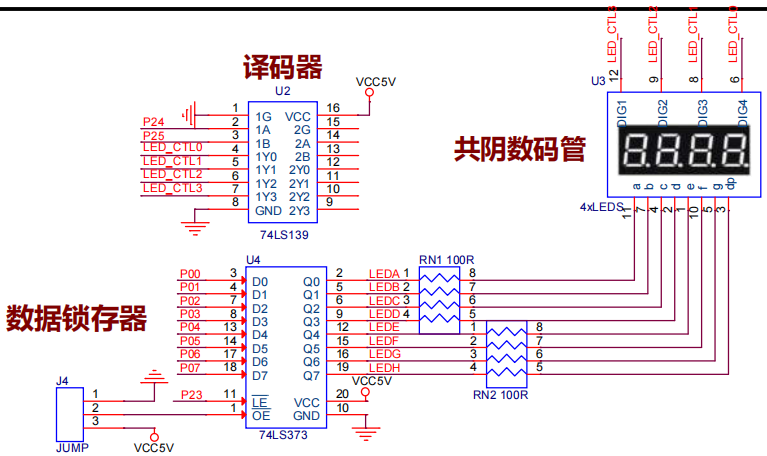
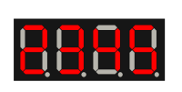
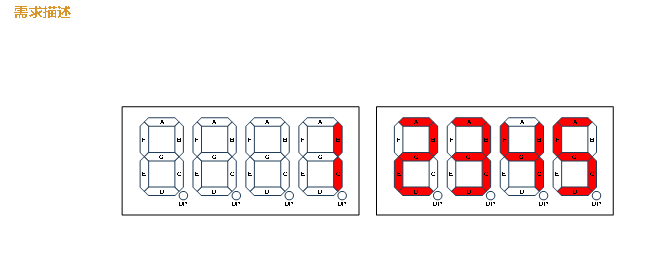

# 数码管显示

> [!NOTE] 技术要点
> 本文深入解析51单片机驱动数码管的完整技术方案，涵盖静态显示与动态显示两种核心模式，通过硬件电路设计与软件编程实践，系统讲解数码管显示的实现原理与工程应用。

## 一、数码管基础结构与工作原理

数码管作为嵌入式系统中**最基础的人机交互显示设备**，其结构和工作原理是理解后续硬件设计的关键。数码管本质上是由多个LED（发光二极管）组成的显示器件，通过控制不同LED的亮灭来显示数字或字符。



### 1.1 数码管内部结构解析

数码管根据内部LED连接方式分为**共阴极**和**共阳极**两种类型。共阴极数码管的所有LED阴极连接在一起，阳极独立控制；共阳极则相反，所有LED阳极连接在一起，阴极独立控制。这种设计差异直接影响驱动电路的设计方案。



一个标准的七段数码管包含七个LED段（a-g）和一个小数点（dp），通过不同段的组合可以显示0-9的数字以及部分字母。八段数码管在此基础上增加了额外的段用于更复杂的显示需求。

> [!TIP] 工程选型建议
> 在实际工程中，共阴极数码管通常与**高电平驱动**配合使用，而共阳极数码管则使用**低电平驱动**。选择哪种类型取决于系统电源设计和MCU的驱动能力。

### 1.2 数码管引脚定义与封装

数码管的引脚排列遵循标准化设计，常见的有**10引脚**和**14引脚**两种封装。引脚功能包括：
- **段选引脚**：控制具体显示哪一段（a-g, dp）
- **位选引脚**：在多位数码管中控制具体显示哪一位
- **公共端**：共阴极或共阳极的连接点



对于多位数码管（如4位、8位），内部采用**动态扫描**的电路设计，通过分时复用技术减少引脚数量。这种设计虽然增加了软件复杂度，但显著降低了硬件成本和PCB布局难度。

## 二、数码管静态显示

### 2.1 显示要求

在嵌入式显示系统中，**静态显示**是最基础的显示模式。本方案要求在一个4位数码管上实现**单数字显示**功能，具体要求包括：
1. 能够在4个显示位置中的任意一个显示数字
2. 显示内容可编程控制（0-9任意数字）
3. 显示稳定无闪烁
4. 硬件资源占用最小化



### 2.2 硬件电路

#### 2.2.1 引脚资源

直接驱动4位数码管需要**4个位选引脚**和**8个段选引脚**，总计12个GPIO引脚。对于资源有限的51单片机来说，这种设计会造成**引脚资源的极大浪费**。为解决这一问题，我们引入两种关键芯片：**74LS139译码器**和**74LS373锁存器**。

> [!IMPORTANT] 硬件设计原则
> 在嵌入式系统设计中，**引脚资源优化**是硬件设计的核心考量之一。通过合理使用外围芯片，可以在不增加MCU成本的前提下扩展系统功能。

#### 2.2.2 74LS139译码器应用

74LS139是一款**双2-4线译码器**，每组电路包含2个输入端和4个输出端。其工作原理基于二进制编码：2位输入信号（A、B）的4种组合（00、01、10、11）分别对应4个输出端（Y0-Y3）的有效状态。



**技术特性分析**：
- **使能控制**：每组译码器都有独立的使能端（G），低电平有效
- **输出逻辑**：输出为低电平有效，符合共阴极数码管的驱动需求
- **传播延迟**：典型值15ns，满足数码管扫描频率要求

通过74LS139，我们将4个位选引脚的需求减少到2个，实现了**引脚资源50%的节省**。

#### 2.2.3 74LS373数据锁存器

74LS373是**8位透明锁存器**，主要功能是在锁存使能信号（LE）有效时将输入数据锁存到输出端。其技术特点包括：

1. **数据锁存机制**：
   - LE为低电平时：输出跟随输入变化（透明模式）
   - LE为高电平时：输出保持当前状态（锁存模式）

2. **输出使能控制**：
   - OE为低电平时：输出正常工作
   - OE为高电平时：输出进入高阻态

3. **引脚功能定义**：
   - D0-D7：8位数据输入
   - Q0-Q7：8位数据输出
   - LE：锁存使能（低电平有效）
   - OE：输出使能（低电平有效）

在数码管驱动电路中，74LS373的作用是**稳定段选信号**，防止在动态扫描过程中出现显示混乱。

#### 2.2.4 原理图



电路设计要点：
- **位选控制**：P2.4、P2.5连接74LS139的A、B输入端
- **段选控制**：P0口8位连接74LS373的数据输入端
- **锁存控制**：74LS373的LE端由MCU控制，实现数据稳定输出
- **译码输出**：74LS139的Y0-Y3连接数码管的4个位选端

### 2.3 代码实现

#### 2.3.1 控制逻辑分析

数码管显示控制分为两个关键步骤：**位选**和**段选**。

**位选控制**通过74LS139实现，具体对应关系如下：

| P2.5 (B) | P2.4 (A) | 74LS139输出 | 数码管位置 |
|----------|----------|-------------|------------|
| 0        | 0        | Y0有效      | 第1位      |
| 0        | 1        | Y1有效      | 第2位      |
| 1        | 0        | Y2有效      | 第3位      |
| 1        | 1        | Y3有效      | 第4位      |


**段选控制**通过P0口的8个引脚实现，对应关系为：
- P0.0-P0.6：分别控制a-g段
- P0.7：控制小数点（dp）


#### 2.3.2 段码表设计

共阴极数码管的段码表基于**高电平驱动**原理设计。每个数字对应的段码是固定值，通过查表法可以快速获取显示数据。

```c
// 共阴极数码管段码表（0-9，A-F）
unsigned char code gDuanMa[16] = {
    0x3f,  // 0: 00111111
    0x06,  // 1: 00000110  
    0x5b,  // 2: 01011011
    0x4f,  // 3: 01001111
    0x66,  // 4: 01100110
    0x6d,  // 5: 01101101
    0x7d,  // 6: 01111101
    0x07,  // 7: 00000111
    0x7f,  // 8: 01111111
    0x6f,  // 9: 01101111
    0x77,  // A: 01110111
    0x7c,  // b: 01111100
    0x39,  // C: 00111001
    0x5e,  // d: 01011110
    0x79,  // E: 01111001
    0x71   // F: 01110001
};
```

> [!NOTE] 段码计算原理
> 段码的每个bit对应一个LED段，从低位到高位依次为：a、b、c、d、e、f、g、dp。例如数字"8"需要点亮所有段（a-g），对应的二进制为01111111，十六进制为0x7F。

#### 2.3.3 静态显示完整代码

```c
/**************************************************************
*【程序名称】：静态数码管实验
*【程序功能】：在4位数码管的任意位置静态显示数字
*【硬件平台】：51单片机 + 74LS139 + 74LS373
**************************************************************/

#include <reg52.h>

// 硬件接口定义
#define DIG_PORT    P0      // 段选信号端口
sbit gA = P2^4;             // 74LS139输入A
sbit gB = P2^5;             // 74LS139输入B

// 共阴极数码管段码表（0-9）
unsigned char code gDuanMa[10] = {
    0x3f, 0x06, 0x5b, 0x4f, 0x66, 
    0x6d, 0x7d, 0x07, 0x7f, 0x6f
};

/*********************************************************************
* 函数名：main
* 功能：主函数，实现4位数码管静态显示
* 参数：无
* 返回值：无
*********************************************************************/
void main(void)
{
    while (1)
    {
        // 在第1位显示数字8
        gA = 0;
        gB = 0;
        DIG_PORT = gDuanMa[8];
        
        // 在第2位显示数字8  
        gA = 0;
        gB = 1;
        DIG_PORT = gDuanMa[8];
        
        // 在第3位显示数字8
        gA = 1;
        gB = 0;
        DIG_PORT = gDuanMa[8];
        
        // 在第4位显示数字8
        gA = 1;
        gB = 1;
        DIG_PORT = gDuanMa[8];
    }
}
```

## 三、数码管动态显示

### 3.1 动态显示原理

**动态显示**是多位数码管显示的核心技术，通过**人眼视觉暂留效应**实现多位数码的同时显示。其基本原理是**分时复用**：在极短的时间间隔内依次点亮各个数码管，由于人眼无法分辨快速切换的画面，从而产生"同时显示"的视觉效果。



**技术需求规格**：
1. **显示内容**：4位以内的任意整数
2. **显示格式**：靠右对齐显示
3. **刷新频率**：≥60Hz（避免闪烁）
4. **亮度均匀**：各位置显示亮度一致
5. **资源占用**：最小化CPU时间占用

### 3.2 动态扫描算法

#### 3.2.1 扫描时序规划

动态显示的核心是**扫描时序控制**。对于4位数码管，典型的扫描时序如下：

1. **位选激活**：选择第1位数码管
2. **段选输出**：输出第1位要显示的数字段码
3. **保持时间**：维持显示一定时间（通常1-5ms）
4. **关闭显示**：关闭当前位数码管
5. **循环切换**：重复步骤1-4，依次显示第2、3、4位



#### 3.2.2 亮度控制策略

动态显示中，**显示亮度**与两个因素直接相关：
1. **单次点亮时间**：每次扫描中数码管点亮的时间长度
2. **扫描周期**：完成一轮完整扫描所需的时间

**亮度计算公式**：
```
实际亮度 = (单次点亮时间 / 扫描周期) × 最大亮度
```

为了保证各位置亮度均匀，需要确保：
- 各位置的单次点亮时间相等
- 扫描周期稳定不变
- 段驱动电流一致

### 3.3 软件实现

#### 3.3.1 延时函数设计

精确的延时控制是动态显示稳定的关键。51单片机通常采用**软件延时**方式实现时间控制。

```c
/*******精确延时函数设计*************/
void delayms(unsigned int x)     // 毫秒级延时
{
    unsigned char i;
    while(x--)
    {
        // 内层循环约1ms（基于12MHz晶振）
        for(i = 0; i < 113; i++);
    }
}
```

> [!TIP] 延时精度优化
> 在实际工程中，建议使用**定时器中断**实现精确延时，避免软件延时占用CPU资源。定时器方案可以提供更稳定的时间基准，同时释放CPU处理其他任务。

#### 3.3.2 数字分解算法

要实现靠右显示整数，需要将整数值分解为各个数位。例如显示数字"1234"：
- 千位：1
- 百位：2  
- 十位：3
- 个位：4

对于不足4位的数字，高位应显示空白或0。算法实现如下：

```c
// 数字分解函数示例
void splitNumber(int num, unsigned char digits[4])
{
    digits[0] = num / 1000;           // 千位
    digits[1] = (num % 1000) / 100;   // 百位
    digits[2] = (num % 100) / 10;     // 十位
    digits[3] = num % 10;             // 个位
}
```

#### 3.3.3 动态显示完整代码

```c
/**************************************************************
*【程序名称】：动态数码管实验
*【程序功能】：4位数码管动态显示数字，支持0-9999整数显示
*【技术特点】：靠右对齐、无闪烁动态扫描
**************************************************************/

#include <reg52.h>

// 硬件接口定义
#define DIG_PORT    P0      // 段选信号端口
sbit gA = P2^4;             // 74LS139输入A
sbit gB = P2^5;             // 74LS139输入B

// 共阴极数码管段码表（0-9）
unsigned char code gDuanMa[10] = {
    0x3f, 0x06, 0x5b, 0x4f, 0x66, 
    0x6d, 0x7d, 0x07, 0x7f, 0x6f
};

/*******毫秒级延时函数*************/
void delayms(unsigned int x)
{
    unsigned char i;
    while(x--)
    {
        for(i = 0; i < 113; i++);  // 约1ms延时
    }
}

/*********************************************************************
* 函数名：displayNumber
* 功能：在指定位置显示数字
* 参数：pos - 显示位置（0-3），num - 显示数字（0-9）
* 返回值：无
*********************************************************************/
void displayNumber(unsigned char pos, unsigned char num)
{
    // 位选控制
    switch(pos)
    {
        case 0: gA = 0; gB = 0; break;  // 第1位
        case 1: gA = 0; gB = 1; break;  // 第2位
        case 2: gA = 1; gB = 0; break;  // 第3位
        case 3: gA = 1; gB = 1; break;  // 第4位
    }
    
    // 段选输出
    DIG_PORT = gDuanMa[num];
}

/*********************************************************************
* 函数名：dynamicDisplay
* 功能：动态显示4位数字
* 参数：num - 要显示的整数（0-9999）
* 返回值：无
*********************************************************************/
void dynamicDisplay(int num)
{
    unsigned char digits[4];
    unsigned char i;
    
    // 数字分解
    digits[0] = num / 1000;
    digits[1] = (num % 1000) / 100;
    digits[2] = (num % 100) / 10;
    digits[3] = num % 10;
    
    // 动态扫描显示
    for(i = 0; i < 4; i++)
    {
        displayNumber(i, digits[i]);
        delayms(2);  // 每位置显示2ms
        DIG_PORT = 0x00;  // 关闭显示，消除残影
    }
}

/*********************************************************************
* 函数名：main
* 功能：主函数，实现动态数字显示
* 参数：无
* 返回值：无
*********************************************************************/
void main(void)
{
    int displayNum = 1234;  // 要显示的数字
    
    while (1)
    {
        dynamicDisplay(displayNum);
        // 此处可添加数字更新逻辑
    }
}
```

### 3.4 性能优化

#### 3.4.1 消除残影技术

动态显示中常见的**残影问题**是由于段选信号切换不及时造成的。解决方案包括：

1. **显示关闭策略**：在切换位选前，先将段选信号置为全灭状态
2. **消隐时间**：在段选信号切换后增加短暂的消隐时间
3. **硬件消隐**：使用专门的消隐电路或芯片

```c
// 消隐处理示例
void displayWithBlank(unsigned char pos, unsigned char num)
{
    DIG_PORT = 0x00;        // 先关闭所有段
    displayNumber(pos, num); // 再显示新内容
}
```

#### 3.4.2 扫描频率优化

**扫描频率**直接影响显示效果：
- **频率过低**（<50Hz）：人眼可察觉闪烁
- **频率过高**（>200Hz）：可能造成亮度不足
- **推荐频率**：60-100Hz

对于4位数码管，推荐的单次显示时间为1-3ms，总扫描周期为4-12ms，对应扫描频率83-250Hz。

#### 3.4.3 中断驱动方案

对于需要同时处理其他任务的系统，建议使用**定时器中断**驱动数码管扫描：

```c
// 定时器中断服务函数示例
void timer0_isr(void) interrupt 1
{
    static unsigned char scanPos = 0;
    
    // 关闭当前显示
    DIG_PORT = 0x00;
    
    // 切换到下一位
    scanPos = (scanPos + 1) & 0x03;
    
    // 显示新内容
    displayNumber(scanPos, displayDigits[scanPos]);
    
    // 重置定时器
    TH0 = 0xFC;  // 1ms定时
    TL0 = 0x66;
}
```

> [!IMPORTANT] 中断方案优势
> 中断驱动方案将数码管扫描任务交给硬件定时器，**释放CPU资源**用于处理其他任务，同时保证扫描时序的**精确性和稳定性**。

## 四、总结与扩展应用

### 4.1 技术要点回顾

1. **硬件设计**：通过74LS139和74LS373优化引脚资源，实现高效驱动
2. **静态显示**：基础显示模式，适合单数字或固定内容显示
3. **动态显示**：基于视觉暂留效应，实现多位数码同时显示
4. **扫描控制**：精确的时序控制是显示稳定的关键
5. **性能优化**：消除残影、优化扫描频率、中断驱动等高级技术

### 4.2 工程应用扩展

在实际嵌入式系统中，数码管显示技术可以扩展应用于：

1. **多级菜单显示**：结合按键输入，实现参数设置界面
2. **实时数据显示**：温度、电压、速度等实时监控
3. **倒计时/计时器**：精确的时间显示与控制
4. **错误代码显示**：系统故障诊断与状态指示

### 4.3 进阶技术方向

对于更高要求的显示应用，可以考虑以下进阶技术：

1. **亮度调节**：通过PWM控制显示亮度
2. **多位数码管级联**：驱动更多位数码管
3. **自定义字符显示**：扩展显示字母和特殊符号
4. **显示特效**：滚动显示、淡入淡出等视觉效果

> [!SUCCESS] 技术实现要点
> 数码管显示技术的核心在于**硬件与软件的协同设计**。合理的硬件电路为软件实现提供基础，而优化的软件算法则充分发挥硬件性能。掌握从静态到动态的完整技术栈，是嵌入式显示系统开发的基本功。