在信息化时代，我们身处一个被模拟信号包围的世界：温度的升降、声音的强弱、光线的明暗，这些连续变化的物理量构成了真实的感知体验。然而，现代电子系统的核心——微控制器（MCU）和微处理器（CPU）却是一个纯粹的数字世界，只能处理 `0` 和 `1`


**ADC（Analog-to-Digital Converter，模数转换器）**，正是连接这两个平行宇宙的桥梁。它将真实世界的模拟信号量化为处理器可理解的数字信号，是嵌入式系统中不可或缺的“感知器官”

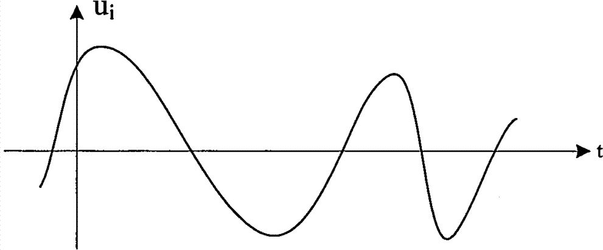

## 模拟与数字

### 模拟信号
模拟信号是指在时间和数值上都**连续**变化的物理量。就像我们说话时的声波，或者一天中气温的变化曲线，它们在任意时刻都有对应的数值，且变化过程是平滑无阶梯的。常见的如温度、湿度、压力、长度、电流、电压等都是模拟信号。

*   **本质特征**：
    *   **连续性**：在一定时间范围内，信号可以取无限多个不同的值。
    *   **直观性**：它几乎是物理世界信息的“复刻”，例如麦克风将声音转换为电流，波形形状基本一致。

*   **核心优势**：
    *   **无穷分辨率**：在理想状态下，模拟信号没有量化误差，能逼近物理量的真实值，信息密度极高。
    *   **处理简单**：简单的模拟电路（如电阻、电容、运算放大器）即可实现放大、滤波等处理，无需复杂的算法或专门的数字信号处理器（DSP）。

*   **致命弱点**：
    *   **抗干扰能力弱（噪声积累）**：信号在传输线上会受到各种电磁干扰，噪声一旦叠加就难以剥离。**就像翻录录音带**，每翻录一次，底噪就增加一分，最终导致音质严重劣化。传输线路越长，噪声积累越多。
    *   **保密性差**：模拟通信（如老式电话、无线电）极易被窃听，只要截获信号就能直接还原内容。

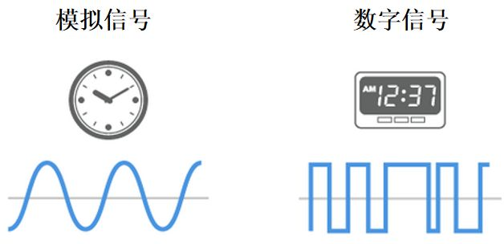

### 数字信号
数字信号并非自然界原生，而是对模拟信号经过**采样（Sampling）、量化（Quantization）和编码（Encoding）** 三大步骤后的人工产物。它是离散时间信号的数字化表现，其自变量用整数表示，因变量用有限位的二进制数表示。
*   **为什么要用二进制？**
    根本原因在于硬件实现。电路中最稳定的两种状态就是“通”与“断”（高电平与低电平），用 `1` 和 `0` 表示这两种状态最抗干扰且易于实现。在实际传输中，将一定范围的信息变化归类为状态 0 或 1，大大提高了抗噪能力。
*   **核心优势**：
    1.  **抗干扰能力极强（无噪声积累）**：数字信号只看电平高低。即使传输过程中叠加了干扰噪声，只要噪声幅度未超过判断阈值（判决再生），接收端就能完美还原出“0”或“1”，**实现无噪声积累的长距离传输**。
    2.  **易于存储与交换**：计算机和互联网的基石是二进制，数字信号天生适配计算机处理，便于联网、存储和交换，是构建综合业务数字网的基础。
    3.  **安全性高**：对二进制数据流进行加密（如简单的逻辑运算或复杂的 AES 算法）比对模拟波形加密要容易且可靠得多。
    4.  **硬件集成度高**：数字电路不需要大体积的滤波器（电感、电容），极易通过大规模和超大规模集成电路（VLSI）实现微型化和低功耗。
*   **代价**：
    *   **量化失真**：由于数值是不连续的（数量有限），数字信号永远只是模拟信号的“近似值”，不可避免地存在失真。
    *   **算法复杂**：处理数字信号需要消耗更多的计算资源，算法越复杂，对硬件性能要求越高。

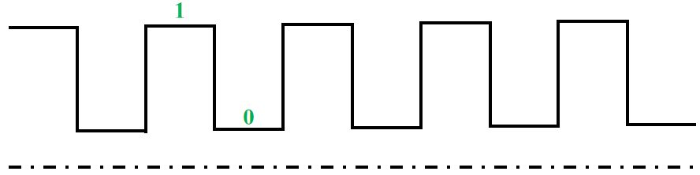

## ADC 运作机制
一个完整的模数转换过程通常包含四个步骤：**采样（Sampling）、保持（Holding）、量化（Quantization）与编码（Encoding）**。这四个步骤就像是用相机拍照片：先对焦取景（采样），按下快门瞬间冻结画面（保持），将画面颜色归类为有限的色阶（量化），最后存为二进制文件（编码）。

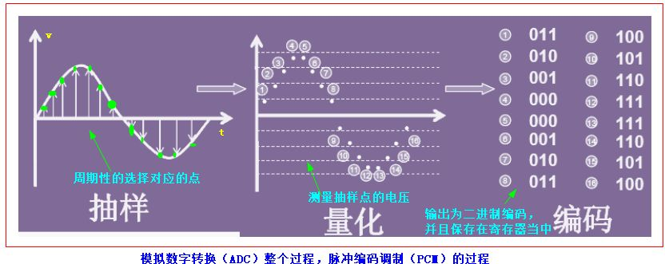

### 采样与保持
*   **采样**：
    就是对连续变化的模拟信号进行定时“抓拍”。采样的频率必须满足**奈奎斯特采样定理（Nyquist Theorem）**，即采样频率 $f_s$ 必须大于信号中最高频率分量 $f_{max}$ 的 2 倍（工程上通常取 3~5 倍），否则会产生混叠现象，无法还原原始信号。
    

*   **保持**：
    ADC 内部的转换电路（如比较器）工作需要时间。在转换完成前，输入电压必须保持稳定。**采样-保持电路（S/H Circuit）** 承担了这一重任。
    *   *硬件模型*：一个模拟开关（场效应管） + 一个保持电容（$C_{hold}$） + 两个电压跟随器（隔离缓冲）。
    *   *工作流程*：
        1.  **采样阶段**：开关闭合，电容充电，电压跟随输入信号变化。
        2.  **保持阶段**：开关断开，由于运放输入阻抗极高，电容上的电荷无法泄放，电压被“冻结”，供 ADC 进行后续转换。
    
    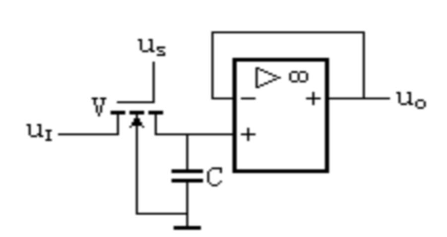
    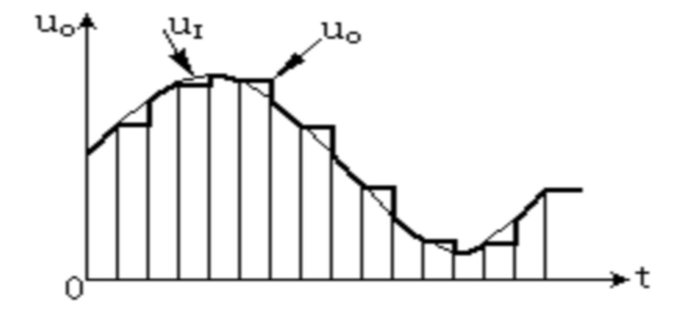

### 量化

量化是将采样得到的连续电压幅值，归并到与之最接近的离散电平上的过程。这就像把斜坡改造成台阶。
*   **量化单位 ($\Delta$)**：ADC 能分辨的最小电压变化量，也称为 LSB。
*   **量化误差**：由于“台阶”的存在，输入电压不可能总是整除 $\Delta$，这种近似过程产生的误差就是量化误差。位数越高，台阶越密，误差越小。

### 编码

将量化后的离散电平值转换为二进制数字代码。
*   例如 10 位 ADC，将输入信号分为 $2^{10} = 1024$ 层。最低有效位（LSB）为 1 代表的大小就是 $\Delta$。

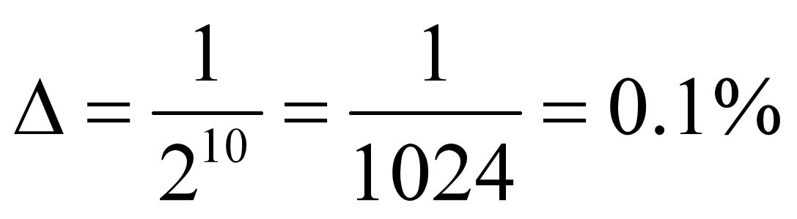

## 逐次比较型 ADC (SAR ADC) 

常见的 ADC 架构有并联比较型（Flash）、双积分型、$\Sigma-\Delta$ 型等。而 **STM32 内部集成的是逐次比较型（Successive Approximation Register, SAR）ADC**。它在速度、精度、功耗和成本之间取得了完美的平衡。

### 核心组成
SAR ADC 主要由控制逻辑、**数码寄存器（SAR）**、**D/A 转换器（DAC）** 和 **电压比较器** 组成。

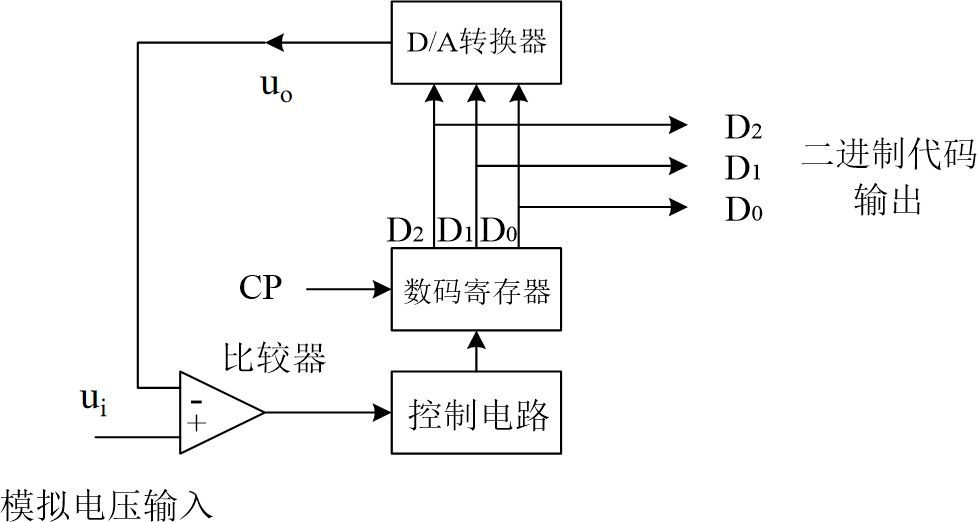

### 工作原理：天平称重法
SAR ADC 的工作过程极其类似用天平称重。假设我们有一个待测物体（模拟输入 $V_{in}$）和一组标准砝码（DAC 输出的电压，权重分别为 1/2, 1/4, 1/8... $V_{REF}$）。

**案例推演**：
设量程为 15g（对应 $V_{REF}$），有 4 个砝码：8g, 4g, 2g, 1g。待测物体 $W = 13g$。
1.  **MSB 试探**：放上最重的 **8g** 砝码。
    *   $8g < 13g$，不够重 -> **保留 8g**（对应位记 1）。当前总重 8g。
2.  **次高位试探**：加 **4g** 砝码。
    *   $8+4=12g < 13g$，不够重 -> **保留 4g**（对应位记 1）。当前总重 12g。
3.  **再次试探**：加 **2g** 砝码。
    *   $12+2=14g > 13g$，超重了 -> **拿走 2g**（对应位记 0）。当前总重 12g。
4.  **最后试探**：加 **1g** 砝码。
    *   $12+1=13g = 13g$，刚好 -> **保留 1g**（对应位记 1）。
    
**最终结果**：砝码状态为 `1101`，这就是转换后的数字量。

### 性能指标

*   **分辨率 (Resolution)**
    输出数字量变化一个 LSB 所对应的模拟电压变化量。
    $$ LSB = \frac{V_{REF}}{2^n} $$
    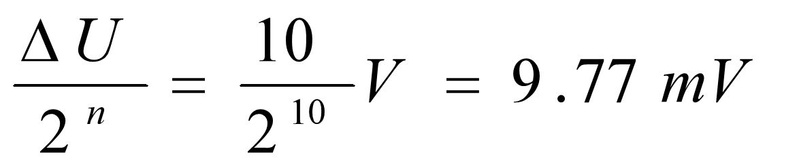

*   **转换误差**
    通常以 **相对误差** 形式给出，单位是 LSB。例如 12 位 ADC，误差 $\pm 3 LSB$ 意味着测量结果可能偏离真实值 3 个量化单位。

*   **转换速度**
    *   **Flash ADC**：最快（<50ns），但电路庞大。
    *   **SAR ADC**：**中等（1us ~ 100us）**，STM32F4 最快可达 2.4 MSPS（约 0.41us）。
    *   **双积分 ADC**：最慢（数十 ms），但抗干扰最强，常用于万用表。

## STM32 ADC 架构

STM32 系列微控制器通常内置高性能的 **12 位逐次逼近型（SAR）ADC**。相较于双积分型（高精度低速）或 Flash 型（超高速低精度），SAR ADC 在速度、精度和功耗之间取得了极佳的平衡。

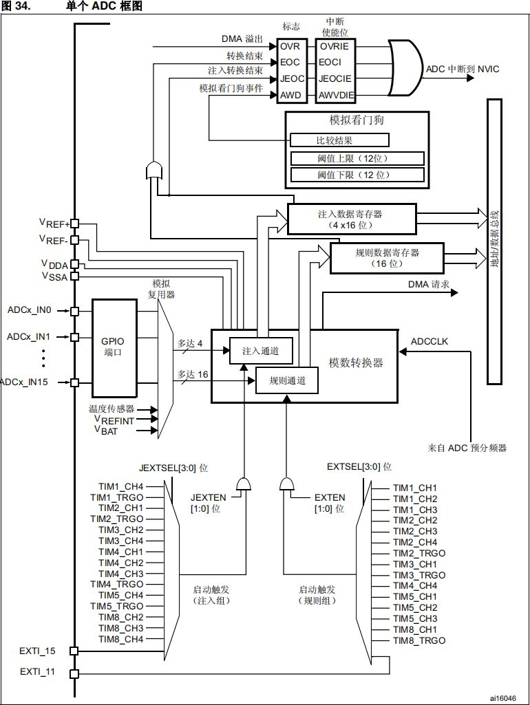

### 特性概览
* **分辨率**：可配置 12/10/8/6 位。分辨率越高，转换越慢。
* **通道数**：多达 19 个复用通道（16 个外部 + 温度传感器 + VREFINT + VBAT）。
* **转换模式**：单次、连续、扫描、不连续。
* **电压范围**：$V_{REF-} \le V_{IN} \le V_{REF+}$（通常为 0 ~ 3.3V）。

### 分辨率与精度
**分辨率** 并不等同于 **精度（Accuracy）**，但在工程应用中常被混用。分辨率决定了 ADC 能分辨的最小电压变化量。


> [!NOTE] 分辨率计算公式
> $$ LSB = \frac{V_{REF}}{2^n} $$
>
> 以 3.3V 参考电压为例：
> * **12-bit**：$3300mV / 4096 \approx 0.8 mV$（高精度控制）
> * **8-bit**：$3300mV / 256 \approx 12.9 mV$（粗略检测）
> * **6-bit**：$3300mV / 64 \approx 51.6 mV$

**应用场景对比**：
* **汽车运动模式**：使用 12-bit 分辨率，轻踩油门（0.8mV 变化）即可被识别，响应灵敏。
* **汽车经济模式**：使用 6-bit 分辨率，需深踩油门（>50mV 变化）才有反应，过滤细微抖动，平顺省油。

### 数据对齐
STM32 的 ADC 结果存储在 16 位寄存器中，支持两种对齐方式：

* **右对齐（Right Alignment）** —— **最常用**
    *   数据存放在低 12 位（Bit0 ~ Bit11）。
    * **适用**：直接获取实际数值，进行电压换算。
    *   *公式*：$Voltage = \frac{ADC\_Value \times 3.3}{4095}$

    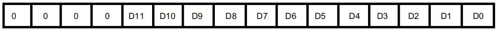

* **左对齐（Left Alignment）**
    *   数据存放在高 12 位（Bit4 ~ Bit15）。
    * **适用**：
        1.  **快速降位**：直接读取高 8 位（即 `DR >> 8`），快速得到 8-bit 结果。
        2.  **PWM 联动**：若定时器 CCR 寄存器也为左对齐逻辑，可直接写入无需移位。

    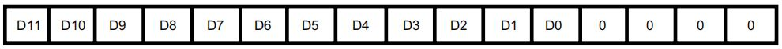

### 规则通道 vs 注入通道

STM32 的 ADC 转换序列被巧妙地划分为两个组：**规则通道组（Regular Channel Group）** 和 **注入通道组（Injected Channel Group）**。这种设计在微控制器中独树一帜，极大地提升了复杂控制系统的实时响应能力。

#### 规则通道组

*   **定位**：
    相当于操作系统中的“主程序循环”。它负责处理常规的、周期性的数据采集任务。大多数 ADC 应用（如环境监测）都运行在此模式下。

*   **核心特点**：
    *   **顺序执行**：按照用户配置的序列（Sequence）依次转换，最多可包含 **16 个**通道。
    *   **数据覆盖**：规则组只有一个 16 位的数据寄存器 (`ADC_DR`)。这意味着每转换完一个通道，新数据就会覆盖旧数据。因此，**必须使用 DMA 及时搬运数据**，否则会导致数据丢失。
    *   **自动化**：支持连续扫描模式，一旦启动，硬件自动轮询所有通道，无需 CPU 干预。

*   **典型场景**：
    *   **环境监控系统**：定期轮询土壤湿度、空气温度、光照强度等多个传感器。
    *   **音频信号处理**：以固定的采样率对麦克风输入进行持续采样。

*   **进阶：规则通道的交替模式 (Dual/Triple Mode)**
    在拥有多个 ADC 的器件（如 STM32F407）上，可以让 ADC1、ADC2 (及 ADC3) 协同工作，实现更高的综合采样率。
    
    *   **双重 ADC 模式**：外部触发后，ADC1 立即启动；经过一段延迟（由 `ADC_CCR` 的 `DELAY` 位配置）后，ADC2 启动。
    *   **三重 ADC 模式**：ADC1、ADC2、ADC3 依次延迟启动。
    
    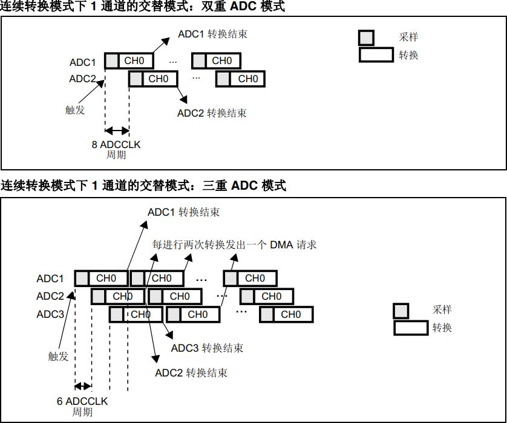

#### 注入通道组

*   **定位**：
    相当于操作系统中的“高优先级中断”。它允许“插队”，用于处理突发、紧急或关键的测量任务。

*   **核心特点**：
    *   **抢占式执行**：一旦注入转换被触发（如定时器溢出或外部引脚触发），当前正在进行的规则通道转换会被**立即暂停**。优先执行完注入通道序列后，再恢复规则通道的转换。
    *   **独立存储**：拥有 4 个独立的数据寄存器 (`ADC_JDR1` ~ `ADC_JDR4`)。每个通道的数据都有专属位置，**不会被覆盖**，软件可以随时读取。
    *   **容量**：最多包含 **4 个**通道。

*   **典型场景**：
    *   **电机保护**：在电机矢量控制（FOC）中，相电流的采样必须在 PWM 周期的特定时刻进行。使用注入通道配合定时器触发，可以实现零延迟的精确采样。一旦检测到过流，立即触发保护。
    *   **故障急停**：当系统检测到异常信号（如急停按钮按下）时，立即启动注入通道对关键电压点进行诊断。

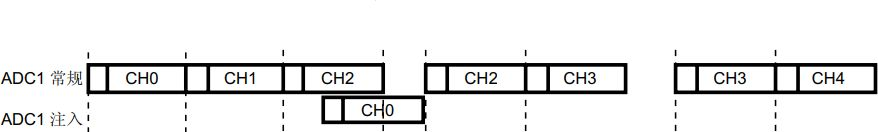

#### 差异总结

| 特性 | 规则通道组 (Regular) | 注入通道组 (Injected) |
| :--- | :--- | :--- |
| **类比** | 主线程 (Main Loop) | 中断服务 (ISR) |
| **优先级** | 低 (可被打断) | 高 (抢占执行) |
| **最大通道数** | 16 | 4 |
| **数据寄存器** | 1 个 (ADC_DR，数据会覆盖) | 4 个 (ADC_JDRx，独立存储) |
| **DMA 支持** | 强烈推荐 (必须) | 不需要 (寄存器够用) |
| **典型用途** | 周期性、大批量数据采集 | 突发事件、关键点位、电机电流采样 |

### 采样时间与阻抗匹配
ADC 不是接上就能测准的，**输入阻抗**和**采样时间**必须匹配。ADC 内部电容 $C_{ADC}$ 需要从信号源抽取电荷进行充电。

* **高阻抗源（如 PT100、光敏电阻）**：电流小，充电慢。必须**延长采样时间**（如 480 cycles），否则电容充不满，读数偏低且不稳定。
* **低阻抗源（如运放输出）**：电流大，充电快。可选择**短采样时间**（如 3 cycles），以提高采样率。

> [!WARNING] 采样时间不足的后果
> 1.  **非线性误差**：测量值与真实值存在偏差。
> 2.  **通道串扰**：多通道扫描时，上一个通道的残留电荷会影响下一个通道（“鬼影”现象）。

**计算公式**：
$$ T_{total} = T_{sampling} + T_{conversion} $$
STM32F4 中，$T_{conversion}$ 固定为 12 个周期。若配置为 480 周期采样：
$$ T_{total} = 480 + 12 = 492 \text{ cycles} $$

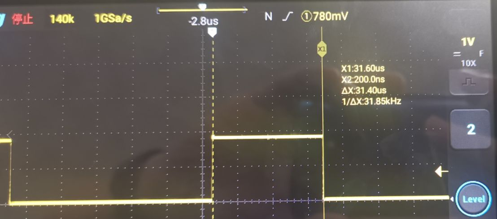

## 设计实战

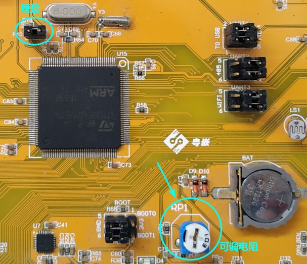

### VREF 的关键作用
**VREF（参考电压）** 是 ADC 的标尺。
* **独立供电**：VREF+ 引脚通常与 VDD 分开（或通过磁珠隔离），建议接入高精度的基准电压芯片（如 REF3033）。
* **噪声抑制**：若 VREF 波动 ±1%，所有测量结果都会产生 ±1% 的系统误差。务必在 VREF 引脚处并联 `0.1μF + 10μF` 滤波电容。

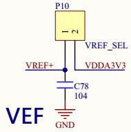

### 测量电路
* **分压电路**：ADC 输入不能超过 VREF（3.3V）。测量 0-12V 电池电压时，需使用电阻分压（如 33K:10K），将电压压缩至 0-3V 范围。
    *   *计算*：$V_{in} = V_{bat} \times \frac{10K}{10K+33K}$

    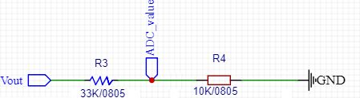

## 典型案例

ADC 的理论落地到实际工程中，最经典的两个案例莫过于**环境光检测**和**电池电量监测**。

### 光敏电阻

光敏电阻（Photoresistor/LDR）是一种利用**内光电效应**制成的半导体元件。

*   **工作原理**：
    *   **光照增强** -> 光子激发电子跃迁 -> 载流子增加 -> **电阻减小**。
    *   **光照减弱** -> 载流子复合减少 -> **电阻增大**（暗电阻通常 > 1MΩ）。
*   **应用场景**：手机屏幕自动亮度调节、路灯自动开关。

**电路设计与计算**：
通常采用串联分压电路读取电压变化。

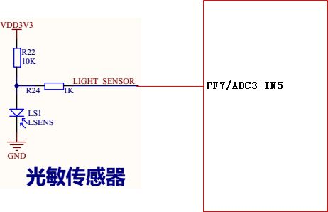

如上图所示，ADC 采集的是光敏电阻分压后的电压。
*   **亮环境下**：光敏电阻阻值变小，分压点电压降低（或升高，取决于上下拉连接方式）。
*   **暗环境下**：光敏电阻阻值变大，电压变化反之。

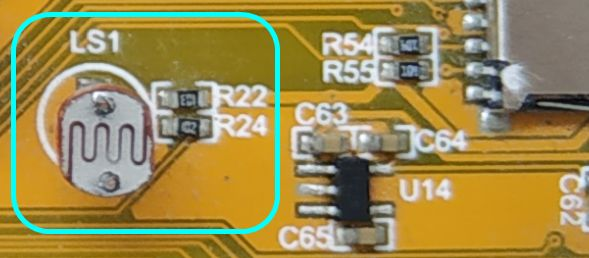

### 锂电池电量检测

锂电池的电压范围通常为 **3.0V ~ 4.2V**，直接输入到 3.3V 量程的 ADC 会导致**烧毁引脚**。因此，必须设计分压电路。

**典型电路**：
采用 33KΩ 和 10KΩ 电阻串联分压。


**关键参数推演**：
1.  **分压比**：
    $$ Ratio = \frac{10K}{10K + 33K} \approx 0.2325 $$
2.  **输入电压范围映射**：
    *   **满电 (4.2V)**：$V_{in} = 4.2 \times 0.2325 \approx 0.976V (976mV)$
    *   **亏电 (3.3V)**：$V_{in} = 3.3 \times 0.2325 \approx 0.767V (767mV)$
3.  **电量步进计算**：
    *   电压变化跨度：$976mV - 767mV = 209mV$。
    *   这 209mV 对应 0% ~ 100% 电量。
    *   **每 1% 电量对应的电压变化**：$209mV / 100 = 2.09mV$。

**实战案例**：
假设 ADC 读数换算后为 **800mV**，当前电量是多少？
$$ Battery\% = \frac{800mV - 767mV}{2.09mV} \approx 15.79\% $$

> [!NOTE] 工程提示
> 实际电池放电曲线并非线性，仅用电压法估算电量存在误差。高精度应用（如手机）通常使用专业的**库仑计**芯片。

## 开发实战

以下代码展示了如何配置 ADC1 的通道 5 进行单次转换（右对齐、软件触发）。

```c
void adc_init(void) {
    GPIO_InitTypeDef GPIO_InitStructure;
    ADC_CommonInitTypeDef ADC_CommonInitStructure;
    ADC_InitTypeDef ADC_InitStructure;

    // 1. 时钟使能
    RCC_AHB1PeriphClockCmd(RCC_AHB1Periph_GPIOA, ENABLE);
    RCC_APB2PeriphClockCmd(RCC_APB2Periph_ADC1, ENABLE);

    // 2. GPIO 配置 (模拟模式是关键)
    GPIO_InitStructure.GPIO_Pin = GPIO_Pin_5;
    GPIO_InitStructure.GPIO_Mode = GPIO_Mode_AN; 
    // Analog Mode
    GPIO_InitStructure.GPIO_PuPd = GPIO_PuPd_NOPULL;
    GPIO_Init(GPIOA, &GPIO_InitStructure);

    // 3. ADC 通用配置
    ADC_CommonInitStructure.ADC_Mode = ADC_Mode_Independent; 
    // 独立模式
    ADC_CommonInitStructure.ADC_Prescaler = ADC_Prescaler_Div4; 
    // 时钟分频，勿超 36MHz
    ADC_CommonInitStructure.ADC_DMAAccessMode = ADC_DMAAccessMode_Disabled;
    ADC_CommonInitStructure.ADC_TwoSamplingDelay = ADC_TwoSamplingDelay_5Cycles;
    ADC_CommonInit(&ADC_CommonInitStructure);

    // 4. ADC1 参数配置
    ADC_InitStructure.ADC_Resolution = ADC_Resolution_12b; 
    // 12位分辨率
    ADC_InitStructure.ADC_ScanConvMode = DISABLE;          
    // 单通道不扫描
    ADC_InitStructure.ADC_ContinuousConvMode = DISABLE;    
    // 单次转换
    ADC_InitStructure.ADC_ExternalTrigConvEdge = ADC_ExternalTrigConvEdge_None; // 软件触发
    ADC_InitStructure.ADC_DataAlign = ADC_DataAlign_Right; 
    // 右对齐
    ADC_InitStructure.ADC_NbrOfConversion = 1;             
    // 转换通道数
    ADC_Init(ADC1, &ADC_InitStructure);

    // 5. 规则通道配置：通道5，序列1，采样时间 480 周期 (求稳)
    ADC_RegularChannelConfig(ADC1, ADC_Channel_5, 1, ADC_SampleTime_480Cycles);

    // 6. 开启 ADC
    ADC_Cmd(ADC1, ENABLE);
}

// 获取转换结果
uint16_t adc_get_value(void) {
    // 软件触发转换
    ADC_SoftwareStartConv(ADC1);
    // 等待转换完成 (EOC 标志)
    while(ADC_GetFlagStatus(ADC1, ADC_FLAG_EOC) == RESET);
    // 清除标志并读取数据
    ADC_ClearFlag(ADC1, ADC_FLAG_EOC);
    return ADC_GetConversionValue(ADC1);
}
```

## 应用场景

ADC 的应用无处不在，从简单的电量显示到复杂的工业控制：

1.  **人机交互**：摇杆（JoyStick）通过双路 ADC 读取 X/Y 轴电位器电压，控制无人机或游戏角色。
    
2.  **环境感知**：光敏（屏幕自动亮度）、热敏（温度监控）、气敏（酒精检测）。
    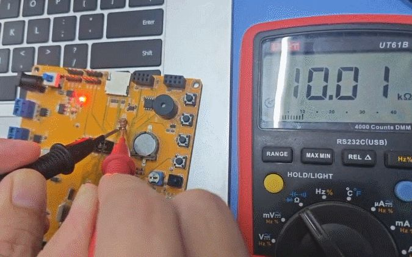
3.  **电源管理**：USB 测试仪、电池电量百分比计算。
    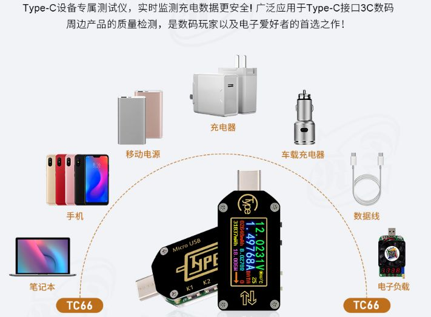
4.  **仪器仪表**：数字万用表、数字示波器（通常使用高速 Flash ADC）。
    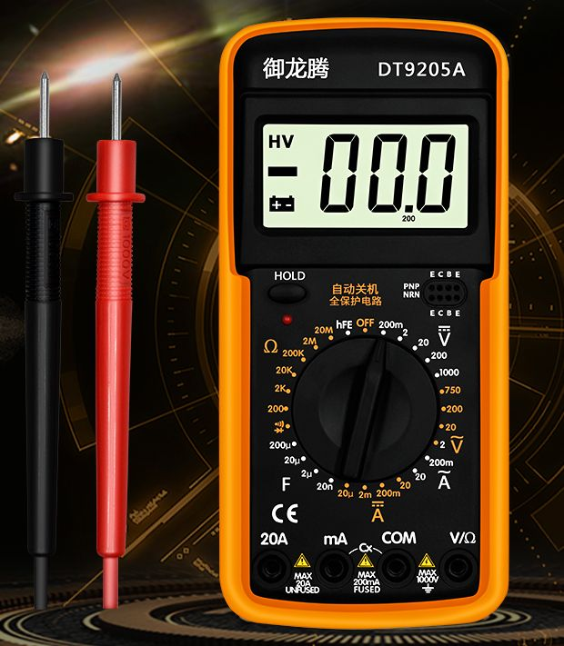

通过深入理解 ADC 的**采样原理、通道机制和硬件特性**，我们才能在设计中避免读数跳变、精度不足等常见坑点，构建出稳定可靠的嵌入式感知系统。