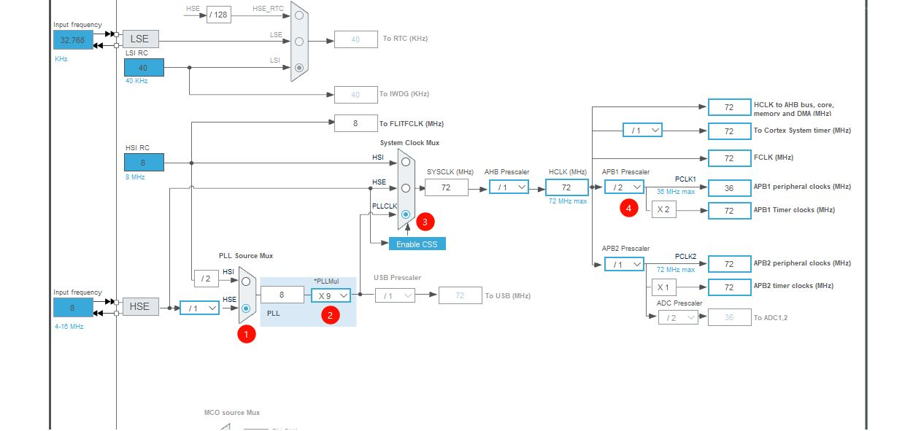

## 创建基础 STM32 HAL 库项目指南
### 1. 新建工程
打开 STM32CubeMX，点击主界面的 **"Access to MCU Selector"** 或 **"File -> New Project"**。
### 2. 芯片选型
在搜索框输入型号（例如 `STM32F103C8`），在右下角列表中选中芯片并点击 **Start Project**。
> [!tip] 提示
>  点击芯片型号前的“五角星”图标收藏，下次可从主界面 "My Favorite MCUs" 快速创建。
### 3. Pinout & Configuration (引脚与配置)
- **SYS (系统调试脚)**：
    - 点击 `System Core` -> `SYS`。
    - 将 **Debug** 选项改为 **Serial Wire** (避免下载一次程序后芯片被锁死)。
- **RCC (时钟源)**：
    - 点击 `System Core` -> `RCC`。
    - **HSE (高速外部时钟)**：选择 `Crystal/Ceramic Resonator` (使用外部晶振)。
    - **LSE (低速外部时钟)**：按需选择。如果有外部 32.768k 晶振则选 `Crystal...`，否则选 `Disable`。
### 4. Clock Configuration (时钟树配置)
这一步的目标是将系统时钟配置为芯片支持的最大频率（STM32F103 为 72MHz）。
**配置技巧：**
1. 确认左侧 **Input frequency** 与板载晶振一致（通常为 `8` MHz）。
2. 在最右侧的 **HCLK (MHz)** 框中直接输入 `72`。
3. 按下 **回车键 (Enter)**。
4. 软件会自动寻找最优的分频系数（自动选择 HSE、配置 PLLMul X9 等），点击 OK 确认即可

或参考如图内容手动配置

### 5. Project Manager (工程管理)
这是决定代码生成质量的关键步骤。
#### 5.1 Project (项目信息)
- **Project Name**：输入项目名称（建议英文）。
- **Project Location**：选择保存路径（**注意：路径中绝对不能包含中文**）。
- **Toolchain / IDE**：
    - 若使用 **Keil**：选择 `MDK-ARM`。
    - 若使用 **VSCode**：选择 `CMake` 或 `Makefile`
#### 5.2 Code Generator (代码生成设置)
- ✅ **勾选** `Generate peripheral initialization as a pair of '.c/.h' files per peripheral`。
    - _作用：将 GPIO、UART 等外设的初始化代码单独生成 .c/.h 文件，而不是全部堆在 main.c 里，保持代码整洁。_
- **Library Files**：
    - 推荐选择 `Copy only the necessary library files` (只复制必要的库文件，减小工程体积)。
### 6. 生成代码
点击右上角的 **GENERATE CODE** 按钮。
- 生成完毕后，点击 **Open Folder** (打开文件夹) 或 **Open Project** (直接打开 IDE)。