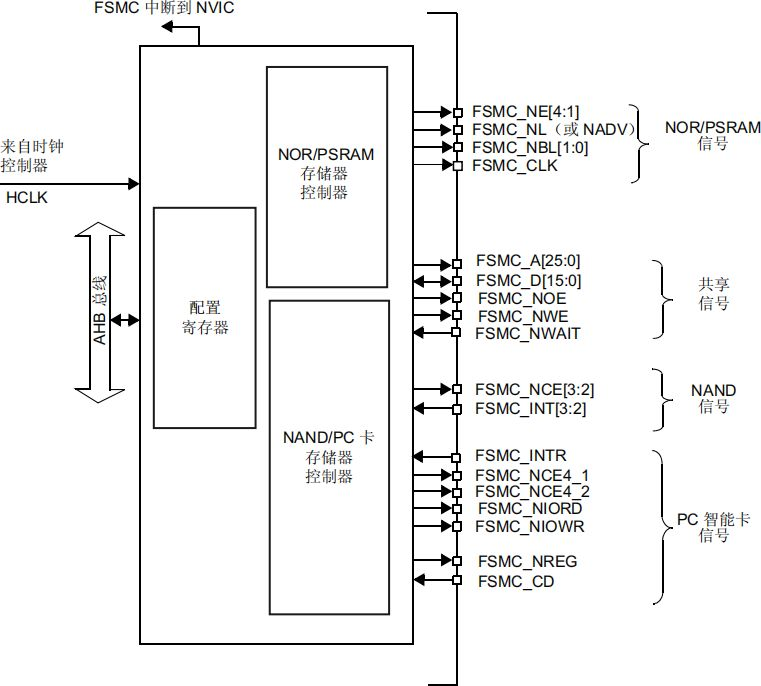
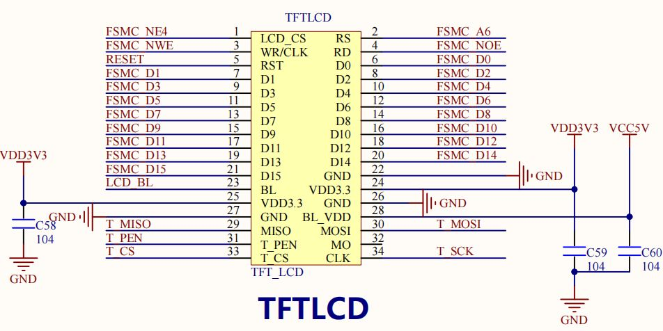
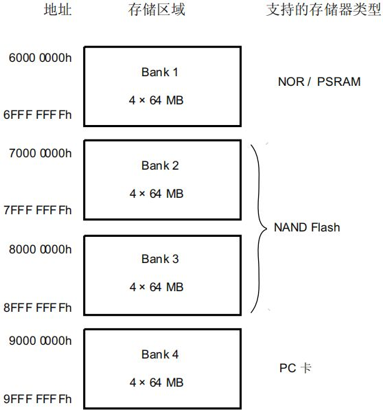
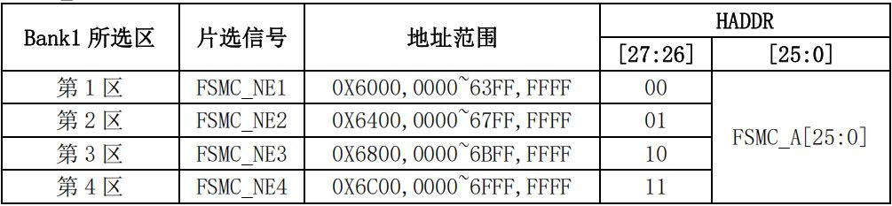
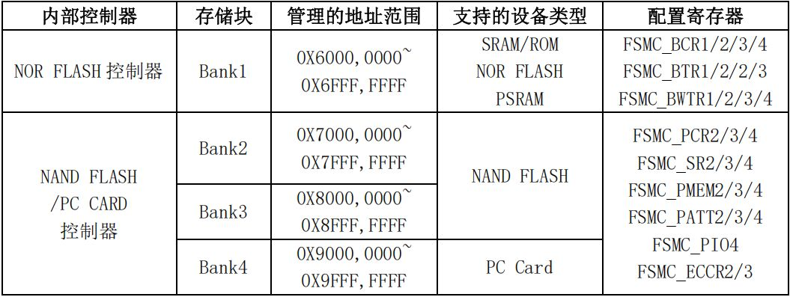
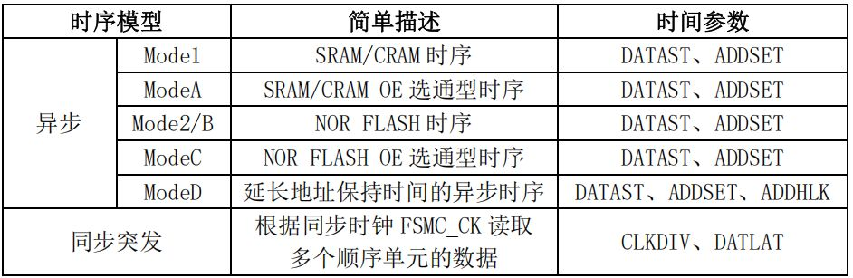
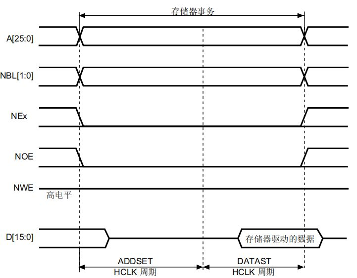
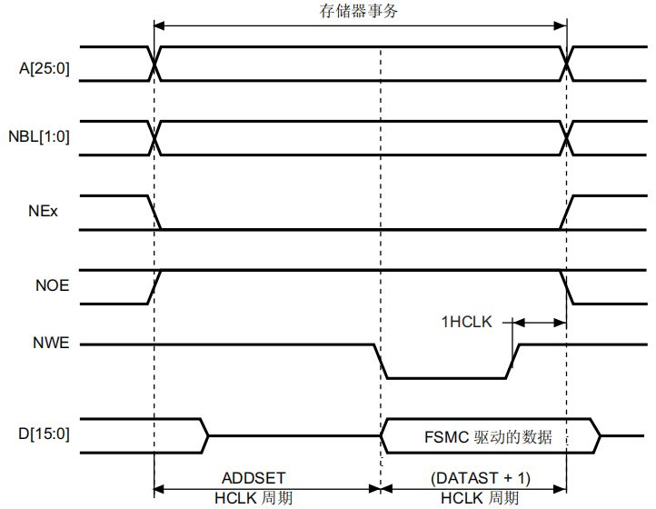
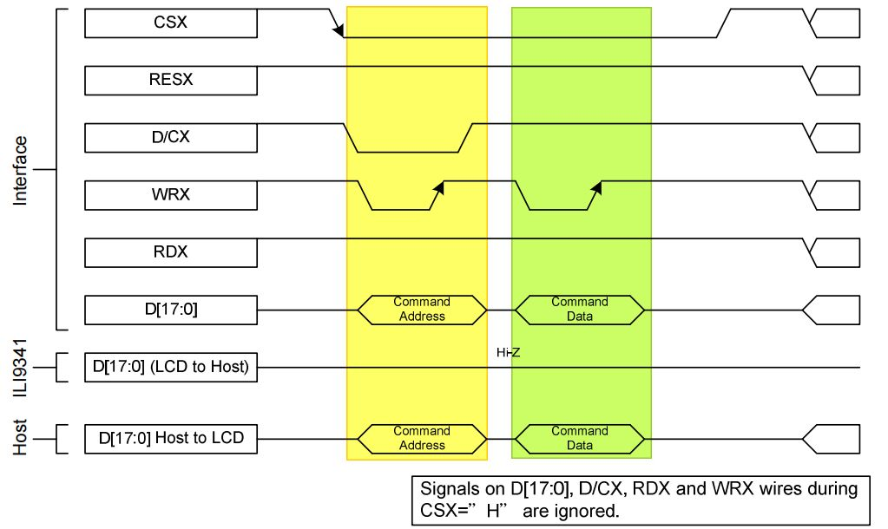

一、概述

STM32F407的FSMC（Flexible Static Memory Controller）是一种灵活的静态存储器控制器，主要用于连接外部存储器和LCD等设备。它支持多种类型的存储器接口，包括：

- NOR Flash/PSRAM存储器
- NAND Flash/PC卡存储器
- 16位PC卡
- LCD接口（支持8080/6800模式）

早期Intel 8080和Motorola 6800微处理器兼容性考虑

1.1 主要特性

​（1）地址和数据总线​：

- 26位地址总线（最大可寻址64MB空间）
- 16位数据总线

​（2）存储区域​：

- 4个独立的存储区域（Bank1-Bank4）
- Bank1可细分为4个子区域（256MB，每个子区域64MB）
- Bank2-Bank4各64MB

​（3）支持的存储器类型​：

- SRAM、PSRAM、ROM
- NOR Flash
- LCD接口（支持8080/6800模式）

- 16位PC卡
- NAND Flash（带ECC功能）

​（4）时序控制​：

- 可编程的等待时序
- 可编程的建立/保持时间
- 可编程的总线恢复时间

1.2 FSMC 框图

从上图我们可以看出，STM32F4 的 FSMC 将外部设备分为 2 类：NOR/PSRAM 设备、NAND/PC 卡设备。他们共用地址数据总线等信号，他们具有不同的 CS 以区分不同的设备，比如开发板用 FSMC_NE4作为TFTLCD屏的片选，其实就是将 TFTLCD 当成 SRAM 来控制。

这里我们介绍下为什么可以把 TFTLCD 当成 SRAM 设备用：首先我们了解下外部 SRAM的连接，外部 SRAM 的控制一般有：地址线（如 A0~A18）、数据线（如 D0~D15）、写信号（WE）、读信号（OE）、片选信号（CS），如果 SRAM 支持字节控制，那么还有 UB/LB 信号。而 TFTLCD的信号包括：RS、D0~D15、WR、RD、CS、RST 和 BL 等，其中真正在操作 LCD 的时候需要用到的就只有：RS、D0~D15、WR、RD 和 CS。其操作时序和 SRAM的控制完全类似，唯一不同就是 TFTLCD 有 RS 信号，但是没有地址信号。

TFTLCD 通过 RS 信号来决定传送的数据是数据还是命令，本质上可以理解为一个地址信号，比如我们把 RS 接在 A0 上面，那么当 FSMC 控制器写地址 0 的时候，会使得 A0 变为 0，对 TFTLCD 来说，就是写命令。而 FSMC 写地址 1 的时候，A0 将会变为 1，对 TFTLCD 来说，就是写数据了。这样，就把数据和命令区分开了，他们其实就是对应 SRAM 操作的两个连续地址。当然 RS 也可以接在其他地址线上，开发板是把 RS 连接在 A6 上面的。

STM32F4 的 FSMC 支持 8/16/32 位数据宽度，我们这里用到的 LCD 是 16 位宽度的，所以在设置的时候，选择 16 位宽就 OK 了。我们再来看看 FSMC 的外部设备地址映像，STM32F4的FSMC 将外部存储器划分为固定大小为 256M 字节的四个存储块，如图 18.1.2.2 所示：

从上图可以看出，FSMC 总共管理 1GB 空间，拥有 4 个存储块（Bank），本章，我们用到的是块 1，所以在本章我们仅讨论块 1 的相关配置，其他块的配置，请参考《STM32F4xx 中文参考手册》第 32 章（1191 页）的相关介绍。

STM32F4 的 FSMC 存储块 1（Bank1）被分为 4 个区，每个区管理 64M 字节空间，每个区都有独立的寄存器对所连接的存储器进行配置。Bank1 的 256M 字节空间由 28 根地址线（HADDR[27:0]）寻址。这里HADDR 是内 部 AHB 地址总 线，其 中 HADDR[25:0]来自外部存储器地址FSMC_A[25:0]，而 HADDR[26:27]对 4 个区进行寻址。如下表所示：

上表 中，我们要特别注意 HADDR[25:0]的对应关系：

- 当 Bank1 接的是 16 位宽度存储器的时候：HADDR[25:1]→ FSMC_A[24:0]。
- 当 Bank1 接的是 8 位宽度存储器的时候：HADDR[25:0]→ FSMC_A[25:0]。

不论外部接 8 位/16 位宽设备，FSMC_A[0]永远接在外部设备地址 A[0]。 这里，TFTLCD使用的是 16 位数据宽度，所以 HADDR[0]并没有用到，只有 HADDR[25:1]是有效的，对应关系变为：HADDR[25:1]→ FSMC_A[24:0]，相当于右移了一位，这里请大家特别留意。另外，HADDR[27:26]的设置，是不需要我们干预的，比如：当你选择使用 Bank1 的第三个区，即使用 FSMC_NE3 来连接外部设备的时候，即对应了 HADDR[27:26]=10，我们要做的就是配置对应第 3区的寄存器组，来适应外部设备即可。STM32F4 的 FSMC 各Bank配置寄存器如下表所示：

对于 NOR FLASH 控制器，主要是通过 FSMC_BCRx、FSMC_BTRx 和 FSMC_BWTRx 寄存器设置（其中 x=1~4，对应 4 个区）。通过这 3 个寄存器，可以设置 FSMC 访问外部存储器的时序参数，拓宽了可选用的外部存储器的速度范围。FSMC 的 NOR FLASH 控制器支持同步和异步突发两种访问方式。选用同步突发访问方式时，FSMC 将 HCLK(系统时钟)分频后，发送给外部存储器作为同步时钟信号 FSMC_CLK。此时需要的设置的时间参数有 2 个：

- HCLK 与 FSMC_CLK 的分频系数(CLKDIV)，可以为 2～16 分频；
- 同步突发访问中获得第 1 个数据所需要的等待延迟(DATLAT)。

对于异步突发访问方式，FSMC 主要设置 3 个时间参数：地址建立时间(ADDSET)、数据建立时间(DATAST)和地址保持时间(ADDHLD)。FSMC 综合了 SRAM／ROM、PSRAM 和 NOR Flash 产品的信号特点，定义了 4 种不同的异步时序模型。选用不同的时序模型时，需要设置不同的时序参数，如下表所列：

在实际扩展时，根据选用存储器的特征确定时序模型，从而确定各时间参数与存储器读／写周期参数指标之间的计算关系；利用该计算关系和存储芯片数据手册中给定的参数指标，可计算出 FSMC 所需要的各时间参数，从而对时间参数寄存器进行合理的配置。本章，我们使用异步模式 A（ModeA）方式来控制 TFTLCD，模式 A 的读操作时序如下图所示：

模式 A 支持独立的读写时序控制，这个对我们驱动 TFTLCD 来说非常有用，因为 TFTLCD在读的时候，一般比较慢，而在写的时候可以比较快，如果读写用一样的时序，那么只能以读的时序为基准，从而导致写的速度变慢，或者在读数据的时候，重新配置 FSMC 的延时，在读操作完成的时候，再配置回写的时序，这样虽然也不会降低写的速度，但是频繁配置，比较麻烦。而如果有独立的读写时序控制，那么我们只要初始化的时候配置好，之后就不用再配置，既可以满足速度要求，又不需要频繁改配置。

模式 A 的写操作时序如下图所示：

模块A中的读/写操作时序的 ADDSET 与 DATAST，是通过不同的寄存器设置的。

ILI9341驱动芯片的写操作时序图

主要信号线分析

1. ​CSX（片选信号）​​：

- WRX（写使能）​​：

- 低电平有效，上升沿锁存数据
- 主机在WRX上升沿时将数据写入ILI9341

1. ​RDX（读使能）​​：

- 低电平有效，用于读取控制器状态或显存数据
- 图中显示为高电平（HI-Z），表示大多数情况下处于读禁止状态

2. ​D[17:0]（数据总线）​​：

- 18位双向数据总线
- 支持Host to LCD（主机到LCD）和LCD to Host（LCD到主机）两种方向
- 当不进行数据传输时处于高阻态（HI-Z）低电平有效，当CSX为低时，ILI9341才会响应其他控制信号

- 图中标注"Signals on D[17:0], D/CX, RDX and WRX wires during CSX="H" are ignored"说明当CSX为高时，其他信号都会被忽略

2. ​RESX（复位信号）​​：

- 低电平有效，用于硬件复位控制器
- 通常在初始化序列开始时需要一个复位脉冲

3. ​D/CX（数据/命令选择）​​：

- 决定数据总线上传输的是命令还是数据
- 低电平：传输的是命令（寄存器地址）
- 高电平：传输的是数据（寄存器值或像素数据）