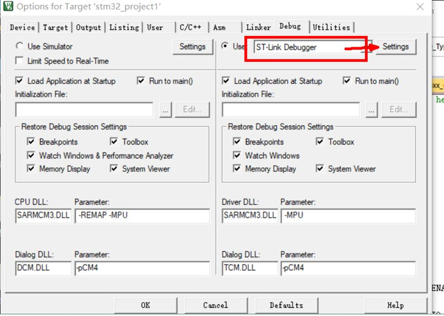

## ST-Link 驱动安装与 Keil 配置指南
### 驱动安装
1. 下载并解压 `ST-Link驱动安装包`
2. 进入解压后的文件夹，双击运行 **`dpinst_amd64.exe`**（适用于64位系统）
3. 按照提示一直点击“下一步”直到安装完成
### 硬件连接
将 ST-Link 调试器与开发板按下表连接：

| **开发板引脚** | **ST-Link 引脚** | **说明** |
| --------- | -------------- | ------ |
| **GND**   | GND            | 地线     |
| **TCK**   | SWCLK          | 时钟信号   |
| **TMS**   | SWDIO          | 数据信号   |
| **3.3V**  | 3.3V           | 电源     |

### 调试器设置 (Keil MDK)
1. 点击工具栏上的 **“魔法棒”** 图标 (Options for Target)
2. 切换到 **Debug** 标签页
3. 在右侧下拉菜单中选择 **ST-Link Debugger**
4. 点击旁边的 Settings 按钮进入详细设置

### 识别与下载配置
1. **设置 SW 模式**：
    - 在弹出的设置窗口中，找到 **Port** 选项，将其改为 **SW**
    - 观察右侧 SW Device 框：如果显示出 ID 号和设备名，说明电脑已成功识别到芯片
        
2. **设置自动运行**：
    - 切换到 **Flash Download** 标签页
    - 勾选 **Reset and Run**
    - _作用：勾选后，程序下载完毕会自动复位并开始运行，无需手动按复位键_
---
> [!tip]
> - **关于 3.3V**：如果连接 ST-Link 的同时又插了 USB 线给开发板供电，建议**拔掉 ST-Link 的 3.3V 线**，只保留 GND、SWCLK、SWDIO 三根线，以防电压冲突烧坏电脑接口
> - **关于找不到设备**：如果 `SW Device` 无法识别，请检查连线是否松动，或者尝试按住开发板复位键再点 Settings