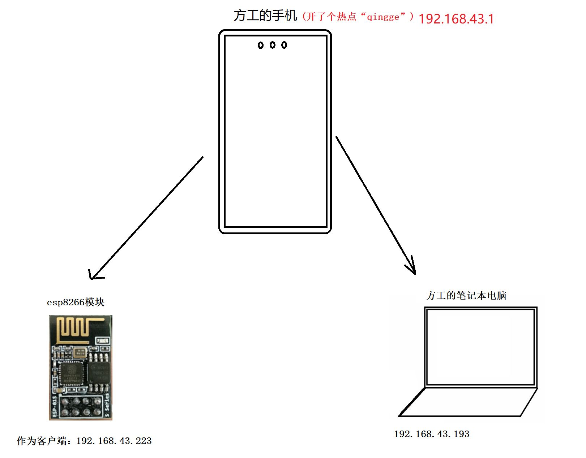
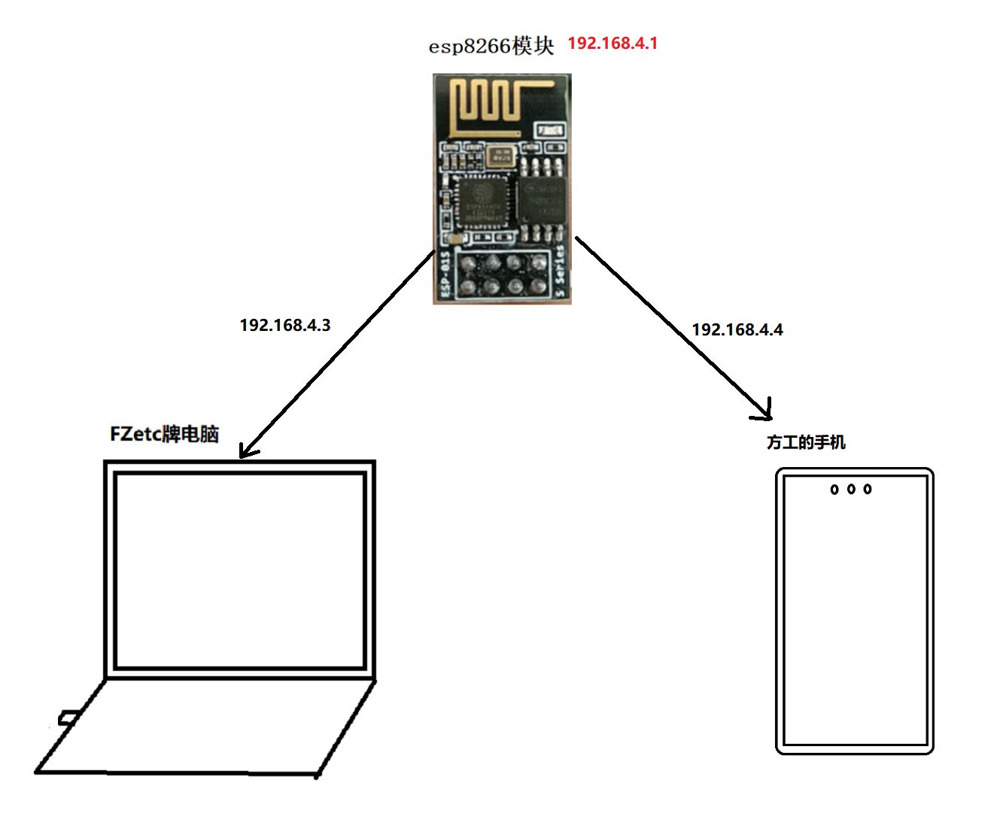
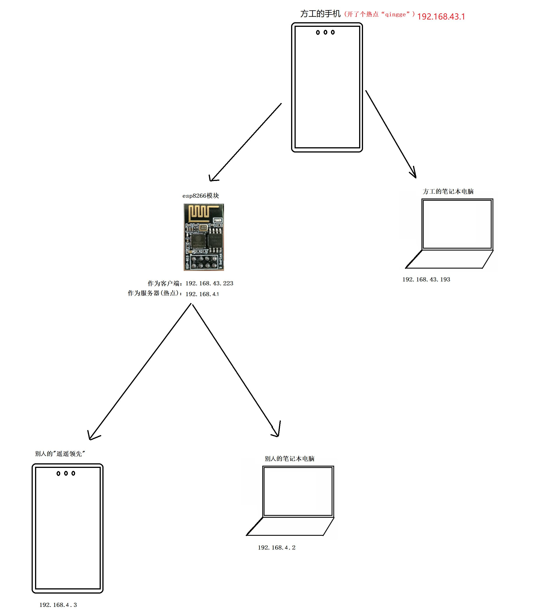
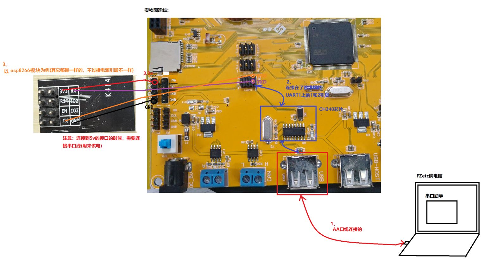
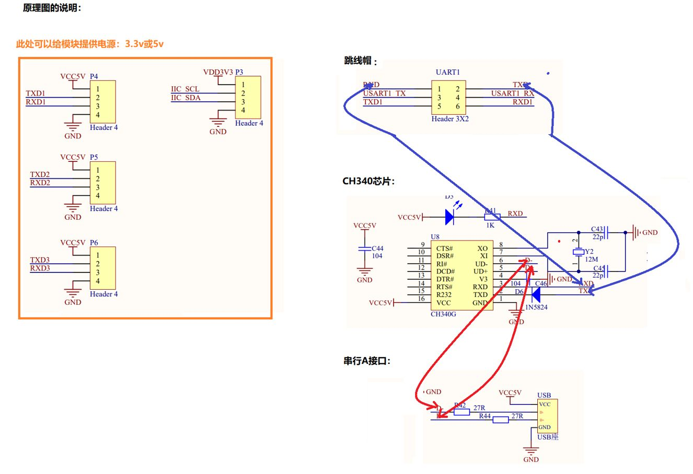

在嵌入式开发与物联网（IoT）体系中，**ESP8266** 模块凭借其完整的 TCP/IP 协议栈和低成本特性，成为了实现设备联网、无线远距离通信的核心组件。本文从硬件连接、工作模式切换、AT 指令集解析到云端中转服务器的部署，建立 ESP8266 的技术知识图谱。
## ESP8266 核心工作模式
ESP8266 支持三种底层工作模式，这决定了它在网络拓扑结构中的物理角色
### TATION 模式（客户端模式）
在该模式下，模块作为终端设备（Client）连接至局域网内的无线路由器或移动热点
- **应用场景**：传感器节点上传数据至服务器、智能家居设备接入家庭网关。
- **物理链路**：
### AP 模式（接入点模式）
模块充当无线热点（Server），允许其他移动设备（如手机、电脑）接入其自建的局域网
- **应用场景**：无路由器环境下的近场通信、设备初始配网调试
- **物理链路**：
### STATION + AP 混合模式
此模式下模块具备双重身份，既作为 Client 接入外网路由器，又作为 Server 提供热点供其他设备接入
- **优势**：可作为信号中继器，或在保持外网连接的同时提供本地配置接口。
- **物理链路**：
---
## 模式的使用
## 硬件连接方案
要实现 ESP8266 与上位机（PC）或单片机（MCU）的可靠通信，物理层连接是首要任务
### 调试级方案：USB-TTL 串口通信
通过 USB-TTL 模块直接驱动 ESP8266，适用于初期 AT 指令调优
- **引脚定义**：TX 接 RX，RX 接 TX，GND 共地
- **供电规范**：必须接 **3.3V**。ESP8266 的峰值功耗较大，若 USB-TTL 供电能力不足，会导致模块重启或初始化失败
    
> [!CAUTION] 引脚版本差异
>
> * ESP-01 模块：必须将 EN (Enable) 引脚 显式拉高至 3.3V 才能正常启动
> 
> * ESP-01S 模块：内部已集成了上拉电阻，无需手动处理 EN 引脚即可直接工作

### 工程级方案：基于 STM32 的系统集成
在单片机系统中，通常通过串口（如 STM32 的 USART3）与 ESP8266 交互
- **方法一（排线连接）**：通过跳线将开发板串口引脚引出

---
## AT 指令集
模块出厂默认固件支持标准 AT 指令集，通过波特率 **115200**（备选 9600 或 38400）进行异步串口通信

> [!NOTE] 关键交互准则
>
> 所有 AT 指令必须以 \r\n（回车换行）结尾。在串口调试助手（如 PortHelper）中，必须选中“发送新行”或手动敲击回车
> 中文乱码可尝试将字符编码换为 UTF-8

### 常用控制指令表

| **逻辑分类**  | **指令原型**                | **说明**                     |
| --------- | ----------------------- | -------------------------- |
| **基础测试**  | `AT`                    | 返回 `OK` 表示模块状态正常。          |
| **复位重启**  | `AT+RST`                | 配置模式后通常需执行重启生效             |
| **模式选择**  | `AT+CWMODE=<mode>`      | 1: STA, 2: AP, 3: STA+AP   |
| **扫描热点**  | `AT+CWLAP`              | 列出周围可用 WIFI（中文显示可能乱码）      |
| **接入网络**  | `AT+CWJAP="ssid","pwd"` | 接入指定热点。需注意支持 **2.4GHz** 频段 |
| **IP 查询** | `AT+CIFSR`              | 获取本地 Station IP 及 AP IP 地址 |
| **多连接模式** | `AT+CIPMUX=1`           | 开启多连接，服务器模式必须开启此项          |

### 网络传输模式：透传
透传是嵌入式开发中最常用的模式。开启后，模块将串口接收到的所有数据直接封装进 TCP/UDP 包发送，反之亦然，不再处理 AT 指令，实现 MCU 与服务器的透明交互
- **配置流程**：`AT+CIPMODE=1`（开启透传） -> `AT+CIPSEND`（开始传输）
- **退出机制**：连续发送 `+++`（不带回车换行）可强制退出透传状态
---
## 跨网段通信与服务器架构
在实际物联网项目中，设备往往需要跨越局域网，与远程公网服务器通信。
### 局域网调试实战
使用 **NetAssist (网络调试助手)** 模拟服务器，ESP8266 作为客户端接入
- **关键点**：确保服务器（PC）与模块连接在同一路由器下，或模块连接 PC 发出的热点。
- **连接指令**：`AT+CIPSTART="TCP","192.168.43.11",8080` 27。

### 公网服务器部署（以阿里云为例）

为了实现广域网（WAN）下的远距离通信，需要部署中转服务器程序
1. **实例创建**：注册阿里云 ECS，推荐选择 **Ubuntu 22.04** 系统
2. **环境搭建**：
    - 修改 SSH 密码并使用 VSCode 进行远程开发
    - **防火墙配置**：在阿里云安全组中放行必要的入方向端口（如 8080 用于 TCP，1883 用于 MQTT）
3. **中转逻辑设计**：
    - 采用 **链表** 结构管理在线客户端
    - 自定义通信协议，如注册信息 `#reg 设备名`，发送指令 `#cmd 设备名 命令`
    - [此处插入图片：阿里云公网 IP 地址配置及 SSH 连接状态示意图]
---

## 云端 API 交互与 JSON 解析
### 1. 获取网络时间与天气
通过 HTTP 协议访问第三方 API（如心知天气），可以使单片机具备获取实时信息的能力
- **传输层**：基于 TCP 80 端口。
- **应用层**：发送 HTTP GET 请求。
### 2. cJSON 移植注意事项
解析复杂的 API 返回值（JSON 格式）时，必须移植 **cJSON** 库

> [!TIP] 内存陷阱
>
> cJSON 涉及大量动态内存申请。在 STM32 中，务必在启动文件 startup_stm32xxxx.s 中调大 Heap_Size（堆空间）和 Stack_Size（栈空间），否则解析大字符串时会导致系统卡死
> [此处插入图片：cJSON 移植代码及启动文件 Heap_Size 修改对比图]
### 3. 物联网协议进阶
在高性能或低带宽环境下，推荐将传输层升级为 **MQTT** 协议，配合阿里云物联网平台或 OneNet 进行大规模设备管理

---

## 总结与常见坑点排查

1. **电源干扰**：ESP8266 启动瞬时电流可达 200mA+，建议增加 100uF 电容稳压
2. **频段锁定**：模块仅支持 **2.4GHz** WIFI，不支持 5GHz 频段，配置热点时务必核实
3. **指令延时**：MCU 发送 AT 指令后，应预留至少 100ms 等待模块返回 `OK`，严禁无间隔连续发送
4. **服务器超时**：当 ESP8266 作为服务器时，若客户端长时间无心跳，会自动断开连接，可通过 `AT+CIPSTO=<time>` 设置超时时间