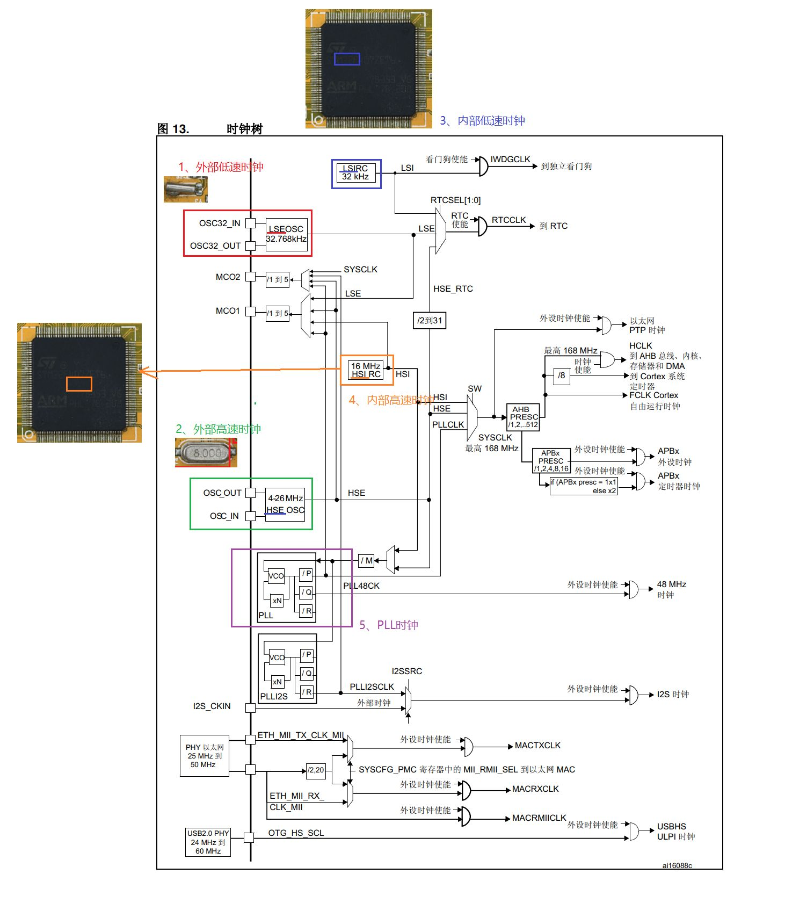
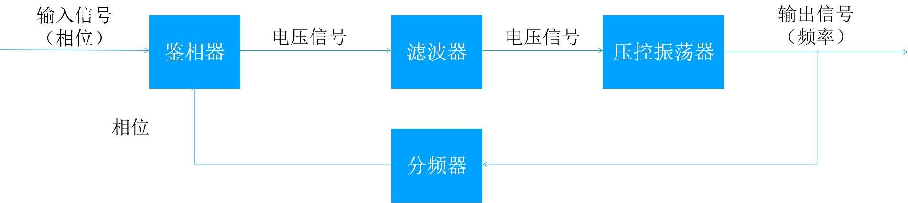
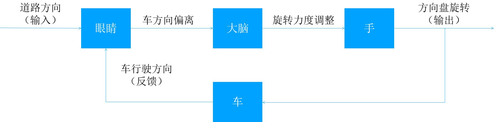

# 一、STM32F407 时钟体系概述

> **参考资料**：《STM32F4xx中文参考手册》第106页
## 为什么需要时钟？
时钟信号是单片机的“心脏”脉搏。它提供一个稳定的频率信号，确保：
- **内部同步**：CPU与各组件（内存、总线）协同工作。
- **外部同步**：与外部设备（串口、I2C等）通信时波特率一致。
- **功耗控制**：类似广播体操，动作频率（性能）取决于音乐节奏（时钟）。频率越高性能越强，但功耗越大；反之亦然。
## 五大时钟源 (Clock Sources)
STM32F407 具有复杂的时钟源，主要分为**高速**（驱动系统）和**低速**（驱动RTC/看门狗）两类：

| **时钟源类型** | **名称**  | **全称**                    | **频率**          | **说明**                                     |
| --------- | ------- | ------------------------- | --------------- | ------------------------------------------ |
| **高速内部**  | **HSI** | High Speed Internal  高速内部 | 16 MHz          | 内部RC振荡器。精度较低，通常作为备用或启动时钟。                  |
| **高速外部**  | **HSE** | High Speed External  高速外部 | **8 MHz**       | 外部晶振（石英/陶瓷）。精度高，**GEC-M4开发板板载为8MHz**。      |
| **主锁相环**  | **PLL** | Phase Locked Loop  锁相环    | 倍频输出            | 将HSI或HSE倍频，产生高达 **168MHz** 的系统时钟 (SYSCLK)。 |
| **低速内部**  | **LSI** | Low Speed Internal  低速内部  | ~32 kHz  约32千赫兹 | 内部RC振荡器。用于驱动独立看门狗 (IWDG) 或 RTC。            |
| **低速外部**  | **LSE** | Low Speed External  低速外部  | 32.768 kHz      | 外部晶振。主要用于 RTC 实时时钟，确保时间精准。                 |
### 扩展：时钟频率的物理来源
参考链接 [【丝滑动画】时间从哪来？晶振是如何记录时间的？](https://www.bilibili.com/video/BV1ho4y1H7Kk/?spm_id_from=333.337.search-card.all.click)

为什么我们需要晶振？尤其是为什么 LSE 的频率偏偏是 **32.768kHz**？
1. 为什么不用单摆？
早期时钟使用单摆（约0.994米长的单摆周期为1秒），但它依赖重力
重力随地球位置（如海平面或高山）变化，导致每天产生数秒甚至数分钟的误差，不适合精密电子设备
**2. 核心原理：石英晶体的压电效应**
- **物理特性**：给石英施加电压，它会发生形变；反之，使其形变，它会产生电压 3。
- **工作方式**：将石英切割成音叉形状，施加交流电后，它会产生机械振动，并输出对应频率的振动电压 4。
- **起振过程**：电路通电瞬间产生无规则噪声，这些波形经过反向放大器反馈回晶振。只有最贴近晶振固有谐振频率的波形能通过并被放大，经过多次循环，最终形成稳定的震荡波形 5。
**3. 数值奥秘：为什么是 32768 Hz？**
- **目标**：我们需要得到 **1Hz** (1秒跳动一次) 的信号来驱动秒针或计时 6。
- **分频原理**：数字电路中最容易实现的是“二分频”（除以2）。
- 计算公式：   $$2^{15} = 32768$$
    晶振被切割工艺控制在每秒震动 32768 次 7。
    通过 15级分频器（连续除以2十五次）：
    $$32768 \div 2 \div 2 \dots (\text{共15次}) \rightarrow 1Hz$$
    这就是 STM32 中 LSE 选用 32.768kHz 的根本原因——为了方便通过硬件电路精确地获得 1秒 的时间基准 8。
## 时钟树 (Clock Tree)

> **核心概念**：时钟树描述了时钟从源头（振荡器）出发，经过分频、倍频、门控，最终到达各个外设的路径。
- **时钟域**：不同的外设（如GPIO, ADC, UART）挂载在不同的总线（AHB, APB1, APB2）上，这些总线拥有不同的时钟频率。
- **门控机制**：为了省电，STM32 允许单独关闭某个外设的时钟（Clock Gating）。
- 
---

# 二、PLL (锁相环) 原理

## 1. 什么是 PLL?
**PLL (Phase Locked Loop)** 是一种反馈控制电路。
- **作用**：统一整合时钟信号，利用外部较低的稳定频率（如8MHz），通过倍频技术产生稳定的高频信号（如168MHz）。
- **必要性**：直接制造高频晶振工艺难、成本高且干扰大。PLL 完美解决了“低频输入，高频输出”的问题。
## 2. 工作原理与类比

- **技术原理**：通过鉴相器(PD)、环路滤波器(LF) 和压控振荡器(VCO) 形成闭环。比较输入信号与反馈信号的相位差，动态调整输出频率，直到两者相位“锁定”。
- 
- **生活类比（开车模型）**：
    - **鉴相器 (眼睛)**：观察车辆实际方向（反馈）与道路方向（输入）的偏差。
    - **控制器 (大脑)**：处理偏差信息。
    - **执行器 (手/方向盘)**：调整行车方向（VCO频率）。
    - **闭环**：不断微调，确保车永远行驶在正确的道路上（锁定频率）。

---

# 三、SystemInit 系统初始化与代码修改

> **核心任务**：将外部 8MHz 晶振通过 PLL 倍频至 168MHz 作为系统时钟。

## 1. 启动流程 (Startup Sequence)
1.启动流程（Startup Sequence）

STM32 上电后，首先执行汇编启动文件 `startup_stm32f40_41xxx.s`：

1. **Set SP**：设置栈指针。
    
2. **Set PC**：设置程序计数器，指向 `Reset_Handler`。
    
3. **Vector Table**：初始化中断向量表。
    
4. **SystemInit**：**关键步骤！** 配置系统时钟，初始化外部SRAM。
    
5. **__main**：跳转至 C 语言的 main 函数。
    

## 2. 实战：修改时钟配置 (适配 8MHz 晶振)

官方库默认配置通常针对 25MHz 晶振，而 GEC-M4 开发板使用 8MHz 晶振，因此必须修改配置文件。

#### A. 修改 PLL 倍频参数

在 system_stm32f4xx.c 中，修改 PLL_M 参数。

PLL 计算公式：

$$f_{PLL\_OUT} = f_{HSE} \times \frac{N}{M \times P}$$

目标：输出 168MHz

- **官方默认 (25MHz 晶振)**: $25MHz / 25(M) \times 336(N) / 2(P) = 168MHz$
    
- **开发板 (8MHz 晶振)**: $8MHz / \mathbf{8(M)} \times 336(N) / 2(P) = 168MHz$
    

修改操作：

找到宏定义 #define PLL_M，将其值从 25 改为 8。

#### B. 修改 HSE_VALUE 宏定义

在 `stm32f4xx.h` 中（文件通常只读，需先去只读属性）：

1. 右键文件属性 -> 取消“只读”。
    
2. 定位到 `HSE_VALUE` 定义处。
    
3. 将默认的 `25000000` ((25MHz) 修改为 **`8000000`** (8MHz)。
    

> **注意**：修改 `HSE_VALUE` 不会直接改变硬件频率，但会影响系统对延时函数和波特率的计算，必须与硬件实际值保持一致。

---

## 四、程序中的时钟源切换与低功耗

在特定应用（如智能穿戴设备）中，并非时刻需要 168MHz 的高性能。

### 1. 动态切换时钟源

通过操作 `RCC->CFGR` 寄存器可实时切换系统时钟源 (SW 位)：

- **高性能模式 (168MHz)**:

    C

    ```
    // 切换到 PLL
    RCC->CFGR &= ~(RCC_CFGR_SW);
    RCC->CFGR |= RCC_CFGR_SW_PLL;
    ```
    
- **低功耗模式 (8MHz)**:

    C

    ```
    // 切换到 HSE (直接使用外部晶振，绕过PLL)
    RCC->CFGR &= ~(RCC_CFGR_SW);
    RCC->CFGR |= RCC_CFGR_SW_HSE;
    ```
    
- **超低功耗/待机 (16MHz)**:

    C

    ```
    // 切换到 HSI
    RCC->CFGR &= ~(RCC_CFGR_SW);
    RCC->CFGR |= RCC_CFGR_SW_HSI;
    ```
    

### 2. 应用场景分析

- **智能手环/手表**：
    
    - **亮屏/运动算法**：开启 **PLL (168MHz)**，保证界面流畅，算法响应快。
        
    - **息屏待机**：切换至 **HSE/HSI**，关闭 PLL，降低电压，大幅延长续航。
        
    - **唤醒机制**：利用 MPU6050 传感器检测“抬手”动作，触发中断，瞬间将时钟切换回高性能模式。
        

---

## [ 课后作业 ]

**实验1：绘制时钟树**

- **要求**：参考《参考手册》P107，使用画图软件（Visio/ProcessOn/画图板）绘制 STM32F4 时钟树。
    
- **重点**：标出 HSE、HSI、PLL 及其流向，理清 AHB、APB1、APB2 的分频关系。