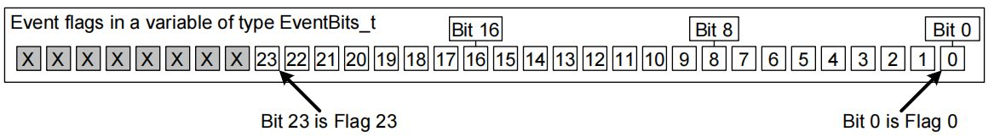

在嵌入式实时系统中，任务间的通信不仅仅局限于数据的传递，状态的同步同样至关重要。FreeRTOS 提供的**事件标志组（Event Groups）**，是一种轻量级、高效且灵活的同步机制。它突破了信号量“一对一”的限制，实现了“一对多”甚至“多对多”的复杂同步模型。
## 概述
**事件标志组**本质上是一组二进制标志位（Event Bits）的集合。与信号量（Semaphore）或队列（Queue）不同，事件标志组不传输具体数据，而是通过标志位的状态（0 或 1）来传递“发生了什么”。
### 核心差异
*   **信号量**：通常用于“一对一”同步或资源计数。获取信号量会消耗它（计数减一）。
*   **事件标志组**：
    *   **广播机制（Broadcast）**：一个事件发生，可以同时唤醒多个等待该事件的任务（一对多）。
    *   **组合等待**：一个任务可以等待多个事件同时发生（逻辑与 AND），或者等待任意一个事件发生（逻辑或 OR）。
    *   **非消耗性**：事件发生后，如果不显式清除，标志位可以保持置位状态，供其他任务查询。

## EventBits_t 的位域

事件标志组在内存中仅仅是一个 `EventBits_t` 类型的变量。其位宽取决于宏 `configUSE_16_BIT_TICKS` 的定义：

*   **32 位系统（STM32 常用）**：
    当 `configUSE_16_BIT_TICKS` 定义为 **0** 时，`EventBits_t` 为 32 位无符号整数。
    *   **可用位**：低 **24** 位（Bit 0 ~ Bit 23）供应用程序使用。
    *   **保留位**：高 8 位由 FreeRTOS 内核保留，用于管理标志组状态，严禁用户修改。
*   **16 位系统**：
    当 `configUSE_16_BIT_TICKS` 定义为 **1** 时，`EventBits_t` 为 16 位。
    *   **可用位**：低 **8** 位（Bit 0 ~ Bit 7）。
    *   **保留位**：高 8 位。



> [!NOTE] 为什么只有 24 位？
> FreeRTOS 内部使用高 8 位来处理阻塞条件（例如标记任务是否在等待所有位）。因此，我们在设计应用层协议时，一个事件组最多只能定义 24 个独立的事件。

## 同步模型与运作机制

事件标志组最强大的功能在于其灵活的同步逻辑。

### 独立型同步（逻辑或 OR）
**场景**：任务只需等待多个事件中的**任意一个**发生即可被唤醒。
* **示例**：任务 A 负责处理按键输入（Bit 0）或串口接收（Bit 1）。无论哪个事件触发，任务 A 都会解除阻塞进行处理。

### 关联型同步（逻辑与 AND）
**场景**：任务需要等待**所有**指定的事件都发生后才能继续执行。这通常被称为“汇聚”（Rendezvous）。
* **示例**：危险机器启动前，必须同时满足：电机就绪（Bit 0）、安全门关闭（Bit 1）、急停按钮松开（Bit 2）。只有当这 3 个位同时为 1 时，启动任务才会被唤醒。

`[此处插入图片：逻辑与 vs 逻辑或 同步机制示意图]`

### 为什么不使用全局变量
新手常问：*“我用一个全局变量 `uint32_t flags`，任务里 `while` 轮询检查不也一样吗？”*
在操作系统中，直接使用全局变量存在严重缺陷：
* **CPU 浪费**：轮询（Polling）会空耗 CPU 时间片，导致系统效率极低。事件组机制允许任务在等待期间进入**阻塞态（Blocked）**，不消耗 CPU 资源。
* **原子性问题**：多任务并发修改全局变量（读-改-写）可能导致数据竞争。FreeRTOS 事件组操作是**原子**的（Atomic），内核保证了操作的线程安全。
* **超时管理**：事件组自带超时机制，用户无需手写复杂的定时器逻辑。

## 核心 API

### 创建事件标志组：`xEventGroupCreate`
- **函数原型**：
  ```c
  EventGroupHandle_t xEventGroupCreate( void );
  ```
- **功能描述**：在堆内存中分配一个事件标志组控制块，并初始化所有标志位为 0。
- **参数详解**：无。
- **返回值**：
    - **成功**：返回事件标志组句柄。
    - **失败**：返回 `NULL`（通常因堆内存不足）。

### 设置标志位：`xEventGroupSetBits`
- **函数原型**：
  ```c
  EventBits_t xEventGroupSetBits( 
      EventGroupHandle_t xEventGroup, 
      const EventBits_t uxBitsToSet 
  );
  ```
- **功能描述**：将指定的标志位置 1（逻辑或操作）。若有任务在等待这些位，可能会触发任务调度。
- **参数详解**：
    - `xEventGroup`：事件标志组句柄。
    - `uxBitsToSet`：要置位的掩码。例如 `0x09` (1001b) 表示同时置位 Bit 0 和 Bit 3。
- **返回值**：返回调用此函数时事件组的**最终值**（包含本次设置的位）。

### 等待标志位：`xEventGroupWaitBits`
这是最复杂也最核心的函数。
- **函数原型**：
  ```c
  EventBits_t xEventGroupWaitBits( 
      EventGroupHandle_t xEventGroup, 
      const EventBits_t uxBitsToWaitFor, 
      const BaseType_t xClearOnExit, 
      const BaseType_t xWaitForAllBits, 
      TickType_t xTicksToWait 
  );
  ```
- **功能描述**：等待指定的一个或多个标志位被置位。
- **参数详解**：
    - `xEventGroup`：句柄。
    - `uxBitsToWaitFor`：感兴趣的事件掩码。如 `0x05` 表示等待 Bit 0 或 Bit 2。
    - `xClearOnExit`：**退出是否清除**。
        - `pdTRUE`：事件满足唤醒条件后，系统自动将 `uxBitsToWaitFor` 对应的位清零（消费事件）。
        - `pdFALSE`：唤醒后保留标志位（仅窥探事件）。
    - `xWaitForAllBits`：**逻辑判断条件**。
        - `pdTRUE` (**逻辑与**)：所有等待位都为 1 时才唤醒。
        - `pdFALSE` (**逻辑或**)：任意一个等待位为 1 就唤醒。
    - `xTicksToWait`：超时时间（Tick）。
- **返回值**：返回**等待结束时**事件组的值。若因超时返回，该值可能不满足等待条件，需用户再次校验。

### 清除标志位：`xEventGroupClearBits`
- **函数原型**：
  ```c
  EventBits_t xEventGroupClearBits( 
      EventGroupHandle_t xEventGroup, 
      const EventBits_t uxBitsToClear 
  );
  ```
- **功能描述**：手动将指定的标志位清零。
- **参数详解**：
    - `xEventGroup`：事件标志组句柄。
    - `uxBitsToClear`：需要清除的位掩码（如 `0x08` 表示清除 Bit 3）
- **返回值**：
    - 返回**清除前**的事件组值
- **注意事项**：
    - 清除操作通常**不会**导致阻塞任务被唤醒。
    - 与 `xEventGroupSetBits` 不同，清除操作虽然也是原子的，但很少用于触发同步行为

---
### 中断中的操作（ISR API）
> [!WARNING] 这是一个必须重视的特殊机制
> 在中断中**不能**直接调用上述普通 API，必须使用 `FromISR` 结尾的函数。

#### 中断中置位：`xEventGroupSetBitsFromISR`
- **函数原型**：
  ```c
  BaseType_t xEventGroupSetBitsFromISR( 
      EventGroupHandle_t xEventGroup, 
      const EventBits_t uxBitsToSet, 
      BaseType_t *pxHigherPriorityTaskWoken 
  );
  ```
- **功能描述**：在中断服务程序（ISR）中设置事件标志位。
- **注意**：此函数并不会直接修改事件组，而是向定时器守护任务发送一条“置位命令”。
- **参数详解**：
    - `xEventGroup`：事件标志组句柄。
    - `uxBitsToSet`：要设置的位掩码。
    - `pxHigherPriorityTaskWoken`：**出参**。如果置位操作导致一个更高优先级的任务解除阻塞，此参数会被设为 `pdTRUE`。
- **返回值**：
    - `pdPASS`：命令成功发送到定时器命令队列。
    - `pdFAIL`：命令队列已满，操作失败。
- **注意事项**：
	- **依赖宏配置**：
	  使用 `FromISR` 系列函数必须在 `FreeRTOSConfig.h` 中启用以下配置：
	  ```c
	  #define configUSE_TIMERS       1
	  #define INCLUDE_xTimerPendFunctionCall 1
	  ```
	  否则编译会报错。
    - 实际的置位操作是在**定时器守护任务**的上下文中延迟执行的，因此具有一定的不确定性延迟。

#### 中断中清除：`xEventGroupClearBitsFromISR`
- **函数原型**：
  ```c
  BaseType_t xEventGroupClearBitsFromISR( 
      EventGroupHandle_t xEventGroup, 
      const EventBits_t uxBitsToClear 
  );
  ```
- **功能描述**：在中断服务程序（ISR）中清除事件标志位。同样是通过向定时器守护任务发送命令来实现。
- **参数详解**：
    - `xEventGroup`：事件标志组句柄。
    - `uxBitsToClear`：要清除的位掩码。
- **返回值**：
    - `pdPASS`：命令发送成功。
    - `pdFAIL`：命令队列已满，发送失败。
- **注意事项**：
    - 同样依赖于定时器守护任务机制。
    - 由于是异步操作，ISR 返回后，标志位可能尚未被立即清除。

## 实战代码范例

### 场景 1：关联型同步（逻辑与）
任务必须等待 Bit 0 和 Bit 1 同时发生才执行。
```c
// 等待 Bit 0 和 Bit 1
const EventBits_t xBitsToWait = (1 << 0) | (1 << 1);
EventBits_t xEventValue;

// 参数说明：
// pdTRUE: 必须2位全为1（逻辑与）
// portMAX_DELAY: 死等
xEventValue = xEventGroupWaitBits(
    xEventGroupHandler, 
    xBitsToWait, 
    pdTRUE, 
    pdTRUE, 
    portMAX_DELAY
);

if( (xEventValue & xBitsToWait) == xBitsToWait ) {
    printf("所有条件满足，任务开始执行！\r\n");
}
```

### 场景 2：独立型同步（逻辑或）
任务等待 Bit 0 或 Bit 1 任意一个发生。
```c
// 参数说明：
// pdTRUE: 退出时清除对应位
// pdFALSE: 任意一位为1即可（逻辑或）
xEventValue = xEventGroupWaitBits(
    xEventGroupHandler, 
    xBitsToWait, 
    pdTRUE, 
    pdFALSE, 
    portMAX_DELAY
);

if( (xEventValue & (1 << 0)) != 0 ) {
    printf("事件 0 发生\r\n");
}
if( (xEventValue & (1 << 1)) != 0 ) {
    printf("事件 1 发生\r\n");
}
```

通过事件标志组，我们能以极低的资源消耗实现复杂的任务编排，是嵌入式开发中替代“全局标志位 + 轮询”的最佳实践。