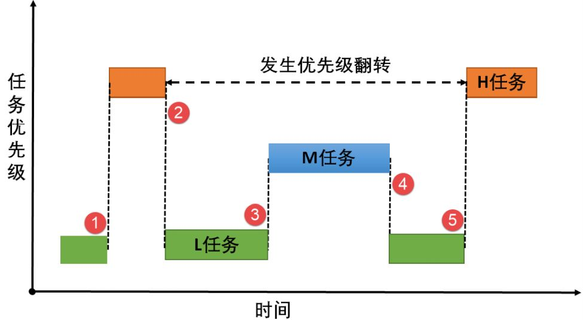
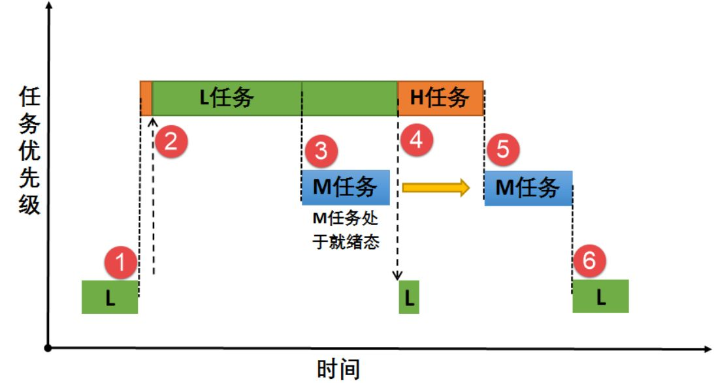
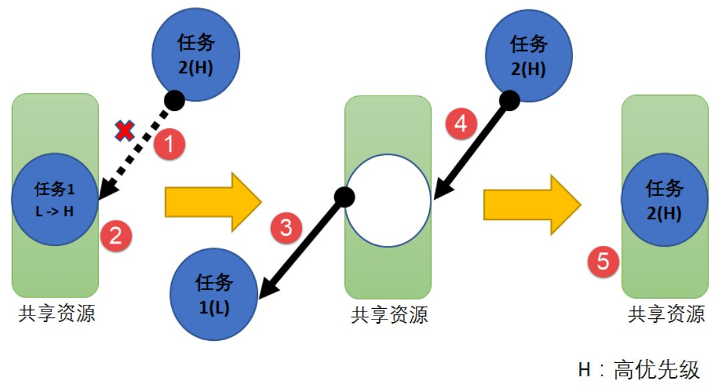

在嵌入式多任务系统中，如何优雅地处理资源的**独占式访问**一直是核心议题。今天我们深入探讨 FreeRTOS 中一种特殊的二值信号量——**互斥量（Mutex）**。它不仅是实现**临界资源**（如串口、I2C 总线、全局变量）**互锁保护**的神兵利器，更是解决**优先级翻**这一实时系统致命顽疾的特效药。

## 互斥量概述
**互斥量**本质上是一种支持**优先级继承**的二值信号量。与用于同步的普通二值信号量不同，互斥量具有明确的**所有权**概念，这赋予了它三个独有的特性：**互斥所有权**、**递归访问**以及**优先级继承**。
任意时刻，互斥量的状态仅有**开锁**和**闭锁**两种：
*  **闭锁（Locked）**：当任务成功**获取（Take）**互斥量时，该任务即获得其**所有权**。此时互斥量处于闭锁状态，其他试图获取该互斥量的任务将被**阻塞**。
*  **开锁（Unlocked）**：当**持有者任务**释放（Give）互斥量时，状态转为开锁，所有权归还系统。

### 同步与互锁的抉择
虽然二值信号量也能实现互锁，但在架构设计上，二者有严格的职能划分：
-   **二值信号量**：侧重于**同步（Synchronization）**。适用于任务与任务、任务与中断之间的事件通知。
-   **互斥量**：侧重于**互锁（Mutual Exclusion）**。它是保护共享资源的令牌，遵循**谁上锁，谁解锁**的原则。

> [!NOTE] 核心区别：递归访问
> 互斥量支持**递归访问**，即**持有锁的任务可以再次成功获取该锁而不会挂起**。这是二值信号量无法做到的——在二值信号量机制下，再次获取已为空的信号量会导致任务主动挂起，从而引发**死锁**。

## 优先级翻转与继承机制

在多任务调度中，若单纯使用二值信号量保护资源，极易触发**优先级翻转（Priority Inversion）**。这是实时系统中极为凶险的现象，轻则导致高优先级任务响应延迟，重则引发系统崩溃。

### 优先级翻转的成因
假设系统中有三个任务，优先级顺序为 **H (High) > M (Middle) > L (Low)**。
1.  **L 任务**正在持有临界资源（如串口）。
2.  **H 任务**抢占执行，也请求该资源，但因资源被占用而进入**阻塞态**等待。
3.  此时 **M 任务**就绪，由于优先级 M > L，它**打断 L 任务**开始执行。

**后果**：H 任务本该只等待 L 释放资源，现在却不得不等待 M 任务执行完毕，再等 L 任务执行完毕。实际上，**优先级最高的 H 任务在等待优先级较低的 M 任务**，逻辑上的优先级完全乱序。若 M 这样的中间优先级任务众多，H 任务的阻塞时间将**不可控**。


### 优先级继承机制
FreeRTOS 的互斥量通过**优先级继承算法**将这种危害降至最低。其原理是：当高优先级任务 H 阻塞在被低优先级任务 L 持有的互斥量上时，**系统临时将 L 的优先级提升至 H 的水平**。
*  **过程**：在 L 继承了 H 的优先级后，中间优先级的 M 任务**无法再抢占 L**。L 任务得以在不受干扰的情况下尽快执行完临界区代码并释放互斥量。
*  **恢复**：一旦 L 释放互斥量，其优先级**立即恢复至初始值**。
*  **结果**：H 任务解除阻塞并立即抢占执行。H 的阻塞时间仅限于 L 访问临界资源的时间，消除了 M 任务的干扰。


> [!WARNING] 架构设计警示
> 优先级继承机制只能**缓解**而无法彻底解决优先级翻转，它只是将不可控的延迟压缩到最小。在**硬实时系统**设计之初，应通过合理的资源分配策略从**源头避免**优先级翻转的发生。

## 应用场景与选型策略

### 互斥量的典型场景
多任务环境下竞争同一临界资源时，互斥量是首选。例如，两个任务都需要通过同一个串口发送数据：
-  **保护机制**：任务 A 发送前获取锁，**独占串口**；任务 B 尝试发送时因获取锁失败而**阻塞**；任务 A 发送完毕释放锁，任务 B 被唤醒并获取锁进行发送。
-  **优势**：避免了**数据交错（Data Interleaving）**导致的乱码，且利用**优先级继承**保护了高优先级任务的响应性。

### 递归互斥量（Recursive Mutex）
当一个任务在复杂的调用栈中可能**多次调用同一个公共函数**（该函数内部获取锁），或者在临界区内再次请求同一个锁时，**必须使用递归互斥量**。它允许同一任务多次成功 Take，但也要求进行**同等次数的 Give** 才能真正释放锁。
### 中断服务程序（ISR）禁区
**互斥量严禁在中断服务函数中使用**。
*   **原因一**：ISR 也是一种高优先级的执行环境，如果 ISR 等待互斥量，可能会**阻塞整个系统**，这是不允许的。
*   **原因二**：优先级继承机制依赖于**任务控制块（TCB）**调整优先级，而在中断上下文中无任务优先级的概念，**继承机制失效且毫无意义**。

## 运作机制详解

FreeRTOS 互斥量的内部运作基于**阻塞等待机制**。当互斥量为闭锁状态时，后续请求任务会根据用户设定的 `xBlockTime`（超时时间）进入阻塞态。
1. **竞争**：多个任务请求同一互斥量。
2. **持有**：第一个成功 Take 的任务获得**所有权**，互斥量闭锁。
3. **等待**：其他任务进入**阻塞列表**，释放 CPU。
4. **唤醒**：持有者 Give 释放互斥量，等待列表中**优先级最高**的任务被唤醒，获得互斥量并再次闭锁。

这一机制确保了临界资源的安全性，同时利用系统调度器实现了高效的 CPU 资源利用。


## 开发接口与实战
### 核心 API
FreeRTOS 提供了标准的信号量 API 来操作互斥量，但创建函数有所不同。
#### 创建互斥量：`xSemaphoreCreateMutex`
- **函数原型**：
    ```c
    SemaphoreHandle_t xSemaphoreCreateMutex ( void );
    ```
- **功能描述**：动态创建一个互斥量，并自动初始化为**开锁**状态。该互斥量**默认启用优先级继承机制**。
- **参数详解**：无。
- **返回值**：
    - **成功**：返回互斥量的句柄。
    - **失败**：返回 `NULL`（通常是因为堆内存不足）。

#### 删除互斥量：`vSemaphoreDelete`
- **函数原型**：
    ```c
    void vSemaphoreDelete ( SemaphoreHandle_t xSemaphore );
    ```
- **功能描述**：删除已创建的互斥量，释放系统为其分配的内存资源。
- **参数详解**：
    - `xSemaphore`：要删除的信号量句柄。
- **返回值**：无。
- **注意事项**：**严禁删除任何任务正处于阻塞态等待的互斥量**。

#### 获取互斥量：`xSemaphoreTake`
- **函数原型**：
    ```c
    BaseType_t xSemaphoreTake ( 
            SemaphoreHandle_t xSemaphore, 
            TickType_t xBlockTime 
        );
    ```
- **功能描述**：尝试获取互斥量的**所有权（上锁）**。如果互斥量处于闭锁状态，任务将根据设定的超时时间进入阻塞状态。
- **参数详解**：
    -   `xSemaphore`：互斥量句柄。
    -   `xBlockTime`：等待超时的节拍数（Tick）。如果宏 `INCLUDE_vTaskSuspend` 定义为 1 且参数设置为 `portMAX_DELAY`，则任务将**无限期等待**，直到成功获取。
- **返回值**：
    -   `pdTRUE`：**成功**获取互斥量。
    -   `pdFALSE`（或 `errQUEUE_EMPTY`）：在超时时间内**未能**获取到互斥量。
- **注意事项**：**严禁在中断服务函数（ISR）中调用此函数**。ISR 中应使用 `xSemaphoreTakeFromISR`，但通常互斥量不用于 ISR。

#### 释放互斥量：`xSemaphoreGive`
- **函数原型**：
    ```c
    BaseType_t xSemaphoreGive ( SemaphoreHandle_t xSemaphore );
    ```
- **功能描述**：释放互斥量（开锁），并**归还所有权**。若有其他任务因等待该互斥量而阻塞，优先级最高的任务将被唤醒。
- **参数详解**：
    -   `xSemaphore`：互斥量句柄。
- **返回值**：
    -   `pdTRUE`：释放成功。
    -   `pdFALSE`：释放失败。
- **注意事项**：
	1. **所有权原则**：互斥量**必须由持有者任务释放**，不能由其他任务强制释放。
	2. **尽快释放**：为了减少高优先级任务的阻塞时间，**持有锁的时间应尽可能短**。
### 实战示例：串口资源保护
以下代码展示了如何使用互斥量保护 USART 外设，防止两个任务打印输出混乱。

```c
static void app_task1(void* pvParameters) {
    for(;;) {
        // 请求互斥量，无限等待直到获取
        xSemaphoreTake(MutexSemaphore, portMAX_DELAY);

        printf("app_task1 is running ...\r\n"); // 临界区：操作 USART
        
        // 访问结束，立即释放
        xSemaphoreGive(MutexSemaphore);
        vTaskDelay(300);
    }
}

static void app_task2(void* pvParameters) {
    for(;;) {
        xSemaphoreTake(MutexSemaphore, portMAX_DELAY);

        printf("app_task2 is running ...\r\n"); // 临界区：操作 USART
        
        xSemaphoreGive(MutexSemaphore);
        vTaskDelay(200);
    }
}
```
**运行效果**：任务 1 和任务 2 交替打印，即使延时不同，也不会出现字符穿插的乱码现象。

##死锁（Deadlock）：系统级灾难

死锁，被称为**抱死**，是指两个或多个任务无限期地**互相等待对方持有的资源**，导致系统部分或全部停滞。这就像两个人在独木桥上相遇，谁也不退后，谁也过不去。

### 经典死锁场景（AB-BA 问题）
假设任务 T1 和 T2 都需要资源 R1 和 R2（对应锁 M1 和 M2）：
*   **T1**：持有 M1，请求 M2。
*   **T2**：持有 M2，请求 M1。

```c
// 伪代码演示死锁逻辑
void T1(void *parg) {
    while(1) {
        // ... 等待事件 ...
        xSemaphoreTake(M1, ...);  // 步骤2：T1 拿到 M1
        // ... 访问 R1 ...
        // 中断发生，切换到高优先级 T2
        xSemaphoreTake(M2, ...);  // 步骤9：T1 请求 M2，但 M2 被 T2 拿着 -> 阻塞！
        // ... 
        xSemaphoreGive(M1);
        xSemaphoreGive(M2);
    }
}

void T2(void *parg) {
    while(1) {
        // ... 等待事件 ...
        xSemaphoreTake(M2, ...);  // 步骤5：T2 拿到 M2
        // ... 访问 R2 ...
        xSemaphoreTake(M1, ...);  // 步骤7：T2 请求 M1，但 M1 被 T1 拿着 -> 阻塞！
        // ...
        xSemaphoreGive(M2);
        xSemaphoreGive(M1);
    }
}
```
**流程推演**：
1.  T1 运行，拿到 M1。
2.  T2 抢占（或 T1 时间片到），T2 拿到 M2。
3.  T2 尝试拿 M1，**失败阻塞**（等待 T1 释放 M1）。
4.  T1 恢复运行，尝试拿 M2，**失败阻塞**（等待 T2 释放 M2）。
5.  **结果**：T1 等 T2，T2 等 T1，形成闭环，**死锁形成**。

### 破解死锁的策略
避免死锁的核心在于**打破“循环等待”条件**。
*   **策略一：统一资源获取顺序（推荐）**
    这是最稳健的方法。规定所有任务**必须按照相同的顺序申请锁**（例如先 M1 后 M2）。
    *   T1：申请 M1 -> 成功 -> 申请 M2。
    *   T2：申请 M1 -> **阻塞**（因为 T1 拿着）。
    *   T1 此时可以顺利申请 M2，执行完释放 M1，T2 才能继续。
*   **策略二：一次性获取所有资源**
    任务必须同时获得所有需要的资源才能开始工作，否则一个也不拿。但这在实际代码中较难实现原子性。
*   **策略三：设置超时时间**
    在 `xSemaphoreTake` 中设置非无限的超时时间。虽然能避免无限挂起，但处理超时后的回滚逻辑（释放已持有的锁）非常复杂，且难以调试，通常**不作为首选方案**。
**修正后的代码（统一顺序法）：**
```c
// 两个任务都遵循先 M1 后 M2 的顺序
void T1(void *parg) {
    while(1) {
        // ...
        xSemaphoreTake(M1, ...);
        xSemaphoreTake(M2, ...); 
        // 访问 R1 和 R2
        xSemaphoreGive(M2); // 建议反向释放，像堆栈一样
        xSemaphoreGive(M1);
    }
}

void T2(void *parg) {
    while(1) {
        // ...
        xSemaphoreTake(M1, ...); // T2 即使只想用 R2，也要先拿 M1 确保顺序
        xSemaphoreTake(M2, ...); 
        // 访问 R1 和 R2
        xSemaphoreGive(M2);
        xSemaphoreGive(M1);
    }
}
```
通过严格的编码规范，我们可以确保多任务系统的稳健运行，让互斥量真正成为资源的守护神，而非系统故障的导火索。