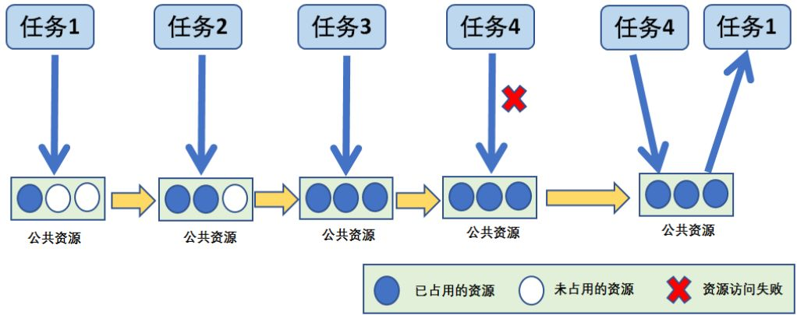
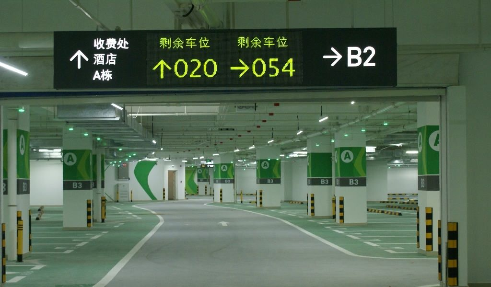
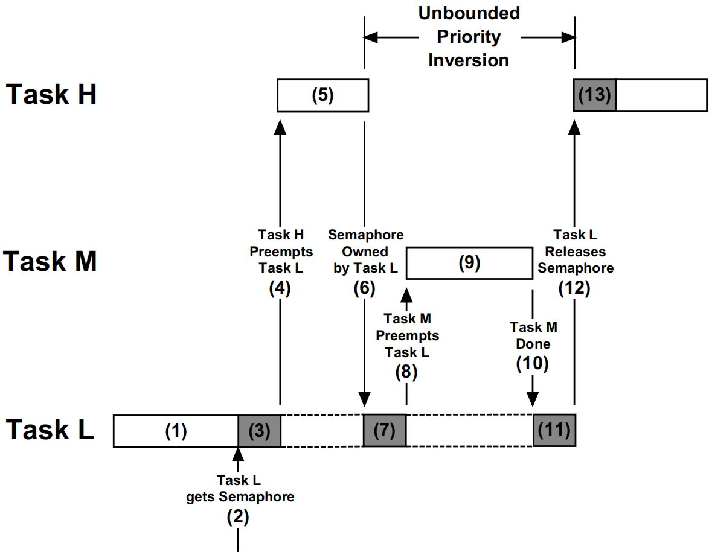

在嵌入式实时操作系统中，任务间的协作与同步是构建复杂应用的核心。**信号量**作为一种经典的同步机制，不仅解决了任务间对有限资源的竞争问题，还为中断与任务、任务与任务之间的协同工作提供了坚实的底层支持。
本文将从信号量的基本概念出发，深入探讨 PV 原语的数学逻辑，并结合 FreeRTOS 的 API 详细解析其在实际工程中的应用及优先级翻转这一关键陷阱。

---

## 信号量概述

信号量是一种用于任务同步或资源管理的内核对象。其本质是一个具有计数值的变量，通过该值的动态变化来表征资源的可用状态

### 计数信号量
计数信号量允许多个任务在资源限额内进行并发访问。当资源数达到最大值时，试图获取信号量的任务将进入阻塞态，直到有其他任务释放资源。

> [!tip] 形象化理解：停车场模型
>
> 设想一个只有 3 个车位的停车场。
>
> - **初始状态**：计数值为 3。5 辆车同时到达，前 3 辆顺利进入，计数值减为 0。
>     
> - **阻塞状态**：剩下的 2 辆车必须在入口等待（进入阻塞队列）。
>     
> - **释放与唤醒**：当 1 辆车离开（释放信号量），计数值恢复为 1，此时看门人唤醒队列首部的车辆进入。
>     


### 二值信号量

二值信号量只有 0 和 1 两个状态，通常用于“单向同步”。例如，中断触发后释放一个信号量，任务获取该信号量后开始执行后续处理。这种方式比轮询更高效，且不涉及复杂的优先级继承机制。

---

## PV 原语
1965 年，荷兰学者 Dijkstra 提出了 PV 原语，奠定了现代多任务同步的理论基础。信号量 $S$ 的取值具有明确的物理意义：
- **$S \ge 0$**：表示当前可供并发进程使用的资源实体数。
- **$S < 0$**：表示当前正在等待使用资源的进程总数。
### P 操作（Proberen，申请资源）
动作逻辑如下：
1. 执行 $S = S - 1$。
2. 若 $S \ge 0$，进程继续执行。
3. 若 $S < 0$，该进程被阻塞并挂起到等待队列中，系统触发进程调度。
### 2. V 操作（Verhogen，释放资源）
动作逻辑如下：
1. 执行 $S = S + 1$。
2. 若 $S > 0$，进程继续执行。
3. 若 $S \le 0$，表示队列中有等待者，系统从等待队列中唤醒一个进程，随后返回原进程执行或转调度。

---

## 信号量函数接口详解
在 FreeRTOS 中使用信号量需包含 `semphr.h`，且必须在 `FreeRTOSConfig.h` 中将 `configUSE_COUNTING_SEMAPHORES` 置为 1
### 创建计数信号量：`xSemaphoreCreateCounting`
- **函数原型**：
    ```c
    SemaphoreHandle_t xSemaphoreCreateCounting( 
	    UBaseType_t uxMaxCount, 
	    UBaseType_t uxInitialCount
    );
    ```
    
- **功能描述**：创建一个计数型信号量，用于资源管理或事件计数。
- **参数详解**：
    - **`uxMaxCount`**：计数值的最大限额，达到此值后不可再执行 Give 操作。
    - **`uxInitialCount`**：初始计数值。
- **返回值**：成功返回信号量句柄，失败（内存不足）返回 `NULL`。
### 创建二值信号量：`vSemaphoreCreateBinary`
- **函数原型**：
    ```c
    SemaphoreHandle_t vSemaphoreCreateBinary( void );
    ```
- **功能描述**：创建一个初始计数值为 0 的二值信号量，专用于任务或中断间的同步。
- **返回值**：成功返回句柄，否则返回 `NULL`。
### 获取信号量（P 操作）：`xSemaphoreTake`
- **函数原型**：
    ```c
    BaseType_t xSemaphoreTake( 
	    SemaphoreHandle_t xSemaphore, 
	    TickType_t xTicksToWait 
    );
    ```
- **功能描述**：尝试获取信号量。本质上是消息出队操作，若信号量无效，任务将根据超时时间进入阻塞。
- **参数详解**：
    - **`xSemaphore`**：信号量句柄
    - **`xTicksToWait`**：阻塞超时节拍。若设为 `portMAX_DELAY` 且开起了挂起功能，则任务将永久等待
- **返回值**：获取成功返回 `pdTRUE`，超时未果返回 `errQUEUE_EMPTY`。
- **注意事项：禁止在中断中使用此函数**

### 任务级信号量释放（v 操作）：`xSemaphoreGive`
- **函数原型**：
    ```c
    BaseType_t xSemaphoreGive( SemaphoreHandle_t xSemaphore );
    ```
    
- **功能描述**：释放信号量，使计数值加 1
- **参数详解**：
    - **`xSemaphore`**：目标信号量的句柄。
- **返回值**：
    - **`pdTRUE`**：信号量释放成功。
    - **`pdFALSE`**：释放失败。常见于计数信号量已达到创建时设定的最大计数值（`uxMaxCount`），无法再继续增加。
- **注意事项**：
    - **环境限制**：严禁在中断服务程序（ISR）中调用，必须使用对应的 `FromISR` 版本
    - **兼容性**：适用于二值信号量、计数信号量和互斥量，但**不能**用于释放递归互斥量（需使用 `xSemaphoreGiveRecursive()`）
### 中断级信号量释放（v 操作）：`xSemaphoreGiveFromISR`
- **函数原型**：
    ```c
    BaseType_t xSemaphoreGiveFromISR(
        SemaphoreHandle_t xSemaphore,
        BaseType_t *pxHigherPriorityTaskWoken
    );
    ```
- **功能描述**：释放信号量，使计数值加 1，具备中断保护机制
- **参数详解**：
    - **`xSemaphore`**：目标信号量的句柄。
    - **`pxHigherPriorityTaskWoken`**：指向一个 `BaseType_t` 变量。如果释放信号量导致一个优先级更高（或相等）的任务从阻塞态转为就绪态，内核会将该值置为 `pdTRUE`
- **返回值**：
    - **`pdTRUE`**：信号量释放成功。
    - **`pdFALSE`**：释放失败（如计数溢出）。
- **注意事项**：
    - **上下文切换**：在中断退出前，必须检查 `pxHigherPriorityTaskWoken`。若为 `pdTRUE`，应手动调用 `portYIELD_FROM_ISR()`（或宏 `portEND_SWITCHING_ISR`）触发上下文切换，以保证高优先级任务能立即执行。
    - **兼容性**：通常仅用于二值信号量和计数信号量。由于互斥量包含任务级的优先级继承机制，通常**不建议**在中断中释放互斥量

---

## 示例代码分析

### 计数信号量：资源量产与消费

在下例中，Task 1 作为生产者一次性释放 3 个信号量，Task 2 则作为消费者逐个获取。

```c
SemaphoreHandle_t g_sem_count;

void app_main(void) {
    // 最大值 255，初始值 0
    g_sem_count = xSemaphoreCreateCounting(255, 0);
}

void app_task1(void *pvParameters) {
    while(1) {    
        xSemaphoreGive(g_sem_count); // 模拟产生 3 个资源
        xSemaphoreGive(g_sem_count);
        xSemaphoreGive(g_sem_count);
        printf("[Task1] Gave 3 units. \r\n");
        vTaskDelay(pdMS_TO_TICKS(1000));
    }
}

void app_task2(void *pvParameters) {
    while(1) {    
        // 阻塞等待，每拿到一个就打印一次
        xSemaphoreTake(g_sem_count, portMAX_DELAY);
        printf("[Task2] Consumed 1 unit. \r\n");
    }
}
```

**运行效果**：Task 1 每秒打印 1 次，Task 2 则会瞬间打印 3 次，循环往复。这体现了信号量对事件计数的累积能力

### 二值信号量：任务间的串行同步

二值信号量的最大计数值仅为 1。它更像是一个“接力棒”，常用于控制两个任务交替执行，或者作为简单的同步锁。在下例中，我们通过信号量的“获取-释放”闭环，实现两个任务的交替打印。

```c
SemaphoreHandle_t g_sem_binary;

void app_main(void) {
    /* 创建二值信号量，初始状态通常为 1（可用）或 0（根据同步需求） */
    vSemaphoreCreateBinary(g_sem_binary);
}

void app_task1(void *pvParameters) {
    while(1) {    
        /* 尝试获取信号量 */
        if (xSemaphoreTake(g_sem_binary, portMAX_DELAY) == pdTRUE) {
            printf("[Task1] Is running... \r\n");
            
            /* 释放信号量，将其交给另一个任务 */
            xSemaphoreGive(g_sem_binary);
            
            /* 延时以防当前任务因优先级高而连续抢占信号量 */
            vTaskDelay(pdMS_TO_TICKS(1000));
        }
    }
}

void app_task2(void *pvParameters) {
    while(1) {    
        /* 等待 Task1 释放信号量 */
        if (xSemaphoreTake(g_sem_binary, portMAX_DELAY) == pdTRUE) {
            printf("[Task2] Is running... \r\n");
            
            /* 释放信号量，归还控制权 */
            xSemaphoreGive(g_sem_binary);
            
            vTaskDelay(pdMS_TO_TICKS(1000));
        }
    }
}
```

> [!important] **运行效果分析** Task1 打印一次后，Task2 接着打印一次，循环往复。 **同步逻辑**：由于信号量最大容量为 1，任意时刻只能有一个任务持有它。通过这种“Take-Give”模式，我们强制让两个任务在时间轴上产生了逻辑上的先后顺序。 **注意**：二值信号量不具备**优先级继承机制**。如果用于互斥访问共享资源，当高、中、低三个优先级任务同时参与时，极易触发**优先级翻转**。

---

## 优先级翻转
信号量虽强大，但在可剥夺内核中会引发**优先级翻转**问题。
### 优先级翻转逻辑
1. **低优先级任务 L** 占有了共享资源的信号量。
2. **高优先级任务 H** 准备运行时发现资源被锁，被迫挂起等待 L 释放
3. 此时 **中优先级任务 M** 发生抢占，由于 M 不需要信号量，它会剥夺 L 的 CPU 时间
4. **结果**：L 无法运行导致无法释放信号量，使得 H 间接在等待 M 的完成。H 的优先级实质上降到了 L 之下。


> [!abstract] 历史鉴证：火星探路者号
>
> 1997 年，火星探路者号因优先级翻转导致高优先级任务无法及时喂狗，引发系统频繁复位，险些导致任务失败。最终技术人员通过远程修改代码，开启优先级继承机制才解决了这一 Bug。

### 解决方案
为了彻底消除这一隐患，RTOS 提供了两种机制：
- **优先级继承（Priority Inheritance）**：当 H 等待 L 占有的资源时，临时将 L 的优先级提升至 H 的水平。L 运行完后恢复原优先级。**这是 FreeRTOS 互斥量（Mutex）默认采用的方案。**
- **优先级天花板（Priority Ceilings）**：无论是否发生阻塞，只要任务访问资源，就将其优先级直接提升至该资源设定的最高天花板水平。
    
**两者的核心区别**：继承机制是“被动触发”，仅在阻塞发生时干预；而天花板机制是“主动提升”，逻辑更简单但对调度器的开销略大。