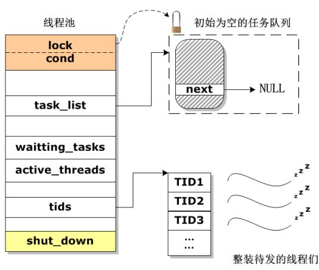

## 1. 工程背景与问题引出

在并发编程中，我们经常需要处理大量的任务，而每个任务可能都需要在一个独立的线程中执行。然而，**线程的创建与销毁**并非没有代价。它们是额外的系统资源开销，包括CPU时间（线程上下文切换）、内存占用以及系统调用等。如果任务量大且每个任务执行时间短，频繁地创建和销毁线程会带来显著的性能瓶颈，导致系统响应缓慢、资源利用率低下，甚至可能引发内存泄漏等问题。
更具体地说：
*   **资源消耗大**：每次创建新线程都需要分配堆栈、PC寄存器等资源，销毁时则需要回收，这带来了不可忽视的开销。
*   **响应速度慢**：如果任务提交后需要等待线程创建才能执行，会增加任务的响应时间。
*   **稳定性差**：无限制地创建线程可能耗尽系统资源，导致系统崩溃。
*   **管理复杂**：手动管理大量线程的生命周期、同步和通信是一项复杂且容易出错的工作。
为了解决这些问题，同时在满足高性能需求（高并发、低延迟）的同时降低系统负载，**线程池**应运而生。
线程池的核心思想是一种“**池化技术**”的应用：预先创建并维护一定数量的线程，这些线程处于待命状态。当有任务提交时，线程池会直接从池中取出空闲线程来执行任务，而不是临时创建新线程。任务执行完毕后，线程并不会被销毁，而是返回到池中继续等待新的任务。这种机制大大减少了线程创建和销毁的开销，实现了线程的复用。
线程池不仅仅是简单的线程复用，它还具备以下管理特性：
*   **动态调整**：线程池中的线程数量可以根据实际负载和并发需求进行动态地增减。例如，在高峰期可以增加活跃线程数量以提高处理能力，在低谷期则可以减少线程数量以节省资源。
*   **统一管理**：提供统一的任务提交接口和线程管理机制，简化了并发编程的复杂性。
*   **资源控制**：可以有效控制系统中并发线程的数量，避免因线程过多导致的资源耗尽。
*   **监控与调优**：通常提供监控接口，可以查看线程池中初始化线程数、增删线程数、检测未完成任务的数量、检测正在执行的线程数量、销毁线程池等基本操作的状态，以便进行性能调优。

## 2. 逻辑框架与核心组件

线程池的逻辑框架主要围绕“如何组织线程”和“如何组织任务”这两个核心问题展开。下图展示了一个典型的线程池逻辑结构：

**核心组件及其作用：**
1.  **互斥锁 (Mutex Lock)**：
    *   **作用**：保护线程池内部共享资源（特别是任务链表 `task_list`）的访问。当多个线程同时尝试访问或修改任务链表时，互斥锁确保一次只有一个线程能够进行操作，从而避免数据竞争和不一致性。
    *   **重要性**：它是保证线程安全的基础。
2.  **条件变量 (Condition Variable)**：
    *   **作用**：用于线程间的同步与通信。它允许线程在满足特定条件（例如任务队列为空）时进入休眠状态，并在条件满足（例如有新任务到来）时被唤醒。
    *   **与互斥锁配合**：条件变量总是与互斥锁一起使用。当线程等待条件时，它会释放持有的互斥锁并进入等待状态；当条件满足并唤醒线程时，线程会重新获取互斥锁。这确保了在检查条件和修改共享状态时的原子性。
3.  **任务链表 (task_list)**：
    *   **作用**：一个链表结构，用于存储待执行的任务。新提交的任务会被添加到链表的末尾，空闲线程则从链表的头部取出任务。
    *   **实现**：通常是一个FIFO（先进先出）队列，以确保任务的公平调度。
4.  **`waiting_tasks` (等待中的任务数)**：
    *   **作用**：记录当前任务队列中等待被线程处理的任务数量。这可以用于监控和负载判断。
5.  **`active_threads` (活跃的线程数)**：
    *   **作用**：记录当前正在执行任务的线程数量。这可以帮助管理员了解线程池的当前工作状态。
6.  **`tids` (线程ID数组)**：
    *   **作用**：存储线程池中所有工作线程的ID。这方便对线程进行管理和控制（例如，在关闭线程池时逐一通知或等待线程结束）。
7.  **`shut_down` (关闭标志位)**：
    *   **作用**：一个布尔类型的标志，指示线程池是否正在关闭。当此标志为真时，线程池将不再接受新任务，并会开始优雅地关闭所有工作线程。
## 3. 线程组织与生命周期

线程池中的线程被创建后，并不会立即执行任务，它们会进入一种“待命”状态。具体来说，当线程池初始化时，所有工作线程被创建出来后，它们都处于**睡眠态**，等待条件变量的通知。所有的待处理任务都被放入一个由互斥锁保护的**任务链表**中。

以下是线程池中一个工作线程的典型生命周期：

1.  **被创建 (Created)**：
    *   当线程池启动时，会根据配置（如核心线程数）创建一批工作线程。这些线程在被创建后会立即尝试进入工作循环。

2.  **准备退出函数 (Prepare Exit Function)**：
    *   **目的**：为了防止线程在持有互斥锁的情况下异常退出（如因取消、信号等），导致互斥锁无法释放，从而引发死锁。
    *   **机制**：在线程进入主循环并可能获取锁之前，通常会设置一个清理函数（或退出处理函数）。这个函数会在线程退出时被调用，负责释放可能持有的资源（如互斥锁）。
    *   **具体操作**：将互斥锁的释放函数压入线程的清理栈中。

3.  **试图持有互斥锁 (Try to Acquire Mutex Lock)**：
    *   线程进入工作循环后，第一步通常是尝试获取用于保护任务队列的互斥锁。这是为了安全地检查任务队列或修改其状态。

4.  **判断是否有任务 (Check for Tasks)**：
    *   在成功获取互斥锁后，线程会检查任务链表 `task_list` 中是否有待执行的任务。
    *   **情况a：无任务**：如果任务链表为空（即 `waiting_tasks` 为0），表示当前没有任务可供执行。此时，线程会调用条件变量的 `wait()` 函数，进入等待队列并释放它当前持有的互斥锁，从而进入休眠状态。它会一直等待，直到有新任务到来并被其他线程（或任务生产者）通过条件变量唤醒。
    *   **情况b：有任务**：如果任务链表不为空，表示有任务可供执行，线程将继续执行第5步。

5.  **从任务链表中取得一个任务 (Get a Task from Task List)**：
    *   线程从任务链表的头部取出一个任务（通常会从链表中删除该节点），准备执行。

6.  **释放互斥锁 (Release Mutex Lock)**：
    *   在取出任务后，线程会立即释放互斥锁。这样做的目的是允许其他工作线程或任务生产者能够访问任务链表，提高并发性，避免长时间持有锁影响其他操作。

7.  **销毁退出函数 (Destroy Exit Function)**：
    *   执行完任务获取操作后，线程不再需要确保在持有锁时安全退出，因此会销毁（弹出）之前设置的退出函数。这可以避免不必要的内存开销。

8.  **执行任务 (Execute Task)**：
    *   线程独立地执行它从任务链表中获取到的任务。这个过程是与任务队列的操作解耦的，可以充分利用CPU资源。

9.  **完毕之后重回第2步 (Return to Step 2 After Completion)**：
    *   任务执行完毕后，线程并不会终止。它会再次回到其工作循环的开始（即回到第2步或第3步），再次尝试获取互斥锁，检查任务队列是否有新任务。这个循环机制是线程复用的核心体现。

通过这种精巧的设计，线程池有效地平衡了资源开销和任务处理效率，使得并发编程更加高效、稳定和易于管理。

---
