> [!abstract] 引言
> 电路设计从理论图纸到物理实物的实现，始终是电子工程的核心挑战。本文将系统梳理电路连接技术的演进历程，剖析各阶段技术原理、应用场景与局限性，揭示**标准化**与**自动化**如何驱动电子制造业的革命。

## 一、从电路图到物理实物的工程挑战

在掌握电路图基本原理后，工程师面临的首要问题是如何将**二维图纸转化为可靠工作的三维实体**。这一过程远非简单连线，它涉及**元件选型**、**连接可靠性**、**机械强度**、**热管理**及**生产可行性**等多重工程考量。

以图 1 所示的简单 LED 驱动电路为例，其原理图明确了电源、限流电阻与 LED 的电气关系，为实物构建提供理论依据。然而实物构建时，需综合考虑：
- **导线的电流承载能力**与**接触电阻导致的压降**
- **连接点的机械稳定性**与长期可靠性  
- **散热路径设计**及温度对元件性能的影响
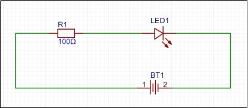

> [!note] 元件选型要点
> 实际构建时，**电阻需根据 LED 正向电压与驱动电流计算阻值与功率规格**，**导线截面积需满足电流密度要求**，**连接器的接触电阻必须控制在电路允许范围内**。

元件采购后（如图 2 所示的各种电子元件与导线材料），**物理连接成为下一个关键步骤**。早期实验者常面临导线与元件引脚如何可靠固定的问题——简单的缠绕无法保证长期电气接触，机械振动或温度变化易导致连接失效。图 3 展示了这种裸露连接方式的局限性，暴露出**接触可靠性与机械强度**的核心问题。

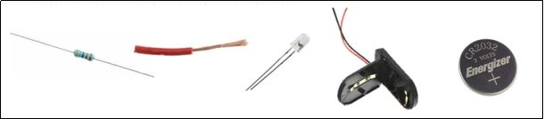

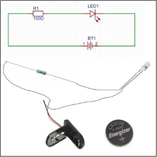

这一基本矛盾推动了电路连接技术的第一次革新。

## 二、早期电路连接技术：螺丝螺母的机械时代

### 2.1 技术原理与应用场景

**1920 年代收音机**等早期电子设备普遍采用**铜片端子配合螺丝螺母的机械连接方式**（如图 4 所示）。其技术核心是通过**螺栓的轴向压力**使端子与导线产生**金属-金属接触**，依赖**接触面的清洁度**与**压力维持电气通路**。

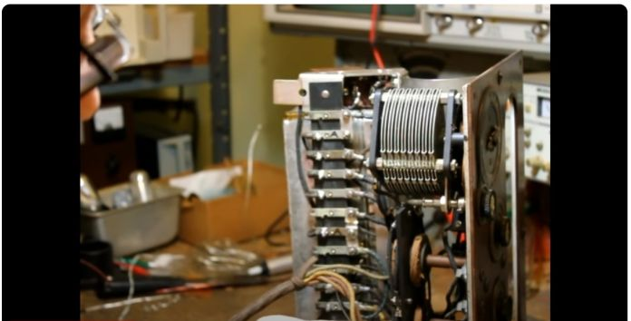

实现这种连接需先在导线末端**压接专用端子**，形成机械强度足够的连接界面。**端子通常采用黄铜或磷青铜材料**，兼具良好导电性与弹性，确保在螺丝紧固压力下不发生塑性变形。图 5 展示了连接端子的实物设计，必须同时满足**电气接触与机械固定的双重需求**；图 6 则显示了**端子压接过程**，专用工具确保导线与端子形成可靠的**机械互锁与电气接触**。

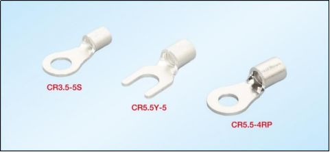

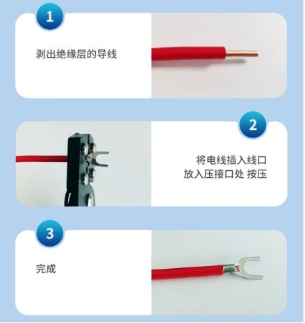

完成准备的导线即可通过**螺丝螺母固定在设备的接线柱上**，形成稳定的电气连接（如图 7 所示）。这种**通过机械压力建立电气通路的方法**简单直观，至今仍在家用电源开关、配电箱等大电流场合使用，但存在固有局限性。

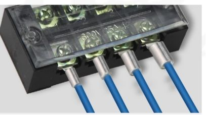

### 2.2 技术局限性分析

尽管螺丝螺母连接提供了基本的电气通路，但其**工程局限性**在电子设备发展中逐渐凸显：

1. **电气可靠性不足**：**接触电阻**受**表面氧化**、**压力均匀性**、**温度变化**等因素影响显著。振动环境下螺丝可能松动，导致接触电阻增大甚至开路。实验数据表明，未经特殊处理的铜接触面在温循环试验中接触电阻可能增加**200%以上**。

2. **机械尺寸限制**：**端子**、**螺丝**及**操作空间需求**使设备体积难以缩小。早期收音机庞大的机箱部分原因正是连接技术对空间的占用，这与**电子设备小型化趋势**背道而驰。

3. **生产自动化障碍**：**螺丝紧固需要人工操作**或复杂机械手，难以实现**高速自动化生产**。每台设备的连接质量依赖操作者技能，**产品一致性与可靠性**难以保证。

> [!warning] 热循环与振动敏感性
> 金属的**热膨胀系数差异**会使螺丝连接在温度变化时产生**应力松弛**，振动环境则可能引起**微动磨损**，两者都是螺丝连接失效的主要机理。

这些局限性催生了下一阶段的技术突破：锡焊技术的引入。

## 三、锡焊技术与点对点构造的革命

### 3.1 锡焊技术的冶金学原理

**锡焊**是通过**熔融焊料**在母材表面**润湿**、**铺展**、**冷却**后形成**冶金结合**的过程。焊料通常为**锡铅共晶合金（Sn 63/Pb 37）**，熔点 183°C，在熔化后能在铜等金属表面形成**金属间化合物（如 Cu₆Sn₅）**，实现**原子级别的结合**。图 8 展示了锡焊过程的示意图，熔融焊料在金属表面润湿铺展，冷却后形成金属间化合物层，实现**电气与机械双重连接**。

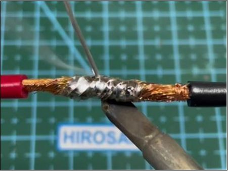

**焊点的可靠性**取决于多个关键因素：
- **焊料成分**决定熔点与机械性能
- **助焊剂**去除氧化层促进润湿
- **加热温度与时间**影响金属间化合物厚度——过薄则结合强度不足，过厚则脆性增加

> [!tip] 现代无铅焊料
> 随着**RoHS 指令**实施，**锡银铜（SAC）等无铅合金**逐步替代锡铅焊料。**SAC 305（96.5%Sn/3%Ag/0.5%Cu）** 熔点 217-220°C，需**更高的工艺温度**与**更严格的过程控制**。

### 3.2 点对点构造的兴起与局限

锡焊的普及催生了"**点对点构造**"（Point-to-point construction）的电子设备制造模式。**元件引脚或导线直接焊接在一起**，形成**三维的电路网络**。图 9 展示了 1948 年摩托罗拉 VT-71 电视机底盘的点对点布线，这种"**空中接线**"方式灵活但缺乏标准化，每个产品都是**独一无二的手工艺品**。

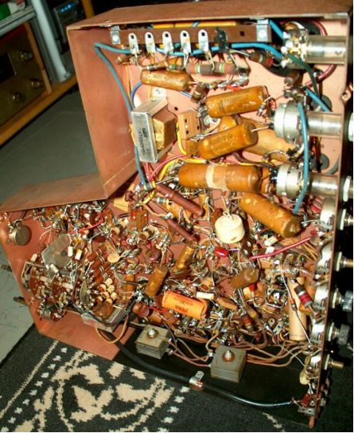

点对点构造解决了**螺丝连接的可靠性问题**——**焊点的冶金结合**具有**稳定的低接触电阻**（通常**<1 mΩ**）和良好的机械强度。然而，新的问题随之产生：

1. **可维护性差**：**复杂的立体布线**使故障定位与元件更换异常困难，维修往往需要**完全拆解**。
2. **一致性缺失**：每个技工的**布线习惯不同**，导致**产品性能差异**，无法实现**标准化生产**。
3. **生产效率低下**：**全手工操作**限制了产能，且对**工人技能依赖度高**。

图 10 直观展示了这种"**鸟巢**"式布线的混乱场景，成为**维修工程师的噩梦**与**质量控制的难点**。

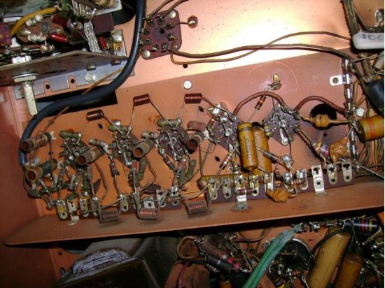

### 3.3 向标准化迈进：电木板的引入

为改善可维护性，工程师引入了**电木板（Bakelite）**作为元件安装基板。所有元件按规定位置安装到板上，虽然导线连接仍较随意，但**元件布局已实现初步标准化**。图 11 展示了电木板上的元件布局，元件位置固定大大提升了可维护性，为后续电路板技术奠定了基础。

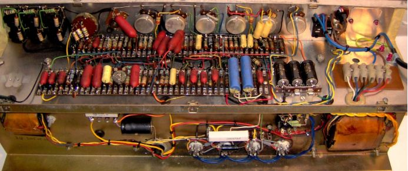

这一改进体现了工程思维的重要转变：从追求**单一连接可靠性**，转向**系统级的可制造性**、**可维护性**与**标准化设计**。电木板不仅提供了机械支撑，更成为电路布局的**二维平面约束**，自然导向了下一突破。

### 3.4 电路板雏形：导线的平面化

随着技术发展，工程师意识到不仅元件可以固定在板上，连接导线也能以**铜箔形式制作在板表面**。由此产生了早期电路板——在绝缘基材上粘附铜箔，通过**蚀刻形成导线图案**。图 12 展示了点对点与电路板的混合结构，左侧仍为点对点布线，右侧已采用蚀刻铜箔导线，电路整洁度显著提升。

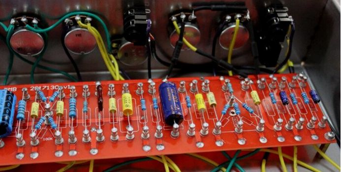

这种"**印制导线**"技术实现了三大进步：

1. **几何精度**：蚀刻工艺可实现**毫米级线宽**，布线密度大幅提升。
2. **一致性保证**：**照相制版**确保每块板完全相同，实现真正标准化。
3. **自动化可能**：蚀刻、钻孔等工序可批量进行，为**自动化生产铺平道路**。

> [!important] 从三维到二维的转变
> 电路连接从**三维空间布线**到**二维平面布局**的转变，是电子制造史上的关键转折。它不仅解决了维护与标准化问题，更开启了**高密度互连**与**自动化生产**的新时代。

## 四、印刷电路板（PCB）的标准化时代

### 4.1 PCB 的技术定义与制造工艺

现代**印刷电路板（Printed Circuit Board, PCB）**是在绝缘基材上按预定设计形成点间连接及印制元件的电子部件。其制造融合了**材料科学**、**精密加工**与**化学工艺**，主要流程包括：

1. **基材选择**：**FR-4 玻璃纤维环氧树脂**是最常用基板，高频应用则选用**PTFE**或**陶瓷基材**。
2. **图形转移**：通过**光刻**或**丝网印刷**将电路图案转移到铜箔上。
3. **蚀刻成型**：**化学蚀刻**去除多余铜箔，保留电路导线。
4. **钻孔与金属化**：**机械钻孔**后通过**化学镀铜**实现层间互连。
5. **阻焊与丝印**：**阻焊层**防止焊接短路，**丝印层**标注元件位置。

图 13 展示了现代多层印刷电路板的复杂结构，其**集成度高**、**布线规整**，适合**自动化生产**，是当代电子设备的基石。

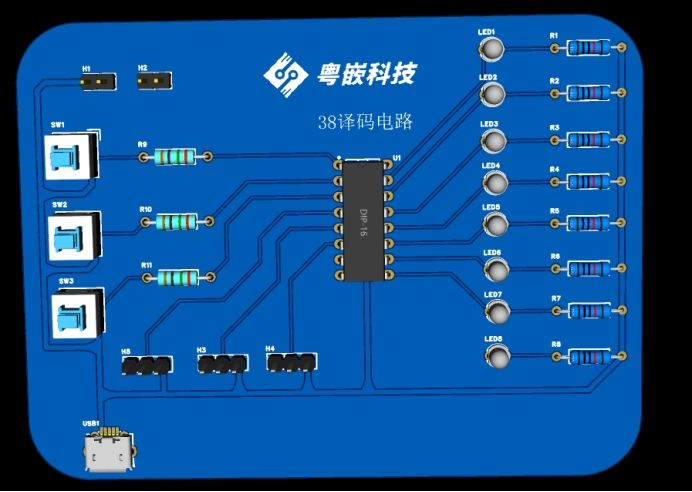

### 4.2 PCB 的技术优势与演进方向

PCB 的普及彻底改变了电子制造业，其核心优势体现在多个维度：

**标准化与自动化优势**：
- **CAD 软件设计**实现电路布局数字化
- **自动化光绘**与**数控钻孔**保证加工精度  
- **贴片机焊接**实现元件高速精准安装
- 整个生产链高度自动化，大幅降低人工成本，提升**产品一致性**

**高密度互连能力**：
- 从**单面板**到**双面板**、**多层板**（现代主板可达 16 层以上）
- **HDI（高密度互连）**技术进一步提升布线密度
- **微孔**、**盲孔**、**埋孔**技术释放布局空间

**电气性能优化**：
- **可控阻抗布线**满足高速信号要求
- **差分对设计**提升信号完整性
- **地平面**与**电源平面**降低噪声干扰
- **电源完整性**设计保证稳定供电

**可靠性提升**：
- 标准化的**焊盘设计**与**阻焊保护**
- **板级测试点**便于生产测试
- 电路可靠性从"**工艺依赖**"转向"**设计保证**"
- **加速寿命试验（ALT）**可量化预测产品寿命

> [!future] 未来发展趋势
> - **柔性 PCB**：聚酰亚胺基材可实现**弯曲折叠**，适合可穿戴设备
> - **嵌入式元件**：电阻、电容**埋入板内**，进一步提升集成密度
> - **3 D 打印电路**：**增材制造**技术可能颠覆传统减材工艺
> - **系统级封装**：将多个芯片与无源元件集成于单一封装，模糊 PCB 与 IC 的界限

## 五、总结：技术演进的内在逻辑

电路连接技术从**螺丝螺母**到**现代 PCB**的演进，体现了电子工程领域的几个核心发展规律：

1. **从机械连接到冶金连接**：**接触电阻稳定性**提升两个数量级，连接可靠性从"**压力维持**"变为"**材料本性**"。
2. **从三维布线到二维布局**：**可制造性**、**可测试性**、**可维护性**得到系统性改善。
3. **从手工技艺到自动化生产**：**标准化推动规模化**，成本下降使电子设备从**奢侈品**变为**日用品**。
4. **从单一功能到系统集成**：连接技术不再只是"**连通电路**"，而是承载**信号完整性**、**电源完整性**、**热管理**等多重功能。

每一次技术跃迁都源于**旧技术无法解决的新矛盾**：
- **螺丝螺母**无法满足可靠性要求催生**锡焊**
- **点对点布线**无法实现标准化催生**电路板**  
- **单层板**无法满足密度需求催生**多层板**

这一过程仍在继续，当前面临的**芯片互连瓶颈**、**高频损耗挑战**、**散热极限**等问题，正在推动**先进封装**、**硅基板**、**光互连**等新一代技术发展。

> [!quote] 工程哲学的启示
> 电路连接技术的发展史，本质上是一部解决"**可靠性与复杂性矛盾**"的历史。当连接点数量超过某个阈值（如早期计算机的数千个焊点），**局部优化的手工方法**必然让位于**系统设计的自动化方案**——这一规律超越电子工程，适用于所有复杂系统构建。
