# PCB制作工艺概览：从设计到成品的精密制造

> [!abstract] 引言
> 印刷电路板（PCB）是现代电子设备的**物理载体**与**电气互连平台**，其制造融合了**材料科学**、**精密加工**与**电子设计**技术。本文概览PCB的核心结构、关键制造流程及多层板技术，呈现从二维图纸到三维实体的工程转化逻辑。

## 一、PCB结构与材料基础

### 1.1 PCB的层级结构与功能

以**双层板**为代表，现代PCB是一个**多层复合结构体**。图1展示了PCB的**层级分解**，揭示了从**介电层**到**表面处理**的完整组成。

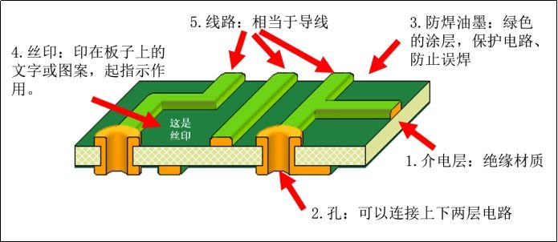

PCB的核心组成包括：
- **介电层**提供电气绝缘与机械支撑，常用**FR-4玻璃纤维环氧树脂**；
- **铜箔层**经蚀刻形成导电线路，厚度通常为1/2 oz至2 oz；
- **导通孔**实现层间电气互连，类型包括通孔、盲孔、埋孔；**防焊油墨**隔离非焊接区域，防止焊锡桥接；
- **丝印层**标注元件信息，辅助装配与维修。

> [!note] FR-4材料特性
> **FR-4**是玻璃纤维增强环氧树脂层压板，其**玻璃化转变温度**（Tg）在130-180°C范围，**热膨胀系数**在X/Y方向为12-16 ppm/°C。选择合适的Tg等级对**回流焊工艺**和**长期可靠性**至关重要。

### 1.2 覆铜板：制造起点

PCB制造始于**覆铜板**（CCL），即铜箔通过热压工艺粘合到绝缘基材上的复合材料。如图2所示，这是PCB制造的**原料基础**。

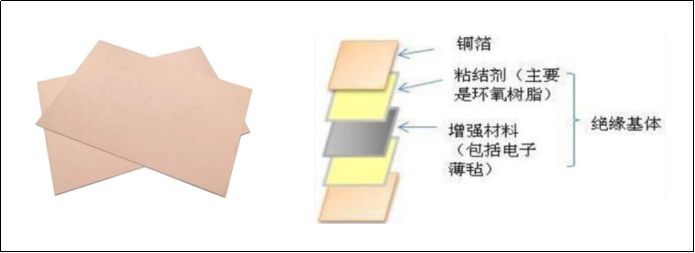

覆铜板制造涉及**基材制备**（玻璃纤维编织与树脂浸渍）、**铜箔处理**（表面粗化与钝化）、**层压成型**（热压固化）等关键环节。其性能指标包括**剥离强度**、**耐浸焊性**、**电气性能**与**机械稳定性**。

> [!important] 材料选择与信号完整性
> 对于**高速数字电路**和**射频应用**，材料选择直接影响**信号完整性**。**低损耗材料**（如Rogers RO4003C）可减少信号衰减，稳定介电常数确保阻抗控制精度。

## 二、PCB制造流程概览

### 2.1 PCB设计：从概念到图纸

在物理制造前，工程师使用**EDA软件**完成电路板的**电气设计**与**物理布局**。图3展示了现代EDA工具提供的完整设计环境。

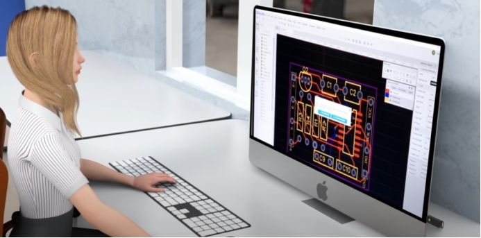

PCB设计包括**原理图设计**（定义电气连接）、**PCB布局**（元件摆放与电源规划）、**布线设计**（线宽规则与阻抗控制）等关键阶段。最终输出**Gerber文件**、**钻孔文件**等制造数据，作为后续加工的“施工图”。

> [!tip] 设计规则与制造能力匹配
> **设计规则**必须与**PCB制造商的能力**匹配，包括最小线宽/线距、最小孔径等参数。提前沟通可避免生产问题与成本超支。

### 2.2 钻孔：导通孔加工

根据设计文件，在覆铜板上**加工导通孔**。图4展示了数控钻孔机的高精度加工过程。

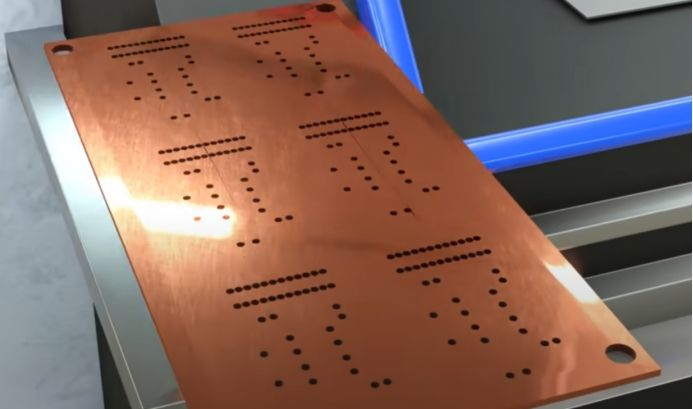

钻孔工艺采用**硬质合金钻头**，通过控制**主轴转速**与**进给速率**优化孔壁质量。对于**微孔**（<0.15mm）、**盲孔**等特殊需求，采用**激光钻孔技术**（CO₂或UV激光）。钻孔质量直接影响后续**孔金属化**的成功率与**电气可靠性**。

### 2.3 曝光与显影：图形转移

**曝光工艺**将设计图形从菲林底片转移到覆铜板感光层。如图5所示，通过**紫外线曝光**在铜箔上形成电路图形的潜影。

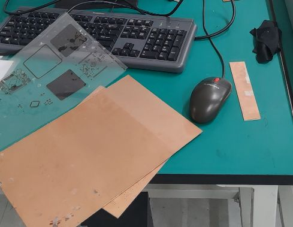

工艺包括**表面处理**（清洁与微蚀）、**涂布感光膜**（干膜或液态感光油墨）、**曝光成像**（CCD视觉对位）、**显影**（选择性去除未曝光区域）。显影后，曝光区域的感光膜作为**蚀刻阻挡层**保留，精确定义电路图形。

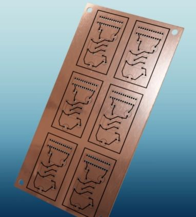

### 2.4 蚀刻：选择性铜去除

**蚀刻**是PCB制造的**核心工艺**，通过**化学方法**选择性去除未受保护的铜箔，形成导电线路。图6展示了蚀刻后仅保留感光膜下方铜线路的结果。

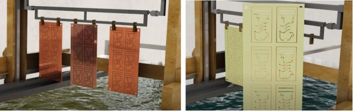

主流采用**碱性氯化铜蚀刻液**，通过控制**温度**、**喷淋压力**与**蚀刻速率**实现精确图形转移。**蚀刻因子**（蚀刻深度与侧蚀宽度的比值）是衡量工艺质量的关键指标，通常要求≥3.0以确保线路截面接近矩形。蚀刻后需进行**退膜**与**表面处理**，为后续工艺做准备。

### 2.5 阻焊：环境防护与绝缘

**阻焊层**是覆盖在PCB表面的**永久性绝缘涂层**，其核心功能是**防止焊锡桥接**、**提供环境防护**。如图7所示，阻焊层覆盖非焊接区域，仅暴露焊盘位置。

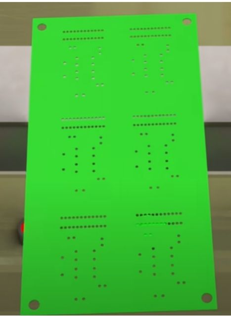

阻焊工艺包括**表面预处理**（机械刷磨与化学清洗）、**油墨涂布**（丝网印刷或帘涂）、**曝光显影**（形成焊盘窗口）、**最终固化**（热固化或UV固化）。阻焊颜色（绿、黑、蓝、红等）由颜料决定，**不影响电气性能**。

### 2.6 焊盘开窗与表面处理

**焊盘开窗**是阻焊工艺的关键步骤，即在焊接位置去除阻焊层，暴露铜焊盘。如图8所示，精确的**焊盘窗口**确保可靠焊接与电气连接。

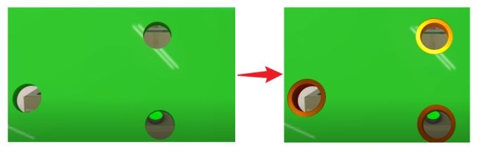

窗口尺寸通常比焊盘**大2-4 mil**，相邻焊盘间需保留**阻焊桥**（≥4 mil）防止桥接。焊盘表面需进行**防氧化处理**，常见方案有**有机保焊剂（OSP）**（成本低但耐热性有限）、**化学镀镍浸金（ENIG）**（可焊性好适合金线绑定）、**化学镀锡**（成本适中但存在锡须风险）、**沉银**（高频性能好需防硫处理）。

图9展示了**镀锡处理**的焊盘效果，银白色表面提供良好抗氧化性与可焊性。

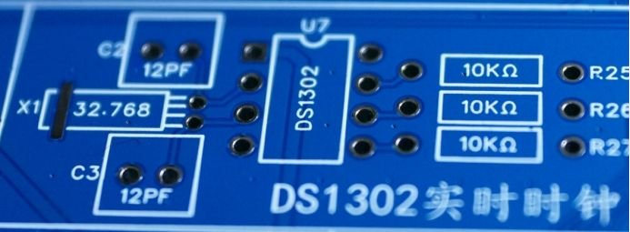

### 2.7 丝印：信息标识

**丝印层**为元件装配、维修调试、产品识别提供关键信息。如图10所示，白色丝印清晰标示元件位号、极性标识与测试点。

丝印采用**环氧树脂油墨**，通过**丝网印刷**或**直接成像**工艺实现。设计规范要求字符高度最小1.0mm（批量生产），与焊盘间距≥0.2mm防止焊接污染。固化后需保证**清晰度**、**附着力**与**耐溶剂性**。

### 2.8 特殊表面处理：金手指

对于**高频接触**、**频繁插拔**的接口（如内存条、显卡），需要**特殊表面处理**确保长期可靠性。如图11所示，**金手指**采用**镀金处理**，提供优异导电性与耐磨性。

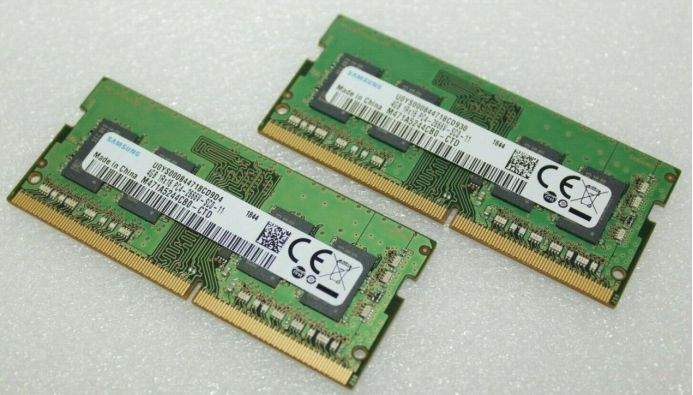

金手指采用**多层镀层结构**：底层**化学镍**作为扩散屏障，中间层**电镀镍**提供机械强度，表层**电镀硬金**（钴金合金）确保耐磨性。设计要点包括**斜边处理**（便于插拔导向）、**长度分段**（电源引脚更长）、**防呆设计**（防止误插）。

## 三、多层PCB与先进技术

### 3.1 多层板结构与制造

随着电子设备**功能集成度**提升，**多层PCB**成为复杂电路的必然选择。图12展示了**四层板**的典型结构，可理解为两个双层板通过**半固化片**层压而成。

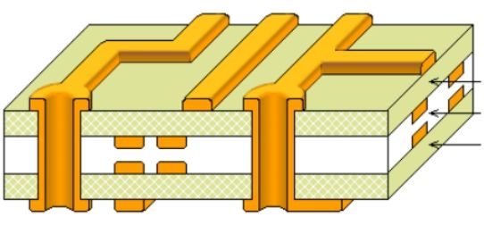

多层板采用**对称层叠设计**减少翘曲变形，通过**介电层厚度**与**线宽**控制**特性阻抗**。典型配置如4层板：**Top→GND→PWR→Bottom**。层压工艺需精确控制**温度**（180-200°C）、**压力**（15-30 kg/cm²）与**冷却速率**，防止内应力累积。

### 3.2 导通孔技术演进

**导通孔**是多层PCB电气互连的核心。随着层数增加，**孔的类型**与**制造工艺**更加复杂。图13展示了**通孔**、**盲孔**与**埋孔**的结构差异与应用场景。

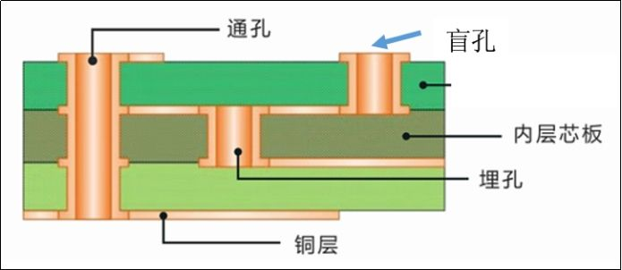

导通孔分为**通孔**（贯穿板厚，工艺简单但占用面积大）、**盲孔**（连接外层与内层，节省面积）、**埋孔**（完全在内层之间，实现最大密度提升）和**微孔**（孔径≤0.15mm，采用激光钻孔，是HDI技术核心）。

**孔径比**（板厚/孔径）是关键参数，通常≤10:1（机械孔），**激光钻孔**可实现更高比例。

### 3.3 高密度互连（HDI）技术

**HDI技术**应对电子产品**小型化**与**功能集成化**需求，通过**微孔**、**精细线路**、**薄型材料**实现超高布线密度。

核心特征包括：**激光钻孔**加工微孔（CO₂激光钻介质层，UV激光钻铜层）；**精细线路技术**实现30/30μm线宽/线距量产能力；**薄型化技术**使用≤100μm超薄芯板与≤50μm介质层。HDI制造采用**顺序层压法**，多次重复内层制作、层压、钻孔、图形转移步骤。

应用领域涵盖**智能手机**（主板厚度≤0.6mm）、**可穿戴设备**（柔性HDI）、**汽车电子**（高可靠性车规级）、**医疗设备**（微型化植入设备）。

### 3.4 先进封装与系统集成

随着**摩尔定律**逼近物理极限，**先进封装**与**系统级集成**成为延续电子性能提升的关键路径。

**嵌入式元件技术**将电阻、电容埋入PCB内部，节省表面空间，改善信号与电源完整性。**系统级封装（SiP）**将多个裸芯片与无源元件集成于单一封装，采用**引线键合**、**倒装芯片**、**硅通孔（TSV）**等互连技术。**扇出型封装**实现芯片间距小于焊球间距，达成高I/O密度与薄型化。

## 四、技术演进与未来展望

PCB制造技术的发展围绕**功能集成**、**性能提升**、**成本控制**三大核心矛盾展开，经历了从**二维到三维**、**宏观到微观**、**分立到集成**、**手工到智能**的演进路径。

**未来发展趋势**涵盖**更高密度**（线宽/线距向10/10μm迈进）、**更高频率**（太赫兹应用推动低损耗材料发展）、**异质集成**（硅、玻璃、有机物的三维集成）、**智能化制造**（工业4.0与人工智能优化工艺）以及**可持续发展**（可回收材料与绿色工艺）。

PCB制造技术持续演进，在**精度控制**、**集成密度**与**生产效率**间寻求最优平衡。

---

*本文基于PCB制造行业标准与技术实践整理，概览PCB制造的技术体系与工程逻辑。所有图片均来自公开技术资料，仅作教学说明用途。*

*修订记录：2025年1月30日 - 概览重构版*