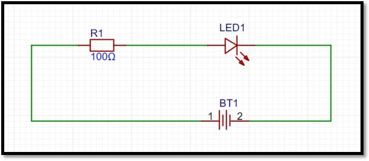
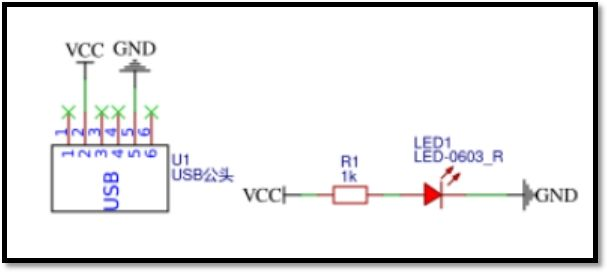
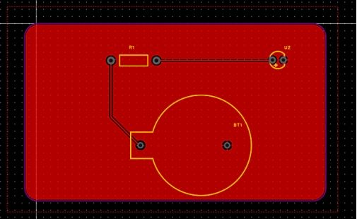
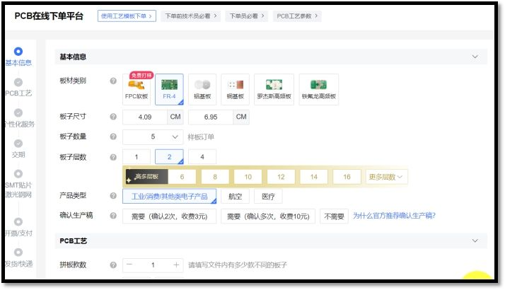
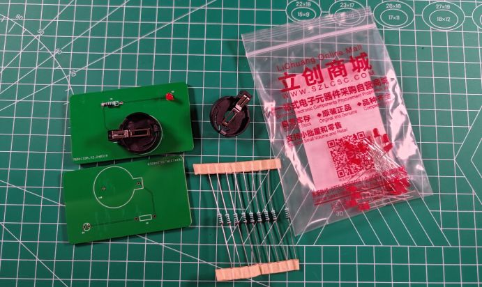
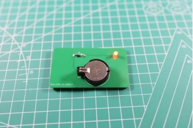
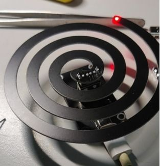

在嵌入式硬件开发领域，单块电路板的成功设计远非终点。我们的PCB设计最终目标是为一个完整产品提供硬件电路板支撑，这就要求开发者必须跳出单纯的“画板”思维，去理解一个电子产品从无到有的全流程。这不仅有助于在课程设计中做出更贴近工程实践的决策，也是每一位嵌入式工程师职业发展的基石。

## 常见的EDA电子设计自动化软件

### 概述：EDA是什么？

EDA（Electronic Design Automation），即电子设计自动化软件，是现代电子系统设计的核心工具集。它涵盖了从电路设计、仿真分析、物理布局、布线优化、设计验证到制造准备的全部环节，**极大地提升了复杂集成电路（IC）和印刷电路板（PCB）的开发效率与可靠性**。无论是消费电子产品中的微小芯片，还是工业控制设备中的多层主板，其诞生都离不开EDA软件的支撑。

### 主流EDA软件分类与选型指南

面对市场上众多的EDA工具，如何选择一款适合自己项目阶段、技术背景和预算的软件，是第一个关键决策。以下对四类主流软件进行横向对比分析。

> [!info] 授权费用说明
> 下文提到的“年授权费”均指企业商业授权的大致费用。对于学生、教育工作者或个人开发者，多数厂商提供免费或极低成本的学术版/社区版。

#### 1. Cadence Allegro / ORCAD
**定位**：高端芯片与高密度多层板设计。
*   **特点**：由Cadence公司出品，以处理高速、高密度、复杂布线规则（如DDR、PCIe）见长，是集成电路和高端通信设备设计的行业标准之一。
*   **学习曲线**：陡峭。界面与操作逻辑为专业芯片设计优化，**全英文环境**，初学者上手难度大。
*   **成本**：商业授权费用高昂，年费通常在30万元人民币左右，一般仅大型芯片设计公司或顶尖硬件团队使用。

#### 2. Mentor Graphics PADS (现为Siemens EDA)
**定位**：专业级PCB设计，兼顾芯片与板级设计。
*   **特点**：以**易学易用、稳定性高、布线效率高**著称，在消费电子、工业控制、医疗电子等领域有广泛应用。它提供了一个从原理图到生产文件的完整、高效的解决方案。
*   **学习曲线**：中等。比Cadence系列更友好，但专业功能丰富。
*   **成本**：商业授权年费约10万元人民币，是许多中小型专业硬件公司的选择。

#### 3. Altium Designer (AD)
**定位**：企业级复杂产品硬件开发的主流选择。
*   **特点**：功能全面，在高速数字电路、射频电路、刚柔结合板设计方面表现出色。集成了3D PCB视图、SI/PI（信号完整性/电源完整性）仿真等高级功能。其**中文界面支持和丰富的本土化教程**，降低了学习门槛。
*   **成本**：企业年授权费约5万元，性价比较高，是国内许多专门设计硬件的公司或部门的首选。

值得注意的是，AD是早期**Protel**软件的现代化继承者。二者核心关系与差异对比如下：

| 维度 | Protel (以 99SE 为代表) | Altium Designer (AD) |
| :--- | :--- | :--- |
| **历史定位** | 1998-2002年主流，已停止更新 | 2004年起接替Protel，持续升级至今 |
| **界面体验** | 经典灰底、菜单层级深，为低分辨率优化 | 现代化扁平/深色主题，支持中文，高DPI适配 |
| **文件格式** | `.ddb`（数据库包） | `.PrjPCB`/`.IntLib`/`.SchDoc`/`.PcbDoc`，向下兼容99SE文件 |
| **功能深度** | 以2~4层板为主，基本布线功能 | 支持20+层板、高速差分、HDI、刚柔结合、3D STEP集成、SI/PI仿真 |
| **库管理** | 独立`.lib`文件，需手动维护 | 集成化“Vault/Concord”云库，支持版本追溯与团队共享 |
| **团队协作** | 无版本控制，依赖人工备份 | 内嵌Git/SVN支持、差异比较、真正的多人协同设计 |
| **学习门槛** | 较低，旧教程资源多 | 中等偏高，但拥有完善的官方中文培训与高校合作课程 |
| **系统兼容** | 仅稳定运行于WinXP/Win7 32位系统 | 需Win10/11 64位系统，对显卡和内存要求较高 |
| **市场场景** | 教学、怀旧、维护老项目 | **企业新项目、高速板、复杂产品开发的标准工具** |

> [!summary] 总结
> 如今仍在使用Protel 99SE的团队，通常是为了维护历史遗留项目。对于任何新的硬件开发项目，**Altium Designer 是 Protel 的“完全体”升级，应作为首选**。

#### 4. 嘉立创EDA
**定位**：国产、开源、免费的轻量级到中级复杂度设计工具。
*   **特点**：**完全免费**，云端与客户端协同，**符合国内用户操作习惯**，内置庞大的立创商城元件库与封装，支持一键下单打板，极大缩短了从设计到实物的周期。其操作逻辑与前述专业软件相通，设计文件可相互转换。
*   **适用场景**：**学生、独立开发者、初创公司及中小型公司的首选**，特别适合课程设计、开源项目、消费类电子产品原型开发。

## 产品开发全流程详解

掌握工具后，更需要理解如何系统性地运用它们来创造一个产品。一个成熟的电子产品开发流程通常遵循以下阶段，每个阶段都有明确的目标、输出和验证方法。

### 阶段一：需求分析与市场调研
**核心目标**：精准定义“为谁解决什么问题，以及他们愿意为此付出多少成本”。
*   **关键活动**：
    1.  **竞品拆解**：分析市场上同类产品的功能、性能、成本与优缺点。
    2.  **用户访谈与问卷**：直接获取目标用户的使用场景、痛点与期望。
    3.  **技术可行性预研**：评估关键功能（如无线通信、传感器精度）的实现难度与成本。
*   **输出物**：
    *   《市场调研报告》
    *   《产品需求规格书（PRD）》
    *   《初步成本与利润测算模型》

### 阶段二：概念设计与快速原型
**核心目标**：将抽象需求转化为“看得见、摸得着”的实体概念，进行早期验证。
*   **关键活动**：
    1.  **工业设计（ID）**：使用Figma、SolidWorks等工具绘制外观草图或建立3D模型。
    2.  **系统架构设计**：绘制功能框图，明确各模块（如MCU、电源、传感器、通信）的交互关系。
    3.  **关键器件选型**：根据性能、功耗、成本、供货周期筛选核心芯片与元件。
    4.  **制作低保真原型**：使用洞洞板（Lo-fi PCB）、3D打印外壳或现成模块快速搭建可演示核心功能的原型。
*   **输出物**：
    *   外观草图/ID模型
    *   系统功能框图与BOM（物料清单）初稿
    *   可工作的低保真物理原型

### 阶段三：详细设计与工程实现
这是硬件工程师最核心的工作阶段，将概念转化为可批量生产的工程设计。

#### 1. 原理图设计
原理图是电子电路的**逻辑蓝图**，它使用标准化的图形符号清晰地展示所有元器件及其电气连接关系。

> [!example] 原理图实例
> 下图展示了一个简单的纽扣电池点灯电路原理图。它清晰地描绘了电池、电阻、LED的符号及其连接方式，是后续PCB布局的唯一依据。
> 
>
> 对于更复杂的项目，如开源的“赛博蚊香”驱蚊器，其原理图则完整定义了MCU、MOS管、超声波换能器、电源管理等所有电路的连接。
> 

#### 2. PCB布局与布线设计
PCB设计是将原理图的逻辑连接转化为**物理实体**的过程。这不仅是“画线”，更是一个系统工程，包括：
*   **机械结构定义**：确定板框形状、安装孔位置，与外壳完美匹配。
*   **元件布局**：根据电气特性、散热、信号流向等因素优化元件摆放。
*   **电气规则设置**：定义线宽、线距、过孔尺寸，满足电流承载和信号完整性要求。
*   **布线**：在多层板上完成所有电气连接，需考虑高速信号、电源完整性和EMC（电磁兼容性）。

> [!example] PCB设计实例
> 纽扣电池点灯的PCB设计（单面板），布局紧凑，考虑了电池座和LED的物理位置。
> 
>
> “赛博蚊香”的PCB设计，展现了更复杂的双层板布局、铺铜（GND平面）和丝印标识。
> 

#### 3. 打样
在正式量产前，必须进行小批量（通常5-10片）的样品生产，以**验证设计的正确性和可制造性**。打样能暴露出设计文件中难以发现的潜在问题，如孔位偏差、丝印不清、焊接不良等。
目前，以**嘉立创**为代表的国内PCB快速打样服务，已将打样成本和时间压缩到极低，极大促进了硬件创新。

#### 4. 焊接与组装
获得空PCB后，需要将元器件焊接上去。你有两种选择：
*   **SMT贴片服务**：在嘉立创等平台下单时，可付费选择SMT服务，由工厂完成精密元件的贴装焊接，**保证质量与一致性**，适合阻容、芯片等小封裝元件。
*   **手工焊接**：自行采购所有元器件和PCB，进行手工焊接。适合调试阶段、插件元件或小批量原型。

> [!example] 焊接物料
> 纽扣电池点灯项目所需的全部物料：PCB、LED、电阻、电池座。
> 

#### 5. 功能验证与测试
这是开发流程的“终考”。工程师需要对组装好的板卡进行全面的测试：
*   **基本功能测试**：上电、烧录程序、验证各项设计功能是否正常。
*   **性能测试**：测量关键参数（如功耗、信号波形、传感器精度）是否达标。
*   **可靠性测试**：进行高低温、振动、长时间老化等测试，评估产品稳定性。
*   **用户测试**：组织小范围封闭测试，收集真实使用反馈。

> [!success] 成品展示
> 通过所有测试后，我们便得到了最终可用的产品。简单的纽扣电池点灯成品，或功能完整的“赛博蚊香”驱蚊器，都标志着一次完整开发流程的成功闭环。
> 
> 

## 结语
电子产品开发是一个**环环相扣、迭代演进**的系统工程。从EDA软件的熟练使用，到严格遵循需求分析、设计、实现、验证的完整流程，每一步都决定了最终产品的质量与市场竞争力。希望本文梳理的框架，能帮助你在接下来的PCB课程设计乃至未来的硬件开发生涯中，建立系统化思维，高效、专业地交付每一个可靠的硬件产品。