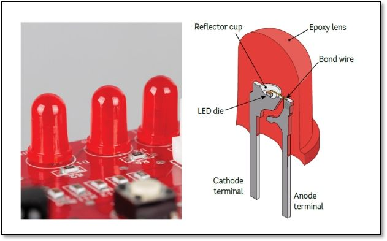
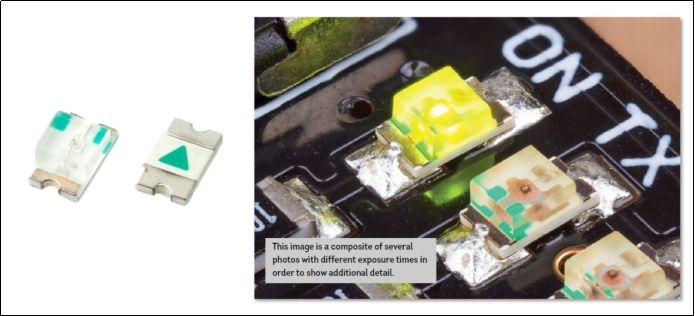
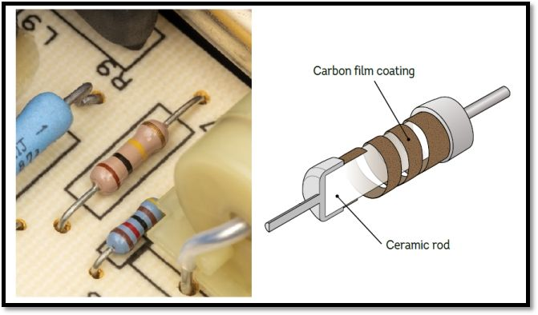
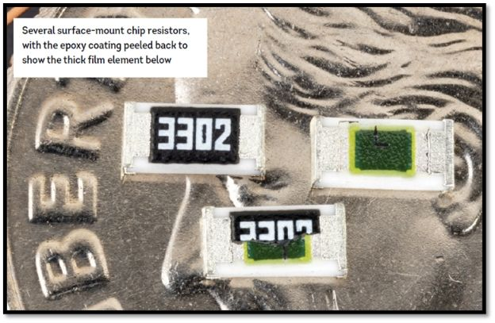
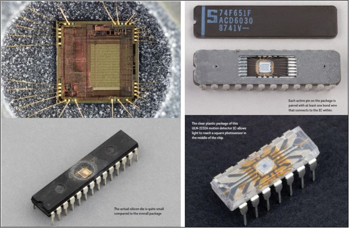
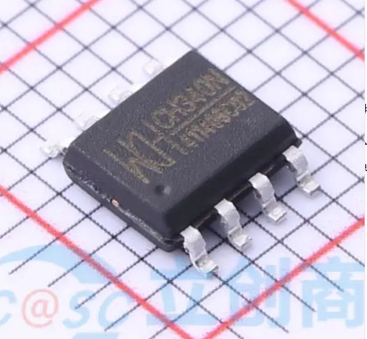
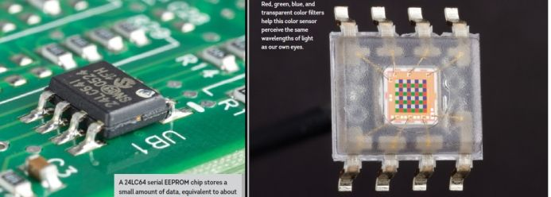
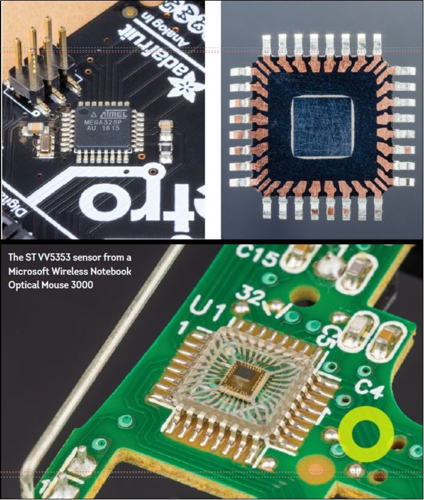
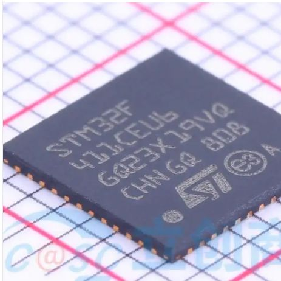
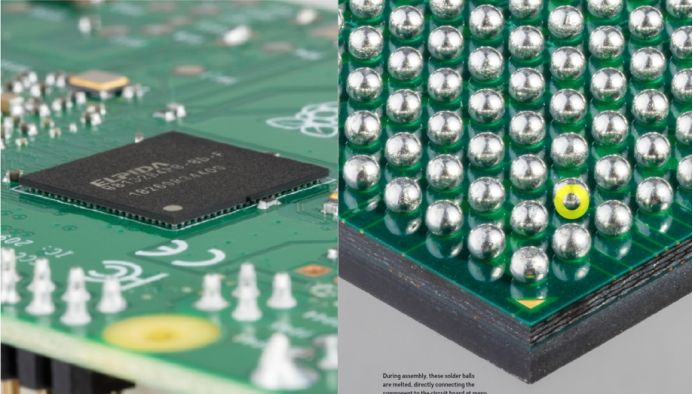

# 电子元器件封装技术：从插件到先进封装的工程演进

> [!abstract] 引言
> 封装是半导体芯片与外部世界的**物理界面**与**工程桥梁**，承担着**电气互连**、**机械保护**、**散热管理**与**标准化集成**等核心功能。本文系统梳理封装技术的分类体系、尺寸标准与演进路径，揭示从传统插件到现代高密度封装的工程逻辑与技术内涵。

## 一、封装概述：功能、分类与工程意义

### 1.1 封装的多维功能定义

电子元器件封装远非简单的"保护性外壳"，它是一个**多物理场耦合**的**系统工程**。其核心功能包括：

**电气互连**：通过**引线键合**、**倒装芯片**或**硅通孔**技术，将芯片内部**微米级电路**转换为PCB可处理的**毫米级接口**，同时控制**寄生参数**（电感、电容、电阻）对高频信号完整性的影响。

**机械保护**：抵御**机械应力**（安装、运输、使用中的振动与冲击）、**环境侵蚀**（湿气、灰尘、化学污染物）以及**热应力**（温度循环导致的材料膨胀差异）。封装材料需在**机械强度**与**热匹配性**间取得平衡。

**散热管理**：现代芯片功率密度可达**100 W/cm²**以上，封装必须提供高效的**热传导路径**。从简单的**塑料封装**到**金属散热片**、**热通孔**、**散热焊盘**，散热设计直接影响器件**可靠性**与**性能稳定性**。

**标准化集成**：封装定义了元件的**外形尺寸**、**引脚布局**与**焊接接口**，实现**制造自动化**与**供应链标准化**。统一的封装规范使不同厂商的芯片可在同一产线装配，大幅降低**系统集成**复杂度。

### 1.2 插件与贴片：两大基础分类体系

从安装方式角度，封装可分为**插件**（Through-Hole Technology, THT）与**贴片**（Surface Mount Technology, SMT）两大体系。图1与图2展示了相同电气规格的LED分别采用**插件封装**与**贴片封装**的物理形态差异。

**插件封装**的技术特征：
- **安装方式**：引脚穿过PCB**通孔**，通过**波峰焊**或**手工焊接**固定
- **机械强度**：**三点支撑**（引脚+焊点+板面）提供优异的**抗振动**与**抗冲击**能力
- **散热路径**：引脚本身作为**热传导通道**，适合**大功率器件**
- **应用场景**：**电源模块**、**连接器**、**高压元件**等对**可靠性**要求苛刻的场合
- **工艺局限**：需**钻孔**增加PCB成本，**双面布线**受限，**组装密度**较低

图3展示了**插件电阻**的典型形态，其**轴向引脚**设计便于在通孔中安装固定。

**贴片封装**的技术革新：
- **安装方式**：元件直接贴装在PCB**表面**，通过**回流焊**工艺批量焊接
- **空间效率**：**无通孔需求**，可实现**双面贴装**，**组装密度**提升3-5倍
- **电气性能**：**引脚电感**降低50%以上，**信号完整性**显著改善
- **自动化程度**：适合**拾放机**（Pick-and-Place）高速自动化生产
- **应用场景**：**消费电子**、**通信设备**、**便携设备**等对**小型化**与**高性能**需求强烈的领域

图4展示了**贴片电阻**的紧凑设计，其**矩形焊盘**直接与PCB铜箔连接。

> [!note] 技术演进的内在逻辑
> 从**插件**到**贴片**的转变，本质是**电子设备小型化**、**高频化**、**批量化**需求驱动的技术响应。贴片技术通过**消除通孔**、**缩短引线**、**平面化布局**，在**电气性能**、**制造成本**与**集成密度**三个维度实现突破。

## 二、贴片元件尺寸标准化：英制与公制的工程统一

### 2.1 尺寸编码系统的技术渊源

贴片元件尺寸采用**英制代码**（如0402、0603、0805）作为行业通用标识，其编码规则源于**美国电子工业联盟**（EIA）的标准化工作。代码前两位表示**长度**（单位为0.01英寸），后两位表示**宽度**（单位为0.01英寸）。例如"0402"表示**0.04×0.02英寸**（≈1.0×0.5 mm）。

为适应**国际标准化**需求，行业同步采用**公制代码**（如1005M、1608M、2012M），其编码直接以**毫米的10倍**表示尺寸。例如"1005M"表示**1.0×0.5 mm**。这种**双轨制编码**体现了电子工业**全球化**与**本地化**的平衡。

### 2.2 尺寸阶梯表：从超微型到功率型

下表系统展示了贴片元件的**尺寸谱系**，揭示了从**超微型**（用于尖端消费电子）到**功率型**（用于工业电源）的完整技术链条：

| 英制代码 | 公制代码 | 实际尺寸 L×W (mm) | 常用称呼 | 典型应用场景 |
|---------|---------|-------------------|---------|------------|
| 0075 | 0201M | 0.3 × 0.15 | 超微0201 | 超密手机模块、微型传感器 |
| 01005 | 0402M | 0.4 × 0.2 | 01005 | 苹果A-series处理器周边电路 |
| 0201 | 0603M | 0.6 × 0.3 | 0201 | 蓝牙耳机、可穿戴设备 |
| 0402 | 1005M | 1.0 × 0.5 | 0402 | 常规便携产品、消费电子 |
| 0603 | 1608M | 1.6 × 0.8 | 0603 | 工控设备、车载电子 |
| 0805 | 2012M | 2.0 × 1.25 | 0805 | 电源模块、功率管理 |
| 1206 | 3216M | 3.2 × 1.6 | 1206 | 高功率电阻、大电流应用 |
| 1210 | 3225M | 3.2 × 2.5 | 1210 | 大容量电容、储能元件 |
| 2010 | 5025M | 5.0 × 2.5 | 2010 | 功率电感、变压器 |
| 2512 | 6432M | 6.4 × 3.2 | 2512 | 电流检测电阻、分流器 |

**尺寸选择的技术考量**：
1. **功率处理能力**：尺寸与**功率额定值**正相关，0805封装电阻通常支持**1/8W**，1206支持**1/4W**，2512可达**1W**以上。
2. **寄生参数控制**：小尺寸（如0402）**寄生电感**更低，适合**高频电路**（>1 GHz），但**焊接可靠性**挑战更大。
3. **制造工艺窗口**：01005及更小尺寸需要**超高精度贴片机**（±25μm）与**细间距钢网**（厚度≤80μm），大幅增加**制造成本**。
4. **热管理需求**：大尺寸元件提供更大**散热面积**，通过**热传导**与**热对流**降低**工作温升**。

> [!important] 尺寸微缩的技术极限
> 当前量产最小尺寸为**0075（0.3×0.15 mm）**，接近**人工操作极限**。更小尺寸面临**拾取精度**、**焊膏印刷**、**视觉对位**、**返修可行性**等多重挑战。未来尺寸微缩需与**嵌入式元件**、**系统级封装**等技术路径协同推进。

### 2.3 工程实践中的尺寸选择策略

**高频数字电路**（如手机RF前端）：优先选择**0402**甚至**0201**，最小化**寄生电感**对信号完整性的影响。需配套**阻抗控制布线**与**精准回流焊曲线**。

**功率电子系统**（如电源模块）：选用**1206**、**1210**或更大尺寸，确保**电流容量**与**散热能力**。需注意**热应力**导致的**焊点疲劳**问题。

**成本敏感型产品**（如消费电子）：采用**0603**作为**平衡点**，兼顾**性能**、**可靠性**与**制造成本**。0603具备良好的**手工焊接**与**返修可行性**。

**微型化设备**（如助听器、植入式医疗）：被迫使用**01005**或**0075**，必须投资**高端制造设备**与**严格工艺控制**，**良率损失**与**测试成本**需纳入总体评估。

## 三、IC芯片封装技术演进：从DIP到先进封装的四十年历程

### 3.1 DIP封装：双列直插的经典范式

**DIP**（Dual In-line Package，双列直插封装）是**集成电路商业化早期**的**标准封装形式**，自20世纪70年代起主导了**微机时代**的芯片封装。其技术特征体现为**两排平行引脚**从封装体两侧引出，引脚间距为标准**2.54 mm**（0.1英寸），引脚数通常在**8至40 pin**之间。

**DIP封装的核心优势**在于**极高的可靠性**与**手工焊接友好性**：
- **机械稳定性**：引脚穿过PCB**通孔**形成**三维机械锚固**，抗振动与冲击能力极强
- **热管理**：较长的引脚提供**纵向散热路径**，适合**中小功率**芯片的自然对流冷却
- **维修便利**：采用**标准插座**或**手工焊接**，支持**现场更换**与**原型调试**
- **标准化程度**：引脚排布与间距的**高度统一**，简化了PCB布局与**测试夹具**设计

典型应用包括**8位微控制器**（如[STC89C52RC](https://item.szlcsc.com/14679.html?fromZone=s_s__%2522STC89C52RC%2520DIP-40%2522&spm=sc.gbn.xh1.zy.t___sc.hm.hd.ss&lcsc_vid=QQNZUV1fQAMPVQJeRgINVVADQwQKX1VUQQIMBVxfElgxVlNTRFVXU11SQFFbXzsOAxUeFF5JWAIASQYPGQZABAsLWA%3D%3D)）、**传统逻辑芯片**（74系列）、**存储器**（EPROM）等。这些芯片多应用于**工业控制**、**教育开发板**、**仪器仪表**等对**环境适应性**要求较高的场景。

然而，DIP的**技术局限**在**高频化**与**小型化**趋势下日益凸显：
- **空间效率低下**：封装高度通常**超过3 mm**，无法满足**轻薄设备**需求
- **电气性能瓶颈**：长引脚引入**1-5 nH**寄生电感，限制**工作频率**（通常<50 MHz）
- **制造复杂度**：需要**钻孔**与**波峰焊**工艺，阻碍**全自动生产**与**双面布线**

> [!note] 技术遗产与持续应用
> 尽管在**消费电子**领域已被淘汰，DIP在**特定利基市场**仍保持生命力：**高可靠性工业设备**（需承受严酷振动环境）、**教育实验套件**（便于学生手工焊接）、**军工航天**（要求极端环境适应性）等领域仍可见其身影。这体现了**技术路径依赖**与**场景特殊性**的平衡。

### 3.2 SOP/SOIC封装：表面贴装的技术奠基

**SOP**（Small Outline Package，小外形封装）及其衍生系列**SOIC**（Small Outline Integrated Circuit）标志着**集成电路封装**从**穿孔安装**向**表面贴装**的**历史性转折**。SOP将DIP的**直引脚**改造为**鸥翼形**（Gull-wing）引脚，引脚间距从**1.27 mm**逐步缩减至**0.65 mm**，实现了**封装体积**的**大幅压缩**。

**SOP封装的技术突破**体现在三个维度：
1. **尺寸缩减**：相同引脚数下，SOP比DIP节省**60-70%** 的PCB面积，高度降低至**1.75 mm**以下
2. **电气优化**：引脚长度缩短**70%**，寄生电感降至**0.5-2 nH**，支持**100 MHz**级工作频率
3. **工艺革新**：适配**回流焊**工艺，实现**全自动贴装**与**双面组装**，大幅提升**生产效率**

**典型应用**包括**USB接口芯片**（如[CH340N](https://item.szlcsc.com/3390257.html?fromZone=s_s__%2522CH340N%2520SOP8%2522&spm=sc.gbn.xh1.zy.t___sc.it.hd.ss&lcsc_vid=TwANX1AATwVYBVUHEgVWUgVXFVJfX1RWFlZbXl0HRAcxVlNTRFJaUVdTR1NYVzsOAxUeFF5JWBIBSRccGwIdBEoFGAxBAAgJFQACSQwSGg0%3D)）、**运放**、**电源管理IC**等。SOIC作为SOP的**标准化变体**，进一步统一了**外形尺寸**与**引脚排布**，成为**模拟芯片**与**中小规模数字IC**的**主流封装**。

**SOIC的技术演进**催生了**薄型SOP**（TSOP）用于**存储器**、**宽体SOP**（SOW）用于**功率器件**等**专用变体**，形成了覆盖**8至28引脚**的完整产品矩阵。

### 3.3 QFP封装：高引脚密度的平面扩展

当芯片引脚数突破**40 pin**时，**双排引脚布局**的SOP达到**物理极限**。**QFP**（Quad Flat Package，四边扁平封装）通过**四边出脚**设计，将**最大引脚数**提升至**200 pin**以上，满足了**微处理器**、**复杂ASIC**的**高密度互连**需求。

**QFP封装的核心特征**包括：
- **引脚排布**：引脚从**封装四边**呈**L形**或**直形**引出，间距从**0.8 mm**逐步微缩至**0.4 mm**
- **封装厚度**：典型高度**1.4-3.0 mm**，提供了**较大芯片面积**的**散热基底**
- **焊接工艺**：采用**高精度钢网印刷**与**可控气氛回流焊**，确保**细间距引脚**的**焊接良率**

以**ARM Cortex-M4微控制器**[STM32F407ZET6](https://item.szlcsc.com/37847.html?fromZone=s_s__%2522STM32F407ZET6%2522&spm=sc.gbn.xh1.zy.t___sc.it.hd.ss&lcsc_vid=TwANX1AATwVYBVUHEgVWUgVXFVJfX1RWFlZbXl0HRAcxVlNTRFJaUVdTR1NYVzsOAxUEFF5JWBIBSRccGwIdBEoFGAxBAAgJFQACSQwSGg0%3D)为例，其采用**LQFP-144**封装（Low-profile QFP），在**20×20 mm**面积内容纳**144个引脚**，实现了**高性能计算**与**丰富外设接口**的平衡。

**QFP的技术挑战**主要集中在**引脚共面性控制**（要求<0.1 mm）与**焊点检测难度**（X射线或AOI必需）。随着引脚间距进一步缩小至**0.4 mm**以下，**桥连**与**虚焊**风险急剧上升，推动封装技术向**无引脚设计**演进。

### 3.4 QFN/QFPN封装：无引脚化的高频突破

**QFN**（Quad Flat No-lead，方形扁平无引脚封装）与**QFPN**（Quad Flat Package No-lead）代表了**表面贴装封装**的**高阶形态**。其**革命性创新**在于**完全取消外部引脚**，代之以封装底部的**平面焊盘**，实现了**电气性能**、**散热效率**与**封装尺寸**的**三重优化**。

**QFN封装的技术优势**体现在：

**电气性能跃升**：
- **寄生电感**降至**0.1-0.5 nH**，支持**GHz级**高频应用（如RF前端、高速SerDes）
- **引脚间电容**减少**30-50%**，改善**信号完整性**与**串扰抑制**
- **接地阻抗**极低，提供优异的**EMI/EMC**性能

**热管理突破**：
- **中央散热焊盘**（Exposed Pad）提供**低热阻路径**（典型值<10 °C/W）
- 芯片产生的热量通过**焊料**直接传导至PCB**内层铜箔**或**散热过孔**
- 支持**3-5 W**功率芯片的**自然冷却**，无需外加散热片

**尺寸极致化**：
- 封装高度可压缩至**0.8 mm**，适合**超薄设备**（智能手机、平板）
- 引脚间距可达**0.4 mm**，在**相同面积**下提供**更多I/O**
- **无引脚悬空**，减少**机械应力**导致的**焊点开裂**

典型应用如**STM32F411CEU6**微控制器采用**UFQFPN-48**封装，在**7×7 mm**面积内集成**Cortex-M4内核**与丰富外设，广泛应用于**无人机飞控**、**物联网网关**、**工业HMI**等场景。

> [!important] 焊接工艺的特殊要求
> QFN的**底部焊盘**与**周边焊盘**存在**热容差异**，需要**精密温度曲线**控制。推荐采用**阶梯式钢网**（中心焊盘开口缩小20%）与**氮气保护回流焊**，防止**空洞率过高**影响散热。**焊后检测**依赖**X射线**或**超声波扫描**，增加**质量控制成本**。

### 3.5 BGA封装：球栅阵列的高密度革命

当引脚数突破**200 pin**、工作频率进入**GHz时代**，**周边引脚布局**的QFP达到**物理极限**。**BGA**（Ball Grid Array，球栅阵列封装）通过**底部阵列焊球**，实现了**互连密度**的**数量级提升**，成为**高性能处理器**、**FPGA**、**GPU**的**标准封装**。

**BGA封装的技术创新**包括：

**密度突破**：
- 焊球间距从**1.27 mm**逐步微缩至**0.5 mm**，单位面积I/O密度**提升4-10倍**
- 焊球以**全阵列**或**部分阵列**排布，支持**500-2000+** 引脚数
- **多层基板**（2-10层）实现**电源**、**地**、**信号**的**分层布线**，减少**层间串扰**

**电气性能优化**：
- 焊球高度一致（典型**0.3-0.6 mm**），提供均匀的**机械支撑**与**电流路径**
- **短互连路径**（<1 mm）将**寄生电感**控制在**0.05-0.2 nH**，支持**10+ GHz**信号传输
- **电源完整性**显著改善：**多电源域**通过**专用焊球**独立供电，降低**同步开关噪声**

**热管理与可靠性**：
- **高热导基板**（如BT树脂、陶瓷）搭配**内部热通孔**，热阻可低至**2-5 °C/W**
- **底部填充胶**（Underfill）补偿**芯片**、**基板**、**PCB**的**热膨胀系数差异**，提升**温度循环寿命**
- **焊球合金**（如SAC305）优化**机械疲劳**与**电迁移**性能

**BGA的技术挑战**主要在于**焊接检测**与**返修难度**：
- **隐藏焊点**需要**X射线检测系统**，投资成本高昂
- **局部加热返修**要求**精密温度控制**（±5 °C），防止**相邻元件**热损伤
- **焊球共面性**要求<0.1 mm，对**基板翘曲**与**焊球植球**工艺提出极高要求

### 3.6 封装演进的内在逻辑与技术趋势

**封装技术的四十年演进**遵循清晰的**工程逻辑**：

1. **从三维到二维**：DIP的**垂直安装**→SOP/QFP的**平面贴装**→QFN/BGA的**底部互连**，不断压缩**第三维度**高度
2. **从周边到面阵**：引脚从**单边**→**双边**→**四边**→**全阵列**，持续提升**单位面积I/O密度**
3. **从引线到焊球**：**长引脚**→**短引脚**→**无引脚**→**球形触点**，逐步优化**电气性能**与**机械可靠性**
4. **从单芯片到系统集成**：**分立封装**→**多芯片模块**→**系统级封装**（SiP）→**芯片堆叠**（3D IC），迈向**异质集成**

**未来封装技术趋势**呈现**三个维度**的并发演进：

**垂直维度**：**3D堆叠**与**硅通孔**（TSV）技术将**存储器**、**逻辑芯片**、**传感器**垂直集成，实现**带宽指数增长**（如HBM内存带宽>1 TB/s）与**互连能耗大幅降低**。

**平面维度**：**扇出型封装**（Fan-Out）消除**基板中介**，芯片直接**重构于环氧模塑料**上，实现**更高I/O密度**（引脚间距<0.2 mm）与**更优热性能**。

**材料维度**：**玻璃基板**、**硅中介层**、**碳纳米管互连**等**新材料体系**突破**传统有机基板**的**频响极限**（>100 GHz）与**热膨胀失配**问题。

> [!abstract] 封装：从配角到主角的技术跃迁
> 在**摩尔定律**放缓的背景下，**封装技术**正从单纯的**芯片保护壳**演变为**系统性能**的**关键赋能者**。先进封装通过**异构集成**、**短互连**、**新材料**，在**功耗**、**带宽**、**尺寸**三个维度延续**算力增长曲线**，成为**后摩尔时代**的**核心创新阵地**。