在硬件开发的入门与实践阶段，工具链的易获取性、学习成本和经济性至关重要。**嘉立创EDA**作为一款**完全免费、国产自主、生态闭环**的电子设计自动化工具，已成为学生、创客、初创团队乃至中小型企业进行PCB设计的首选。它集成了从原理图设计、PCB布局到元器件采购、打样下单的完整工作流，极大地降低了硬件创新的门槛。

本文旨在提供一份详尽、可操作的嘉立创EDA专业版环境搭建指南，不仅涵盖安装步骤，更深入解析版本选择策略、安装背后的技术考量，帮助你高效构建稳定可靠的硬件开发环境。

## 版本选择

在下载安装包之前，明确版本差异是做出正确选择的前提。嘉立创EDA主要提供**标准版**与**专业版**两个产品线，且每个版本都拥有**在线（Web）** 与**本地（Desktop）** 两种形态。

### 专业版 vs 标准版

> [!important] 核心建议：直接选择专业版
> 对于任何新的学习或工程项目，**强烈推荐直接使用嘉立创EDA专业版**。

| 考量维度 | 标准版 | 专业版 |
| :--- | :--- | :--- |
| **功能定位** | 精简、轻量，满足基础设计需求 | **全面、强大**，支持复杂电路与高级功能 |
| **开发状态** | **已暂停功能更新**，仅进行安全维护 | **持续活跃开发**，新功能和优化不断加入 |
| **学习成本** | 极低，界面简单 | 适中，但结构清晰，易于上手 |
| **适用场景** | 维护旧项目或极其简单的电路 | **新项目学习、课程设计、产品开发** |
| **成本** | 免费 | **免费** |

嘉立创EDA专业版于2019年底正式发布，代表了团队未来的技术方向。选择专业版，意味着你能接触到更现代化的设计界面、更强大的布线引擎和仿真工具，并且能持续获得官方更新支持。**“易上手”的特性确保初学者也能快速掌握专业版的核心操作**。

### 在线版 vs 本地版

选择专业版后，还需决定使用模式。

*   **在线版（Web）**：
    *   **优势**：无需安装，通过浏览器即可访问；**团队协作功能强大**，支持实时多人编辑与版本管理；自动同步，项目数据保存在云端。
    *   **劣势**：**严重依赖网络连接**与浏览器性能；复杂设计或大文件操作可能响应迟缓；数据安全完全依赖于服务提供商。
    *   **场景**：适合进行轻量级设计评审、跨地域团队协作或临时使用。

*   **本地版（Desktop）**：
    *   **优势**：**性能更优**，充分利用本地计算机的CPU、内存和显卡资源；**网络依赖度低**，核心设计操作可离线进行；响应速度快，操作体验流畅。
    *   **劣势**：团队协作需借助第三方工具（如Git）或手动同步文件；需要占用本地存储空间。
    *   **场景**：**个人学习、主力开发、复杂项目设计的推荐选择**。

> [!tip] 实践建议
> 对于绝大多数个人开发者与学习者，**优先安装并使用本地专业版**作为主力开发工具。在线版可作为辅助协作或快速查看的备用方案。

## 嘉立创EDA专业版下载与安装

### 获取官方安装包
确保软件来源的正规与安全是第一步。请通过以下任一方式访问官网：
1.  在搜索引擎中直接搜索“**嘉立创EDA**”。
2.  直接访问官方网址：[**https://lceda.cn/**](https://lceda.cn/)

进入官网后，点击首页醒目的“**立即下载**”按钮，进入下载页面。

### 选择正确的安装包版本
下载页面会提供适用于不同操作系统（Windows、macOS、Linux）的安装包。对于主流Windows用户，选择判断如下：
*   **系统架构**：现代个人电脑绝大多数为**amd64（即x64）** 架构。
*   **操作系统**：Windows 10 或 Windows 11。

因此，你应该下载如下图所示，**被红框标注的 `Windows (amd64)` 版本安装程序**。
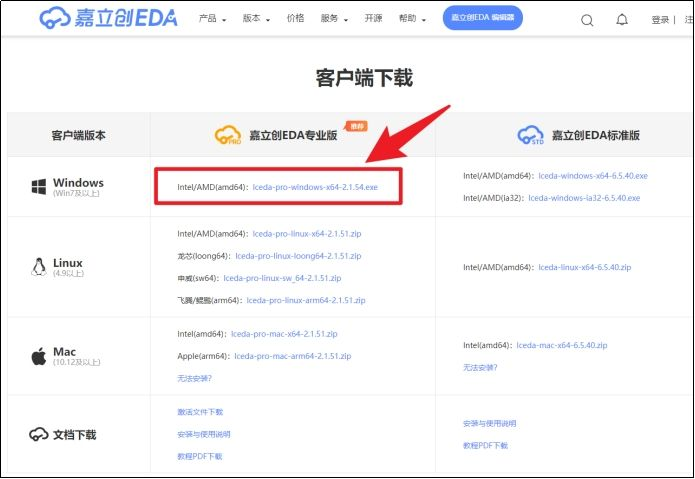

> [!note] 关于系统架构
> 如果你不确定自己电脑的架构，可以在Windows搜索框输入“系统信息”，在打开窗口的“系统类型”一栏查看。显示“基于x64的电脑”即对应amd64架构。

### Windows系统安装详解（图解步骤）
安装过程遵循标准的Windows软件安装流程，清晰直观。

1.  **启动安装程序**：双击运行下载好的 `LCEDA-Pro-Setup-x.x.x.exe` 文件。
    

2.  **开始安装向导**：点击“**下一步**”继续。
    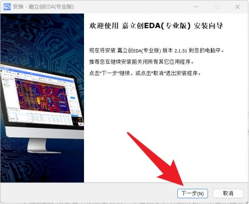

3.  **选择安装路径**：软件默认安装到 `C:\Program Files\LCEDA`。如果C盘空间紧张，可以点击“浏览”按钮，更改到其他磁盘（如D盘）。**建议路径中不要包含中文或特殊字符**，以避免潜在的软件兼容性问题。
    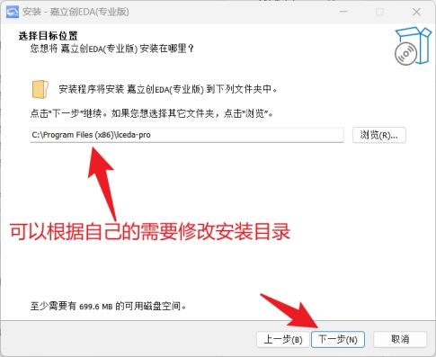

4.  **确认安装**：继续点击“**下一步**”。
    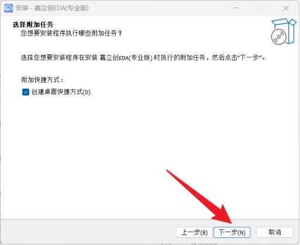

5.  **执行安装**：点击“**安装**”按钮，开始将文件写入系统。
    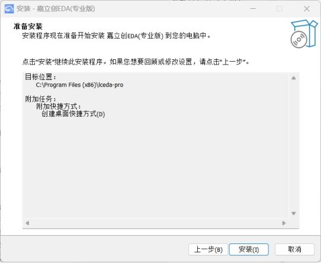

6.  **等待安装完成**：进度条走完，即表示文件复制与配置完成。
    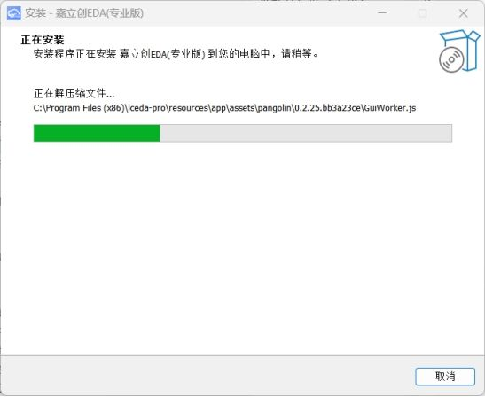

7.  **完成并启动**：安装向导最后一步，默认勾选了“**运行 嘉立创EDA（专业版）**”。直接点击“完成”，软件将自动启动。
    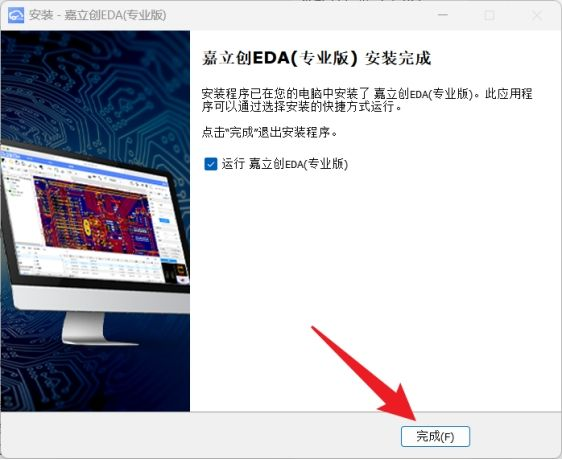

### 首次运行配置
第一次启动软件时，可能会弹出初始配置对话框，涉及“简易库路径”和“工程路径”的设置。
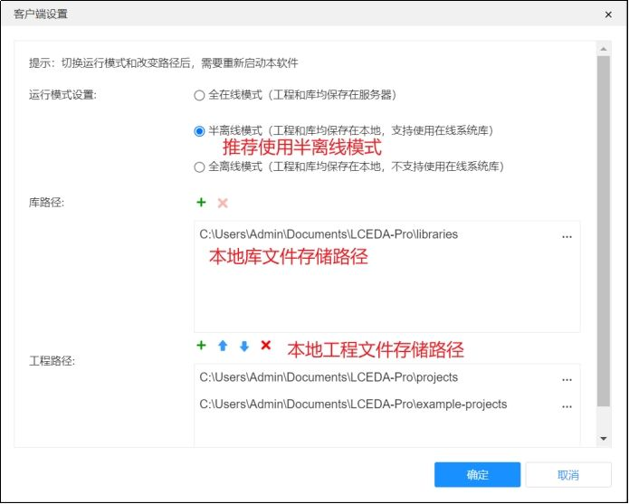

> [!info] 配置说明
> 初次使用建议**直接点击“确定”保留默认设置**。这些路径定义了元件库和项目文件的默认存储位置，后续在软件设置中可以随时修改，不会影响当前使用。

## 账户注册与软件激活

嘉立创EDA专业版需要关联一个免费的嘉立创账户才能解锁全部功能。这是一个**完全免费**的实名验证流程，旨在提供更稳定的服务和支持。

### 激活提示与策略
完成安装首次启动后，软件主界面会显示一个明显的“**激活**”提示按钮。
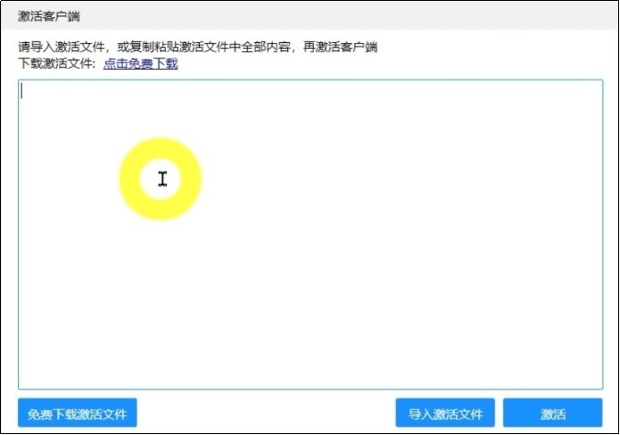

此时**无需在软件内进行任何操作**，我们需要先完成网页端的账户注册。

### 注册嘉立创EDA账户
1.  **访问注册页面**：在浏览器中打开 [https://lceda.cn](https://lceda.cn)，点击网站右上角的“**注册**”按钮。
    

2.  **扫码注册**：使用微信扫描页面显示的二维码（**请扫描自己浏览器中显示的二维码，而非教程图片中的码**），在手机端完成快捷注册。
    

3.  **绑定手机号**：根据指引，绑定你的手机号码以完成账户安全验证。
    

4.  **进入系统**：注册成功后，点击“**进入系统**”。
    

5.  **账户确认**：网站会识别当前已登录的账户，直接点击“**进入系统**”即可。
    

6.  **完善信息**：首次使用需要补充基本信息。在“公司名称”一栏，可以填写你所在的**学校、公司名称或“个人开发者”**。这是嘉立创提供服务所需的常规信息收集。
    

7.  **完成注册**：可选择添加技术支持微信，最后点击“**下一步**”。当看到如下图所示的工作台页面时，标志着网页端账户注册已全部完成。
    
    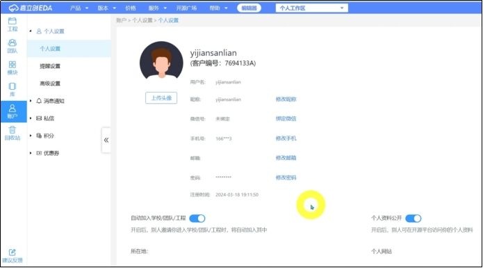

### 获取并输入激活码
1.  **启动激活流程**：回到已安装的嘉立创EDA专业版软件，在激活提示窗口点击“**免费下载激活文件**”按钮。
    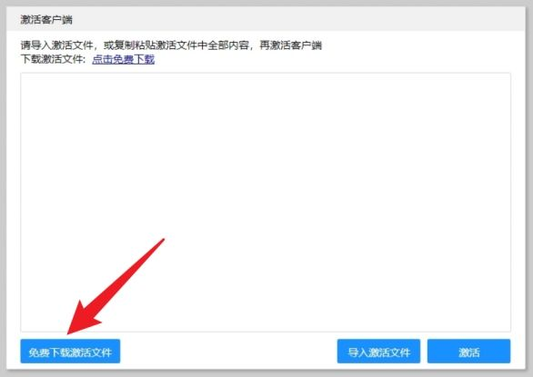

2.  **复制激活码**：软件会自动打开浏览器并跳转到激活码获取页面。点击页面上醒目的“**一键复制**”按钮，将激活码复制到剪贴板。
    

3.  **粘贴激活**：切换回软件窗口，在输入框中**粘贴（Ctrl+V）** 刚才复制的激活码，然后点击“**激活**”按钮。
    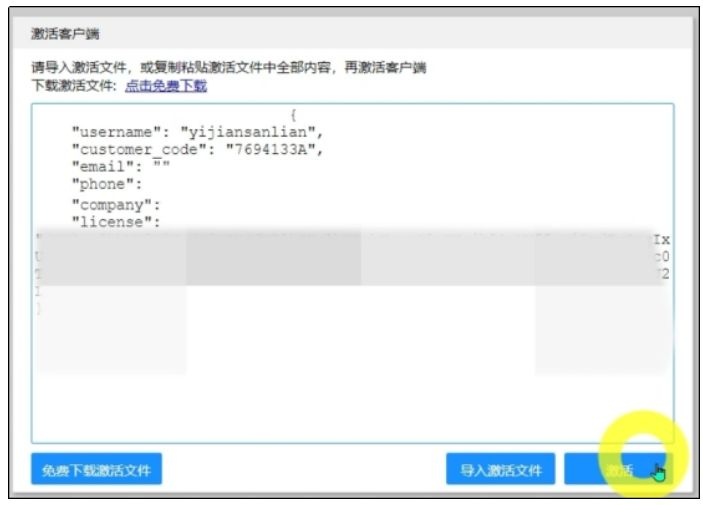

4.  **激活成功**：软件会自动重启。重启后，如果你看到如下图所示的功能完整、无任何限制提示的软件主界面，则代表**嘉立创EDA专业版已成功安装并激活**。
    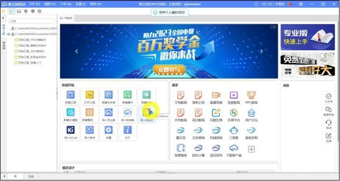
