对于任何专业设计工具而言，熟练掌握其用户界面（UI）是提升工作效率、减少操作阻力的基础。嘉立创EDA专业版作为一款现代化的国产EDA工具，其界面设计遵循了**功能分区明确、操作逻辑直观**的原则。本文将对软件的核心界面元素——菜单栏、工具栏、运行模式配置及文件管理策略——进行系统性拆解，帮助你快速建立对软件的整体认知，从而在后续的原理图与PCB设计中游刃有余。

## 菜单栏

菜单栏位于软件窗口顶部的左侧区域，是访问所有高级功能和全局设置的**核心入口**。它采用经典的下拉菜单结构，将庞杂的命令按逻辑归类，确保用户能快速定位所需操作。

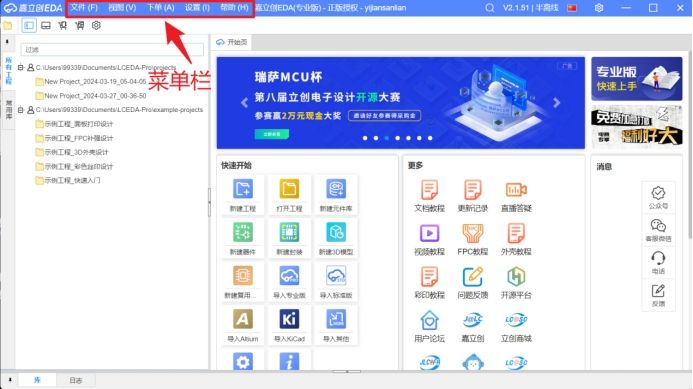

### 1文件菜单
“文件”菜单负责处理工程的**创建、打开、保存、导入与导出**等基本文件操作。这是你开始一个新设计或维护旧项目的起点。
* **核心操作**：新建工程、打开工程、保存/另存为、导入其他格式文件（如Altium Designer的`.SchDoc`/`.PcbDoc`）、导出生产文件（Gerber、BOM、坐标文件）。
* **工程实践价值**：定期使用“保存”或熟练运用快捷键（Ctrl+S）是避免意外丢失进度的**最基本也是最重要的习惯**。

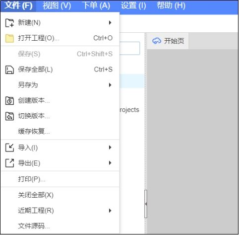

### 视图菜单
“视图”菜单允许你根据个人习惯和当前任务定制软件界面布局与显示选项。
* **面板控制**：显示或隐藏诸如“库”、“属性”、“导航器”等侧边栏面板，优化屏幕空间利用率。
* **单位切换**：支持在**英制（mil）** 与**公制（mm）** 之间快速切换。在PCB布局中，芯片引脚间距常用英制，而机械结构尺寸多用公制，此功能至关重要。
* **显示优化**：调整网格、栅格、背景色等视觉元素，减轻长时间设计带来的视觉疲劳。

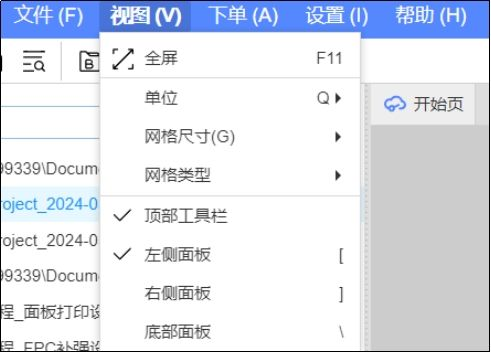

### 下单菜单
嘉立创EDA最具特色的功能之一，实现了从**电子设计到物理产品的一键转化**。
* **PCB打样下单**：直接调用当前设计的PCB文件，跳转至嘉立创PCB下单平台，自动填充板子参数，极大简化打样流程。
* **元件采购**：基于原理图生成的BOM（物料清单），可一键在立创商城匹配并采购所需元器件。
* **SMT贴片**：支持在线选择SMT贴片服务，完成从空板到贴装好元件的PCBA的快速交付。

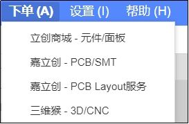

> [!tip] 生态优势
> “下单”菜单深度集成了嘉立创的制造与供应链资源，是**“设计-打样-采购-贴片”一站式服务**的体现，能显著缩短硬件产品从开发到验证的周期。

### 设置菜单
“设置”菜单用于配置软件的整体行为和工作环境。
* **常规设置**：语言、主题（深色/浅色）、默认单位、编辑器字体等。
* **保存与备份**：配置自动保存、自动备份策略，是**数据安全的守护线**（后文详述）。
* **快捷键**：查看和自定义键盘快捷键，对于提升高阶用户的操作效率至关重要。

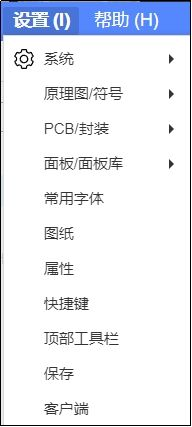

### 帮助菜单
遇到难题时，“帮助”菜单是你的第一求助站。
* **帮助文档 (F1)**：提供完整的官方使用手册，覆盖所有功能细节。
* **教程与更新日志**：获取最新视频教程、功能指南，了解软件版本迭代信息。
* **关于**：查看当前软件版本号，在寻求技术支持或报告Bug时必备信息。

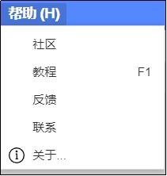

### 动态菜单栏
嘉立创EDA的菜单栏是**上下文敏感**的，其内容会根据当前所处的工作模式自动切换，确保你看到的都是最相关的命令。

| 工作模式                                                    | 菜单栏特点         | 核心功能举例                       |
| :------------------------------------------------------ | :------------ | :--------------------------- |
| **首页模式**  | 提供工程管理和全局设置入口 | 新建工程、打开最近工程、运行模式设置           |
| **原理图模式** | 聚焦电路逻辑设计      | 放置元件、绘制导线、添加网络标签、ERC（电气规则检查） |
| **PCB模式** | 专注物理布局与布线     | 放置过孔、绘制铜皮、设计规则检查（DRC）、3D视图   |

> [!note] 操作一致性检查
> 如果你在教程中看到某个功能，但在自己的菜单栏中找不到，请**首先确认当前是否处于正确的工作模式**。这是初学者常遇到的问题。

## 工具栏

工具栏通常位于菜单栏下方或界面侧边，它将以图标形式**聚合了当前模式下最常用的命令**，旨在减少菜单层级点击，实现“一键直达”。

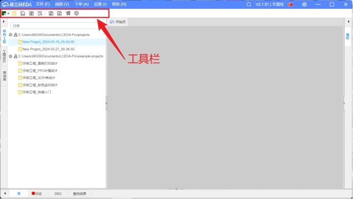

* **首页工具栏**：包含“新建原理图”、“新建PCB”、“打开工程”等核心入口，是设计旅程的起点。
    
* **原理图工具栏**：集成了“放置器件”、“绘制导线”、“添加网络标签”、“电源端口”等逻辑设计工具。
    
* **PCB工具栏**：提供了“放置过孔”、“绘制走线”、“铺铜”、“测量距离”、“规则检查”等物理设计工具。
    

**使用策略**：在熟悉基础菜单命令后，应有意识地记忆并使用工具栏图标，这是从“会用”到“熟练”的关键一步。

## 运行模式与文件路径

嘉立创EDA专业版提供了灵活的运行模式以适应不同的网络环境与协作需求，理解并正确配置它们是保证稳定、高效工作的基础。

### 运行模式详解
点击软件右上角的齿轮图标（设置按钮），即可进入运行模式配置页面。
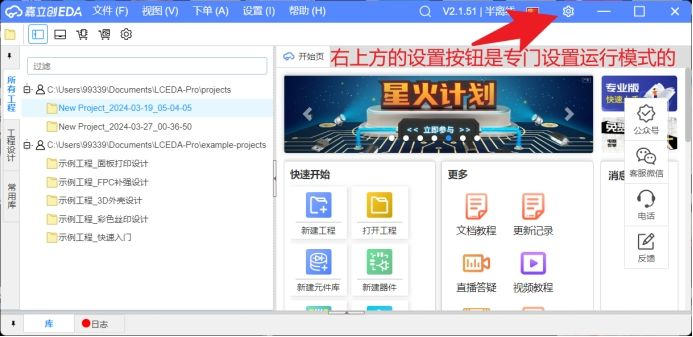
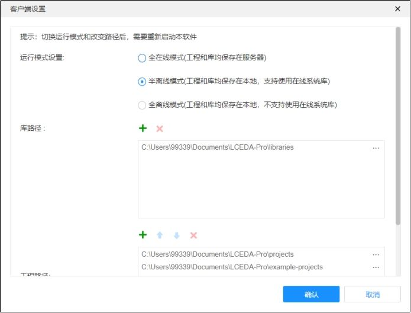

软件提供三种运行模式，其核心区别如下表所示：

| 运行模式 | 文件存储位置 | 网络依赖 | 可用资源 | 适用场景与建议 |
| :--- | :--- | :--- | :--- | :--- |
| **全在线模式** | 嘉立创云端服务器 | **完全依赖** | 全部云端资源（库、协作） | **不推荐常规使用**。仅适用于纯云端协作或临时在无本地环境的电脑上操作。 |
| **半离线模式** | **本地计算机** | 部分依赖（访问云端库） | 本地文件 + **云端元件库** | **强烈推荐**。兼顾了本地性能与云端海量元件库的便利，是个人开发与学习的最佳选择。 |
| **全离线模式** | **本地计算机** | **完全离线** | 本地文件 + 有限离线库 | 适用于**无网络环境**或对数据保密有极高要求的场景。对于学习者，因库不完整，不推荐。 |

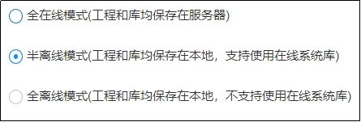

> [!summary] 模式选择黄金法则
> 对于绝大多数用户，**“半离线模式”是默认且唯一正确的选择**。它让你在享受本地软件流畅操作的同时，能随时调用嘉立创庞大的云端元件库，避免了自建库的繁琐。

### 库路径与工程路径管理
在半离线和全离线模式下，你需要指定文件在本地磁盘的存储位置。
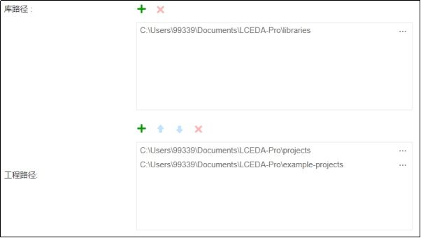

1.  **库路径**：用于存放**用户自定义的元件库文件**。当你在设计中需要使用嘉立创官方库中没有的元器件时，需要自行创建该元件的符号（Symbol）、封装（Footprint）等信息，这些信息将保存在此路径下的库文件中。
2.  **工程路径**：你的所有设计工程（包含原理图、PCB、输出文件等）将默认保存在此路径下的 `projects` 文件夹中。`example-projects` 文件夹则存放了嘉立创官方提供的示例工程，是极佳的学习素材。
3.  **路径设置逻辑**：**全在线模式无需设置本地路径**，因为所有数据均在云端。设置合理的本地路径（建议放在非系统盘、路径简洁无中文），有利于工程文件的备份与管理。

## 自动保存与自动备份

硬件设计是精细且耗时的工作，任何意外的软件崩溃、系统死机或断电都可能导致数小时的工作付诸东流。嘉立创EDA内置的自动保存与自动备份机制，是**保护你设计成果的关键配置**。

### 如何配置
通过菜单栏【设置】 -> 【保存】进入配置页面。
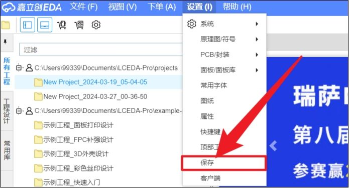

**推荐配置参数**：
* **自动保存间隔**：**5分钟**。间隔太短可能影响操作流畅度，太长则风险增高。
* **自动备份间隔**：**10分钟**。备份频率可略低于保存频率。
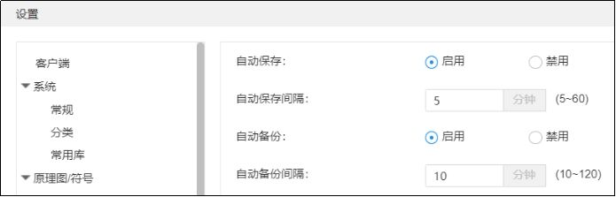

### 机制区别与价值
尽管名称相似，但两者从机制到用途有着本质区别：

| 机制 | 作用对象 | 恢复粒度 | 核心价值 |
| :--- | :--- | :--- | :--- |
| **自动保存** | **当前正在编辑的文件** | 覆盖式保存，只保留最新状态 | 防范**突发性意外丢失**（崩溃、断电）。在意外关闭后重新打开软件，通常可恢复到最近一次自动保存的状态。 |
| **自动备份** | **创建独立的副本文件** | 生成历史版本，可按时间点恢复 | 应对**错误操作或需求变更**。当你发现当前设计有误，或客户/导师要求改回之前的某个版本时，可以从备份中找回“昨天的现场”。 |

> [!warning] 重要提醒
> **自动保存不能替代手动保存（Ctrl+S）的习惯！** 它只是最后一道安全网。养成在完成一个关键步骤后手动保存的习惯，是专业工程师的基本素养。