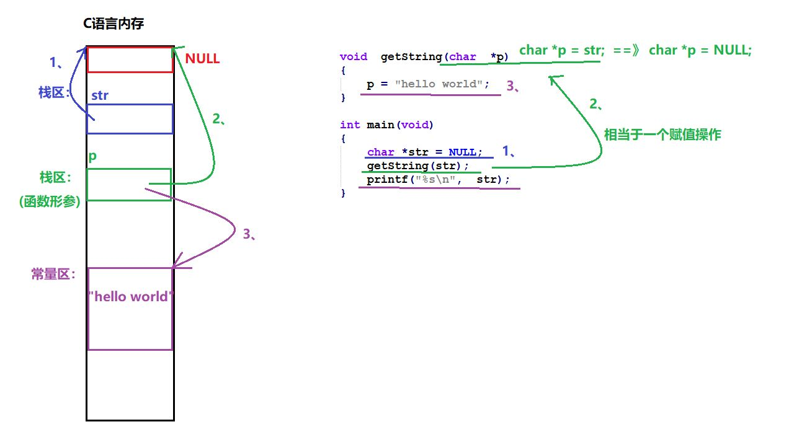
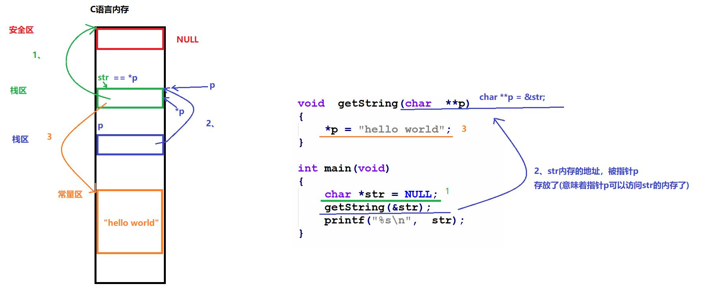
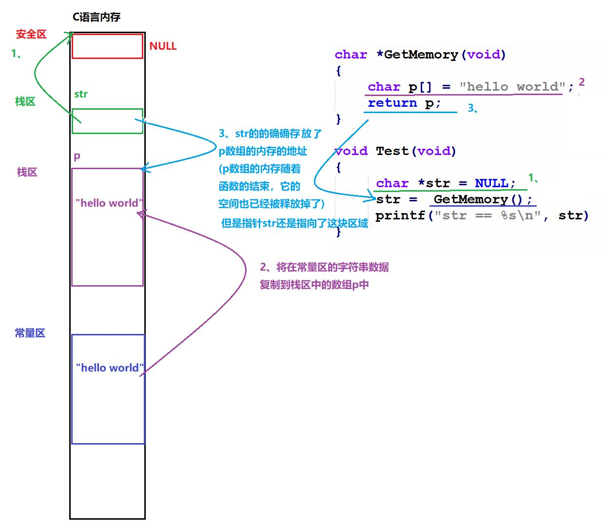
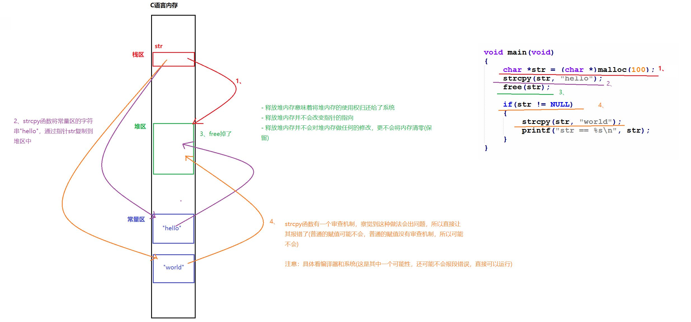
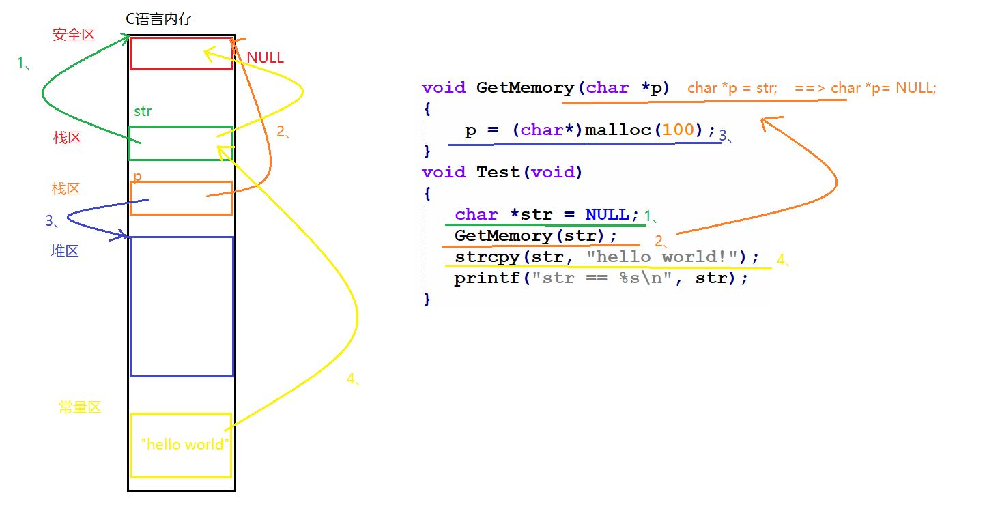
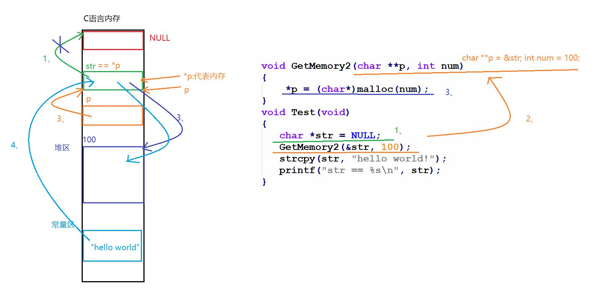
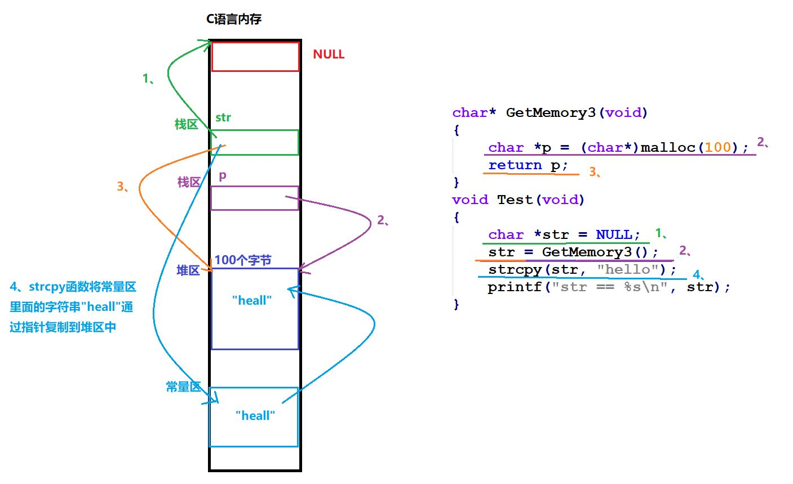

# C语言指针与内存管理代码分析

本文档汇总了关于C语言指针参数传递、内存分配及释放的7个典型案例分析。

## 例子 1

```c
void getString(char *p) { 
    p = "hello world"; 
} 

int main(void) { 
    char *str = NULL; 
    getString(str); 
    printf("%s\n", str); 
}
```

**图解：**


**分析与解释：**
*   **描述问题：** `main()` 函数里面的 `str` 指针，和 `getString()` 函数里面的 `p` 指针，没有丝毫联系。这是**值传递**，`p` 只是 `str` 的一份拷贝。在函数内部修改 `p` 的指向（让它指向常量字符串），并不会影响外部的 `str`。这意味着不能通过指针 `p` 去修改 `str` 的指向，`str` 指针依然指向 `NULL`。
*   **可能输出：** 不同的编译器或者系统，由于处理该错误的方式不一样，输出结果也可能不一样。可能输出 `(null)`，也有可能输出**段错误 (Segmentation Fault)**，因为 `printf` 试图读取空指针。

---

## 例子 2

```c
void getString(char **p) { 
    *p = "hello world"; 
} 

int main(void) { 
    char *str = NULL; 
    getString(&str); 
    printf("%s\n", str); 
}
```

**图解：**


**分析与解释：**
*   **描述情况：** `main()` 函数传递的是一级指针 `str` 的地址（即 `&str`），`getString()` 函数使用二级指针 `p` 接收。这里存在联系，因为二级指针 `p` 存放了一级指针 `str` 的地址。
*   **原理：** 通过解引用 `*p`，可以直接访问并修改 `main` 函数中 `str` 的值。
*   **确定输出：** 输出 `hello world`。

---

## 例子 3

```c
char *GetMemory(void) { 
    char p[] = "hello world"; 
    return p; 
} 

void Test(void) { 
    char *str = NULL; 
    str = GetMemory(); 
    printf("str == %s\n", str);
}
```

**图解：**


**分析与解释：**
*   **描述问题：** `GetMemory()` 函数内的 `p` 是一个**局部数组**，存储在**栈（Stack）**上。当 `GetMemory` 函数执行完毕返回时，栈帧被销毁，局部变量 `p` 占用的内存被系统回收。
*   **后果：** 虽然 `str` 接收到了 `p` 指向的地址，但该地址的内容已经无效（Dangling Pointer）。
*   **可能输出：** 结果是未定义的。有可能输出 `NULL`，也有可能输出乱码，或者输出段错误。

---

## 例题 4

```c
void Test(void) { 
    char *str = (char *)malloc(100); 
    strcpy(str, "hello"); 
    free(str); 
    if(str != NULL) { 
        strcpy(str, "world"); 
        printf("str == %s\n", str); 
    } 
}
```

**图解：**


**分析与解释：**
*   **描述问题：** 这是一个典型的**释放后使用（Use After Free）**错误。
    1.  `free(str)` 释放了 `str` 指向的堆内存，但**没有**将 `str` 置为 `NULL`。
    2.  此时 `str` 成为“野指针”，`if(str != NULL)` 判断为真。
    3.  程序继续执行 `strcpy`，试图向已经归还给操作系统的内存写入数据。
*   **可能输出：** 结果是**未定义行为**。
    *   如果内存尚未被系统重新分配，可能侥幸输出 `str == world`。
    *   大多数情况下会导致**程序崩溃（段错误）**。
    *   也可能导致数据损坏。

---

## 例题 5

```c
void GetMemory(char *p) { 
    p = (char*)malloc(100); 
} 

void Test(void) { 
    char *str = NULL; 
    GetMemory(str); 
    strcpy(str, "hello world!"); 
    printf("str == %s\n", str); 
}
```

**图解：**


**分析与解释：**
*   **描述问题：**
    1.  **内存泄露：** `GetMemory` 申请了 100 字节内存，赋值给参数 `p`。由于 `p` 是值传递，函数结束后，这块堆内存无法被外部访问也无法释放。
    2.  **空指针写入：** `Test` 函数中的 `str` 始终为 `NULL`。`strcpy(str, ...)` 试图向地址 0 写入数据。
*   **确定输出：** **程序崩溃（段错误 / Segmentation Fault）**。

---

## 例题 6

```c
void GetMemory2(char **p, int num) { 
    *p = (char*)malloc(num); 
} 

void Test(void) { 
    char *str = NULL; 
    GetMemory2(&str, 100); 
    strcpy(str, "hello world!"); 
    printf("str == %s\n", str); 
}
```

**图解：**


**分析与解释：**
*   **描述情况：** 使用了**二级指针**作为参数。`GetMemory2` 接收 `&str`，通过 `*p` 直接操作了外部的 `str` 指针。`malloc` 分配的地址正确地赋给了 `str`。
*   **确定输出：** 输出 `str == hello world!`。
*   **注意：** 虽然程序运行正常，但 `Test` 结束前未调用 `free(str)`，严格来说存在内存泄露。

---

## 例题 7

```c
char* GetMemory3(void) { 
    char *p = (char*)malloc(100); 
    return p; 
} 

void Test(void) { 
    char *str = NULL; 
    str = GetMemory3(); 
    strcpy(str, "hello"); 
    printf("str == %s\n", str); 
}
```

**图解：**


**分析与解释：**
*   **描述情况：** `GetMemory3` 在**堆（Heap）**上分配内存。与栈内存不同，堆内存的生命周期由程序员控制，不会随函数返回而消失。函数返回指针 `p` 是有效的。
*   **确定输出：** 输出 `str == hello`。
*   **注意：** 同样需要在使用完毕后调用 `free(str)` 以避免内存泄露。

---

## 总结与最佳实践

通过以上7个例题的分析，我们可以得出C语言指针与内存管理的几个核心原则：

1.  **指针参数传递机制**：
    *   **值传递**：函数参数是 `char *p` 时，传递的是指针变量的**拷贝**。在函数内修改 `p` 的指向不会影响外部指针（如例1、例5）。
    *   **地址传递**：若需在函数内部修改外部指针的指向（例如申请内存），必须传递指针的地址（即二级指针 `char **p`），或者通过返回值返回新的指针（如例2、例6、例7）。

2.  **栈内存 vs 堆内存**：
    *   **栈（Stack）**：局部变量（包括局部数组）存储在栈上，函数返回后自动销毁。**绝对禁止**返回局部变量的地址（如例3）。
    *   **堆（Heap）**：通过 `malloc`/`calloc` 分配的内存位于堆上，生命周期由程序员控制。即使函数返回，内存依然存在，直到显式调用 `free`（如例7）。

3.  **野指针与内存安全**：
    *   **释放后置空**：调用 `free(p)` 后，指针 `p` 仍然指向原来的地址（变为野指针）。继续使用会导致未定义行为。最佳实践是 `free(p); p = NULL;`（如例4）。
    *   **内存泄露**：堆内存使用完毕后必须 `free`，否则会导致内存泄露。虽然例6和例7逻辑正确，但在实际工程中必须补上 `free` 操作。
