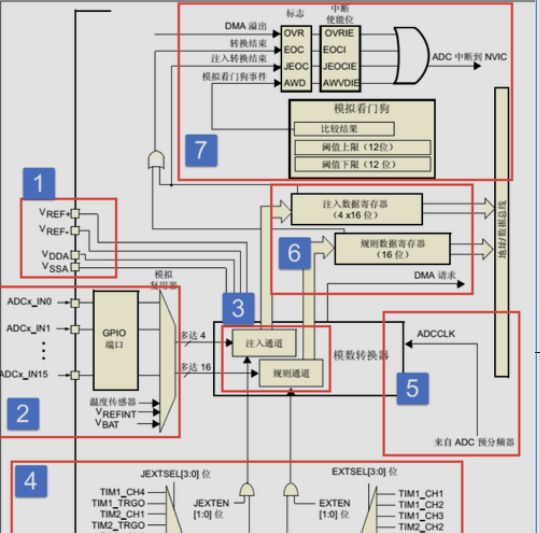

### 什么是单片机
单片机（Microcontroller Unit, MCU）是一种集成电路芯片，它将微处理器（CPU）、存储器（包括 RAM 和 ROM）、输入 / 输出接口（I/O）以及其他功能模块集成在一个小型的芯片上。单片机设计用于执行特定的控制任务，广泛应用于嵌入式系统。

---

### 单片机有什么特点

单片机的主要特点包括：
1. **集成度高**：单片机将多个电子元件集成在一个芯片上，节省空间，降低成本。
2. **低功耗**：单片机通常设计为低功耗，适合由电池供电的便携式设备。
3. **专用性**：单片机通常针对特定的应用场景进行优化，如汽车电子、工业控制、消费电子等。
4. **实时性**：单片机能够快速响应外部事件，适合需要实时控制的场合。
5. **可编程性**：单片机内部的存储器可以编程，允许用户根据需要编写和运行不同的控制逻辑。
6. **丰富的 I/O 接口**：单片机提供多种类型的 I/O 接口，如 GPIO（通用输入 / 输出）、ADC（模拟数字转换器）、PWM（脉冲宽度调制）等。
7. **成本效益**：单片机因其高度集成和专用性，通常具有很高的成本效益。
8. **易于使用**：许多单片机都配有开发工具和库，简化了开发过程。
9. **可扩展性**：虽然单片机是集成的，但它们可以通过总线系统与其他芯片或模块进行通信和扩展。
10. **广泛的应用**：单片机被广泛应用于各种电子产品和系统中，从简单的家用电器到复杂的工业自动化设备。

---

### 为什么芯片需要时钟信号

时钟信号在芯片（尤其是数字芯片）中扮演着至关重要的角色，它是整个芯片正常工作的基础。以下是时钟信号在芯片中的主要作用和为什么芯片需要时钟信号的原因：

1. 同步数据传输
	- **定义**：时钟信号是一个周期性变化的信号，通常是一个方波。它为芯片中的各个逻辑单元提供一个统一的时间基准。
	- **作用**：在数字电路中，数据的传输和处理需要在特定的时间点进行。时钟信号确保所有逻辑单元在相同的时间点进行操作，从而实现数据的同步传输。
	- **举例**：在寄存器中，数据的写入和读出操作通常在时钟信号的上升沿或下降沿触发。如果没有时钟信号，数据的传输将无法同步，可能导致数据错误或丢失。
2. 控制操作时序
	- **定义**：时钟信号的周期决定了芯片中操作的时序。每个时钟周期内，芯片可以执行一个或多个操作。
	- **作用**：时钟信号确保芯片中的各个模块按照预定的时序执行操作，避免操作冲突和数据混乱。
	- **举例**：在处理器中，指令的取指、译码、执行等操作都是在时钟信号的控制下依次进行的。如果没有时钟信号，这些操作将无法有序进行。

### 时钟为什么需要使能

STM32 微控制器采用了高效的时钟系统，其外设（如 GPIO、USART、SPI、I2C 等）的时钟信号由一个或多个时钟源提供。这些时钟源可以是内部的时钟（如 HSI、LSI）或经过 PLL（相位锁定环）处理后的时钟信号。为了节省功耗和提高系统的灵活性，STM32 允许用户动态地控制外设的时钟开启和关闭。

---

### 51 单片机和 32 单片机的区别

51 单片机和 STM32 单片机是两种不同的微控制器系列，它们在架构、性能、功能和应用领域上有很多区别。以下是它们之间的一些主要差异：

|对比项|51 单片机|STM32 单片机|
|:--|:--|:--|
|**架构差异**|基于 Intel 8051 微控制器架构，是一种 8 位微控制器，使用简单的冯・诺依曼架构。|基于 ARM Cortex-M 内核，是一种 32 位微控制器，使用更复杂的哈佛架构，具有独立的指令和数据总线。|
|**性能差异**|处理速度较低，通常在几十 MHz 以下。|处理速度较高，可以达到几百 MHz，甚至更高。|
|**内存和存储**|内存和存储空间较小，通常只有几 KB 的 ROM 和 RAM。|内存和存储空间较大，可以从几十 KB 到几 MB 不等。|
|**外设和接口**|外设和接口相对简单，如 UART、定时器、ADC 等。|提供丰富的外设和接口，如多个 UART、SPI、I2C、CAN、USB、以太网等。|
|**功耗**|通常功耗较低，适合电池供电的应用。|功耗较高，但也提供了多种低功耗模式。|
|**开发工具和支持**|开发工具相对简单，如 Keil C51。|开发工具更丰富，如 Keil MDK-ARM、STM32CubeMX 等，支持更高级的编程和配置。|
|**编程语言和库**|主要使用 C 语言，有时也会用汇编语言。|主要使用 C 语言，也可以使用 C++，有丰富的库支持，如 HAL 库、LL 库等。|
|**应用领域**|由于成本低、易于学习，常用于教学、简单的控制应用和低成本项目。|由于性能强大、功能丰富，常用于复杂的嵌入式系统，如工业控制、医疗设备、物联网设备等。|
|**价格**|价格低廉。|价格相对较高，但性能和功能也更强大。|
|**社区和资源**|有着广泛的用户基础和丰富的学习资源。|同样有着庞大的用户社区，但更偏向于高级应用和复杂项目。|

总的来说，STM32 单片机在性能、功能和应用领域上都比 51 单片机更为先进和强大，但 51 单片机因其简单、低成本和易于学习的特点，在某些领域仍然有其应用价值。


### 常见 MCU 型号及特点

在单片机（MCU）领域，存在多种不同的型号，以下是一些常见的 MCU 型号及其特点：

- **STM32 系列**：由意法半导体（STMicroelectronics）推出的基于 ARM Cortex-M 内核的 32 位单片机系列。STM32 单片机具有高性能、丰富的外设和广泛的型号选择，适用于工业控制、通信设备、嵌入式系统等应用。
- **PIC 系列**：由微芯科技（Microchip Technology）推出的一系列单片机，具有低功耗、高可靠性和丰富的外设功能，广泛应用于医疗、家电设备、汽车电子等领域。
- **AVR 系列**：由 Atmel 公司推出的一系列单片机，具有高性能、低功耗和强大的指令集，常用于嵌入式系统和物联网应用中，如传感器节点、智能家居等。
- **MSP430 系列**：由德州仪器（Texas Instruments）推出的超低功耗单片机系列，适用于由电池供电的便携设备、传感器节点、智能电网等应用。
- **Freescale 系列**：现在的恩智浦半导体（NXP Semiconductors）推出了多个单片机系列，如 HC08、HC12 和 ColdFire 系列，广泛应用于汽车电子、工业控制、医疗设备等领域。
- **ESP 系列**：由乐鑫科技（Espressif Systems）推出的 Wi-Fi 和蓝牙单片机解决方案，适用于物联网（IoT）应用、智能家居、传感器网络等领域。
- **Arduino 系列**：一种开源的单片机开发平台，使用 Atmel AVR 系列单片机作为核心，广泛应用于创客教育、原型开发、艺术装置等领域。

---

#### MCU 品牌与企业对应表

| 品牌或型号     | 企业     | 品牌或型号   | 企业    | 品牌或型号   | 企业    |
| :-------- | :----- | :------ | :---- | :------ | :---- |
| GD32      | 兆易创新   | KF-32   | 芯海微电子 | CLMEN80 | 启诚微电子 |
| AT32      | 雅特力    | MM32    | 灵动微电子 | N32     | 国民技术  |
| JL7016C   | 珠海杰理   | RK3588  | 瑞芯微   | XL6600  | 琪瑞维   |
| T1312     | 珠海全志   | SPR2401 | 矽力杰   | AC8025  | 杰发科   |
| 恩智浦       | NXP    | NX1     | 九齐    | HK32    | 航顺芯片  |
| Kinetic K | 飞思卡尔   | PL51    | 深圳中微  | RJM32   | 联创迈   |
| HC-32     | 华大半导体  | CMS32   | 深圳利尔达 | LCM32   | 联芯微电子 |
| BF7707    | 比亚迪半导体 | FT32    | 辉芒微电子 | AS8009  | 星宸    |
| APM32     | 极海半导体  | PIT32   | 澎峰微科技 | CW32    | 芯源半导体 |

---

### 你了解哪些国产单片机

1. 北京兆易创新（GigaDevice）
	- 是中国领先的半导体公司，其单片机产品性能稳定、功耗低，广泛应用于多个领域。
	- **GD32 系列**：基于 ARM Cortex-M 内核，提供与 STM32 相同型号的全兼容方案，方便替换，且主频频率更高。
2. 上海灵动微电子（MindMotion）
	- 提供**MM32 系列**单片机，可批量替换 STM32 的多个系列，硬件引脚与 STM32 P2P 兼容，软件高度兼容。
3. 雅特力（Artery）
	- 推出的 AT32F403A/F407/F413/F415/F421 系列，可批量替换 STM32 的 F030、F303、F103、F107、F072、F401 和 F411 等系列，硬件引脚与 STM32 P2P 兼容，软件高度兼容。
4. 乐鑫科技
	- **ESP 系列**：由乐鑫科技推出的 Wi-Fi 和蓝牙单芯片解决方案，适用于物联网（IoT）应用、智能家居、传感器网络等领域。
 5. 杰理科技
	- 是一家专注于系统级芯片（SoC）的集成电路设计企业，主要面向蓝牙音视频、智能穿戴、智能物联终端等领域，为全球市场提供高规格、高灵活性与高集成度的芯片产品。
6. 宏晶科技
	- 核心技术是增强型 8 位 8051 单片机设计，主要产品为**STC 增强型 8051 系列 FLASH 单片机**。
7. 华芯微特
	- 核心技术是低功耗处理器设计，提供基于 ARM Cortex-M0、Cortex-M4 内核的 MCU。
8. 中科芯蕊
	- 核心技术包括亚阈值技术和异步电路技术，专注于低功耗 MCU。
9. 中微股份（CMSemicon）
	- 提供高性能低功耗高集成全领域的 MCU，可批量替换 STM32F030/031 系列、STM32G030/031 系列和 STM32L031/051 系列。
### PCB（印刷电路板）的设计流程

PCB（印刷电路板）的设计流程通常包括以下几个步骤：
1. **前期准备**
    准备元件库和原理图。在进行 PCB 设计之前，需要准备好原理图 SCH 元件库和 PCB 元件封装库。
2. **PCB 结构设计**
    根据电路板尺寸和机械定位要求，在 PCB 设计环境中绘制 PCB 板框，并放置接插件、按键开关、螺丝孔、装配孔等。
3. **PCB 布局设计**
    在 PCB 板框内摆放器件，生成网络表并导入网络表，然后对器件进行布局设计。
4. **自动布局布线**
    使用自动布局布线工具，根据设计规则和电气要求，自动放置电子元件和芯片，并进行布线。
5. **检查和调整**
    检查布局和布线是否符合设计要求，并进行必要的调整。
6. **DRC 检查**
    进行设计规则检查（DRC），确保布局和布线符合 PCB 制造的基本规则。
7. **输出加工文件**
    将完成的设计文件输出到工厂进行加工，包括制造参数、钻孔文件等。
8. **生产验证**
    进行生产验证，确保 PCB 板的质量和性能符合设计要求。
9. **制版**
    在制板之前，最好还有一个审核的过程，以确保设计无误。
这个流程涵盖了从设计前的准备工作到最终的制版和生产验证，确保 PCB 设计的质量。每一步都是至关重要的，需要设计师严格按照流程操作，以保证最终产品的质量和性能。

---
### PCB 的加工工艺

PCB 的加工是将设计图纸转化为实体电路板的过程，主要包括以下关键步骤：
1. **PCB 设计**
    在生产前，工程师需要在 EDA（电子设计自动化）软件上设计出整个电路板的布线，这个布线也就是后续的 “施工图纸”。
2. **钻孔**
    根据 PCB 设计图纸，在覆铜板上钻出必要的过孔，用于实现不同层之间的电气连接。
3. **显影**
    按照预先设计的 PCB 线路图，将一种防腐材料精确地印刷在覆铜板上，形成线路的抗腐蚀保护层。
4. **蚀刻**
    将覆铜板浸入特定化学溶剂中，未被抗腐蚀材料保护的铜箔会被溶解除去，从而精确地留下设计图案中预期的 PCB 导电铜线路径。
5. **阻焊涂层**
    为了防止铜线上的铜线老化和短路，在电路板上添加一层绝缘涂层（阻焊层）。根据不同的材料，这个涂层可能是绿的、黑的、蓝的、紫的，对应的材料也被称为绿油、黑油、蓝油等，不同的颜色并不会存在性能差异。
6. **保留焊盘**
    为了让电子元件能够通过焊接与固定连接，必须移除预定安装电子元件位置上的阻焊绿油，重新暴露出铜面，便于后续焊接。
7. **印制丝印**
    在电路板上添加一系列标识符号（丝网印刷 / 丝印），这些标记有助于识别各种电子元件的放置位置和方向，确保焊接过程的准确性和便捷性。
    
---

### 单片机中 IO 口的作用

IO 口最主要的功能是用来与外部器件实现**数据信息交互**、**速度匹配**、**数据传送方式**的适配，同时增强单片机的负载能力。

---

### GPIO 的几种工作模式

GPIO 有推挽输出、开漏输出、上拉输入、下拉输入、浮空输入、模拟输入、推挽复用、开漏复用等模式。

---

### GPIO 的推挽输出和开漏输出的区别

- **推挽输出**：由片内器件电压 VDD 和 VSS 实现输出数字 1 和数字 0，内部两个三极管只能单一导通，实现输出 1 时内部 VDD 供电推电流出引脚，输出 0 时换电流回内部 VSS。推挽驱动能力稳定，但引脚输出功率全靠片内，故只能直连小功率设备或开关应用控制，片外可界上拉电阻，能够驱动相对高功率的设备。
- **开漏输出**：本身不具备输出高电平能力，输出 1 时片内属于高阻态，需要接上拉电路实现输出高电平，输出低电平和推挽类似是将引脚短接片内的 VSS 地。

---

### 引脚的输出速度（翻转速率）选择注意事项

在选择引脚的输出速度时，要综合考虑**应用需求**、**噪声控制**、**功耗**和**信号失真**等因素，以达到最佳的噪声控制和降低功耗的目的。同时，要注意输出速度与系统时钟的关系，并根据具体需求选择合适的输出驱动模块。

---

### 上拉与下拉的定义

- **上拉（Pull-Up）**：将一个电阻连接到电源的正极（VCC），另一端连接到电路的节点上。当电路节点没有其他连接时（例如，一个输入引脚没有连接任何信号源），节点会被拉到高电平（接近 VCC）。上拉电阻常用于确保电路节点不会悬空（即不确定的电平状态），保证节点电平的稳定性。
- **下拉（Pull-Down）**：将一个电阻连接到电源的负极（GND），另一端同样连接到电路的节点上。在没有其他连接的情况下，电路节点会被拉到低电平（接近 GND）。与上拉电阻的作用类似，下拉电阻也是为了保证节点电平的稳定性，防止电路节点悬空。

上拉和下拉电阻的共同作用是避免电路节点出现不确定的 “悬浮” 状态，这种状态可能导致电路行为不可预测。它们在数字电路中尤其重要，因为数字电路通常工作在明确的逻辑高电平（1）或低电平（0）状态下。

---

### 对中断的理解

中断是指单片机在执行程序的过程中，由于出现了某些特殊的事件（如外部设备的请求、定时器溢出等），使得单片机暂停当前正在执行的程序，转而执行与该事件相关的处理程序（中断服务程序），处理完毕后再返回原来被中断的地方继续执行程序的过程。

### 中断的工作原理（中断的配置过程）

以外部中断为例，配置步骤如下：
1. 设置 GPIO 口为输入模式，并且时钟使能，完成 GPIO 初始化。
2. 查阅中文参考手册，获取 GPIO 口到底是挂载在哪个 EXTI 线，初始化该外部中断事件线，设置下降沿触发。
3. 通过系统配置控制器 SYSCFG 将 GPIO 口与该外部中断事件线 EXTIx 映射连接起来。
4. 初始化嵌套向量中断控制器 NVIC，设置中断源以及该中断的优先级。
5. 在启动文件中，重写该中断的服务函数名字，编写实现中断服务函数。
6. 当中断触发之后，执行你要操作的业务，处理完要清除中断标志位。

---

### 什么是中断源

在单片机（如 STM32）中，中断源是指能够触发中断请求的源头或事件。当一个中断源产生中断请求时，单片机会暂停当前正在执行的程序，转而执行与该中断请求相关的中断服务程序（Interrupt Service Routine, ISR）。中断源可以是单片机内部的硬件模块，也可以是外部的信号。

---

### 外部中断的触发条件

- 边沿触发
- 电平触发
- 脉冲触发
- 脉冲计数触发

---

### F407 的最高时钟主频

**168MHz**

---

### 定时器的工作原理

1. 核心原理
	- 定时器是根据固定的时钟信号进行计数，一个脉冲计一个数，实现精准的时间控制或事件计数，本质是 “可控电子计数器”。
2. 核心逻辑
	- 基于 “固定周期脉冲” 换算时间：每个脉冲周期固定（如 12MHz 晶振的脉冲周期约 0.083 微秒），计数 N 个脉冲，即代表经过了 “N× 单个脉冲周期” 的时间。
3. 工作流程
	1. **初始化**：设定计数起点（如从 0 开始）和终点（溢出值，即计到多少时触发动作）。
	2. **计数**：启动后，按固定频率累加计数（脉冲来自内部时钟或外部引脚）。
	3. **触发**：计数到终点时，自动重置计数，并触发预设动作（如中断、电平翻转）。
4. 两种模式
- **定时模式**：用内部固定时钟脉冲，实现精准延时（如 1ms、1s）。
- **计数模式**：用外部引脚脉冲，统计外部事件次数（如按键按压、电机转速）。
### 什么是 PWM

脉冲宽度调制（PWM），是英文 “Pulse Width Modulation” 的缩写，是利用定时器的捕获比较寄存器以及输出通道来实现输出指定的波形。在一个脉冲周期内，高电平或者低电平的占比，可以通过捕获比较寄存器来进行设置。

---

### 在 1kHz 下，如何设置百分之五十的占空比

若使用 1kHz 的时钟频率，假设使用定时器 x 通道 y，设置的定时器 x 的时钟周期为 1000，那么只需要设置 TIMx->CCRy 寄存器的值为 499，即可得到一个百分之五十的占空比。

---

### 电机的分类
1. 直流电机（换相方式）：
	- **有刷 DC**：机械换向器 + 电刷 → 简单、便宜，需维护
	- **无刷 BLDC**：电子换向（霍尔 / 反电动势） → 高效率、长寿命
	- **步进电机**：定子脉冲磁场 → 开环定位，失步风险
	- **伺服电机（DC/AC）**：电机 + 编码器 + 闭环驱动 → 高精度位置 / 速度 / 扭矩控制

2. 交流电机(转子速度)：
- **同步电机**：转子 = 永磁或直流励磁，严格同步电网频率 → 功率因数可调，用于发电机、大型压缩机
- **异步（感应）电机**：转子靠滑差感应电流，转速 < 同步速 → 结构最简单，工业电机 90% 占比

---

### 电机如何测试转速

使用**编码器**进行测试。

---

### 编码器

编码器 = 电机的 “眼睛”—— 实时告诉控制系统 “转子现在在哪、转得多快、往哪走”，没有它电机只能 “盲转”，有了它才能：
- 精准定位（位置环）
- 宽范围调速（速度环）
- 输出恒定扭矩（电流环）
- 实现 FOC、伺服、步进细分等高级算法
一句话：编码器把 “机械运动” 变成 “电信号”，让 MCU 对电机做闭环控制。

### 直流减速电机的工作原理

直流减速电机先靠电枢在磁场里高速低扭旋转，再通过内置齿轮组把转速降低、扭矩成比例放大，最终输出低速大扭矩，驱动轮子或机械负载。

---

### 直流减速电机的控制

- **调速**：单片机输出 PWM → 驱动 L298N/MOSFET → 均值电压 0~Vcc 连续可变，占空比高则转速高，占空比低则转速低，实现线性调速。
- **方向**：用 GPIO 控制 H 桥使能 / 方向引脚，高低电平切换电流流向，瞬间实现正反转；刹车则把上下臂同时关断或短接电机两端。
- **反馈**：在减速机尾端接霍尔 / 光电编码器，用定时器捕获脉冲计算速度，形成闭环 PID，负载变化也能稳速；只要求到位可计数脉冲停转。
- **保护与接口**：电源加续流二极管或肖特基，RS-485 做远程控制；逻辑与功率地分开，PWM 频率 10-20kHz 避开音频，电机电流走粗线，采样电阻做限流和过流保护。

---

### 直流减速电机的供电电压

**3-6V**

---

### 直流电机的转速

默认发货为减速比 **1:48** 的双轴电机。


| 型号        | 规格  | 减速比  | 5V 空载转速 / 转 / 分钟 |
| --------- | --- | ---- | ---------------- |
| 6IK202-48 | 双轴  | 1:48 | 125              |

### 舵机的作用和原理

1. **核心定位**
	- 舵机本质是**位置（角度）伺服驱动器**，也常被称作伺服电机，核心应用于需要精准控制角度变化的场景，可灵活实现任意角度的转动与角度变化控制。
2. **控制逻辑**
	1. **信号规范**：采用周期为**20ms**的 PWM 信号控制，脉冲宽度在**0.5ms-2.5ms**之间，与输出角度呈 **0-180°** 线性对应关系。给定固定脉宽，输出轴将保持在对应角度；仅当输入新脉宽信号时，才会转动至新角度。
	2. **内部机制**：内置基准电路产生 20ms 周期、1.5ms 脉宽的基准信号，通过比较器将外部输入信号与基准信号对比，判断方向和大小，生成电机转动信号。
	3. **闭环控制**：控制电路板接收 PWM 信号后驱动电机，电机经齿轮组减速后带动输出舵盘；舵盘与位置反馈电位计相连，转动时电位计输出电压信号至控制电路板，电路板根据位置反馈调整电机转动方向和速度，最终实现**目标停止**。

### 同步与异步通信

|通信方式|核心特征|传输机制|典型应用|
|:--|:--|:--|:--|
|**同步通信**|收发双方**时钟线同步**，时序严格一致|连续传输字符的串行通信方式，依靠时钟信号实现同步|单片机常用的 I2C、SPI 总线|
|**异步通信**|无时钟线，收发双方**各自计时**，无时序关联|以 “字符” 为单位帧传输，每帧含起始位（逻辑 0）、数据位（5~8 位）、奇偶校验位、停止位（逻辑 1）；起始位标识传输开始，停止位标识结束，通过起止位实现同步|串口通信（UART）|

### 全双工、半双工、单工的区别

三种通信方式的核心差异在于**数据传输的方向与同时性**，具体对比与说明如下：
1. **单工**
    - **定义**：数据仅能**单向传输**，无法反向通信。
    - **特点**：通信双方的软、硬件设计简化，适配单向数据传输场景。
    - **典型例子**：并行接口打印机。
2. **半双工**
    - **定义**：允许数据**双向传输**，但**不能同时进行**，需交替收发。
    - **特点**：兼顾双向通信需求，无需双路独立传输通道，成本适中。
    - **典型例子**：对讲机。
3. **全双工**
    - **定义**：数据可**同时在双向**进行传输。
    - **特点**：通信效率最高，需双路独立的发送与接收通道。
    - **典型例子**：电话。
### 一帧 UART 的字符通信格式

在 STM32 中，一帧 UART 字符通信格式通常包括以下几个部分：
1. **起始位**
    - **定义**：起始位是一个逻辑 “0” 信号，用于标识一个数据帧的开始。
    - **作用**：在数据线处于高电平（空闲状态）时，发送方通过发送一个低电平信号来通知接收方即将开始传输数据。
2. **数据位**
    - **定义**：数据位是实际要传输的数据，位数可以是 5、6、7 或 8 位。
    - **传输顺序**：数据位从最低位（LSB）开始传输，即先发送最低位。
3. **奇偶校验位（可选）**
    - **定义**：奇偶校验位用于校验数据传输的正确性。根据设置，可以是奇校验或偶校验。
    - **奇校验**：数据位和校验位中 “1” 的总数为奇数。
    - **偶校验**：数据位和校验位中 “1” 的总数为偶数。
4. **停止位**
    - **定义**：停止位是一个高电平信号，用于标识一个数据帧的结束。
    - **位数**：停止位可以是 1 位、1.5 位或 2 位。
5. **空闲位**
    - **定义**：空闲位是指在数据帧之间的时间间隔，此时数据线处于高电平状态。
#### 常见的 UART 帧格式

1 个起始位、8 位数据位、无校验位、1 位停止位：这是最常用的格式，适用于大多数应用场景。

---

### TTL 电平与 CMOS 电平对比

|特性|TTL 电平|CMOS 电平|
|:--|:--|:--|
|逻辑 “0” 电压范围|0V 到 0.8V|0V 到 VDD 的 1/3|
|逻辑 “1” 电压范围|2.0V 到 5.0V|2/3VDD 到 VDD|
|功耗|高|低|
|速度|快|慢（现代工艺已大幅提高）|
|抗干扰能力|强|弱|
|兼容性|早期数字电路、计算机系统|现代微处理器、FPGA、ASIC 等|
### 串口数据包结构

串口数据包结构通常由以下几个要素组成：
- **起始位（Start Bit）**：数据传输的开始标志位，一般为低电平。
- **数据位（Data Bits）**：实际传输的数据位数，通常为 5、6、7 或 8 位。
- **奇偶校验位（Parity Bit）**：用于检测和纠正数据传输中的错误，可以是奇校验、偶校验或无校验。
- **停止位（Stop Bit）**：数据传输的结束标志位，一般为高电平。
- **波特率（Baud Rate）**：指串口通信中的数据传输速率，表示每秒传输的位数。
#### 串口数据包的结构示例

- 起始位：0（低电平）
- 数据位：8 位（`01101101`）
- 奇偶校验位：1（奇校验）
- 停止位：1（高电平）

在上述示例中，起始位为低电平（0），数据位为 8 位（`01101101`），奇偶校验位为 1，停止位为高电平（1）。数据位的具体值根据需要传输的数据而定，奇偶校验位可用于数据的完整性检查。通过配置波特率，发送方和接收方可以协调好传输速率，以保证正确的数据接收。

---

### UART（通用异步收发传输器）

1. 定义
	- UART（通用异步收发传输器）是一种硬件通信模块
	- 发送端的 UART 将来自控制设备（如 CPU）的并行数据转换为串行数据，以串行方式将其发送到接收端的 UART。
	- 接收端的 UART 将串行数据转换为并行数据，以便于接收设备的正常处理。
	- UART 的数据传输只需要两条线，分别是 RX 和 TX，TX 为发送端，RX 为接收端。
2. TTL 电平特性
	- 输入高电平最小为 2V，输出高电平最小为 2.4V，典型值是 3.4V。
	- 输入低电平最大为 0.8V，输出低电平最大为 0.4V，典型值为 0.2V。
3. 优点
	1. 通信只需要两条数据线。
	2. 无需时钟信号。
	3. 有奇偶校验位，方便通信的差错检查。
	4. 只需要接收端和发送端设置好数据包结构，即可稳定通信。
4. 缺点
	1. 数据帧最大只能支持 9 位的数据。
	2. 不支持多主机或者多从机的主从系统。
5. 应用现状
	现今通常使用外部 USB 转 UART 转换器，例如 CH340 驱动，现在很多处理器和芯片都内置了 UART。


### UART 与 USART 的区别

- **同步通信支持**：USART 支持同步和异步通信，而 UART 仅支持异步通信。
- **时钟需求**：USART 需要一个时钟信号（CLK）来同步数据传输，而 UART 不需要外部时钟信号。UART 的数据传输完全依赖于波特率的设定，而 USART 通过时钟信号来确保数据传输的同步。
- **数据传输速率**：由于 USART 支持同步通信，因此在相同的波特率下，USART 能够实现更高的数据传输速率。相比之下，UART 的数据传输速率受限于异步通信的性质，通常较低。
- **硬件复杂性**：USART 相对于 UART 具有更复杂的硬件实现。由于支持同步通信和更高的数据传输速率，USART 需要更多的硬件资源来实现时钟信号的生成和同步处理。UART 的硬件实现相对简单，适用于一些低复杂性和低速率的应用。
---

### UART 出现乱码的排查方法

在单片机调试中，UART 出现乱码最常见也最好先排查的 “两种入口”：

1. 波特率是否一致

	- **现象**：全部字符无规律乱码，每次上电乱码不一样。
	- **做法**：用示波器看 TX 引脚，测一位宽度，算实际波特率；与程序里设定的对比，偏差 > 2% 就会乱码，哪边不对改哪边，保证两边 “数值” 相同且时钟源准确（内部 RC 经常偏差 3% 以上，换晶振或重新计算分频系数即可）。
2. 帧格式是否一致
	- **现象**：部分字符对、部分错，或偶尔少一位。
	- **做法**：把双方 UART 寄存器（或 CubeMX 配置界面）逐位对比 —— 数据位 8/9、停止位 1/2、校验 N/E/O。只要有一项不同就会看到 “半个字节移位” 的乱码；改到完全匹配即可。

---

### 如何自定义通信数据包

通用结构：**帧头 + 命令 + 命令类型 (子命令) + 数据长度 + 数据 + 校验位 + 帧尾**

---
### 常见校验算法

#### 校验和（Checksum）
- **简单校验和**：将所有数据字节相加，得到一个总和；有时还会取反或进行其他变换。
- **累加和校验**：对数据的每个字节进行累加，可能包括进位位。
#### 奇偶校验（Parity Check）
- **奇校验**：确保数据中 1 的个数为奇数。
- **偶校验**：确保数据中 1 的个数为偶数。
- 特点：实现简单，但只能检测到单个位错误。
#### 循环冗余校验（CRC）
- 是一种广泛使用的校验算法，有多种变体，如 CRC-16、CRC-32 等，提供不同程度的错误检测能力。
#### 海明码（Hamming Code）
- 一种可以检测并纠正单比特错误的编码方法，通过在数据中插入额外的校验位来实现。
#### 异或校验（XOR Checksum）
- 对数据中的所有字节进行异或操作，得到一个校验值。
#### 序列号 / 时间戳
- 在数据包中包含一个序列号或时间戳，用于检测重复或乱序的数据包。
#### 自定义校验算法
- 根据特定应用的需求，可能会设计特定的校验算法，这些算法可能融合了上述方法中的多种。
#### 哈希函数
- 虽然在单片机中不常见，但在需要确保数据完整性和安全性的场景中，可以使用简单的哈希函数。

#### 校验算法选择建议

选择哪种校验方法取决于多种因素，包括错误检测的需求、计算资源的限制、存储空间的限制以及数据传输的可靠性要求。

- 对于需要高可靠性和能够检测多种错误类型的场景，CRC 可能是更好的选择。
- 对于资源非常有限的系统，可能选择更简单的校验和或奇偶校验。
### CRC 校验核心原理

CRC（循环冗余校验）的核心逻辑基于**多项式除法**，属于检错码技术，用于验证数据传输或存储过程中是否发生错误，具体原理与流程如下：
#### 核心逻辑
发送端将待传输数据视为二进制长数，除以一个预设的**生成多项式**（又称标准多项式），除法过程仅做**异或运算**、不进行借位操作，计算得到的余数即为**CRC 校验值**，并将其附加在原始数据后一同发送。
接收端收到数据（含 CRC 校验值）后，使用**相同的生成多项式**再次进行异或除法，若余数为 0，则判定数据无错误；若余数非 0，则说明数据传输过程中出现损坏。
#### 关键要素与计算步骤

| 核心要素  | 说明                                                   |
| :---- | :--------------------------------------------------- |
| 生成多项式 | CRC 算法的核心，决定检错能力，如 CRC-16 常用`0x8005`（对应x16+x15+x2+1） |
| 数据预处理 | 在原始数据后添加与生成多项式**次数相同数量的 0**（如 16 位生成多项式补 16 个 0）     |
| 除法规则  | 仅执行异或运算，无借位、无进位，最终余数即为 CRC 校验值                       |

#### 完整计算流程

1. **数据预处理**：按生成多项式次数补 0；
2. **模 2 除法**：将补 0 后的数据与生成多项式执行异或除法；
3. **获取校验值**：除法完成后的余数即为 CRC 校验值；
4. **附加传输**：将 CRC 校验值附加在原始数据后发送；
5. **接收校验**：接收端用相同生成多项式对 “数据 + 校验值” 做除法，余数为 0 则数据有效。

#### CRC-8 C 语言实现

以下是基于**CRC-8**标准的极简 C 语言实现，生成多项式为`0x07`，包含核心算法与关键宏定义解析。

```c
#include <stdint.h>

// 宏定义：CRC-8核心参数
#define POLYNOMIAL 0x07  // CRC-8标准生成多项式
#define INIT_CRC   0xFF  // CRC初始值
#define FINAL_XOR  0x00  // 最终异或值

/**
 * @brief 计算CRC-8校验值
 * @param init_crc: CRC初始值（固定为INIT_CRC）
 * @param data: 待校验的原始数据指针
 * @param length: 待校验数据的字节长度
 * @return uint8_t: 计算得到的CRC-8校验值
 */
uint8_t crc8(uint8_t init_crc, const uint8_t *data, uint8_t length) {
    uint8_t crc = INIT_CRC;  // 初始化CRC寄存器
    // 遍历每个数据字节
    for (uint8_t i = 0; i < length; i++) {
        crc ^= data[i];  // 数据字节与CRC寄存器异或，更新初始值
        // 遍历当前字节的每一位（8位）
        for (uint8_t j = 0; j < 8; j++) {
            // 检查CRC寄存器最高位是否为1
            if (crc & 0x80) {
                // 最高位为1：左移1位后与生成多项式异或
                crc = (crc << 1) ^ POLYNOMIAL;
            } else {
                // 最高位为0：仅左移1位
                crc <<= 1;
            }
        }
    }
    crc ^= FINAL_XOR;  // 最终异或处理
    return crc;        // 返回CRC-8校验值
}
```

1. **参数宏定义**
    - `POLYNOMIAL 0x07`：CRC-8 的标准生成多项式，对应二进制`00000111`；
    - `INIT_CRC 0xFF`：CRC 寄存器的初始值，为提升检错能力，CRC-8 通常以`0xFF`初始化；
    - `FINAL_XOR 0x00`：计算完成后的最终异或值，CRC-8 标准规定为 0。
2. **算法执行逻辑**
    - **字节级遍历**：逐个处理待校验数据的每个字节，先将字节与 CRC 寄存器异或，完成数据注入；
    - **位级运算**：对每个字节的 8 位逐位判断，通过最高位是否为 1，决定执行 “左移 + 异或” 或 “仅左移”，模拟模 2 除法过程；
    - **最终处理**：所有数据处理完成后，执行最终异或，得到最终 CRC 校验值。
#### 应用场景与选型建议
1. **适用场景**：单片机通信（UART/SPI/I2C）、存储数据校验（Flash/EEPROM）、物联网数据包校验等；
2. **选型依据**：
    - 资源受限的 8 位单片机：优先选择**CRC-8**，计算量小、代码占用少；
    - 中高速通信（如串口波特率 > 115200）：选择**CRC-16**，检错能力更强；
    - 高可靠性场景（如工业控制）：选择**CRC-32**，可检测绝大多数传输错误。

### RS232 与 RS485 的区别

|对比项|RS232|RS485|
|:--|:--|:--|
|**电气接口**|单端（对地电压）|差分（A、B 两线）|
|**节点数**|全双工，点对点|半双工，一主多从（最多 32 节点）|
|**通信方式**|全双工|半双工（收发切换）|
|**距离 / 速率**|最大 15m @ 20 kbps|最大 1200m @ 100 kbps|
|**抗干扰**|差，易受共模噪声影响|强，差分传输抗共模噪声|
|**电气标准**|负逻辑：+3~+15V = 逻辑 0，-3~-15V = 逻辑 1|差分信号：A-B ≥ +200mV = 逻辑 1，A-B ≤ -200mV = 逻辑 0|

---

### RS485 的通信距离

- **理论最大通信距离**：1200 米（100 kbps 速率下，使用优质屏蔽双绞线且环境干扰较小）。
- **实际应用距离**：受多种因素影响，通常为 200~800 米；当波特率提升至 115200 bps 时，有效距离可能缩短至 50~200 米。

---

### 影响 RS485 通信距离的因素

1. **波特率**：波特率越高，通信距离越短（经验：115200 bps 时通常≤50m，9600 bps 可至 800m）。
2. **电缆特性**：阻抗（典型 120Ω）、线径（AWG 越粗越远）、双绞密度、屏蔽层直接决定衰减与噪声。
3. **节点数与负载**：每增加一个节点会增加输入阻抗，总负载≥32 单位负载时必须加中继或改用 18UL 芯片。
4. **终端与拓扑**：两端 120Ω 终端匹配、无 T 型分支、单总线、反射和驻波最小，可最大化距离。
5. **共模电压与隔离**：共模电压＞7V 会导致限幅；加隔离或提高共模抑制，可把 “有效距离” 从几十米恢复到上千米。
6. **环境干扰**：接地、终端电阻、网络拓扑不合理会引入反射或干扰；强电磁干扰也会显著缩短可用距离。

---

### 延长 RS485 通信距离的方法
1. **降速 + 换线（最经济）**
    - 降低波特率到 19.2 kbps 以下，电缆换成 18 AWG 屏蔽双绞线（特性阻抗 120Ω），单段距离可从 200m 恢复到 800~1200m；直连加 120Ω 终端，中间严禁 T 接。
2. **加 RS485 隔离中继（最常用）**
    - 每 1200m 或每 32 个节点插入一台隔离中继器，可把起点距离成倍延伸：9600 bps 下可级联 8 台，理论总长 9.8 km；中继区还需隔离地电位，抑制浪涌，解决 “9600 bps 跨网段节点间短路” 问题。
3. **光纤转换（最抗干扰）**
    - 单模光纤 + RS485 光纤转换器（如研华 ADAM-4541），可把可控距离直接拉到 20~50 km，彻底避开电磁干扰、地环流和雷击。

---

### RS485 的 AB 线两端接 120Ω 终端电阻的作用

一句话总结：**120Ω 电阻用来做阻抗匹配，消除信号反射，让 RS485 总线末端不再有 “回弹” 干扰，通信才稳定。**

---

### Modbus协议

Modbus 是 **1979年** 由 **Modicon** (现为 Schneider) 推出的“主-从”式应用层协议。它具有**免费、简单、硬件无绑定**的特点，现已成为工业现场的事实标准。

- **协议地位**：工业领域最经典的串行通信协议。
    
- **面试核心维度**：
    
    - 协议本质
        
    - 数据帧结构
        
    - 主从机制
        
    - 实际应用
        

---

## RS-232 (SCI串行通信接口的一种)

RS-232 是最常用的串口通信标准之一，采用**全双工**通讯方式。

### 接口引脚与功能

常见的 RS-232 接口为 **9针**，核心引脚功能如下：

|**引脚符号**|**功能名称**|**详细说明**|
|---|---|---|
|**DCD**|载波检测|通知 DTE，数据通信设备（DCE）已准备好|
|**RXD**|接收数据|终端接收数据的通道|
|**TXD**|发送数据|终端发送数据的通道|
|**GND**|地信号|**0电平**参考位|
|**DTR**|数据终端就绪|DTE 告诉 DCE 已准备就绪|
|**DSR**|数据设备就绪|DCE 告诉 DTE 已准备就绪|
|**RTS**|请求发送|DTE 向 DCE 发送数据请求|
|**CTS**|清除发送|DCE 通知 DTE 可以传输数据|
|**RI**|振铃指示|DCE 通知 DTE 有振铃信号|

> **注：** 在一般应用中，通常仅使用 **RXD、TXD、GND** 三线即可实现简单的全双工通信。若需硬件流控，则需使用 5线 或 9线 连接。

### 技术特点与优缺点对比

|**维度**|**技术描述**|**评价**|
|---|---|---|
|**逻辑电平**|**+3V到+15V**为逻辑“0”，**-3V到-15V**为逻辑“1”|**负逻辑**标准|
|**波特率**|异步传输时波特率通常为 **20Kbps**；CPLD开发板中常选 **19200**|传输速率较低|
|**传输距离**|理论距离一般为 **30米**；实际使用建议在 **15米** 左右|传输距离有限|
|**抗干扰性**|采用一根信号线和一根信号返回线（共地）传输|易产生共模干扰，抗噪声性弱|

### 三种通讯方式方案

- **标准通讯**：两设备直接通过 RS-232 标准通讯，发出 TTL 电平经过 **电平转换芯片** 转换成 232 电平。
    
- **USB 转串口**：使用 **CH340** 电平转换芯片与电脑通讯，电脑端需安装 **CH340驱动**。
    
- **直接 TTL 通讯**：用于与带串口的设备或传感器（如 **GPS模块、串口转WIFI模块、HC04蓝牙模块**）通讯，不需要经过电平转换芯片。
    

### 工业应用建议

工业通信中一般使用 **RS-485**，因其采用 **差分信号**，可以有效抑制共模干扰。在恶劣环境中，RS-485 比 RS-232 拥有更好的抗干扰性和稳定性。

### Modbus 协议

Modbus 是 **1979年** 由 **Modicon**（今 Schneider）推出的“主-从”式应用层协议。其特点是**免费、简单、硬件无绑定**，已成为工业现场事实标准。面试通常从协议本质、数据帧结构、主从机制、实际应用四个维度展开：
- **协议本质**：工业领域最经典的串行通信协议。
- **核心特性**：
    - **主-从架构**：由一个主站控制多个从站。
    - **硬件无关性**：可以在多种物理层（如 RS-232, RS-485, TCP/IP）上运行。

---
### RS-232 (SCI 串行通信接口的一种)
RS-232 是常用的串口通信接口标准之一，采用**全双工**通讯方式。
**引脚功能定义**

| **引脚代号** | **功能描述** | **交互方向/备注**       |
| -------- | -------- | ----------------- |
| **RXD**  | 接收数据     | 接收终端数据            |
| **TXD**  | 发送数据     | 发送终端数据            |
| **GND**  | 信号地      | **0电平**基准         |
| **DCD**  | 载波检测     | 通知 DTE 已接收到载波信号   |
| **DTR**  | 数据终端就绪   | DTE 告诉 DCE 已准备就绪  |
| **DSR**  | 数据设备就绪   | DCE 告诉 DTE 已准备就绪  |
| **RTS**  | 请求发送     | DTE 向 DCE 发送数据请求  |
| **CTS**  | 清除发送     | DCE 通知 DTE 可以传输数据 |
| **RI**   | 振铃指示     | DCE 通知 DTE 有振铃信号  |
**连接方式与硬件流控**
- **硬件连接分类**：分为 **9线连接**、**5线连接**和**3线连接**。
- **常规使用**：一般只使用3线连接（**RXD, TXD, GND**），此时无法实现硬件流控功能。
- **大数据传输**：若要实现大数据量可靠传输，需使用5线或9线连接以支持硬件流控。
**技术特点与优缺点分析**

|**维度**|**技术细节**|
|---|---|
|**电气特性**|采用**负逻辑**。**+3V 到 +15V** 为逻辑“0”；**-3V 到 -15V** 为逻辑“1”；**-3V 到 +3V** 为非法状态。|
|**传输速率**|异步传输时比特率通常为 **20Kbps**。在 CPLD 开发板中，综合程序波特率只能选 **19200**。|
|**传输距离**|理论传输距离较远，可达 **30米**。但实际环境受限，通常只能在 **15米** 左右。|
|**抗干扰能力**|采用单端传输方式（一根信号线与一根信号返回线构成共地），易产生**共模干扰**，抗噪声干扰性能弱。|
|**电平转换**|接口信号电平较高，容易损坏接口电路芯片。与常规 TTL 电路连接时，必须使用**电平转换电路**。|
**三种通讯方式**
- **标准通讯**：两设备直接通过 RS-232 标准通讯。发出 TTL 电平后，通过电平转换芯片转换成 232 所用的电平。
- **USB 转串口**：使用 **CH340** 等电平转换芯片与电脑通讯，电脑端需安装 **CH340 驱动**。
- **TTL 直接通讯**：直接通过 TTL 电平进行通讯。常用于带串口的设备或传感器（如 **GPS 模块、串口转 WIFI 模块、HC04 蓝牙模块**），不需要经过电平转换芯片。
**工业应用补充**
工业通信中一般使用 **RS-485**，因为 RS-485 是**差分信号**，可以抑制共模干扰，在恶劣环境中拥有良好的抗干扰性，表现更稳定。

### 了解哪些无线通信模块

单片机常用无线模块按“接口方式 → 协议/芯片 → 典型型号 → 一句话特点”整理如下：

| **接口方式**    | **协议/技术**       | **典型型号**                                     | **技术特点**                                                |
| ----------- | --------------- | -------------------------------------------- | ------------------------------------------------------- |
| **UART口**   | **Wi-Fi**       | **ESP8266、ESP32-C3**                         | **5元**级别，AT指令直连云端。                                      |
| **UART口**   | **BLE蓝牙**       | **HC-05/06(SPP)、JDY-23(BLE5.0)**             | 串口即插即用替换 RS-232，手机适配最易。                                 |
| **UART口**   | **蜂窝网络**        | **SIM800C(2G)、A7670C(4G-Cat1)、BC26(NB-IoT)** | 有手机信号就能上网，掉电 **1mA** 级。                                 |
| **SPI口**    | **2.4 GHz私有**   | **NRF24L01+**                                | **2 Mbps** 高速、**2 mA** 低功耗，宿舍遥控/无线鼠标最常用。                |
| **SPI口**    | **433/470 MHz** | **RF4432、SI4463**                            | **100 mW** 功率，穿墙好，速率 **1 Mbps** 内。                      |
| **SPI口**    | **LoRa**        | **SX1278 (433MHz)、SX1262 (470-868MHz)**      | 远距离（城市 **1km**、郊区 **5km**），低功耗（发 **50mA** / 睡 **5μA**）。 |
| **SPI口**    | **ZigBee**      | **CC2530 模块**                                | 自组网 **100** 点，用于工业灯控、智能家居网关。                            |
| **GPIO/其他** | **433 MHz ASK** | **PT2262/2272、EV1527**                       | **3元**无线遥控器，按一下发一串地址码。                                  |
| **UART口**   | **新兴国产窄带**      | **TP2210 (TPUNB)**                           | **470 MHz** 星型组网，**3 km** 内免运营商/免平台，AT配置。               |


> [!tip] **选型口诀**:
> 手机互联选 **UART蓝牙/Wi-Fi**；远距电池选 **LoRa/NB**；宿舍高速选 **NRF24L01**；工业组网选 **ZigBee**；遥控器就用 **433 ASK**。

---

### LoRa, NB-IoT的应用场景

- **LoRa案例**：某智慧农业项目将 LoRa 网关搭载于无人机，覆盖数十公里农场，监测土壤湿度和环境温度。
    
- **NB-IoT案例**：中国电信+华为合作，通过 NB-IoT 实现奶牛发情预测，繁殖成功率提升至 **59%** 以上。
### 有没有了解过蓝牙芯片，当前主流的蓝牙芯片

当前主流蓝牙芯片广泛应用于物联网、智能家居、可穿戴设备和音频领域，并普遍支持 **蓝牙 5.x** 标准。
- **国际大厂**：
    - **TI (德州仪器)**：**CC2640 系列**（低功耗，蓝牙 5.0+）。
    - **Nordic**：**nRF52 系列**（低功耗，蓝牙 5.2+）。
    - **Qualcomm (高通)**：**QCC5100 系列**（高质量音频）。
- **国产精品**：
    - **乐鑫 (Espressif)**：**ESP32 系列**（Wi-Fi/蓝牙双模，高性价比）。
    - **泰凌微**：**TLSR 系列**（低功耗 BLE/Mesh）。
    - **恒玄 (BES)**：**BES 系列**（高端音频与主动降噪）。
    - **炬芯 (ATS)**：**ATS 系列**（蓝牙音频）。
---
### 有没有了解蓝牙协议栈开发

蓝牙协议栈是实现无线通信和数据交换的核心分层架构，基于**射频物理连接**构建。
- **核心协议层**：
    - **物理层/链路层**：负责射频连接的**基带协议**、**链路管理协议 (LMP)**。
    - **逻辑链路控制与适配协议 (L2CAP)**：为上层提供数据服务。
    - **服务发现协议 (SDP)**：用于发现远程设备服务。
- **应用适配层**：包括用于串口仿真的 **RFCOMM** 等。
- **技术保障**：架构工作在 **2.4GHz** 频段，并采用**跳频**等技术确保链路稳定与安全。

---
### ESP8266 模块
ESP8266 是乐鑫科技推出的低成本 Wi-Fi 模块，集成 **32位处理器** 和 **TCP/IP 协议栈**。
- **主要功能**：支持 **STA/AP/STA+AP** 三种模式，具备 **GPIO、PWM、ADC** 等功能。
- **应用领域**：广泛用于物联网设备、智能家居和工业控制。
- **开发生态**：官方 **AT 固件** 可让 **51单片机** 快速上网；若刷入 **NodeMCU、Arduino、MicroPython** 固件，其本质是一块 **3元钱的“带无线 Python/Arduino 板”**。

---

### ESP8266 几种工作模式

通过 AT 指令 `AT+CWMODE=<mode>` 可切换以下三种官方 Wi-Fi 工作模式：

| **模式名称**                      | **指令参数** | **角色定位**                  | **应用场景**                             |
| ----------------------------- | -------- | ------------------------- | ------------------------------------ |
| **Station 模式 (STA)**          | `mode=1` | 普通 Wi-Fi 客户端（像手机一样连接路由器）。 | 数据上传云端、远程控制、HTTP 请求等。                |
| **AP 模式 (Soft-Access Point)** | `mode=2` | 自身发出热点，让别的设备来连接。          | 现场配网、局域网 Web 配置、离线调试。                |
| **STA+AP 混合模式**               | `mode=3` | 同时当“客户端”和“热点”，双角色共存。      | 一边连接路由器上网，一边给手机/传感器提供本地热点，方便调试与远程并存。 |
### WIFI 模块有几种配网模式
**为什么需要配网：**
ESP8266 模块本身没有键盘、没有屏幕，出厂时“不知道你家 Wi-Fi 的 SSID 和密码”。配网模式就是让用户把路由器名称和密码告诉它的必经步骤；不经历这一步，它永远连不上网，也就无法做后续的云端通信、OTA、数据上传。
**配网方法对比：**

| **配网方式**              | **技术实现原理**                                              | **优点**           | **缺点**        |
| --------------------- | ------------------------------------------------------- | ---------------- | ------------- |
| **直接写入配网信息（硬编码）**     | 在代码中直接写入 **WIFI 账号和密码**                                 | 实现简单，适合固定网络环境    | 网络变更时需要重新烧录程序 |
| **SmartConfig（一键配网）** | 利用手机 APP（如微信“**AirKiss**”工具）将 WiFi 信息发送给 **ESP8266** 模块 | 无需物理接触设备，适合批量配网  | 部分手机可能存在兼容性问题 |
| **AP 模式（Web 配网）**     | **ESP8266** 先作为热点（**AP**），用户手动连接该热点后，通过访问网页配置 WiFi 信息   | 跨平台兼容性好，无需专用 APP | 需要用户手动操作，步骤较多 |

- **扩展方式：** 蓝牙辅助配网（需额外**蓝牙模块**支持）和 **WPS** 配网（需**路由器**支持）。
    

---

### esp8266 用的协议
**ESP8266** 是一款低成本、低功耗的 **Wi-Fi 模块**，它支持多种协议：
- **核心协议栈：** 最常用的是 **TCP/IP** 协议栈。它由传输层的 **TCP**（传输控制协议）和 **UDP**（用户数据报协议），以及网络层的 **IP**（互联网协议）等组成。
- **通信特性：**
    - 通过 **TCP** 协议，**ESP8266** 可以建立可靠的连接，实现数据的可靠传输。
    - 通过 **UDP** 协议，**ESP8266** 可以实现无连接的数据传输，适用于一些实时性要求较高的应用。
- **应用层协议支持：** 除了 **TCP/IP** 协议栈，**ESP8266** 还支持其他一些常见的网络协议，如 **HTTP**（超文本传输协议）、**FTP**（文件传输协议）、**DNS**（域名系统）等。
- **总结：** 这些协议使得 **ESP8266** 可以与 Web 服务器进行通信、进行文件传输以及进行域名解析操作。
---
### keil5 如何进行软件仿真/debug 模式
**核心定义：**
“**Keil5** 自带 **µVision Simulator** 软件仿真器，零硬件就能跑 **STM32**，外设寄存器、中断、**GPIO** 都能波形化。”
**操作三步法（模拟快捷键逻辑）：**
- **第一步：** **Ctrl+Alt+F5** $\rightarrow$ **Debug** 页 $\rightarrow$ 勾选 **Use Simulator**。
- **第二步：** **Ctrl+F5** 进仿真 $\rightarrow$ 自动弹出寄存器、内存、反汇编窗口。
- **第三步：** **F9** 打断点 $\rightarrow$ **F11** 单步 $\rightarrow$ **Peripherals** 菜单把 **GPIO/TIM** 拉出来，逻辑分析仪窗口实时看波形。

**技术细节：**
- **外设异常处理：** 如果外设寄存器不动，把 **.svd** 文件手动添加到 **Debug** $\rightarrow$ **Settings**，即可立马恢复。
- **自动化测试：** 脚本还能做自动化单元测试。
- **工程经验总结：** 前期用 **Simulator** 调算法、测中断，后期换 **J-Link** 上板，同一套界面零学习成本。

### STM32的低功耗模式
**概述：**
按功耗由高到低排列，**STM32** 具有**运行**、**睡眠**、**停止**和**待机**四种工作模式。上电复位后 **STM32** 处于运行状态，当内核不需要继续运行时，可以选择进入低功耗模式以降低功耗。
**各模式对比整理：**

| **模式名称** | **核心状态**                          | **唤醒源 / 方式**                                      | **影响与特点**                          |
| -------- | --------------------------------- | ------------------------------------------------- | ---------------------------------- |
| **睡眠模式** | 仅关闭**内核时钟**，片上外设（**CM4**核心外设）正常运行 | **WFI** (等待中断) 或 **WFE** (等待事件)                   | 功耗降低有限，唤醒速度最快                      |
| **停止模式** | 关闭所有时钟，保留**内核寄存器**与**内存**信息       | 任意外部中断 (**EXTI**)                                 | **1.2V** 区域部分电源开启，唤醒后从停止处继续执行代码    |
| **待机模式** | 关闭所有时钟及 **1.2V** 区域电源             | **WKUP** 引脚上升沿、**RTC** 闹钟、**NRST** 复位、**IWDG** 复位 | 功耗最低，唤醒后芯片复位，重新检测 **boot** 条件并执行程序 |
- **停止模式附加项：** 可选择电压调节器为开模式或低功耗模式，Flash 可工作在正常或掉电模式。
### STM32的低功耗模式-睡眠模式
**进入与退出机制：**

| **类别**   | **详情说明**                                                                                                                 |
| -------- | ------------------------------------------------------------------------------------------------------------------------ |
| **进入模式** | 使用 **WFI** (等待中断) 或 **WFE** (等待事件)，且需设置：<br>- **SLEEPDEEP = 0**<br>- **SLEEPONEXIT = 0**<br>(详见 **Cortex™-M4F** 系统控制寄存器) |
| **退出模式** | **WFI 进入：** 任意中断 (参考 **STM32F4** 系列向量表)<br>**WFE 进入：** 唤醒事件 (参考 **唤醒事件管理**)                                              |
| **唤醒延迟** | **无**                                                                                                                    |


### STM32的低功耗模式-停止模式
**进入与退出机制：**

| **类别**   | **详情说明**                                                                                |
| -------- | --------------------------------------------------------------------------------------- |
| **退出模式** | **WFI 进入：** 所有配置为中断模式的 **EXTI** 线（需在 **NVIC** 中使能）<br>**WFE 进入：** 所有配置为事件模式的 **EXTI** 线 |
| **唤醒延迟** | **基础延迟 + HSI 启动延迟**                                                                     |

**技术实现与注意事项：**
- **函数实现：** 使用 `void PWR_EnterSTOPMode(uint32_t PWR_Regulator, uint8_t PWR_STOPEntry)`。代码中会先配置 **PWR_CR** 寄存器，再配置 **SLEEPDEEP** 位，最后调用 **WFI** 或 **WFE** 指令。
- **IO 状态：** 进入停止模式后，所有 **I/O** 引脚均保持停止前的状态。
- **时钟变化：** 唤醒时，**STM32** 使用 **HSI** (16MHz) 作为系统时钟。若需恢复原有时钟频率，需在代码中重新开启 **HSE**。
- **Flash 控制：** 可通过 `PWR_FlashPowerDownCmd` 配置内部 **FLASH** 进入掉电状态以进一步省电。
---
### STM32的低功耗模式-待机模式
**进入与退出机制：**

| **类别**   | **详情说明**                                                                                                                                                                                                                    |
| -------- | --------------------------------------------------------------------------------------------------------------------------------------------------------------------------------------------------------------------------- |
| **进入模式** | 使用 **WFI** (等待中断) 或 **WFE** (等待事件)，且需满足：<br>- 将 **Cortex™-M4F** 系统控制寄存器中的 **SLEEPDEEP** 位置 1<br>- 将电源控制寄存器 (**PWR_CR**) 中的 **PDDS** 位置 1<br>- 将电源控制/状态寄存器 (**PWR_CSR**) 中的 **WUF** 位清零<br>- 对应 **RTC** 唤醒标志位清零（若使用 **RTC**） |
| **退出模式** | **WKUP** 引脚上升沿、**RTC** 闹钟（闹钟 A 和闹钟 B）、**RTC** 唤醒事件、**RTC** 入侵事件、**RTC** 时间戳事件、**NRST** 引脚外部复位和 **IWDG** 复位。                                                                                                                 |
| **唤醒延迟** | **复位阶段**                                                                                                                                                                                                                    |

**技术实现与注意事项：**
- **函数实现：** 使用 `void PWR_EnterSTANDBYMode(void)`。该函数配置 **PDDS** 位及 **SLEEPDEEP** 位，接着调用 `__force_stores` 确保操作完成，最后执行 **WFI** 指令。
- **IO 状态：** 除了被使能了的用于唤醒的 **I/O**，其余 **I/O** 都会进入高阻态。
- **执行逻辑：** 从待机模式唤醒后，其效果等同于复位 **STM32** 芯片，程序将从头开始执行。

### ADC工作原理是什么

ADC 是 **Analog-to-Digital Converter** 的缩写，指模/数转换器或者模数转换器。它是将连续变化的模拟信号转换为离散的数字信号的器件。真实世界的模拟信号，例如温度、压力、声音或者图像等，需要转换成更容易储存、处理和发射的数字形式。

ADC 转换分为三步：
- **采样**：在时间轴上对信号数字化。按照固定的时间间隔抽取模拟信号的值，使一个时间连续的信息波变为在时间上取值数目有限的离散信号。
- **量化**：在幅度轴上对信号数字化。用有限个幅度值近似还原原来连续变化的幅度值，把模拟信号的连续幅度变为有限数量的有一定间隔的离散值。
- **编码**：用二进制数表示每个采样的量化值（十进制数）。

---
### STM32的ADC工作原理
**STM32F407** 拥有三个 ADC 外设，其核心特性与工作流程如下：
- **硬件参数**：每个 ADC 有 **12位、10位、8位和6位** 转换精度可选。每个 ADC 有 **16个外部通道**（即 GPIO 口）及 **2个内部 ADC 源**（温度传感器/参考电压和 VBAT 通道）。
- **工作模式**：具有独立模式、双重模式和三重模式。
- **参考电压**：通过 **Vref+** 引脚设置参考电压，作为量化时的电压参考值。
- **转换方式**：
    - **注入通道转换**。
    - **规则通道转换**：最多可转换 **16个通道** 的数据。
- **触发与周期**：支持软件触发和硬件触发；可通过代码设置单次转换或连续转换；转换顺序及每个通道的采样时间通过寄存器设置。
- **数据存储**：
    - 转换完成后，数据送入 **16位数据寄存器** 中（支持左对齐或右对齐）。
    - **注意**：规则通道转换时，多个通道共用一个数据寄存器，存在数据被覆盖的风险。建议对于多通道转换采用 **DMA 方式** 进行传输。
- **状态标志**：转换完成后触发 **EOC（转换结束）** 标志位，可配置中断功能或通过轮询该标志位来读取数据。

---

### ADC的转换精度或者分辨率

| **参数名称** | **定义与影响因素**                         | **示例**                                                            |
| -------- | ----------------------------------- | ----------------------------------------------------------------- |
| **转换精度** | 描述 ADC 输出的数字值与输入的模拟信号之间的一致性，反映准确程度。 | 精度越高，转换结果越接近真实的模拟信号值。                                             |
| **分辨率**  | 指 ADC 能够区分的**最小模拟信号变化**，是影响精度的首要因素。 | 一个 **12位** 的 ADC 可以将电压范围（如 **0-3.3V**）划分成 $2^{12} = 4096$ 个离散数字值。 |

---
### ADC的位数

我们通常采用 **12位**，指的是 ADC 采样量化编码之后的数值使用 **12个 bit** 进行存储和表示。
### DMA原理

DMA（Direct Memory Access）即直接存储器访问，旨在实现外设与存储器之间、存储器与存储器之间的高速数据传输，无需 **CPU** 操作控制。

- **硬件独立性**：DMA 控制器独立于 **Cortex-M4** 内核。
    
- **传输方向**：支持 **外设到存储器**（如 ADC 采集）、**存储器到外设**（如发送通信数据）、**存储器到存储器**（类似 `memcpy`）。
    
- **工作步骤**：
    
    1. **DMA请求**：外设或软件发出请求。
        
    2. **DMA响应**：控制器获准占用总线。
        
    3. **DMA传输**：直接操控地址和控制总线进行数据搬运。
        
    4. **DMA结束**：预设数据量完成传输后释放总线，通常触发中断告知 CPU。
        

---
### DMA的作用
DMA 是单片机的“数据搬运工”，不经过 **CPU**，直接把外设数据搬进内存或反向搬出。其核心价值在于：**释放 CPU 算力**、**节省中断开销**、**提高系统提速**、**降低功耗**。

---
### DMA的直接模式与FIFO模式

| **模式名称**   | **核心特点**     | **适用场景**                    |
| ---------- | ------------ | --------------------------- |
| **直接模式**   | 强调实时性，响应速度快。 | 实时性要求极高的场景。                 |
| **FIFO模式** | 利用缓冲空间换取带宽。  | **高速场景** 或 **突发（Burst）传输**。 |

---

### DMA的双缓冲模式

在双缓冲中，使用两个内存缓冲区，当 DMA 填充其中一个时，CPU 处理另一个，实现数据的“零拷贝”并行处理。
- **适用系列**：F4/H7 系列支持。
- **关键配置**：
    - 使用 `DMA_DoubleBufferModeConfig` 配置两个缓冲区地址。
    - 使用 `DMA_DoubleBufferModeCmd` 使能该模式。
- **中断处理**：在中断处理函数中，通过 `DMA_GetCurrentMemoryTarget` 判断当前正在使用的缓冲区，从而安全地对非活动缓冲区进行数据处理（如执行 `process_buffer` 函数）。****

### DMA 传输失败，如何排查？

|检查点|排查方法|常见问题|
|---|---|---|
|时钟使能|`RCC_AHB1PeriphClockCmd`|忘记开 DMA 时钟，最常见！|
|地址对齐|检查 `Memory0BaseAddr`|32 位传输地址必须**4 字节对齐**|
|FIFO 配置|突发大小 vs FIFO 阈值|突发 8 节拍但阈值配 1/4 → FIFO 溢出|
|中断使能|`DMA_ITConfig` + NVIC|只开 DMA 中断未开 NVIC|
|外设 DMA 使能|`USART_DMACmd` / `ADC_DMACmd`|只配 DMA 未开外设请求|
|优先级冲突|高优先级 Stream 抢占|低优先级 Stream 饿死|
|总线竞争|调试时观察 `DMA_HISR`|DMA 与 CPU 同时访问 SRAM|

---

### 存储器分类

存储器按存储介质特性主要分为**易失性存储器（RAM）** 和**非易失性存储器（ROM）**两大类。
- 易失 / 非易失：指存储器断电后，存储的数据内容是否会丢失的特性。
- 易失性存储器存取速度快，非易失性存储器可长期保存数据，在计算机中均占据重要角色。
    - 计算机中易失性存储器最典型代表：**内存**
    - 计算机中非易失性存储器最典型代表：**硬盘**
#### RAM 存储器
RAM 是`Random Access Memory`（随机存储器）的缩写，指当存储器中的消息被读取或写入时，所需时间与信息所在位置无关。
- 名称由来：早期计算机使用磁鼓作为存储器（顺序读写设备），而 RAM 可随取其内部任意地址地址的数据，时间相同，因此得名。
- 现在 RAM 专门用于指代作为计算机内存的**易失性半导体存储器**。
- 根据存储机制分为：
    - **DRAM**（Dynamic RAM，动态随机存储器）
    - **SRAM**（Static RAM，静态随机存储器）
#### ROM 存储器
ROM 是`Read Only Memory`（只读存储器）的缩写，技术发展后已可方便写入数据，名称仍沿用。
- 现在一般用于指代**非易失性半导体存储器**，包括 FLASH 存储器（部分也归到 ROM 类）。
#### 存储器层级结构
- **易失性存储器**
    - RAM
        - SDRAM
        - DRAM
            - DDR SDRAM
            - DDRII SDRAM
            - DDRIII SDRAM
        - SRAM
        
    
- **非易失性存储器**
    - ROM
        - MASK ROM
        - OTPROM
        - PROM
        - EPROM
        - EEPROM
    - FLASH
        - NOR FLASH
        - NAND FLASH
    - 光盘
    - 软盘
    - 机械硬盘

### NOR FLASH 与 NAND FLASH 的区别

FLASH 存储器又称闪存，是可重复擦写的存储器，部分书籍称其为 FLASH ROM，容量通常远大于 EEPROM，擦除一般以多个字节为单位（最小擦除单位为扇区）。根据存储单元电路不同，分为**NOR FLASH**和**NAND FLASH**。
- 共性：数据写入前均需擦除操作，擦除单位为**扇区 / 块**。
- 特性差异：源于内部地址线与数据线是否分开。

| 特性       | NOR FLASH     | NAND FLASH    |
| -------- | ------------- | ------------- |
| 同容量存储器成本 | 较贵            | 较便宜           |
| 集成度      | 较低            | 较高            |
| 介质类型     | 随机存储          | 连续存储          |
| 地址线和数据线  | 独立分开          | 共用            |
| 擦除单元     | 以 “扇区 / 块” 擦除 | 以 “扇区 / 块” 擦除 |
| 读写单元     | 可以基于字节读写      | 必须以 “块” 为单位读写 |
| 读取速度     | 较高            | 较低            |
| 写入速度     | 较低            | 较高            |
| 坏块       | 较少            | 较多            |
| 是否支持 XIP | 支持            | 不支持           |

- NOR FLASH：地址线与数据线分开，可按**字节**读写，符合 CPU 指令译码执行要求，适合存储代码指令，CPU 可直接读取执行。
- NAND FLASH：数据与地址线共用，仅能按**块**读写，不支持指令译码，代码需先加载到 RAM 再由 CPU 执行。
- 补充：FLASH 擦除次数有限（普遍约 10 万次），接近寿命时可能出现写操作失败；NAND 易产生坏块，需  **探测 / 错误更正（EDC/ECC）** 算法保证数据正确性。

---

### STM32F4 的 FLASH 是什么类型

**NOR FLASH 类型**，擦除按扇区 / 块进行，读写数据可以按字节。

---

### 写入 FLASH 的流程，SPI 通信原理，如何实现写入和读取数据

#### (1) 写入 FLASH 的流程

1. 准备要写入的 buf 数据
2. 擦除 Flash 存储器（将存储单元数据置为 1 状态，因 Flash 写入基于位翻转，只能将 1 写为 0，不能直接将 0 写为 1）
3. 写入数据
4. 读取并验证数据
5. 结束写入操作

#### (2) SPI 通信原理

全双工同步通信，由片选引脚`SS`决定通信的 SPI 从机；

引脚定义：

- `MOSI`：主机输出从机输入
- `MISO`：主机输入从机输出
- `SS`：片选
- `SCL`：时钟

#### (3) 如何实现写入和读取数据

1. 通过 SPI 的四种工作模式（通常为模式 0 和模式 3），编写相应程序，可实现读写 8 位数据
2. 调用 “读写 8 位数据的函数”，通过拉高拉低片选引脚 `SS`，发送**引导码、地址码**等，完成对应地址数据的读取或修改

### RAM 与 ROM 的区别

| 对比维度        | RAM                                                                                 | ROM                                                                                                                       |
| :---------- | :---------------------------------------------------------------------------------- | :------------------------------------------------------------------------------------------------------------------------ |
| **核心功能与用途** | 临时存储计算机运行时的数据和程序，CPU 频繁读写，是计算机的 “临时工作台”。                                            | 永久存储计算机启动和基础运行必需的固定程序 / 数据，如 BIOS 固件、主板启动程序、嵌入式设备的控制程序等。                                                                  |
| **读写权限**    | 支持**随机读 / 写**，CPU 可随时写入新数据或读取已存储数据，操作灵活且速度快。                                        | 早期仅**只读**，无法随意修改或写入新数据（现 ROM 类型不完全不可写，如 EEPROM、Flash ROM，但写入操作需特定条件且速度远慢于 RAM）。                                           |
| **数据持久性**   | **易失性存储器**，断电后所有存储的数据立即丢失，如电脑突然关机，未保存文档会消失。                                         | **非易失性存储器**，断电后程序和数据长期保留，即使断电电脑、BIOS 程序仍能正常引导开机。                                                                          |
| **存储速度**    | **速度极快**，为计算机中除缓存外最快的存储设备，读写速度通常以**GB/s**为单位，如 DDR5 内存速度可达 5GB/s 以上，能匹配 CPU 高速运算需求。 | **速度较慢**，尤其是传统 ROM 和部分可擦写 ROM（如 EEPROM），读写速度通常以**MB/s**为单位，仅满足读取基础程序的低速需求。                                                |
| **存储容量**    | **容量通常较大**，主流个人电脑 RAM 容量为 8GB、16GB 或 32GB，服务器甚至可达 TB 级，以满足多程序同时运行需求。                | **容量通常较小**，计算机中的 BIOS ROM 容量多为几 MB 到几十 MB（如 16MB、32MB），嵌入式设备的 ROM 容量也多在 KB 到 GB 级，如手机的系统 ROM 多为 64GB、128GB，本质是 Flash ROM。 |

---

### FLASH 是怎么规划的，分了哪些数据，怎么分类的？

Flash 规划及数据分类如下：
#### 按功能区域
- **引导区**：在起始位置，存放启动引导程序，用于初始化硬件、加载后续程序。
- **系统区**：存放操作系统内核、驱动程序等，保障系统运行。
- **用户数据区**：存放用户安装的应用和创建的文件，如照片、文档等。
#### 按数据类型
- **代码类**：引导、系统、应用程序的二进制代码，是设备运行基础。
- **文件类**：用户生成的文本、图像等文件，数据量不定。
- **配置类**：设备网络参数、个性化设置等信息，数据量小。
#### 按存储特性
- **频繁擦写区**：如日志、缓存区，用于存储频繁更新的数据。
- **非频繁擦写区**：放系统固件、预案应用等，数据相对固定，可延长 Flash 寿命。

---

### STM32 的 bootloader 程序

STM32 的**bootloader**是芯片出厂时固化在**System memory**（系统存储区）的一段官方小程序，用户**不可擦除、不可修改**。

- 上电后先运行，根据**BOOT0/BOOT1**引脚内部选项判断：要不要 “帮” 用户把新固件灌进去。

### 简述 IIC 协议
#### 1. 定义
I2C（Inter - Integrated Circuit），两线式串行总线，由 PHILIPS（飞利浦）公司开发，用于连接微控制器及其外围设备。
- 组成：由数据线**SDA**和时钟**SCL**构成。
- 通信：IC 与 IC 之间进行双向传送，高速 IIC 总线一般可达**400kbps**。
- 通信方式：**半双工**通信方式，可实现一对多通信。
#### 2. 特点
- **线数少**：仅需两根线，分别为**SCL（时钟线）** 和**SDA（数据线）**，极大节省引脚资源。
- **多主多从**：支持多主控器（Multi - master）和多从设备（Multi - slave）架构，通过地址识别设备。
- **地址识别**：每个从设备有唯一**7 位或 10 位地址**，主设备通过地址选择通信对象。
- **同步通信**：使用时钟线 SCL 同步数据传输，属于同步串行通信。
- **半双工**：数据在同一根线 SDA 上双向传输，但不能同时收发，属半双工。
- **应答机制**：每传输 8 位数据后，接收方需发送 ACK（应答位），确保数据可靠。
- **速率模式**
    - 标准模式（Sm）：**100 kbps**
    - 快速模式（Fm）：**400 kbps**
    - 高速模式（Hs）：**3.4 Mbps**（部分单片机支持）
- **开漏输出**：SDA 和 SCL 通常为开漏（Open - drain）结构，需外接上拉电阻，支持线与逻辑。
- **冲突检测**：支持仲裁机制（Arbitration）和时钟同步，防止多主通信冲突。
- **简单灵活**：硬件实现简单，几乎所有单片机（如 STM32、AVR、8051、ESP32）都内置 I2C 控制器。
#### 3. 缺点
- **传输距离短**：适合板级通信（<1m），不适合远距离传输。
- **速率较低**：相比 SPI，速率偏低。
- **调试困难**：因总线结构，故障排查需示波器或逻辑分析仪。
#### 4. 通信时序
- **起始信号**：SCL 为高电平时，SDA 由高电平向低电平跳变，开始传送数据。
- **结束信号**：SCL 为高电平时，SDA 由低电平向高电平跳变，结束传送数据。
- **数据传输状态**：I2C 总线进行数据传送时，时钟信号为高电平期间，数据线上的数据必须保持稳定；只有在时钟线上的信号为低电平期间，数据线上的高电平或低电平状态才允许变化。
- **应答信号**：接收数据的 IC 在接收到 8bit 数据后，向发送数据的 IC 发出特定的低电平脉冲，表示已收到数据。CPU 向受控单元发出一个信号后，等待受控单元发出一个应答信号（0 低电平为有效应答，1 高电平为无应答），CPU 接到应答信号后，根据实际情况作出是否继续传递信号的判断。若未收到应答信号，则判断为受控单元出现故障。

### IIC 是使用开漏模式还是推挽模式，为什么使用开漏

IIC 协议在物理层规定为**开漏模式**，任何推挽输出直接违反 IIC 规范，会导致总线锁死或器件损坏。

使用开漏模式的核心原因：

- **避免总线冲突**：推挽输出下，若一个设备输出高电平、另一个输出低电平，会直接在 VCC 和 GND 间形成低阻抗路径，造成电源短路、损坏芯片；开漏模式下设备仅能主动拉低总线或释放总线（高阻态），所有设备释放时由外部上拉电阻将总线拉至高电平，实现 “线与” 逻辑，不会发生冲突。
- **实现双向通信**：IIC 的 SDA 线为双向，主设备发送地址 / 命令后需释放 SDA 线，以便从设备接管并发送应答（ACK）或数据，开漏模式让 “释放” 和 “接管” 可无缝、安全进行。
- **兼容不同电压设备**：开漏输出配合上拉电阻可轻松实现电平转换，例如总线上同时存在 3.3V 和 5V 设备时，将上拉电阻接到 3.3V，5V 设备也能安全读取 3.3V 高电平（高电平由上拉电阻决定，而非设备内部电源），推挽输出无法实现该兼容性。

---

### IIC 的模式
IIC 协议既支持**一主多从**，也支持**多主多从**，具体模式由单片机软硬件实现决定，而非协议本身：
- **一主多从（Single-Master）**：仅 1 个主机（通常为单片机），其余为外设（如 EEPROM、传感器、RTC 等），是最常用模式。所有 MCU 默认例程均跑此模式，代码量最小，无需仲裁 / 冲突处理。
- **多主多从（Multi-Master）**：总线上有≥2 个主机（如两颗 MCU 均可发起传输），需要仲裁 + 时钟同步机制。协议层支持，但需打开 MCU 的 Multi-Master 功能位，并处理 “仲裁丢失” 中断，很多轻量级裸机例程为省事直接不使用。

---

### IIC 的数据传输的最高传输速度
IIC 总线的最高传输速度取决于硬件和通信条件，不同模式下的理论上限：
- 标准模式（Standard Mode）：**100 kbps**
- 快速模式（Fast Mode）：**400 kbps**
- 高速模式（High-Speed Mode）：**3.4 Mbps**
- 超高速模式（Ultra Fast Mode）：**5 Mbps**
- 超高速模式 +（Ultra Fast Mode Plus）：**10 Mbps**

⚠️ 实际传输速度会受硬件、电路设计及总线上其他设备限制，需根据具体场景选择合适速率以保证通信可靠。

### I2C 的主要有哪几个根线？SPI 呢？有什么用
#### I2C 总线
I2C（Inter-Integrated Circuit）总线通常由两根信号线组成：
- **时钟线（SCL）**：由主设备（通常是微控制器或主机）控制，用于同步数据传输。主设备通过在时钟线上生成时钟脉冲来指示数据传输的时序。
- **数据线（SDA）**：用于在主设备和从设备之间传输数据。主设备和从设备都可以在数据线上发送和接收数据，数据线上的电平变化表示数据的传输状态。

I2C 总线使用了一种基于主从设备的通信协议。主设备负责发起和控制通信过程，而从设备则被动响应主设备的命令或请求。除了这两根必需的信号线外，I2C 总线还可以使用电源线和地线来提供电源和地连接。这些电源和地线通常不计在信号线的数量中。通过使用时钟线和数据线，I2C 总线可以实现多个设备之间的串行通信，使得多个设备可以在同一总线上进行通信，从而节省了引脚资源。这使得 I2C 总线在连接多个设备的应用中非常有用，例如传感器、存储器、显示器等。

#### SPI 总线
SPI（Serial Peripheral Interface）总线通常由四根信号线组成：
- **时钟线（SCLK）**：时钟线由主设备（通常是微控制器或主机）提供，并用于同步数据传输。时钟线上的时钟脉冲驱动数据的传输。
- **主设备输出 / 从设备输入（MISO）**：MISO 线用于从设备向主设备传输数据。从设备通过 MISO 线将数据发送给主设备。
- **主设备输入 / 从设备输出（MOSI）**：MOSI 线用于主设备向从设备传输数据。主设备通过 MOSI 线将数据发送给从设备。
- **片选线（SS）**：片选线用于选择特定的从设备进行通信。主设备通过将片选线拉低来选择要与之通信的从设备。当有多个从设备连接到 SPI 总线时，每个从设备通常都有一个独立的片选线。
SPI 总线的特点是具有高速的数据传输能力和全双工通信。它通常用于连接主设备和外部设备，如存储器、传感器、显示器、无线模块等。SPI 总线的信号线数量相对较少，因此在资源受限的嵌入式系统中非常常见。

---

### 软件模拟 IIC 与硬件 IIC 的区别

| 对比维度     | 硬件 I2C (PC)                    | 软件 I2C (模拟)                               |
| :------- | :----------------------------- | :---------------------------------------- |
| **硬件实现** | 由芯片内部**I2C 外设控制器**自动完成时序与数据收发。 | 通过**GPIO 口 + 软件延时 / 定时器**模拟 I2C 时序，纯代码控制。 |
| **速度**   | **速度快**，时序精确，由硬件时钟驱动，CPU 占用极低。 | **速度慢**，时序依赖软件，受 CPU 主频影响，CPU 占用高。        |
| **资源占用** | 占用芯片内部**I2C 控制器**，占用少量 GPIO。   | 不占用硬件 I2C 控制器，**占用大量 GPIO**及 CPU 资源。      |
| **灵活性**  | 引脚固定、功能固定，难以灵活复用。              | 引脚灵活，可任意映射到任意 GPIO，功能可定制。                 |
| **调试**   | 易于实现和调试，库函数支持完善。               | 实现复杂，时序计算繁琐，调试困难。                         |
| **适用场景** | 对通信速度、时序精度要求高，资源紧张的系统。         | 硬件资源有限、需灵活复用引脚，或硬件 I2C 故障时的备用方案。          |

**实际应用建议**：
- 若对通信速度和时序精度有**较高要求**，建议使用**硬件 I2C**。
- 若硬件资源有限或需要灵活配置引脚，可考虑使用**软件 I2C**。

---

### IIC 如何识别从设备 / IIC 的寻址模式

在 I2C 总线下，每一个主机或者从机设备都有一个**唯一的设备地址**，设备地址可以是**7bit**或者**10bit**。

- **7 位地址**：是最常用的寻址方式，支持**128 个**从设备（27）。
- **10 位地址**：支持**1024 个**从设备（210），主要用于需要更多设备的特殊场景。

**寻址过程**：

1. 主设备发送**起始信号**后，紧接着发送一个**字节**的数据。
2. 该字节的高 7 位即为**从设备地址**，最低位为**读写控制位**（0 表示写，1 表示读）。
3. 总线上所有从设备同时接收该地址，并与自身存储的地址进行比较。
4. 只有**地址匹配**的从设备会拉低 SDA 线发出**应答信号（ACK）**，表示被选中，后续主设备与该从设备进行数据交互。

### IIC 如何知道器件地址

I2C 器件地址由芯片厂商在数据手册里预先定义，并非通信中 “自动发现”，主设备需提前获知地址才能发起通信，常见确定方式：
1. **查数据手册**
    - 多数 I2C 器件在数据手册中明确写地址（如`0x48`、`0x68`等）。
    - 部分器件地址为 7 位，少数为 10 位；地址可能包含固定部分 + 由硬件引脚电平决定的部分（如 A0、A1、A2 引脚）。
2. **硬件引脚配置**
    - 部分芯片带地址选择引脚（如 A0、A1），接高 / 低电平可改变地址最后几位，方便一条总线上挂多个相同器件。
    - 例：某芯片固定地址是`0x40`，A0 接高电平后地址变为`0x41`。
3. **IIC 扫描工具**
    - 不确定地址时，主设备可向从设备发 “广播” 探测，尝试 7 位地址（0~127），收到应答（ACK）即为有效地址。
    - 常用工具：Arduino 的 Wire 库、Linux 的`i2cdetect`命令。
4. **协议规范**
    - I2C 标准规定：主设备发起通信时先发送从设备地址 + 读写位。
    - 从设备收到匹配自身地址的信号后，拉低 SDA 产生应答信号（ACK），主设备由此确认器件在线。
    
---
### USB 协议
#### 常用 USB 版本与速率

| USB 版本  | 传输速率            |
| ------- | --------------- |
| USB 2.0 | 480Mbps(60MB/s) |
| USB 3.0 | 5Gbps(500MB/s)  |
#### 物理层结构
- **USB 2.0**：4 芯屏蔽线，一对差分线`D+`/`D-`传输信号，另一对`VCC`/`GND`传输 5V 直流电。
- **USB 3.0**：9 芯内部线路，继承 USB2.0 的`D+`/`D-`、`VCC`/`GND`，新增一对专门线路`SSRX+`/`SSRX-`和`SSTX+`/`SSTX-`，以及一条`GND_GRAIT`线。
#### USB 设备分层
1. **最底层**：总线接口，用于发送和接收数据包。
2. **中间层**：处理总线接口和不同端点之间的数据流。
3. **最上层**：USB 设备提供的功能。
#### USB 传输方式
- **批量传输**：用于大量数据传输、实时性要求不高的场景（如 U 盘）。
- **中断传输**：传输数据量小，用于通知 Host 某个事件（如 USB 鼠标、键盘），此处 “中断” 非硬件中断，而是 USB 主机按指定时间不断查询设备是否有数据传输。
- **同步传输**：保证信息传输同步性（如摄像头），要求实时性，但不要求百分百正确。
- **控制传输**：负责向 USB 设备发送控制信息，一个 USB 控制器下可挂接多个设备，寻址等均通过控制传输建立。
#### 核心概念
- **管道（Pipe）**：
    - 定义：USB 主机和从机之间的通信通道，本质是驱动程序的一个数据缓冲区与外设端点的连接，代表两者间传输数据的能力（逻辑概念，非真实存在）。
    - 分类：数据管道（数据无 USB 定义结构）、消息管道（数据必须有 USB 定义结构）。
    - 特点：所有设备必须支持**控制管道**作为设备控制管道；通过控制管道可获取完整 USB 设备信息。
- **端点（Endpoint）**：
    - 作用：主机通过端点与设备通信，以使用设备功能。
    - 定义：本质是一个一定大小的数据缓冲区。
    - 特点：每个端点有固定特性（传输方式、总线访问频率、带宽、最大数据包容量等）；除端点 0 外，端点必须在设备配置后才能生效，用于初始化设备。

### SPI 协议
#### 1. 定义
SPI（Serial Peripheral Interface，串行外设接口）由 Motorola 在 MC68HCXX 系列处理器上定义，是一种**高速、全双工、同步**通信总线，仅占用 4 根芯片引脚，节省管脚与 PCB 空间，主要应用于 EEPROM、FLASH、实时时钟、AD 转换器及数字信号处理器之间。
#### 2. 接线
SPI 包含 4 条逻辑线：
- **MISO**：主机输入，从机输出（数据来自从机）
- **MOSI**：主机输出，从机输入（数据来自主机）
- **SCLK**：串行时钟信号，由主机发送给从机
- **NSS/CS**：片选信号，由主机发送，低电平有效，用于选择通信的从机
#### 3. 特点
- **全双工通信**：数据可在主从设备间双向同时传输（MOSI 和 MISO 独立）
- **同步通信**：使用 SCLK 同步数据传输，主设备控制时钟
- **主从结构**：一个主设备控制一个或多个从设备
- **高速传输**：速度比 I2C 更快，通常可达几十 MHz 甚至更高
- **硬件结构简单**：无地址机制，通信协议简单，实现成本低
- **无应答机制**：无 ACK/NACK 机制，主设备无法确认数据是否被成功接收
- **占用引脚多**：每增加一个从设备，通常需要额外增加一个片选线
- **短距离通信**：适合板级通信，不适合远距离传输
#### 4. 工作原理（通信时序）
SPI 靠主设备产生的共享时钟，将两个移位寄存器（主、从各一个）连成环形链路，每来一个时钟边沿双方同时移出 / 移入 1bit，8/16 个时钟后完成一次双向数据交换；片选线（NSS/CS）决定当前挂在环路上的从设备。
#### 5. 工作模式
SPI 有 4 种模式，由 **时钟极性（CPOL）** 和**时钟相位（CPHA）** 组合决定：
- 模式 0：CPOL=0，CPHA=0
- 模式 1：CPOL=0，CPHA=1
- 模式 2：CPOL=1，CPHA=0
- 模式 3：CPOL=1，CPHA=1
- **时钟极性（CPOL）**：决定空闲时时钟电平，0 为低电平，1 为高电平
- **时钟相位（CPHA）**：决定数据采样边沿，0 为第一个边沿采样，1 为第二个边沿采样
- 实际开发中**模式 0 和模式 3 最常见**，主从设备必须使用相同模式才能正常通信
---
### SPI 的时钟极性和时钟相位
- **时钟极性（CPOL）**：定义 SCLK 在空闲状态时的电平
    - `CPOL=0`：空闲时 SCLK 为低电平
    - `CPOL=1`：空闲时 SCLK 为高电平
- **时钟相位（CPHA）**：定义数据在 SCLK 的哪个边沿被采样
    - `CPHA=0`：在第一个 SCLK 边沿采样数据
    - `CPHA=1`：在第二个 SCLK 边沿采样数据
- 两者组合成 4 种工作模式（0-3），主从设备必须配置为相同模式才能正常通信。

---
### SPI 和 IIC 的区别，使用中感受到的差别

|对比项|IIC|SPI|
|---|---|---|
|通信方式|半双工|全双工|
|速度|标准 100kbps~400kbps|最高可达几十 Mbps|
|设备寻址|通过设备地址寻址|通过片选线（CS/NSS）选择从设备|
|应答机制|有 ACK/NACK 应答机制|无应答机制|
|收发时序|在 SCL 高低电平期间收发数据|在 SCLK 边沿期间收发数据|
### 有没有了解过软件 SPI，简单讲述软件 SPI

软件 SPI（也叫**模拟 SPI**、“bit-bang SPI”），是用普通 GPIO 口手动翻转时钟和数据线，用软件时序替代硬件 SPI 外设的一种通信方式。
- 核心逻辑：通过代码控制 GPIO 电平变化，模拟出 SCLK、MOSI、MISO、NSS 的时序，实现与硬件 SPI 一致的通信协议。
- 适用场景：硬件 SPI 资源不足、引脚复用受限或需要灵活适配特殊时序的场景。
- 优缺点：
    - ✅ 优点：引脚灵活、不占用硬件 SPI 外设、可自定义时序。
    - ❌ 缺点：速度慢、CPU 占用高、时序精度依赖代码实现，稳定性不如硬件 SPI。
    
---

### 单片机开发中，芯片如何选型
芯片选型是影响产品性能、成本和开发周期的关键步骤，核心步骤与考量因素如下：
1. **明确项目需求**
    - 功能需求：确定所需外设接口、通信协议、控制逻辑等。
    - 性能需求：明确处理速度、RAM/Flash 容量、功耗、实时性要求等。
    - 成本预算：限定芯片采购成本及整体 BOM 成本范围。
2. **对比性能参数**
    - 核心参数：CPU 架构、主频、RAM/Flash 大小、外设资源（如 UART/I2C/SPI/ADC 数量）。
    - 系列对比：例如 STM32 不同系列（F1/F4/L4/G4）各有侧重，需按需选择性能与成本的平衡点。
3. **参考应用领域**
    - 学习 / 简单应用：可选择 AT89S51/STC89C51 等入门级芯片。
    - 实时性要求高：可选择 C8051Fxxx 等系列。
    - 高性能 / 复杂应用：优先考虑 Cortex-M4/M7 内核的 STM32F4/F7 等。
4. **评估开发与成本**
    - 学习成本：芯片生态、开发工具、资料丰富度（如 STM32 社区资源完善）。
    - 性价比：在满足需求的前提下，选择成本最优方案（如 STC12C5A08S2 性价比高）。
5. **其他关键考量**
    - 功能匹配：确保芯片基本功能与扩展功能满足系统需求。
    - 性能平衡：避免性能过剩（浪费资源）或性能不足（影响功能可靠性）。
    - 外设兼容性：确保芯片外设与系统其他组件兼容，避免通信 / 接口问题。
    - 开发便利性：优先选择开发工具完善、技术支持好的芯片，便于调试与迭代。
    - 未来扩展：预留一定性能与外设余量，适配系统后续扩展需求。
    
---

### UART、IIC、SPI 的区别

| 通信方式     | 典型应用场景                            | 核心特点                                          |
| -------- | --------------------------------- | --------------------------------------------- |
| **SPI**  | 高速、稳定、实时响应场景（如高速 FLASH、显示屏、传感器）   | 全双工、高速（几十 MHz）、主从结构、片选寻址、无应答机制                |
| **UART** | 点对点通信、传输速率较低场景（如串口调试、GPS 模块、蓝牙模块） | 异步通信、点对点传输、速率较低（通常≤1Mbps）、简单可靠                |
| **IIC**  | 多个设备在总线上传输数据场景（如多个传感器、EEPROM、RTC） | 半双工、总线型、多主多从、地址寻址、有应答机制、速率适中（100kbps~400kbps） |

---

### Zigbee 用的芯片？有无射频部分？

Zigbee 常用芯片为**CC2530**，该芯片**集成了射频部分**，是一颗 SoC（片上系统）芯片，内置 2.4GHz 射频收发器，可直接用于 Zigbee 网络的无线通信，无需额外外接射频模块。

### 什么是 ADC/DAC/PWM？
- **ADC（模数转换器）**：Analog-to-Digital Converter，将连续变化的模拟信号（如温度、压力、声音、图像等）转换为离散数字信号，便于存储、处理和传输。
- **DAC（数模转换器）**：Digital-to-Analog Converter，将数字信号转换为模拟信号，例如音频播放器将数字音频转换为电压信号，经放大后驱动扬声器发声。
- **PWM（脉冲宽度调制）**：Pulse Width Modulation，通过改变脉冲宽度来控制平均电压或电流，广泛用于电机控制、照明调节、音频控制等场景。
---
### W25Q128 用的什么通信？
W25Q128 是一款闪存存储器，采用 **SPI（串行外设接口）** 通信协议。
- SPI 为同步串行通信，使用 4 根线：
    - **SCLK**：时钟线，由主设备提供，同步数据传输。
    - **MISO**：主设备输入 / 从机输出，用于从设备向主设备回传数据。
    - **MOSI**：主设备输出 / 从机输入，用于主设备向从设备发送数据。
    - **CS**：片选线，低电平有效，用于选择要通信的从设备。
- 通信流程：主设备通过 SCLK 控制时序，经 MOSI 发送指令 / 地址 / 数据，从设备通过 MISO 返回数据。

---
### 有没有用过 MM32？
MM32 与 STM32 均基于**ARM 架构**设计，两者高度相似：
- 相同点：
    - 均为 32 位处理器。
    - 支持多种 I/O 接口（如 SPI、I2C 等）。
    - 支持内部 / 外部存储器及多种外设（ADC、DAC 等）。
- 上手难度：若熟悉 STM32，可快速掌握 MM32，代码逻辑基本一致，仅函数名称有差异。
---
### 请说说三极管和 MOS 管的区别？

| 维度       | 三极管（BJT）           | MOS 管（MOSFET）               |
| -------- | ------------------ | --------------------------- |
| **结构**   | 基极、发射极、集电极，两个 PN 结 | 栅极、绝缘层、衬底 / 漏极 / 源极，两个 PN 结 |
| **工作原理** | 电流控制型，基极电流控制集电极电流  | 电压控制型，栅极电压控制漏极电流            |
| **应用场景** | 电流放大、开关、振荡等电路      | 开关、功率器件、电路保护等（低功耗场景更优）      |
### MQTT 是什么？如何通过 MQTT 连接物联网平台？说一下过程
#### 1. MQTT 定义
MQTT（Message Queuing Telemetry Transport）是一种**轻量级**的消息传输协议，专门用于物联网设备之间的通信。
- 核心特点：**简单、可靠、灵活**，能有效解决物联网设备间的通信问题，尤其适合低带宽、高延迟、网络不稳定的场景。
#### 2. MQTT 连接物联网平台的步骤
1. **注册账号**
    在物联网平台上注册开发者账号，获取相应开发权限。不同平台注册方式和步骤存在差异。
2. **创建设备**
    在物联网平台中创建设备，设备通常由**设备 ID**、**设备密钥**等信息组成，用于唯一标识设备并进行身份认证。
3. **配置 MQTT 客户端**
    使用 MQTT 客户端库，或自行编写 MQTT 客户端代码，将设备连接到物联网平台的 MQTT 服务器。
    需配置的核心参数：
    - 设备 ID
    - 设备密钥
    - MQTT 服务器地址
    - 端口号（如 1883 为 TCP 端口，8883 为 SSL 端口）
4. **发布和订阅消息**
    - **发布消息**：设备向平台发送数据时，需指定**主题（Topic）** 和消息内容。
    - **订阅消息**：设备接收平台或其他设备数据时，需指定主题，并设置回调函数处理接收的消息。
        通过发布和订阅，设备可与其他设备或云端进行数据交换。
5. **数据处理与心跳保活**
    - 设备收到消息后，需进行本地存储、云端上传、数据分析等处理。
    - 设备需定期向物联网平台发送**心跳包**，保持连接状态，避免因网络空闲被断开。
#### 3. 实际应用补充
实际开发中，还需考虑**网络安全**（如 SSL/TLS 加密）、**设备管理**（如远程升级、状态监控）、**断线重连**等问题，保障设备与平台的稳定通信。

### RTC 时钟芯片相关的（以 STM32 为例）
STM32 系列微控制器的 RTC 配置流程如下：
1. **使能 RTC 时钟**
    在 RCC 寄存器中使能 RTC 时钟，具体寄存器和位域名称因芯片型号不同而存在差异。
2. **解锁 RTC**
    修改 RTC 寄存器前，需通过设置`RTC_CR`寄存器的特定位（如 DBP 备份寄存器访问使能位）解锁写入操作。
3. **配置时钟源**
    选择 LSE（低速外部晶体振荡器）或 LSI（内部低速振荡器）作为时钟源，并配置`RCC_CSR`等相关寄存器。
4. **初始化 RTC**
    通过操作`RTC_TR`和`RTC_DR`寄存器，设置初始的年、月、日、时、分、秒等日期时间信息。
5. **配置时钟预分频器**
    设置`RTC_PRER`寄存器的分频系数，产生 1 秒的时钟周期。
6. **配置闹钟 / 定时器 / 中断**
    根据需求，通过`RTC_ALRMxR`和`RTC_CR`寄存器配置闹钟、定时器及中断功能。
7. **锁定 RTC**
    配置完成后，重新锁定 RTC（如锁定 DBP 位），防止意外修改。
8. **处理 RTC 中断**
    若启用中断，需编写对应的中断服务程序，在中断函数中执行相关操作。
> [!tip]
>  具体步骤因 STM32 型号不同而存在差异，需参考对应芯片的参考手册和固件库获取详细信息。

---

### MPU6050 底层实现原理
1. **核心实现原理**
    MPU6050 内部集成 3 轴陀螺仪、3 轴加速度计和 3 轴磁力计，可监测并获取对应数据，将数据传给内部 DMP 模块计算四元数；开发者通过 IIC 引脚与芯片通信，读取欧拉角等姿态数据。
2. **内部框图**
    内部框图可通过以下链接查看：
    [https://note.youdao.com/yws/res/37023/WEBRESOURCEcc3853ad8f5ad5cdcb2de755b32cab92](https://note.youdao.com/yws/res/37023/WEBRESOURCEcc3853ad8f5ad5cdcb2de755b32cab92)
### Json 在 stm32 的处理效率问题
JSON 在 STM32 上的处理效率受**芯片型号、主频、内存大小、JSON 数据大小 / 复杂度**等因素影响，处理大型或复杂 JSON 数据可能导致性能下降、处理时间延长。
**提升处理效率的优化方向**：
1. **选择轻量 JSON 库**
    优先选用针对嵌入式优化的库，如**cJSON**或**Jsmn**，这类库内存占用小、执行效率高。
2. **优化数据结构**
    尽量用简单数据结构表示 JSON，避免嵌套结构和复杂数据类型，减少内存占用与解析耗时。
3. **减小 JSON 数据体积**
    传输 / 存储时压缩数据，如使用压缩算法、移除不必要字段，降低数据量。
4. **利用硬件加速**
    若芯片支持，启用 **FPU（浮点运算单元）** 或 **DMA（直接内存访问）** 等硬件功能，提升处理速度。
5. **代码层面优化**
    针对 STM32 特性优化代码，如使用寄存器变量、减少频繁内存访问，提升执行效率。
---
### Mqtt 的底层
MQTT 的底层基于**TCP/IP 协议**，通过 socket 编程实现报文的编辑、发送等操作。
- 架构：**客户端 - 服务端**架构，采用**发布 / 订阅**模式的消息传输协议。
- 网络层级：位于五层网络模型的**应用层**，依赖 TCP/IP 提供可靠的端到端连接。

### 用定时器输出 1kHz、占空比 1:1 的 PWM 程序（以 STM32F4/GEC-M4 开发板为例）
#### 核心原理
- 目标频率：**1kHz** → 周期 = 1ms = 1000µs
- 占空比 1:1 → 高电平 / 低电平各 500µs
- 定时器时钟：`sysclk=168MHz`，APB1 分频后为`84MHz`
- 分频配置：`PSC=84-1` → 计数频率 = `84MHz / 84 = 1MHz`（1µs / 计数）
- 自动重装载值：`ARR=1000-1` → 周期 = `1000 * 1µs = 1ms`（1kHz）
- 比较值：`CCR=500` → 占空比 = `500/1000 = 50%`（1:1）
#### 完整代码实现
```c
// 定时器14通道1初始化(LED0, PF9)
void Timer14_Ch1_Init(void)
{
    TIM_TimeBaseInitTypeDef  TIM_TimeBaseStructure;
    TIM_OCInitTypeDef        TIM_OCInitStructure;
    GPIO_InitTypeDef         GPIO_InitStructure;

    // 1. 使能GPIOF、TIM14的硬件时钟
    RCC_AHB1PeriphClockCmd(RCC_AHB1Periph_GPIOF, ENABLE);
    RCC_APB1PeriphClockCmd(RCC_APB1Periph_TIM14, ENABLE);

    // 2. 配置GPIOF9引脚为复用推挽模式
    GPIO_InitStructure.GPIO_Pin   = GPIO_Pin_9;
    GPIO_InitStructure.GPIO_Mode  = GPIO_Mode_AF;
    GPIO_InitStructure.GPIO_Speed = GPIO_Speed_100MHz;
    GPIO_InitStructure.GPIO_OType = GPIO_OType_PP;
    GPIO_InitStructure.GPIO_PuPd  = GPIO_PuPd_UP;
    GPIO_Init(GPIOF, &GPIO_InitStructure);

    // 3. 引脚复用功能配置（连接到TIM14）
    GPIO_PinAFConfig(GPIOF, GPIO_PinSource9, GPIO_AF_TIM14);

    // 4. 基础定时器配置：生成1kHz计数频率
    TIM_TimeBaseStructure.TIM_Prescaler     = 84-1;       // 预分频：84MHz / 84 = 1MHz
    TIM_TimeBaseStructure.TIM_Period        = 1000-1;     // 周期：1000次计数 → 1ms = 1kHz
    TIM_TimeBaseStructure.TIM_ClockDivision = 0;
    TIM_TimeBaseStructure.TIM_CounterMode   = TIM_CounterMode_Up;
    TIM_TimeBaseInit(TIM14, &TIM_TimeBaseStructure);

    // 5. 配置定时器14通道1为PWM模式（1:1占空比）
    TIM_OCInitStructure.TIM_OCMode      = TIM_OCMode_PWM1;
    TIM_OCInitStructure.TIM_OutputState = TIM_OutputState_Enable;
    TIM_OCInitStructure.TIM_OCPolarity  = TIM_OCPolarity_High;
    TIM_OCInitStructure.TIM_Pulse       = 500;            // 比较值：500 → 50%占空比
    TIM_OC1Init(TIM14, &TIM_OCInitStructure);

    // 6. 启用预加载寄存器
    TIM_OC1PreloadConfig(TIM14, TIM_OCPreload_Enable);
    TIM_ARRPreloadConfig(TIM14, ENABLE);

    // 7. 使能定时器计数
    TIM_Cmd(TIM14, ENABLE);
}
```
#### 代码关键说明
1. **时钟与分频**：通过`PSC=84`将定时器时钟降到 1MHz，保证 1µs / 次计数。
2. **周期与频率**：`ARR=999`实现 1ms 周期，对应 1kHz 输出频率。
3. **占空比控制**：`CCR=500`使高电平持续 500µs，低电平持续 500µs，占空比 1:1。
4. **引脚复用**：PF9 引脚复用为 TIM14_CH1，输出 PWM 波形。

### 字符设备、块设备（特点）
#### 字符设备
- 以**字节为单位**逐字节读写。
- 数据读取需**按先后顺序**，不支持随机访问。
- 常见设备：鼠标、键盘、串口、控制台、LED 设备。
- 在`/dev`目录下对应设备文件，用户程序通过设备文件操作设备。
#### 块设备
- 数据以**固定长度块**（如 512KB）为单位传输。
- 支持**随机访问**（可跳转到任意位置读取），但实际会读取整块内容后返回用户所需部分。
- 常见设备：硬盘、磁盘、U 盘、SD 卡等。
- 在`/dev`目录下对应设备文件，可容纳文件系统（如磁盘分区）。
---

### 比特率定义
**比特率**是指一秒钟内在通信网络上传输的**比特数量**，用于衡量数据传输的速率。

---

### 51 单片机中，可拓展的外部程序存储器最大为多少字节
51 单片机为**16 位寻址**，最大寻址空间为 216=64KB，具体分两种情况：
1. **EA 接高电平**：单片机优先从内部 4KB 程序存储器读取，超出部分从外部读取，外部可拓展 **60KB**。
2. **EA 接低电平**：单片机直接从外部程序存储器读取，可拓展 **64KB**。
---
### 单片机使用过程中，堆栈的作用

1. **保存 / 恢复程序断点**：子程序调用或中断时，CPU 自动将当前 PC 值压栈保存；返回时自动弹栈恢复 PC 值。
2. **保护 / 恢复现场**：中断服务时，将寄存器等现场数据压栈，执行完后弹栈恢复，保证程序执行上下文不被破坏。
3. **数据传输与临时存储**：用于函数参数传递、局部变量分配等场景。

### 边沿触发中断和电平触发中断
#### 基本定义
- **边沿触发**：分为**上升沿**和**下降沿**触发，检测电平变化（高→低 或 低→高）时触发中断；中断信号由 D 触发器锁存，即使 CPU 未及时响应，信号消失后仍保持有效，直到进入中断服务程序（ISR）后由硬件自动清除。
- **电平触发**：分为**高电平**和**低电平**触发，根据硬件设计分为两种：
    1. **即时电平触发**：外部信号撤销时中断申请随之消失，若 CPU 未及时响应则可能漏触发，适合需要持续触发的场景（如高电平一直触发）。
    2. **信号锁存电平触发**：检测到电平后锁存触发信号，类似边沿触发，但需手动清除触发标志。
#### 核心区别

|触发方式|中断产生条件|中断标志清除|重复触发特性|
|---|---|---|---|
|**边沿触发**|检测到电平变化|硬件自动清除|需下次电平变化才会再次触发，若保持单一电平则无新中断|
|**电平触发**|检测到指定电平|需手动 / 硬件清除|若电平持续保持，中断处理完成后会继续触发，直到电平变化|

---
### 单片机的最小系统组成

1. **电源电路**：为单片机提供稳定工作电压（如 3.3V/5V），包含稳压、滤波等模块，匹配芯片电压需求。
2. **复位电路**：使单片机在上电或异常时复位到初始状态，常见形式为 RC 复位电路或专用复位芯片。
3. **晶振电路**：提供系统时钟信号，可采用内部 RC 振荡、外部晶振 + 匹配电容，决定单片机运行速度。
4. **调试下载接口电路**：用于烧录程序到单片机，常见接口有 SWD、JTAG、UART、USB-DFU 等。
5. **启动配置电路（部分单片机）**：决定程序启动位置，如 STM32 的 BOOT 引脚配置电路。

---

### 单片机中能够位寻址的寄存器的规律

**地址能被 8 整除的寄存器，可以进行位寻址**。

（原理：位寻址空间按字节划分，每个字节对应 8 个位，地址模 8 为 0 时，其对应位可直接操作）

### 单片机的寻址方式
#### 1. 定义
单片机的寻址方式是 CPU 找到操作数（数据）所在位置的规则，本质是 **“去哪儿找数据”** 的方法。
#### 2. 7 种寻址方式分类

|寻址方式|核心特点（以 51 单片机为例）|示例指令|
|---|---|---|
|**立即寻址**|操作数直接写在指令中|`MOV A,#30H`（#30H 是数据）|
|**直接寻址**|直接给出操作数地址|`MOV A,30H`（30H 是地址）|
|**寄存器寻址**|操作数在寄存器中|`MOV A,R1`（R1 是寄存器）|
|**寄存器间接寻址**|寄存器存操作数地址，@间接访问|`MOV A,@R0`（R0 存地址）|
|**变址寻址**|基址寄存器 + 变址寄存器找地址|`MOVC A,@A+PC`（PC 是基址）|
|**相对寻址**|仅用于跳转指令，PC + 偏移量|`SJMP 05H`|
|**位寻址**|对可位寻址单元的某一位操作|`SETB P1.0`（操作 P1.0 位）|
#### 3. 总结
寻址方式决定了程序如何操作内存与寄存器，直接影响程序的**灵活性和执行效率**。

---
### 单片机的 PC（程序计数器）

PC 是 16 位寄存器，用于存放**即将执行的指令地址**：
1. 取指令：CPU 根据 PC 中的地址取出指令，送到指令寄存器。
2. 自动跳转：取指令同时，PC 地址自动 + 1，指向下一条指令。
3. 执行流程：指令执行完毕后，CPU 再次根据 PC 取下一条指令，循环执行。
---
### 单片机的堆栈
#### 定义
在片内 RAM 中专门开辟的区域，遵循**后进先出**原则，通常放在 RAM 靠后位置（避开工作寄存器和可位寻址区）。
#### 核心作用
1. **保存 / 恢复断点**：子程序调用或中断时，自动将当前 PC 值压栈保存；返回时自动弹栈恢复 PC。
2. **保护 / 恢复现场**：中断时保存寄存器等现场数据，执行完后恢复，保证上下文不被破坏。
3. **数据传输**：用于函数参数传递、局部变量临时存储。

### CAN 协议基础
#### 1. 通讯方式与组成
- **通讯方式**：异步半双工（同一时刻只能收或发，不能同时进行），无时钟信号线。
- **物理层**：由 `CAN_HIGH` 和 `CAN_LOW` 两条差分信号线组成，可构成两种网络：
    1. **闭环总线网络**：高速（最高 1Mbps）、短距离（最长 40m）、闭环结构。
    2. **开环总线网络**：传输距离远（最长 1km）、开环结构、速率较低（最高 125Kbps）。
- **通讯节点**：理论上可挂载无限多节点，每个节点由 **CAN 控制器 + CAN 收发器** 构成：
    - 发送：控制器输出 0/1 → 收发器转换为差分信号发送到总线。
    - 接收：收发器将总线差分信号 → 转换为 0/1 二进制编码。
- **波特率要求**：无时钟线，所有节点必须使用**相同波特率**通讯。
---
#### 2. 差分信号特性
CAN 总线通过 `CAN_HIGH` 与 `CAN_LOW` 的电压差表示逻辑电平：
- **逻辑 1（隐性电平）**：`CAN_HIGH` ≈ 2.5V，`CAN_LOW` ≈ 2.5V，压差≈0V。
- **逻辑 0（显性电平）**：`CAN_HIGH` ≈ 3.5V，`CAN_LOW` ≈ 1.5V，压差≈2V。
- 抗干扰能力强，适合工业 / 车载等复杂电磁环境。
---
#### 3. 平台支持与错误状态
- **平台支持**：
    - Linux 内核提供 CAN 协议 API。
    - STM32 等单片机集成 CAN 外设，提供库函数直接使用。
- **错误状态分类**：
    1. **主动错误**：可正常参与总线通讯，检测到错误时主动发送错误帧。
    2. **被动错误**：可正常通讯，检测到错误时不主动发送错误帧。
    3. **总线关闭**：无法参与通讯，收发均被禁止。

### 看门狗（Watch Dog）
#### 作用
防止程序无限执行导致死循环，可用于数据收发超时处理，起到**数据保护**和**电路保护**的作用。
#### 原理
本质是一个定时器电路：
- 系统正常运行时，需在固定时间间隔内对看门狗计数器清零（**喂狗**），避免产生复位信号。
- 一旦程序异常（如死机、死循环），无法执行喂狗操作，系统将被自动复位。
#### 种类
1. **CPU 内部自带看门狗**：集成在芯片内，无需额外硬件。
2. **独立看门狗芯片**：外置硬件看门狗，可靠性更高，不受 CPU 故障影响。
#### 使用方法
在程序中**周期性执行喂狗操作**：

- 可放入主程序循环，或放在中断子程序中。
- 需保证喂狗间隔小于看门狗溢出时间。
#### 失效场景
1. 系统内部定时器自身故障。
2. 中断系统故障导致定时器中断失效。
3. 整个程序死机，主程序出现异常。
---
### 中断的功能

1. **实时处理功能**：实时控制场景中，现场变量可随时向 CPU 发出中断请求，要求 CPU 及时处理。
2. **故障处理功能**：针对掉电等不可预料的故障，由故障源触发中断，CPU 跳转至故障处理程序。
3. **分时操作功能**：实现 CPU 与外设并行工作：
    - CPU 启动外设后继续执行主程序。
    - 外设完成任务后发出中断，CPU 暂停主程序，执行中断服务程序。
    - 中断处理完成后，CPU 恢复主程序，外设继续工作，可同时启动多个外设，大幅提升效率。
### EMC 认证（Electromagnetic Compatibility Certification）
#### 1. 核心定义
EMC 认证是确保**电子、电气设备**在同一电磁环境中能够**互不干扰、兼容工作**的一种认证。
- **核心两个方面**：
    - **EMI（电磁干扰）**：防止设备对其他设备产生干扰。
    - **EMS（电磁抗扰度）**：确保设备在受到外部干扰时，能够正常工作。
- **最终目的**：产品在实际电磁环境中能够正常工作，且不会干扰其他设备。
#### 2. 认证流程步骤
1. **产品 EMC 需求设计**：根据产品目标市场和形态，编制《产品 EMC 认证需求书》，明确测试标准和目标。
2. **产品 EMC 规格定义**：依据需求书，编制《产品 EMC 设计规格书》，制定具体的硬件、PCB Layout、软件抗干扰设计方案。
3. **产品系统 EMC 设计**：进行产品硬件、软件、结构的全流程 EMC 设计，确保满足 EMC 要求。
4. **产品 EMC 阶段评审**：依据设计方案进行阶段性评审，排查潜在风险。
5. **测试和验证**：通过一系列 EMC 测试，包括：
    - **EMI 测试**：辐射骚扰、传导骚扰、谐波电流、电压波动等。
    - **EMS 测试**：静电放电（ESD）、电快速瞬变脉冲群、浪涌、射频辐射抗扰度等。
6. **问题整改**：若测试未通过，需针对问题项进行硬件 / 软件整改，并重新测试，直至完全通过。
7. **获得认证**：通过所有测试后，获得相应 EMC 认证标志（如 CE 标志），代表产品符合欧盟等地区的 EMC 指令。
8. **市场准入**：获得 EMC 认证的产品方可进入目标市场销售。
#### 3. 重要性
- **可靠性与安全性**：保障设备自身工作可靠，避免因电磁干扰导致误动作、死机。
- **兼容性**：确保设备不会干扰周围其他设备（如医疗、工业控制设备）。
- **市场竞争力**：EMC 认证是电子产品进入国际市场（如欧盟 CE）的强制门槛，通过认证的产品更具质量信誉。

### RTOS 任务怎么划分的？
#### 核心划分原则
1. **功能独立性**：将独立的业务功能封装为单独任务，比如 “按键扫描”、“数据采集”、“OLED 显示”、“通信处理” 等，避免功能耦合。
2. **实时性优先级**：根据任务响应要求分配优先级：
    - 高优先级：紧急事件（如中断触发的故障处理、安全控制）。
    - 中优先级：周期业务（如传感器数据采集、通信收发）。
    - 低优先级：后台处理（如日志存储、数据计算）。
3. **资源独占性**：对共享资源（如 SPI/I2C 总线、外设）的操作尽量封装到单一任务，避免多任务竞争导致死锁。
4. **执行周期**：按执行频率拆分，比如 1ms 周期的任务、10ms 周期的任务、100ms 周期的任务，减少频繁调度开销。
5. **解耦与模块化**：任务间通过消息队列、信号量、事件标志组等 RTOS 机制通信，而非全局变量，提升可维护性。
#### 典型划分示例（以嵌入式项目为例）
- 任务 1（高优先级）：`key_task` – 按键扫描与事件处理。
- 任务 2（中优先级）：`sensor_task` – 周期采集传感器数据，放入消息队列。
- 任务 3（中优先级）：`comm_task` – 处理 UART/CAN 通信，收发数据。
- 任务 4（低优先级）：`display_task` – 从队列取数据，刷新 OLED 显示。

---

### 按键怎么做好的？流程是什么？
#### 核心设计思路：消抖 + 状态机 + 事件触发
#### 完整流程
1. **硬件初始化**：配置按键引脚为输入模式（上拉 / 下拉 / 浮空），开启时钟。
2. **扫描消抖**（周期执行，一般 10~20ms）：
    - 读取引脚电平，连续多次采样（如连续 2 次读取到相同电平），避免机械抖动导致误判。
    - 记录当前按键状态（按下 / 释放）。
3. **状态机检测**：
    - 状态：空闲态、按下态、长按态、释放态。
    - 检测边缘：上升沿（释放）/ 下降沿（按下），区分短按 / 长按 / 连击。
    - 长按判定：按下后持续计时，超过阈值（如 500ms）则判定为长按事件。
4. **事件通知**：
    - 检测到有效按键事件（短按 / 长按 / 双击）后，通过消息队列 / 信号量通知其他任务，或直接调用回调函数。
5. **释放处理**：按键释放后恢复初始状态，等待下一次扫描。
#### 关键优化点
- 避免在中断里做复杂处理，仅标记事件，在任务中处理。
- 支持多按键，避免阻塞式扫描。
---
### 数字怎么在 OLED 屏显示，中间发生了什么？怎么编码的？
#### 显示流程
1. **字库准备**：
    - 生成数字 0~9 的点阵字模（如 8x16/16x16 像素），存储在 Flash 中。
    - 每个数字对应一个点阵数组，每一位代表像素亮灭（1 = 亮，0 = 灭）。
2. **数据转换**：
    - 将待显示的数字（如`int num = 123`）拆分为单个字符（`'1'`、`'2'`、`'3'`）。
    - 根据字符编码（如 ASCII），在字库中找到对应点阵数据的起始地址。
3. **OLED 通信**：
    - 初始化 OLED（I2C/SPI 接口），设置显示区域坐标（X,Y）。
    - 逐行发送点阵数据到 OLED 显存：每发送一个字节，对应 8 个像素行。
    - 刷新显存到屏幕，完成数字显示。
#### 编码方式
- **点阵编码**：每个数字由固定分辨率的像素点阵表示，直接映射到 OLED 的显示区域。
- **字符编码映射**：通过 ASCII 码或自定义编码，将数字字符映射到对应的点阵数据地址，实现快速查表显示。
- **显存映射**：OLED 内部有显存（GRAM），CPU 将点阵数据写入显存后，OLED 硬件自动扫描显存并驱动像素发光。
---
### 32 位芯片的调试主要包括哪些工具？
#### 硬件调试工具
1. **调试器 / 仿真器**：
    - J-Link：支持 JTAG/SWD 接口，高速下载、在线调试、实时变量查看。
    - ST-Link：STM32 专用，低成本，支持 SWD 调试、程序烧录。
    - DAP-Link：开源调试器，支持 Cortex-M 系列芯片。
2. **逻辑分析仪**：
    - 捕获数字信号（如 UART/SPI/I2C/CAN）时序，分析通信协议、信号完整性。
3. **示波器**：
    - 测量模拟信号（如电源纹波、PWM 波形、ADC 采样），排查硬件故障。
#### 软件调试工具
1. **IDE 集成调试**：Keil MDK、IAR、STM32CubeIDE – 支持断点、单步执行、变量监控、寄存器查看。
2. **串口调试助手**：通过 UART 打印日志，查看程序运行状态、数据输出。
3. **RTOS 调试插件**：如 FreeRTOS Trace、RT-Thread Studio – 监控任务调度、信号量、消息队列状态。
4. **性能分析工具**：测量 CPU 占用率、任务执行时间、中断延迟，优化系统性能。

---
### 单片机的波形调制主要包括有哪几种？
#### 常见波形调制方式
1. **PWM（脉冲宽度调制）**：
    - 原理：固定周期，改变高电平占空比，等效输出不同平均电压 / 功率。
    - 应用：电机调速、LED 调光、蜂鸣器发声、模拟 DAC 输出。
2. **PCM（脉冲编码调制）**：
    - 原理：将模拟信号采样、量化、编码为数字脉冲序列。
    - 应用：音频数字化（如语音播放）、ADC 采样数据编码。
3. **FSK（频移键控）**：
    - 原理：用不同频率的载波代表数字 0/1。
    - 应用：无线通信（如 433MHz 射频模块）、UART 红外通信。
4. **ASK（幅移键控）**：
    - 原理：用载波幅度变化代表数字 0/1（如无载波 = 0，有载波 = 1）。
    - 应用：简单无线遥控、红外通信。
5. **PSK（相移键控）**：
    - 原理：用载波相位变化代表数字信号（如 0°=0，180°=1）。
    - 应用：高速无线通信、蓝牙、WiFi。
6. **SPWM（正弦脉宽调制）**：
    - 原理：PWM 基础上，按正弦规律改变占空比，等效输出正弦波。
    - 应用：电机变频驱动、逆变器、正弦波电源。
### 列出单片机的几种通信外设
单片机常见的通信外设按通信方式可分为以下几类：
#### 1. 串行异步通信
- **UART/USART**：通用异步收发器，用于点对点串行通信（如串口调试、GPS、蓝牙模块），无时钟线，依靠波特率同步。
- **LIN**：本地互连网络，面向汽车 / 工业低成本场景，基于 UART 物理层。
#### 2. 串行同步通信
- **SPI**：串行外设接口，全双工、高速（可达几十 MHz），主从结构，使用 SCLK/MOSI/MISO/CS 四线。
- **I2C**：集成电路总线，半双工、多主多从，使用 SCL/SDA 两线，支持设备地址寻址，适合多传感器组网。
- **I2S**：集成电路音频总线，专门用于音频数据传输，支持立体声。
#### 3. 高速通信与现场总线
- **CAN**：控制器局域网，差分信号、抗干扰强，适合汽车 / 工业控制，多主多从、优先级仲裁。
- **USB**：通用串行总线，支持高速数据传输（如 USB 2.0 480Mbps），用于设备与 PC 通信。
- **Ethernet**：以太网外设，用于联网（如 TCP/IP 通信），实现设备接入互联网。
#### 4. 无线通信外设
- **BLE**：低功耗蓝牙，用于短距离无线通信（如智能穿戴、IoT 设备）。
- **Zigbee**：低功耗、自组网无线协议，适合传感器网络。
- **LoRa**：长距离低功耗无线通信，用于广域物联网。
---
### 什么是 RTOS
RTOS（Real-Time Operating System）即**实时操作系统**，核心是对**事件响应时间**提供可证明、可预测的上限，而非单纯追求 “运行更快”。
#### 核心特征
1. **确定性（Determinism）**
    中断延迟、任务切换时间、系统调用耗时都有明确上限，不会随系统负载增加而急剧增长，保证关键任务的实时性。
2. **抢占式多任务**
    高优先级任务一旦就绪，可立即抢占 CPU 资源，任务切换时间通常在**µs 级**（Cortex-M 架构约 0.5–2 µs）。
3. **优先级驱动**
    任务、中断、消息队列、信号量等均带优先级，内核永远执行**就绪队列中优先级最高**的任务。
4. **资源管理原语**
    提供信号量、互斥量、事件组、消息队列、软件定时器等机制，避免优先级反转和死锁。
5. **低资源占用**
    内核 ROM 极小（6–10 KB），RAM 仅需几百字节即可运行，专为单片机 / MPU 资源受限场景设计。
6. **可裁剪**
    通过配置文件（config）可编译掉不需要的功能，极端情况下仅保留任务调度器。

### 你了解过哪些 RTOS
1. **FreeRTOS**：亚马逊旗下开源 RTOS，采用 MIT 协议免费商用，内核最小仅 6KB，轻量易裁剪，适配绝大多数主流 MCU，广泛用于物联网终端、智能家居等场景。
2. **RT-Thread**：国产开源 RTOS（Apache 协议），不仅包含内核，还自带文件系统、网络、GUI 等丰富组件，中文生态完善，适合工业控制、智能穿戴等场景，开发门槛低。
3. **VxWorks**：风河系统的工业级商用 RTOS，闭源商用，以高可靠、微秒级实时响应著称，可适应极端环境，主要用于航空航天、自动驾驶等高要求领域。
4. **uCOS-III**：经典商用 RTOS，可抢占式调度，任务管理简洁，曾广泛用于教育与嵌入式开发场景。
---
### 什么是 FreeRTOS，有哪些特点
FreeRTOS 是一款广泛应用于嵌入式领域的**开源实时操作系统（RTOS）**，最初由 Richard Barry 开发，现由亚马逊维护，主打轻量、高效的实时任务管理能力。
核心特点：
- **开源免费**：基于 MIT 协议，无商业授权费，源码完全公开，可自由修改和商用。  
- **极致轻量**：内核最小仅需 6KB 存储空间和少量 RAM，适合资源受限的微控制器（MCU）。
- **强实时性**：采用可剥夺式优先级调度，高优先级任务可立即抢占低优先级任务，响应时间可预测。
- **高度可裁剪**：功能模块（任务管理、队列、信号量等）可按需取舍，适配不同硬件与场景。
- **硬件适配广**：支持 80% 以上主流架构（如 ARM Cortex-M/R、RISC-V、AVR 等），几乎覆盖常见 MCU 平台。
- **易用性**：API 接口简洁，文档丰富，社区活跃，降低嵌入式实时开发门槛。

应用场景：物联网终端、智能家居、工业传感器等对成本和资源敏感的领域。

---

### FreeRTOS 如何移植到 M4 平台（以 STM32 为例）

1. **获取源码**：下载 FreeRTOS 源码，选取适配 Cortex-M4 架构的移植文件（`port.c`/`portmacro.h`，路径：`FreeRTOS/Source/Portable/GCC/ARM_CM4x`）。
2. **工程配置**：将 FreeRTOS 核心文件（如`tasks.c`、`queue.c`）和对应移植文件添加到 STM32 工程，配置头文件路径。
3. **硬件适配**：
    - 配置`SysTick`定时器作为系统滴答时钟，提供任务调度基准。
    - 协调 STM32 中断优先级，与 FreeRTOS 的`configMAX_SYSCALL_INTERRUPT_PRIORITY`（BASEPRI）配置匹配，避免中断冲突。
4. **编译测试**：编写简单任务（如 LED 闪烁），调用 `vTaskStartScheduler()` 启动调度器，验证任务正常切换即可。

### RTOS 的任务有哪些状态
1. **运行态**：单 CPU 系统中同一时刻仅一个任务处于此态，正占用 CPU 执行。
2. **就绪态**：任务满足执行条件，但因 CPU 被其他任务占用暂未运行，待调度触发。
3. **阻塞态**：任务因等待事件（信号量、定时器、I/O 等）主动放弃 CPU，不参与调度，事件发生后转就绪态。
4. **挂起态**：需显式 API（如暂停 / 恢复函数）控制，暂停后即使满足条件也无法运行；与阻塞态区别：阻塞是 “等事件”，挂起是 “手动控”。
5. **初始态**（部分 RTOS 有）：任务刚创建未加入调度，激活后转就绪态。
6. **终止态**：任务执行完或被删除，不参与调度，资源待回收。

---
### RTOS 有哪些任务调度策略
1. **基于优先级的抢占式调度**：高优先级任务可随时抢占低优先级任务的 CPU 资源，确保紧急任务优先执行。
2. **时间片轮转调度**：同优先级任务按固定时间片轮流占用 CPU，均衡分配资源。
3. **合作式调度（非抢占式）**：任务需主动释放 CPU，低优先级任务不会被高优先级任务打断。
4. **优先级反转处理策略**：如优先级继承（低优先级任务临时提升优先级）、优先级天花板（访问共享资源时提升至最高优先级），避免高优先级任务长时间等待。
5. **截止时间驱动调度**：按任务截止时间排序，优先调度截止时间最早的任务，保障关键任务按时完成。

---
### FreeRTOS 的中断管理
FreeRTOS 中断管理核心目标：
1. **保证实时性**：高优先级中断不被无意义地关闭。
2. **保证内核数据一致性**：低优先级中断如果要用 FreeRTOS API，必须受到 “优先级天花板” 限制。
FreeRTOS 把中断切成两组：
3. **可调用 API 的 “系统中断”**
    - 优先级必须 ≥ `configMAX_SYSCALL_INTERRUPT_PRIORITY`（数值上 ≤ 该宏值，Cortex-M 优先级数值越小优先级越高）。
    - 在 FreeRTOS 里又称 “被管理中断”。
    - 只有它们才能调用`FromISR`结尾的 API。
4. **不可调用 API 的 “高优先级中断”**
    - 优先级 < `configMAX_SYSCALL_INTERRUPT_PRIORITY`（数值上 > 该宏值）。
    - 完全不受内核开关影响，任何 API 都不能碰，但实时性最高。
### FreeRTOS 的任务调度机制

FreeRTOS 的任务调度核心逻辑是：**永远运行就绪任务中优先级最高的那一个；同优先级则轮流时间片；可抢占，也可自愿让出**。
底层由**就绪列表数组 + 位图**实现（算法叫 “就绪列表 + 位图加速”），时间复杂度为 **O(1)**。
#### 一、核心数据结构

1. **`pxReadyTasksLists[]`**
    - 数组下标 = 任务优先级（0 为最低，`configMAX_PRIORITIES-1`为最高）。
    - 每个元素是一条双向链表，挂载所有处于就绪态且优先级相同的 TCB（任务控制块）。
2. **`uxTopReadyPriority`**
    - 32/64 位位图，每一位指示对应优先级链表是否非空。
    - 最高置位 bit 就是 “当前最高就绪优先级”。
    - 找最高优先级：通过`CLZ/BSR`指令实现，**恒定时间**完成。
3. **`pxCurrentTCB`**
    - 当前运行任务指针，永远指向 “正在使用 CPU 的 TCB”。
---
#### 二、调度时机（什么时候会 “重新选一次”）
1. **抢占式**
    高优先级任务就绪（队列收到数据、信号量给出、中断解阻塞某任务）→ 中断出口`portYIELD_FROM_ISR` → 触发 PendSV，强制切换到高优先级任务。
2. **自愿让出**
    任务调用`taskYIELD()`、`vTaskDelay()`、`vTaskDelayUntil()`、`xQueueSend(...,portMAX_DELAY)`等阻塞 API → API 内部调用`taskYIELD()`，主动放弃 CPU。
3. **时间片轮询**
    SysTick 每 1 个 tick 发现当前优先级链表有 “下一个” 任务 → 置位`xSwitchRequired = pdTRUE`，PendSV 做同等优先级切换。
---
#### 三、一次调度全过程（PendSV 里发生的事）
1. 保存当前任务现场（R4-R11, PSP, LR）到该任务堆栈。
2. 把当前 TCB 的 SP 字段更新为当前堆栈指针。
3. 查位图`uxTopReadyPriority`得到最高优先级 P。
4. 从`pxReadyTasksLists[P]`链表头取下一个 TCB → 新的`pxCurrentTCB`。
5. 从它的堆栈恢复 R4-R11, PSP, LR。
6. 退出异常，新任务开始执行。

> [!tip] 全程汇编约 80 条指令，Cortex-M3 上耗时 **< 1µs**，保证强实时性。

### RTOS 中任务与任务之间的通信用哪些机制
RTOS 中任务间通信是让任务 “有规矩地协作”，常见机制如下：

| 通信机制                   | 形象比喻      | 核心作用与场景                                                                                                       |
| ---------------------- | --------- | ------------------------------------------------------------------------------------------------------------- |
| **队列（Queue）**          | 传送带       | 最常用，可传递数字、消息、数组等数据；一个任务放数据，另一个任务取数据，按顺序排队。适合传递批量 / 连续数据（如传感器读数传给处理任务）。                                        |
| **信号量（Semaphore）**     | 通行证 / 计数器 | 用于资源互斥或计数：<br>・二值信号量：像 “1 张门票”，多个任务抢一个外设（如打印机）时，谁拿到谁用，用完归还。<br>・计数信号量：初始值为资源数（如 3 个缓冲区），用一个减 1，用完加 1，防止任务抢资源。 |
| **事件标志组（Event Flags）** | 多个开关      | 一个任务可等待 “某一个开关开” 或 “所有开关都开”。比如任务 A 要等 “按键按下” 或 “传感器触发” 任一事件，哪个事件来了就 “开哪个开关”，满足条件就触发执行。                        |
| **消息邮箱（Mailbox）**      | 快递柜       | 专门传递单个消息（如指针 / 结构体），一个任务放消息，另一个任务直接取走。适合传递少量关键信息（如状态指令）。                                                      |

---

### FreeRTOS 中，消息队列机制

FreeRTOS 的消息队列是**任务到任务、任务到中断、中断到任务**的全双工数据管道，核心特性：

- 本质：**带副本拷贝的 FIFO**（先进先出），发送时把数据拷贝到队列，接收时再拷贝出来，避免原数据被篡改。
- 线程安全：全程支持多任务 / 中断并发访问，不会出现数据错乱。
- 支持：
    - **阻塞 / 超时**：队列满 / 空时，任务可阻塞等待，也可设置超时时间。
    - **优先级继承**：避免优先级反转问题，保障高优先级任务及时获取数据。
    - **多生产单消费**：多个任务可往队列发数据，一个任务从队列取数据。
### FreeRTOS 同步与互斥机制总结
#### 1. 信号量（Semaphores）
- **二值信号量**：只有 0/1 状态，轻量，用于任务 - 任务 / 中断 - 任务的一次性同步（如标志事件发生），不支持优先级继承，不适合保护共享资源。
    - 核心 API：`xSemaphoreCreateBinary()`、`xSemaphoreTake()`/`xSemaphoreGive()`
- **计数信号量**：计数值 0~N，可表示多个相同资源（如缓冲池、连接槽位）或事件计数（如按键次数）。
    - 核心 API：`xSemaphoreCreateCounting(max, init)`、`xSemaphoreTake()`/`xSemaphoreGive()`
#### 2. 互斥量（Mutex）
- **标准互斥量**：专门保护临界资源，同一时刻仅一个任务可持有；支持优先级继承，缓解优先级反转；持有者必须负责释放。
    - 核心 API：`xSemaphoreCreateMutex()`、`xSemaphoreTake()`/`xSemaphoreGive()`
- **递归互斥量**：允许同一任务多次获取，适合嵌套调用场景（如函数递归、分层驱动）；获取与释放次数必须匹配。
    - 核心 API：`xSemaphoreCreateRecursiveMutex()`、`xSemaphoreTakeRecursive()`/`xSemaphoreGiveRecursive()`
#### 3. 事件组（Event Groups）
- 使用位图一次性等待 / 触发多个事件位，支持 “或 / 与” 组合逻辑，适合多条件联合同步（如任务 A 等待 B 完成且 C 发生）。
    - 核心 API：`xEventGroupCreate()`、`xEventGroupWaitBits()`、`xEventGroupSetBits()`/`xEventGroupSetBitsFromISR()`
#### 4. 队列（Queues）
- 自带互斥的 FIFO 数据通道，可传数据 / 指针；长度 = 1 的队列可模拟二值信号量 / 互斥量，支持任务 - 任务、中断 - 任务间通信与串行化访问共享数据。
    - 核心 API：`xQueueCreate()`、`xQueueSend()`/`xQueueReceive()` 及中断安全版 `...FromISR()`
#### 5. 任务通知（Task Notifications）
- 直接写入接收任务 TCB 的 32 位通知值，可充当轻量级二值 / 计数信号量、事件标志或消息邮箱；零额外 RAM、执行最快，但仅一对一，无法广播。
    - 核心 API：
        - 信号量模式：`xTaskNotifyGive()`/`ulTaskNotifyTake()`
        - 事件 / 数据模式：`xTaskNotify()`/`xTaskNotifyWait()`
#### 6. 临界区与挂起调度器
- **临界区**：关中断（或仅关受管中断），最粗暴的互斥手段，用于极短且敏感的数据 / 寄存器操作；不可嵌套或成对使用。
    - 核心 API：`taskENTER_CRITICAL()`/`taskEXIT_CRITICAL()` 及 ISR 版 `taskENTER_CRITICAL_FROM_ISR()`
- **挂起调度器**：关闭任务切换但保持中断响应，比临界区粒度轻，适合稍长临界段；需保证尽快恢复。
    - 核心 API：`vTaskSuspendAll()` / `xTaskResumeAll()`
### reeRTOS 中，消息队列与信号量区别
✅ **本质区别**：队列传递**数据**，信号量传递**状态 / 事件**。
- **队列**：每次发送附带用户数据（传感器值、字符串、结构体等），接收方既能感知事件，也能拿到具体参数；内部是带数据拷贝的 FIFO，`xQueueSend`需要传数据指针，`xQueueReceive`会返回数据副本。
- **信号量**：只有计数值，不带任何 payload，`xSemaphoreGive`一次计数 + 1，`xSemaphoreTake`一次计数 - 1，只返回成功 / 失败；内部复用队列代码（把消息长度设为 0），API 看起来相似但语义完全不同。
✅ **使用场景**：
- 要**传消息 / 数据**（比如传感器读数、指令）→ 用队列。
- 要**通知事件 / 同步**（比如缓冲区已满、资源释放）→ 用信号量。
---
### FreeRTOS 中，什么是优先级翻转，如何解决
✅ **优先级翻转定义**：
低优先级任务持有高优先级任务所需的资源（如互斥锁），导致高优先级任务被阻塞，而中等优先级任务却抢占运行，破坏了 “高优先级先执行” 的预期行为。
✅ **经典例子**：
1. Task_L（低优先级）获取互斥锁。
2. Task_H（高优先级）尝试获取同一互斥锁，被阻塞。
3. Task_M（中优先级）抢占 Task_L（因为优先级更高），导致 Task_L 无法释放锁。
4. 结果：高优先级 Task_H 被低优先级 Task_L 和中优先级 Task_M 共同阻塞，这就是优先级翻转。
✅ **解决方法：优先级继承（Priority Inheritance）**
FreeRTOS 的互斥量（Mutex）和递归互斥量支持该机制：
- 当高优先级任务等待一个被低优先级任务持有的互斥锁时，**低优先级任务的优先级会临时提升到与高优先级任务相同**，直到它释放锁。
- 这样低优先级任务不会被中等优先级任务抢占，能尽快完成并释放资源，避免高优先级任务长时间阻塞。
---
### FreeRTOS 中，什么是事件标志组
事件标志组是一个**轻量级任务间同步 / 通信机制**，本质是一个共享的标志位集合：
- 每个标志位代表一个特定状态 / 事件（如 “按键按下”“传感器数据就绪”）。
- 任务可以等待多个标志位（支持 “或”/“与” 逻辑），也可以设置 / 清除标志位。
- 适合多条件联合同步场景（比如 “等待 A 完成且 B 发生”），比信号量更灵活。
### FreeRTOS 内存管理核心逻辑
FreeRTOS 内存管理采用**分离设计**：

- 内核对象（任务、队列、信号量等）：永远通过 `pvPortMalloc()` / `vPortFree()` 分配 / 释放。
- 用户数据（任务栈、队列存储区）：可通过 `pvPortMalloc()` 动态分配，也可静态声明。
- 官方提供 5 种堆实现（`heap_x.c`），可自由选择或自定义，源码位于 `FreeRTOS/Source/portable/MemMang/`。
#### 5 种官方堆模型对比

|堆实现|核心特点|适用场景|
|---|---|---|
|**heap_1**|只分配、不释放，无碎片，确定性 100%|启动时创建所有对象且永不删除的硬实时系统|
|**heap_2**|首次适应 + 空闲块链表，会产生碎片|小 RAM 旧 MCU，新版不推荐|
|**heap_3**|封装标准 `malloc/free`，线程安全|依赖 C 库堆，需要 `sbrk` 或 `__heap_start/end`，确定性差|
|**heap_4**|首次适应 + 地址排序 + 合并相邻空闲块，碎片少；支持多块不连续 RAM 拼接|**最常用**，可整合内部 SRAM + 外部 SDRAM|
|**heap_5**|在 heap_4 基础上，支持**非连续地址段**堆|带外部 RAM 或 SRAM 分块的复杂 MPU（如 A7/M7/M55）|
#### 关键配置宏
```c
#define configTOTAL_HEAP_SIZE          ((size_t)(50 * 1024)) // 仅 heap_1/2/4/5 需要
#define configUSE_MALLOC_FAILED_HOOK   1                     // 分配失败回调
#define configSUPPORT_STATIC_ALLOCATION 1                     // 允许静态 API
#define configSUPPORT_DYNAMIC_ALLOCATION 1                     // 允许动态 API
#define configAPPLICATION_ALLOCATED_HEAP 0                     // 1=由用户声明堆数组
```


### FreeRTOS 任务堆栈的动态分配与静态分配
#### 一、动态堆栈分配
- **定义**：运行时通过 FreeRTOS 内存分配器动态申请堆栈空间。
- **配置方法**：
    1. 在 `FreeRTOSConfig.h` 中定义 `configSUPPORT_DYNAMIC_ALLOCATION = 1`。
    2. 使用 `xTaskCreate()` 创建任务，堆栈和 TCB 由内核自动从堆中分配。
- **优点**：灵活性高，可在运行时动态创建 / 删除任务。
- **缺点**：存在内存碎片、内存泄漏风险，分配有一定开销。
- **适用场景**：任务数量和大小可能变化的场合。
---
#### 二、静态堆栈分配
- **定义**：编译时就为任务分配固定的堆栈空间和 TCB 缓冲区。
- **配置方法**：
    1. 在 `FreeRTOSConfig.h` 中定义 `configSUPPORT_STATIC_ALLOCATION = 1`。
    2. 手动定义堆栈缓冲区和 TCB 结构体。
    3. 使用 `xTaskCreateStatic()` 创建任务，传入预定义的堆栈和 TCB 地址。
- **优点**：无内存碎片 / 泄漏，资源使用效率高，确定性强。
- **缺点**：灵活性低，任务数量和内存大小在编译时就已固定。
- **适用场景**：资源受限、任务数量和资源需求在编译时已知且不会改变的场景。
---
#### 三、核心区别总结

|对比维度|动态分配|静态分配|
|---|---|---|
|**分配时机**|运行时|编译时|
|**灵活性**|高，可动态增减任务|低，任务数量 / 大小固定|
|**资源效率**|较低，有分配开销和碎片风险|高，无额外开销|
|**确定性**|较差，依赖堆管理算法|极佳，地址和大小固定|
|**适用场景**|任务数量 / 大小可变|资源受限、需求固定|

### FreeRTOS 中，空闲任务的作用

在 FreeRTOS 里，空闲任务（**Idle Task**）不是打酱油的，而是内核正常运转的基础设施。它由调度器在启动时自动创建，优先级固定为 **0（最低）**，除非有更高优先级任务可运行，否则它永远处于就绪态。核心作用可归纳为 6 点：
#### 1. 保证 CPU 永远有任务可跑
空闲任务是系统 “兜底” 的合法任务。
- 所有用户任务删除 / 阻塞时，系统必须切换到空闲任务，否则 CPU 会跑飞（空闲任务就是这块 “垫底” 的合法任务）。
- 因此应用代码绝不能用 `vTaskDelete(NULL)`，必须确保空闲任务有机会运行（不能把 CPU 100% 占死）。
#### 2. 回收用户任务的 TCB 和栈（内存回收）
通过 `vTaskDelete()` 删除其他任务后，内核只是把它移到 “死亡列表”；真正的 TCB / 栈释放要等到 **空闲任务执行时**，在 `prvCheckTasksWaitingTermination()` 中完成回收。
→ 因此**不能随便删除空闲任务**，否则空闲任务无法执行回收，会导致内存泄漏。
#### 3. 执行用户注册的 Idle Hook（空闲钩子）
只要 `configUSE_IDLE_HOOK = 1` 并实现 `vApplicationIdleHook()`，就能在空闲时执行：
- 低功耗模式（如进入 Sleep/Low Power）
- 系统运行统计（可选）
#### 4. 处理延时任务的超时唤醒
空闲任务会循环执行一次 “微秒级一次”，时间片不限，但禁止调用任何可能阻塞的 API（如 `vTaskDelay()`/`xQueueReceive()` 等）。
- 每次循环扫描 `xTickCount`，调用 `xTaskIncrementTick()` 并检查延时超时。
#### 5. 统计系统运行时间（可选）
当 `configGENERATE_RUN_TIME_STATS = 1` 时，内核利用空闲任务统计各任务的 CPU 占用百分比。
#### 6. 低功耗机制（Tickless 低功耗）
若 `configUSE_TICKLESS_IDLE` 为 1，空闲任务会在进入 low power 前暂停滴答计数器，把 MCU 推到低功耗，直到下一个唤醒源（定时器 / 中断）。
#### 7. 允许空闲任务 “让步”
作为 co-routine（与空闲任务同优先级，调用 `taskYIELD()`），可让空闲任务主动放弃 CPU，保证协程执行。

---

### 有没有研究过 RTOS 的内核源码

FreeRTOS 内核源码结构清晰、体量小，非常适合深入研究：
#### 1. 核心源码目录结构
- **`tasks.c`**：任务创建、删除、切换、调度的核心。
- **`queue.c`**：队列、信号量、互斥量实现（IPC 基础）。
- **`event_groups.c`**：事件标志组。
- **`timers.c`**：软件定时器。
- **`portable/`**：与架构 / 编译器相关的移植层（如 `port.c`、`portmacro.h`）。
- **`MemMang/heap_x.c`**：5 种堆内存管理模型。
#### 2. 重点研究内容
- **任务切换上下文（Context Switch）**：PendSV 异常如何保存 / 恢复 R4-R11、PSP、LR。
- **调度器算法**：就绪列表 + 位图（`pxReadyTasksLists` + `uxTopReadyPriority`）的 O (1) 调度。
- **中断管理**：可调用 API 的中断优先级范围（`configMAX_SYSCALL_INTERRUPT_PRIORITY`）。
- **同步机制**：互斥量如何解决优先级翻转（优先级继承）。
- **内存管理**：heap_4 与 heap_5 的空闲块合并与多段 RAM 管理。
---

### 简述 LWIP 协议
**LWIP（Light-weight IP）** 是一套开源、轻量级的 TCP/IP 协议栈实现，专为内存 / CPU 受限的嵌入式系统设计。
#### 1. 核心定位
- **轻量**：代码体积小、RAM 占用低（通常几 KB 到几十 KB），无需完整操作系统支持。
- **可裁剪**：通过宏配置按需裁剪功能（如仅保留 UDP、TCP、HTTP 等）。
- **标准化**：兼容标准 BSD Socket API，便于移植网络应用。
#### 2. 架构层次（TCP/IP 四层）
LWIP 实现了 TCP/IP 协议栈中的三个层次：
- **应用层**：提供 API 接口，如 Socket 接口、NETCONN 接口、RAW 接口。
- **传输层**：实现 TCP、UDP、ICMP 等协议，负责端到端的数据传输与可靠性保证。
- **网络接口层 / 链路层**：处理数据帧的发送与接收，与底层网卡驱动交互。
#### 3. 关键特性
- **零拷贝（Zero-copy）**：通过优化数据缓冲区，减少数据在内存间的拷贝，极大提升性能。
- **核心线程**：LWIP 可设计为单线程（轮询）或多线程（独立线程处理协议栈）。
- **兼容性**：与硬件平台无关，仅需底层提供网卡驱动和定时时钟。
#### 4. 应用场景
由于其资源占用小且高性能，LWIP 广泛应用于：
- 物联网（IoT）设备
- 嵌入式 Web 服务器（如智能家居控制面板）
- 工业以太网设备
- 无线通信模块（WiFi、蓝牙）的网络协议栈
#### 5. 接口设计（为了开发者便利）
FreeRTOS 官方为了方便开发者将其他平台的网络应用移植到 LWIP 上，设计了三种应用程序接口：
1. **RAW 回调接口**：直接操作 LWIP 内核，性能最高，但开发复杂。
2. **NETCONN 模块接口**：基于连接的操作，简化了 RAW 接口，适合复杂网络交互。
3. **Socket 编程接口**：标准的 BSD 套接字 API，由于 RAW 接口移植复杂，无法对每个套接字都实现，因此对于部分不兼容的套接字，**仅由 LWIP 提供最基础的实现**（如仅支持连接套接字）。