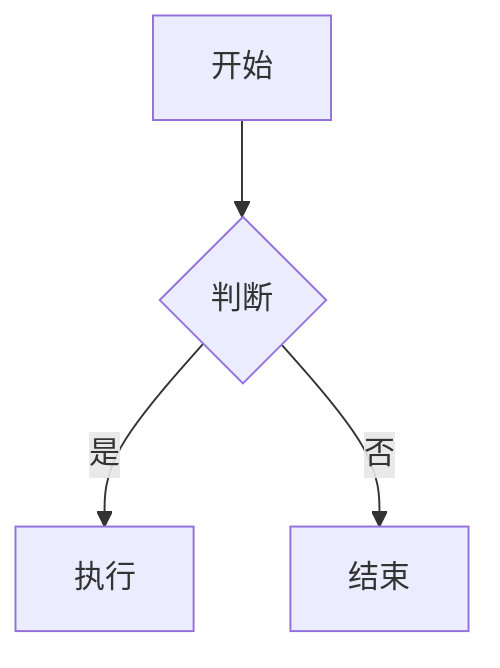

> **简介**：Markdown 是一种轻量级标记语言，它允许人们使用易读易写的纯文本格式编写文档。在 Obsidian 中，它被发挥到了极致。
---
## 1. 文本样式

| **效果**    | **语法符号**   | **显示效果**   |
| --------- | ---------- | ---------- |
| **加粗**    | `**内容**`   | **重点**     |
| _斜体_      | `*内容*`     | _倾斜_       |
| **_粗斜体_** | `***内容***` | **_非常重要_** |
| ~~删除线~~   | `~~内容~~`   | ~~已废弃~~    |
| ==高亮==    | `==内容== `  | ==需注意==    |

## 2. 标题
使用 `#` 的数量来表示标题等级，建议在 `#` 后加一个空格。

```Markdown
# 一级标题 (通常是文章题目)
## 二级标题 (主要章节)
### 三级标题 (子章节)
#### 四级标题
##### 五级标题
###### 六级标题
```

---
## 3. 列表
### 无序列表
使用 `-`、`*` 或 `+` 加上空格。


```Markdown
- 苹果
- 香蕉
  - (按 Tab 键缩进) 香蕉牛奶
```
### 有序列表
使用数字加点 `1.`。
```Markdown
1. 第一步
2. 第二步
```
### 任务列表 (Todo List)
用于管理待办事项。
```Markdown
- [ ] 还没做的事 (空格)
- [x] 已经做完的事 (小写x)
```
- **效果：**
    - [ ] 还没做的事
    - [x] 已经做完的事
---
## 4. 引用与标注
### 基础引用
使用 `>` 符号。
```Markdown
> 这是一段引用名言。
>> 这是一个嵌套引用。
```

### 标注

使用 `> [!类型]` 语法（支持 `NOTE`, `TIP`, `WARNING`, `DANGER`, `TODO` 等）

> [!NOTE] 笔记 (Note)
> 这是一个标准的笔记框。

```Markdown
> [!NOTE]  笔记 (Note)
> 这是一个标准的笔记框。
```

> [!TIP] 提示 (Tip)
> 这是一个提示框，通常用于展示技巧。

```Markdown
> [!TIP] 提示 (Tip)
> 这是一个提示框，通常用于展示技巧。
```

> [!SUCCESS] 成功 (Success)
> 操作成功！颜色通常是绿色的。

```Markdown
> [!SUCCESS] 成功 (Success)
> 操作成功！颜色通常是绿色的。
```

> [!QUESTION] 疑问 (Question)
> 这是一个问题框，你可以用来放 FAQ。

```Markdown
> [!QUESTION] 疑问 (Question)
> 这是一个问题框，你可以用来放 FAQ。
```

> [!WARNING] 警告 (Warning)
> 请注意，这是一个警告框。

```Markdown
> [!WARNING] 警告 (Warning)
> 请注意，这是一个警告框。
```

> [!FAILURE] 失败 (Failure)
> 这是一个表示失败或缺失的框。

```Markdown
> [!FAILURE] 失败 (Failure)
> 这是一个表示失败或缺失的框。
```

> [!DANGER] 危险 (Danger)
> 危险操作！请务必小心。

```Markdown
> [!DANGER] 危险 (Danger)
> 危险操作！请务必小心。
```

> [!BUG] Bug
> 这是一个 Bug 报告框。

```Markdown
> [!BUG] Bug
> 这是一个 Bug 报告框。
```

> [!EXAMPLE] 示例 (Example)
> 这是一个示例框，颜色通常是紫色的。

```Markdown
> [!EXAMPLE] 示例 (Example)
> 这是一个示例框，颜色通常是紫色的。
```
---
## 5. 代码
### 行内代码
使用反引号 ` 包裹内容。
- 输入：`按 \`Ctrl+C` 复制`
- 效果：按 `Ctrl+C` 复制
### 代码块
使用三个反引号 ``` 包裹，并指定语言（如 python, js, c, markdown）以实现语法高亮。
````Markdown
```python
print("Hello World")
def add(a, b):
    return a + b
```
````

---

## 6. 链接与图片
### 标准 Markdown 链接
`[显示文本](链接地址)`
- 示例：`[Google](https://www.google.com)`
### 内部双链 (Obsidian 核心)
使用双中括号链接库内的其他笔记。
- 语法：`[[笔记标题]]`
- 别名：`[[笔记标题|显示的别名]]` (在文章中显示为“显示的别名”，但点击跳转到“笔记标题”)
### 图片
``
- 在线图片：``
- 本地图片 (Obsidian)：`![[图片名.png]]` (直接嵌入本地图片)
- 调整大小 (Obsidian)：`![[图片名.png|100]]` (将宽度调整为 100 像素)
---
## 7. 表格
使用 `|` 分隔列，使用 `-` 分隔表头。
- `:--` 左对齐
- `--:` 右对齐
- `:-:` 居中
```Markdown

| 商品  | 价格    | 库存  |
| :-- | ----- | --: |
| 苹果  | $1    | 500 |
| 电脑  | $1000 | 5   |

```
效果：

| 商品  | 价格    | 库存  |
| :-- | ----- | --: |
| 苹果  | $1    | 500 |
| 电脑  | $1000 | 5   |

### 8. 进阶功能
#### 数学公式 (LaTeX)
使用 `$` 包裹。
- 行内公式：`$E=mc^2$` $\rightarrow$ $E=mc^2$
- 独立公式块：
    ```Markdown
    $$
    \sum_{i=1}^n i = \frac{n(n+1)}{2}
    $$
    ```
        $$
    \sum_{i=1}^n i = \frac{n(n+1)}{2}
    $$
#### 脚注 (Footnotes)
用于添加注释。
```Markdown
这是一个需要解释的词[^1]。

[^1]: 这里是解释的内容。
```
#### 分割线
使用三个或以上的 `-` 或 `*`。
```Markdown
---
```
#### 流程图
Obsidian 原生支持 Mermaid 绘图。
````Mermaid

````


## 9. 转义字符

如果你想打出 Markdown 的关键符号（比如想显示 `*` 而不是变斜体），需要在前面加反斜杠 `\`。

- 输入：`\*这不是斜体\*`
- 效果：\*这不是斜体\*
    