**一、ADC**

**(1)、概述**

信息化时代已经不告而至，我们时时刻刻被各种各样的信号包围，信号本质是表示消息的物理量，如常见的正弦电信号中，不同幅度、不同频率、不同相位则表示不同的消息。以信号为载体的数据可表示现实物理世界中的任何信息，如文字符号、语音图像等，从其特定的表现形式来看，信号可以分为：模拟信号和数字信号。

 如果正在收听卫星广播，那么接收的就是是数字信号，但是如果正在收听AM或者FM，那么接收的是模拟信号。
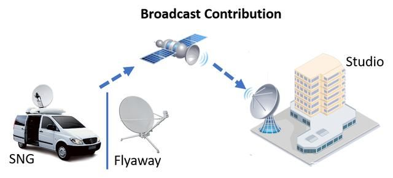

**(2)、模拟信号**

  模拟信号是指用连续变化的物理量表示的信息，其信号的幅度，或频率，或相位随时间作连续变化，或在一段连续的时间间隔内，其代表信息的特征量可以在任意瞬间呈现为任意数值的信号。模拟信号是指用连续变化的物理量所表达的信息，如温度、湿度、压力、长度、电流、电压等等，我们通常又把模拟信号称为连续信号，它在一定的时间范围内可以有无限多个不同的取值。

  ADC，Analog-to-Digital Converter的缩写，指模/数转换器或者模数转换器。是指将连续变化的模拟信号转换为离散的数字信号的器件。真实世界的模拟信号，例如温度、压力、声音或者图像等，需要转换成更容易储存、处理和发射的数字形式。模/数转换器可以实现这个功能，在各种不同的产品中都可以找到它的身影。

  实际生产生活中的各种物理量，如摄相机摄下的图像、录音机录下的声音、车间控制室所记录的压力、流速、转速、湿度等等都是模拟信号。模拟信号传输过程中，先把信息信号转换成几乎“一模一样”的波动电信号(因此叫“模拟”)，再通过有线或无线的方式传输出去，电信号被接收下来后，通过接收设备还原成信息信号。

**优点：**

  模拟信号的主要优点是其精确的分辨率，在理想情况下，它具有无穷大的分辨率。与数字信号相比，模拟信号的信息密度更高。由于不存在量化误差，它可以对自然界物理量的真实值进行尽可能逼近的描述。模拟信号的另一个优点是，当达到相同的效果，模拟信号处理比数字信号处理更简单。模拟信号的处理可以直接通过模拟电路组件（例如运算放大器等）实现，而数字信号处理往往涉及复杂的算法，甚至需要专门的数字信号处理器。

**缺点：**

(1)抗干扰能力弱

  电信号在沿线路的传输过程中会受到外界的通信系统内部的各种噪声干扰，噪声和信号混合后难以分开，从而使得通信质量下降。线路越长，噪声积累也就越多。例如翻录录音带、录像带，每翻录一次，声音、图像质量就差一次，原因就在于此。

(2)保密性差

  模拟通信，尤其是微波通信和有线通信，很容易被窃听。只要收到模拟信号，就容易得到通信的内容。

**模拟信号，就是数值上是连续的，就是数值的数量是无限多。**

**(3)、数字信号**

  **数字信号是在模拟信号的基础上经过采样、量化和编码而形成的。**具体地说，采样就是把输入的模拟信号按适当的时间间隔得到各个时刻的样本值；量化是把经采样测得的各个时刻的值用二进码制来表示；编码则是把量化生成的二进制数排列在一起形成顺序脉冲序列数字信号是用一组特殊的状态来描述信号，**典型的就是当前用最为常见的二进制数字来表示的信号，之所以采用二进制数字表示信号，其根本原因是电路只能表示两种状态，即电路的通与断**。在实际的数字信号传输中，通常是将一定范围的信息变化归类为状态0或状态1，这种状态的设置大大提高了数字信号的抗噪声能力。不仅如此，在保密性、抗干扰、传输质量等方面，数字信号都比模拟信号要好，且更加节约信号传输通道资源。

  数字信号与离散时间信号的区别在因变量。离散时间信号的自变量是离散的、因变量是连续的，其自变量用整数表示，因变量用与物理量大小相对应的数字表示。离散时间信号的大小用有限位二进制数表示后，就是数字信号。

**优点：**

(1) 抗干扰能力强，无噪声积累

  在模拟通信中，为了提高信噪比，需要在信号传输过程中及时对衰减的传输信号进行放大，信号在传输过程中不可避免的将叠加的噪声也同时放大，随着传输距离的增加，噪声积累越来越多，以致传输质量严重恶化。由于数字信号的幅值为有限个离散值(通常取两个幅值)，在传输过程中虽然也受到噪声的干扰，但当信噪比恶化到一定程度时，即在适当的距离采用判决再生的方法，再生成没有噪声干扰的和原发送端一样的数字信号，所以可以实现长距离高质量的传输。

(2) 便于加密处理

  信息传输的安全性和保密性越来越重要，数字通信的加密处理比模拟通信容易得多，以语音信号为例，经过数字变换后的信号可以用简单的数字逻辑运算进行加密、解密处理。

(3) 便于储存、处理和交换

  数字信号形式和计算机所用信号一致，都是二进制代码，因此便于与计算机联网，也便于用计算机对数字信号进行存储、处理和交换，可使通信网的管理、维护实现自动化、智能化。

(4) 设备便于集成化、微型化

  数字信号采用时分多路复用，不需要体积较大的滤波器。设备中大部分电路是数字电路，可用大规模和超大规模集成电路实现，因此体积小、功耗低。

(5) 便于构成综合数字网和综合业务数字网

  采用数字传输方式，可以通过程控数字交换设备进行数字交换，以实现传输和交换的综合。另外，电话业务和各种非话业务都可以实现数字化，构成综合业务数字网。

**缺点：**

  算法复杂。当算法的复杂性越高，所需要的资源越多；反之，当算法所需要的资源越少，算法的复杂性越低。

**数字信号，就是数值是不连续的，就是数值的数量是有限的，不可避免存在失真。**

**(4)、模数转换工作详解**

  模拟数字转换器即A/D转换器，或简称ADC，作用是将时间连续、幅值也连续的模拟信号转换为时间离散、幅值也离散的数字信号，因此，A/D转换一般要经过取样、保持、量化及编码4个过程。在实际电路中，这些过程有的是合并进行的，例如，取样和保持，量化和编码往往都是在转换过程中同时实现的。

  由于数字信号本身不具有实际意义，仅仅表示一个相对大小。故任何一个模数转换器都需要一个参考模拟量作为转换的标准，比较常见的参考标准为最大的可转换信号大小。而输出的数字量则表示输入信号相对于参考信号的大小。

**1、采样和保持**

**采样：**

就是对连续变化的模拟信号进行定时测量，抽取其样值。采样结束后，再将此取样信号保持一段时间，使A/D转换器有充分的时间进行A/D转换。采样－保持电路就是完成该任务的。其中，采样脉冲的频率越高，采样越密，采样值就越多，其采样－保持电路的输出信号就越接近于输入信号的波形。因此，对采样频率就有一定的要求，必须满足采样定理即：

其中fimax 是输入模拟信号频谱中的最高频率。在工程设计中，通常取fs=(3~5倍)fimax。

**采样-保持电路：**

  模拟信号经采样后，得到一系列样值脉冲，采样脉冲的宽度tw一般是很短暂的，在下一个采样脉冲到来之前，应在那时保持取得的样值脉冲幅度不变，以便进行转换。因此，在采样电路之后，须加保持电路。

  保持电路如上图，其中场效应管为采样开关。电容C为保持电容。运放为跟随器，起缓冲隔离作用。

  场效应管开关断开，由于运放输入阻抗很高，MOS管截止电阻也非常高，电容C上的电压可以保持到下一个采样脉冲到来。当下一个采样脉冲到来，场效应管开关又接通，uo又随ui变化而变化。在输入一连串采样脉冲序列后，运放输出一连串样值脉冲。这个样值脉冲是输入模拟量的阶梯波。

**2、量化**

  在A/D转换过程中，要用数字量来表示断续变化的模拟量时，必须将采样-保持电压归化为某个最小单位的整数倍，这个过程称为量化过程。所得的最小单位叫做量化单位。用△表示。

**3、编码**

  把量化的结果用二进制或二-十进制的数表示出来，称为编码。编码输出的最低有效位（LSB）的1所代表的数量大小就等于△。由于模拟信号在时间、数值大小都是连续的，不一定被最小量化单位△整除，所以在量化过程中就可能引入量化误差。如果数字信号的位数越多，量化的误差就越小。例如10位A/D最小量化单位：

把输入信号分为1024层，输入信号分层越多，量化误差越小。即数字量位数越多，量化等级越细。

**(5)、逐次比较型A/D转换器**

逐次比较型A/D转换器由控制电路、数码寄存器、D/A转换器和电压比较器组成。

1、组成部分

2、工作原理

  A/D转换器工作原理可用天平称重过程作比喻说明。若有四个砝码共重15克，每个重量分别为8、4、2、1克。设待称重量W=13克，可以用下表步骤来称量：

| 次数   | 砝码重 | 结论                 | 暂时结果 |
| ------ | ------ | -------------------- | -------- |
| 第一次 | 8克    | 砝码总重 < 待测重量W | 8 克     |
| 第二次 | 加4克  | 砝码总重 < 待测重量W | 12 克    |
| 第三次 | 加2克  | 砝码总重 > 待测重量W | 12 克    |
| 第四次 | 加1克  | 砝码总重 = 待测重量W | 13 克    |

  控制电路使数码寄存器的输出为100，经过D/A转换成相应的电压uo,送到电压比较器于模拟输入电压ui进行比较，若ui>uo ,则通过控制电路将最高位的1保留，反之，则将最高位置0；接着将次高位置1，再经D/A转换为相应的电压uo，重复上一步，根据比较结果决定次高位是1还是0；最后所有位都比较结束后，转换完成。这样数码寄存器中保存的数码就是A/D转换后的输出数码。

3、分辨率

  ADC的分辨率是指输出数字量变化一个最低有效位所对应的输入模拟电压的变化量。如ADC输入模拟电压范围为0到10V，输出为10位二进制数，则分辨率为：

4、转换误差

  转换误差通常以相对误差形式给出，它表示实际输出的数字量和理论输出的数字量之间的误差，一般多以最低有效位的倍数给出。如12位的ADC，输入最大电压是4.096v，则最小LSB是1mv，误差是±3LSB。

5、转换速度

  ADC的转换速度主要取决于转换电路的类型。并联比较型ADC的转换速度最快，如一个8位二进制集成ADC的转换时间可在50ns之内；逐次比较型ADC的转换时间都在10~100us之间，较快的也不会小于1us；双积分型ADC的转换时间多在数十到数百ms之间。

**二、特性(建议看)**

**12位ADC**是逐次趋近型模数转换器。它具有多达 19 个复用通道，可测量来自16个外部源、两个内部源和VBAT通道的信号。这些通道的A/D转换可在单次、连续、扫描或不连续采样模式下进行。ADC的结果存储在一个左对齐或右对齐的16位数据寄存器中。

  ADC具有模拟看门狗特性，允许应用检测输入电压是否超过了用户自定义的阈值上限或下限。

**(1)、主要特性**

-   可配置12位、10位、8位或6位分辨率，默认情况下，转换结果是12位的，但可以通过编程减少有效位数以提高转换速率。
-   单次和连续转换模式
-   双重/三重模式（具有2个或更多ADC的器件提供）
-   双重/三重 ADC 模式下可配置的DMA数据存储
-   双重/三重交替模式下可配置的转换间延迟
-   ADC 电源要求：全速运行时为 2.4 V 到 3.6 V，慢速运行时为 1.8 V
-   ADC 输入范围：VREF- ≤ VIN ≤ VREF+
-   规则通道转换期间可产生DMA请求
-   转换结果可以被设置为在16位寄存器中左对齐或右对齐。

**(2)、分辨率的理解**

**分辨率就是能够读取到的最小值。**

12位分辨率：3300mv/4096=0.8mv，也就是说adc能识别到最小电压值±0.8mv的变化。

10位分辨率：3300mv/1024=3.22mv，也就是说adc能识别到最小电压值有±3.22mv的变化。

8位分辨率：3300mv/256=12mv，也就是说adc能识别到最小电压值有±12mv的变化。

6位分辨率：3300mv/64=51.5625mv，也就是adc能识别到最小电压值有±51.5625mv的变化。

应用场景：例如汽车的油门踏板的灵敏度控制，可以基于不同的ADC分辨率实现。在不少的自动挡汽车中，有标准模式、运动模式的设置。假设标准模式下ADC的分辨率为6位，运动模式下ADC的分辨率为12bit，标准模式往往需要油门踩深点（要识别到51.5625mv的电压变化）才能触发更好的加速，运动模式（识别到0.8mv的电压变化）轻点油门就有很好的加速。

**(3)、转换结果**

STM32F407的ADC模块为12位分辨率，转换结果存储在16位数据寄存器中。左对齐和右对齐决定了12位数据在16位寄存器中的存储方式，直接影响数据的读取和处理逻辑。

**1、右对齐**

-   **数据存储方式**：12位结果存放在寄存器的**低12位**，高4位补0。

-   **数值范围**：0x0000–0x0FFF（对应0–4095）。
-   **特点**：

-   直接反映原始ADC值，无需额外计算。
-   适合需要完整12位精度的应用。

-   **应用场景：**
    -   **高精度测量**如温度传感器（PT100）、压力传感器等需要精确电压值的场景。

// 计算电压值（假设参考电压3.3V） uint16_t adc_value = ADC_GetConversionValue(ADC1); float voltage = (adc_value * 3.3f) / 4095.0f;

-   **低噪声环境**在电源稳定的系统中，充分利用12位分辨率。

**2、左对齐**

-   **数据存储方式**：12位结果存放在寄存器的**高12位**，低4位无效。
-   **数值范围**：0x0000–0xFFF0（步长16，对应0–4095 × 16）。
-   **特点**：
    -   数据左移4位，等效于原始值乘以16。
    -   方便快速获取高8位数据，减少计算步骤。

-   **应用场景：**
    -   快速获取8位数据

uint8_t quick_data = (ADC_GetConversionValue(ADC1) >> 8); // 直接取高8位（等效原始值高4位）

-   直接写入16位PWM寄存器

// 假设PWM占空比寄存器为16位，左对齐数据无需移位 TIM_SetCompare1(TIM1, ADC_GetConversionValue(ADC1));

**(4)、内部框图**

**关键引脚**
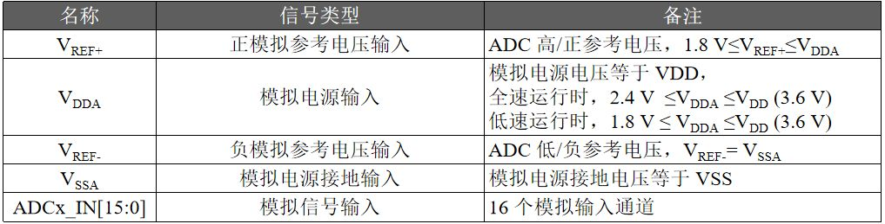

**温度传感器、V****REFINT** **和 V****BAT** **内部通道**

-   对于 STM32F40x 和 STM32F41x 器件，**温度传感器内部连接到通道 ADC1_IN16**。**内部参考电压 VREFINT 连接到 ADC1_IN17**。**VBAT 连接到ADC1_IN18**。
-   对于 STM23F42x 和 STM32F43x 器件，温度传感器内部连接到与 VBAT 共用的通道ADC1_IN18。一次只能选择一个转换（温度传感器或 VBAT）。同时设置了温度传感器 和 VBAT 转换时，将只进行 VBAT 转换。内部参考电压 VREFINT 连接到 ADC1_IN17。VBAT 通道连接到通道 ADC1_IN18。该通道也可转换为注入通道或规则通道。

**注意： 温度传感器、****V****REFINT** **和** **V****BAT** **通道只在主** **ADC1** **外设上可用。**

ADC 在开始精确转换之前需要一段稳定时间 tSTAB。ADC 开始转换并经过多个时钟周期后，EOC 标志置 1，转换结果存放在 16 位 ADC 数据寄存器中
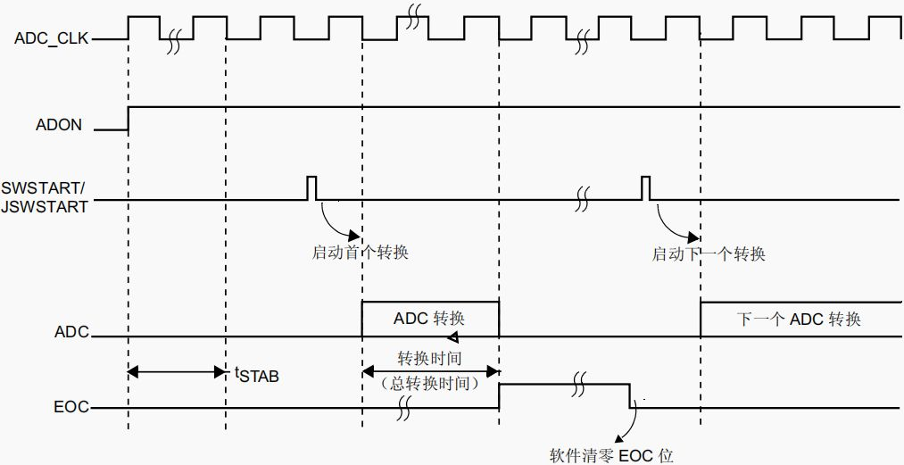

**三、规则通道与注入通道组(建议看)**

在STM32F407微控制器中，ADC转换被组织成两个不同的组：规则通道组和注入通道组。这两种组的设计目的是为了满足不同类型的测量需求，并且它们有不同的触发机制和处理方式。下面分别介绍这两个组的特点：

**(1)、规则通道组 (Regular Channel Group)**

**特点：**

-   顺序执行：规则通道按照用户配置的序列依次进行转换。这意味着你可以设定多个通道，并定义它们的转换顺序。
-   周期性操作：非常适合用于需要定期或周期性采集数据的情况，如温度、湿度等环境参数的监测。
-   自动模式：支持连续转换和扫描模式，在这些模式下，ADC可以自动完成整个规则组的转换而无需CPU干预，提高了效率。
-   中断能力：当规则组转换结束时，可以触发中断，允许软件处理转换结果。

**应用场景举例：**

-   环境监控系统：在一个农业自动化系统中，可能需要定期测量土壤湿度、空气温度和湿度等多个传感器的数据。使用规则通道设置一个包含所有必要传感器输入的序列，然后以固定间隔运行这个序列来收集数据。
-   音频信号处理：在一些简单的音频应用中，可能需要对麦克风输入进行持续采样，这时就可以使用规则通道以固定的速率进行数据采集。

**配置与使用：**

-   规则通道组可以包含最多16个通道。
-   这些**通道可以在连续模式下按顺序转换**。
-   用户可以为每个通道设置不同的采样时间，这有助于优化转换精度和速度之间的平衡。
-   规则通道组的转换可以由软件启动，也可以通过外部触发信号（如定时器中断、外部中断线等）来启动。
-   转换完成后，结果会存储在ADC_DR寄存器中，用户可以通过读取该寄存器来获取转换值。
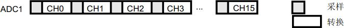

**🔶规则通道组的交替模式**

双重 ADC 模式，出现外部触发之后： ● ADC1 立即启动 ● 经过几个 ADC 时钟周期延迟后 ADC2 启动

三重 ADC 模式，出现外部触发之后： ● ADC1 立即启动 ● 经过几个 ADC 时钟周期延迟后 ADC2 启动 ● 在 ADC2 转换经过几个 ADC 时钟周期的延迟后 ADC3 启动

**交替模式下 2 个转换之间的最小延迟通过 ADC_CCR 寄存器中的 DELAY 位进行配置。**

**(2)、注入通道组 (Injected Channel Group)**

注入通道组允许中断规则通道的转换序列来进行高优先级的转换。换句话说，当有一个注入通道的转换请求时，当前正在进行的规则通道转换会被暂停，先处理注入通道的转换请求。

**特点：**

-   高优先级：注入通道具有比规则通道更高的优先级。一旦有注入通道请求转换，当前正在进行的规则通道转换将被暂停，直到注入通道转换完成。
-   即时响应：适用于需要快速响应特定事件或条件的应用场景，比如检测到异常电压水平时立即进行更详细的分析。
-   独立于规则通道：即使规则通道正在转换，也可以随时启动注入通道转换，这使得它非常适合紧急情况下的快速检查。

**应用场景举例：**

-   故障检测系统：在一个电力监控系统中，通常会有一个规则通道负责常规的电压和电流监测。但如果系统检测到某个关键参数超出正常范围（例如过压），可以通过注入通道立即对相关电路进行详细检查，以便迅速判断是否发生了故障。
-   安全监控：在某些工业环境中，可能需要对设备的关键性能指标进行实时监控。如果某一指标突然发生变化，可以利用注入通道进行额外的检查或诊断，确保系统的安全性。

**配置与使用：**

-   注入通道组可以包含最多4个通道。
-   **这些通道可以在规则通道组转换之间插入进行转换。**
-   注入通道组的转换可以由软件启动，也可以通过外部触发信号来启动。
-   注入通道组的转换结果存储在专门的ADC_JDRx寄存器中。
-   当注入通道转换完成时，会生成一个注入通道结束标志 (ADC_FLAG_JEOC)，这可以用来触发中断或DMA传输。

**(3)、总结**

总的来说，规则通道适合于常规的数据采集需求，而注入通道则提供了一种机制来优先处理紧急或重要的测量任务。根据具体的应用需求，合理配置这两种通道可以有效地提高系统的灵活性和效率。

**四、硬件电路**

注意：参考电压处的跳线帽需要短接

**(1)、实物**

可调电阻的作用等同于初中物理课常见的滑动变阻器，如下图。
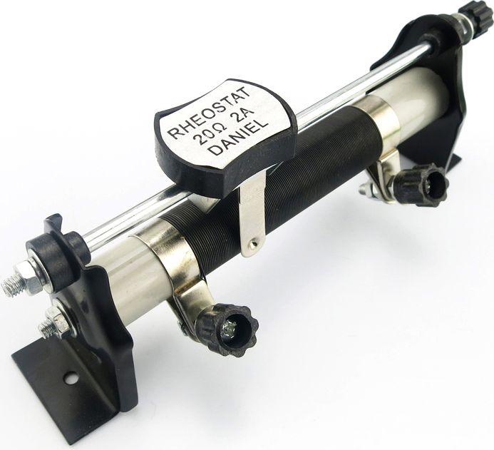

滑动变阻器是一种电阻器，其特点是可以通过手动调节来改变电阻值。它通常由一个电阻体和一个可以在电阻体上滑动的触点（或称作滑块）组成。通过移动滑块的位置，可以改变接入电路中的电阻长度，从而实现电阻值的连续调节。

滑动变阻器常用于实验教学、电子设备调试以及需要调整电阻值的场合中。例如，在调光台灯中，就是通过改变滑动变阻器的电阻值来调整流经灯泡的电流大小，进而实现灯光亮度的调节。在音响设备里，也可用来调整音量大小等。根据不同的使用场景和需求，滑动变阻器有多种型号和规格可供选择。

**(2)、原理图**

**1、VREF（参考电压） 是模数转换器（ADC）的核心参数之一，决定了ADC的量程和转换精度。**

VREF引脚是参考电压，ADC硬件且是独立供电，可以理解为决定了ADC测量的最大值。

VREF引脚的连接是决定当前的电压测量范围0V~3.3V。一般来说，该引脚不能超过芯片的供电电压！

**1、影响转换精度和分辨率**

分辨率：每个数字量级（LSB）对应的最小电压变化：
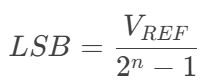

例如，12位ADC，VREF=3.3V时，LSB = 0.8mV。

-   **精度依赖**：VREF的稳定性直接决定ADC的绝对精度。若VREF波动±1%，转换结果也会偏差±1%。

**2、避免电源噪声干扰**

-   **独立参考源**：多数ADC模块提供独立的VREF引脚（而非直接使用电源电压VDD），原因如下：

1.  **电源噪声**：VDD可能受数字电路噪声干扰（如MCU内核、PWM等），导致转换误差。
2.  **电压波动**：电池供电场景中，VDD会随电量下降而降低，影响量程。

-   **典型方案**：使用低噪声、高稳定性的外部基准电压芯片（如REF3033、LM4040）为VREF供电。

**3、实际应用场景**

-   **场景1：小信号测量**若测量传感器输出信号为0~100mV（如热电偶），需选择较小的VREF（如1.2V），以提高分辨率。

-   **场景2：宽动态范围**若输入信号范围较大（如0~10V），需通过分压电路将信号缩放到VREF范围内，并选择匹配的VREF值。

**4、常见问题与解决方案**

-   **问题1：ADC读数跳变严重**
    -   **可能原因**：VREF受电源噪声干扰。
    -   **解决**：为VREF添加滤波电容（如10μF钽电容 + 0.1μF陶瓷电容）。
-   **问题2：测量值随VDD波动**
    -   **可能原因**：错误使用VDD作为VREF。
    -   **解决**：启用独立外部基准源。
-   **问题3：量程不足**
    -   **可能原因**：VREF设置过小，导致输入信号超出范围。
    -   **解决**：调整分压电路或更换更高VREF的基准芯片。

**5、可调电阻用到的引脚**
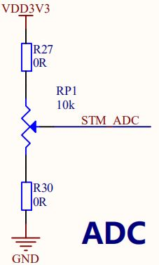

通过了解原理图，不同的引脚支持的ADC是不一样的。

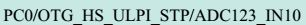
PC0引脚能够使用ADC1、ADC2或ADC3转换器，使用第10个输入通道！

PF10引脚只能够使用ADC3转换器，使用第8个输入通道！

**注意事项：**

1.  如何知道当前是使用哪个ADC硬件，同时使用哪个通道？

答：PA5/ADC12_IN5，表示PA5引脚支持ADC1或ADC2进行扫描，使用通道是第五个输入通道。

1.  存储对齐方式

-   12位数据的右对齐（常用）

-   12位数据的左对齐

思考题：通过ADC硬件获取到的结果值，为什么还得要进行转换为电压值，依据是什么？
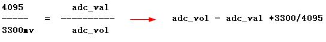

**五、参考代码**

**(1)、 adc初始化**

void adc_init(void) {    //使能端口A的硬件时钟，端口A才能工作    RCC_AHB1PeriphClockCmd(RCC_AHB1Periph_GPIOA,ENABLE);        //使能ADC1的硬件时钟    RCC_APB2PeriphClockCmd(RCC_APB2Periph_ADC1,ENABLE);        GPIO_InitStructure.GPIO_Pin = GPIO_Pin_5;//5号引脚    GPIO_InitStructure.GPIO_Mode = GPIO_Mode_AN;//模拟信号模式    GPIO_Init(GPIOA, &GPIO_InitStructure);        //ADC（ADC1~ADC3）常规参数的配置    ADC_CommonInitStructure.ADC_Mode = ADC_Mode_Independent;//单个ADC工作    ADC_CommonInitStructure.ADC_Prescaler = ADC_Prescaler_Div2;//ADC硬件时钟频率=84MHz/2=42MHz    ADC_CommonInitStructure.ADC_DMAAccessMode = ADC_DMAAccessMode_Disabled;//关闭DMA访问功能    ADC_CommonInitStructure.ADC_TwoSamplingDelay = ADC_TwoSamplingDelay_5Cycles;//面向于双重或三重ADC交错模式的采样间隔    ADC_CommonInit(&ADC_CommonInitStructure);        ADC_InitStructure.ADC_Resolution = ADC_Resolution_12b;//12位的分辨率    ADC_InitStructure.ADC_ScanConvMode = DISABLE;//针对单个通道进行扫描    ADC_InitStructure.ADC_ContinuousConvMode = ENABLE;//当前ADC连续工作；DISABLE就是单次工作，就是转换一次，就停止    ADC_InitStructure.ADC_ExternalTrigConvEdge = ADC_ExternalTrigConvEdge_None;//不需要外部脉冲触发工作    ADC_InitStructure.ADC_ExternalTrigConv = ADC_ExternalTrigConv_T1_CC1;//ADC_ExternalTrigConvEdge没有生效，该成员怎么配置都不会生效    ADC_InitStructure.ADC_DataAlign = ADC_DataAlign_Right;//转换结果值在数据寄存器中右对齐存储    ADC_InitStructure.ADC_NbrOfConversion = 1;//ADC_ScanConvMode成员若是ENABLE，这里指定ADC扫描多少个通道    ADC_Init(ADC1, &ADC_InitStructure);        //ADC1对输入通道5进行转换，扫描顺序为1，采样时间为3个ADC时间周期（采样时间越长，精度越高）    ADC_RegularChannelConfig(ADC1, ADC_Channel_5, 1, ADC_SampleTime_3Cycles);        //使能ADC1工作    ADC_Cmd(ADC1, ENABLE); }

**💡不同采样时间对ADC性能的影响**

**采样时间**（𝑇𝑠𝑎𝑚）是指ADC对输入模拟信号进行采样的持续时间。在此时间内，ADC内部的采样保持电容（𝐶𝐻𝑂𝐿𝐷）需充电至输入电压的稳定值。若时间不足，电容未充满，转换结果将出现偏差。

**平衡速度与精度**

-   采样时间越短，ADC转换速率越高，但可能牺牲精度；
-   采样时间越长，转换结果越精确，但整体转换速度降低。

**支持的采样周期选项**

STM32F4的ADC通道可配置以下采样时间：

-   3 cycles（最快，适合低阻抗信号）
-   15 cycles
-   28 cycles
-   56 cycles
-   84 cycles
-   112 cycles
-   144 cycles
-   480 cycles（最慢，适合高阻抗信号）

**1. 高阻抗信号源（如传感器）**

**场景**：温度传感器（PT100）输出阻抗较高（约10kΩ）。

**计算**：

𝑇𝑠𝑎𝑚(𝑚𝑖𝑛)=(10𝑘Ω+1𝑘Ω)×(4𝑝𝐹)×8.32≈3.67𝜇𝑠

若ADC时钟为21MHz（𝑇𝐴𝐷𝐶_𝐶𝐿𝐾=47.6𝑛𝑠）：

𝑁𝑐𝑦𝑐𝑙𝑒𝑠=3.67𝜇𝑠/47.6𝑛𝑠≈77→选择84𝑐𝑦𝑐𝑙𝑒𝑠（4.0𝜇𝑠）

**2.低阻抗信号源（如运放输出）**

**场景**：运算放大器输出阻抗低（<100Ω）。

**计算**：

𝑇𝑠𝑎𝑚(𝑚𝑖𝑛)=(100Ω+1𝑘Ω)×4𝑝𝐹×8.32≈0.037𝜇𝑠

若ADC时钟为21MHz：

𝑁𝑐𝑦𝑐𝑙𝑒𝑠=0.037𝜇𝑠/47.6𝑛𝑠≈0.78→选择3𝑐𝑦𝑐𝑙𝑒𝑠（0.14𝜇𝑠）

**3.噪声环境下的信号采集**

-   **场景**：工业环境中存在高频噪声。
-   **策略**：增加采样时间至144 cycles（6.86μs），通过均值滤波提升抗噪能力。

**设计原则**：

-   高阻抗信号 → 长采样时间（84~480 cycles）
-   低阻抗信号 → 短采样时间（3~28 cycles）

**4.采样时间不足的后果**

1.  **非线性误差**

-   输入信号未稳定时，ADC转换结果偏离真实值，表现为非线性误差（如0.5 LSB的偏差）。

1.  **随机噪声放大**

-   短采样时间对噪声敏感，导致输出值波动增大。

1.  **案例实测**

-   使用信号发生器输入1kHz正弦波（幅值3.3V），比较不同采样时间的ADC输出：

| **采样周期** | **SNR（dB）** | **有效位数（ENOB）** |
| ------------ | ------------- | -------------------- |
| 3 cycles     | 62.1          | 9.8 bits             |
| 84 cycles    | 73.5          | 11.4 bits            |

💡**转换时间计算**

**《STM32F4xx中文参考手册》P256 11.5小节**

转换时间：（采样时间+12）/ADC时钟频率=转换时间

假如代码配置如下：

选择4分频：21Mhz(F407ADC在2.4-3.6V供电电压下最大速率36M,稳定速度为30M)

配置采样时间：ADC SampleTime28 Cycles

单次采样：(28+12)/21=1.904uS

规则通道序列长度(Regular channel sequence length)设置为16

总时间为：16*1.904=30.464us

**(2)、adc转换**

int main(void) {    uint16_t adc_val;    uint16_t adc_vol;        //串口1的波特率初始化为115200bps    usart1_init(115200);        printf("This is adc test\r\n");        adc_init();            //软件启动ADC1的转换    ADC_SoftwareStartConv(ADC1);        //死循环（不可退出的循环）        while(1)    {        //等待ADC转换完毕        while(ADC_GetFlagStatus(ADC1,ADC_FLAG_EOC)==RESET);                //清空标志位        ADC_ClearFlag(ADC1,ADC_FLAG_EOC);                //获取转换结果        adc_val=ADC_GetConversionValue(ADC1);                printf("adc val:%hd\r\n",adc_val);                //将转换结果换算为电压值        adc_vol = adc_val * 3300 / 4095;        printf("adc vol:%hd mv\r\n",adc_vol);                        delay_ms(1000);    } }

**六、光敏电阻**

**光敏电阻的工作原理：**光照时，电阻值很小；无光照时，电阻值很大（常为10KΩ）。光照越强，电阻越小；光照停止，电阻又恢复原值。

应用案例：

手机屏幕自动亮度，根据的光照的强度来动态调整手机屏幕的亮度。

1.  硬件实物

1.  原理图

1.  原理图-常见锂电池供电电路电量测量

假设电池供电最高4.2V，最低3.3V（当3.3V时就断电）ADC为12 位。

10K/(10K+33K)约等于0.2325。

电池最高时:0.2325*4.2V约等于976mV。

电池最低时:0.2325*3.3V约等于767mV。

假设976mV为电量百分比100%，767mV为电量百分比1%，即每步进1%，电压值步进2.09mV。

当前检测到的电压为800mV，则电量百分比=（800mV-767mV）/2.09mV≈15.79%。

**七、应用领域**

1.万用表

2.示波器
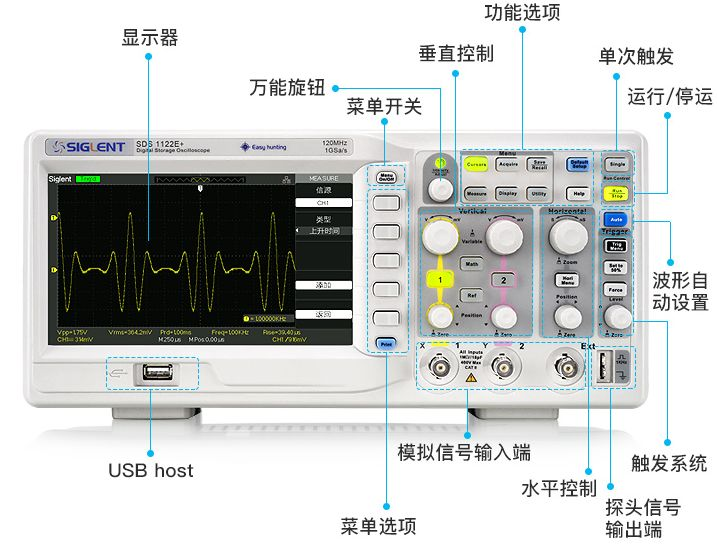

3.电量检测

4.汽车进入隧道自动打开大灯（可使用光敏电阻）

5.智能灯光系统（采用灵敏度更高的光强传感器）

6.手机/平板/电脑等电子设备的屏幕自动亮度，实现显示管理，延长续航（采用灵敏度更高的光强传感器）

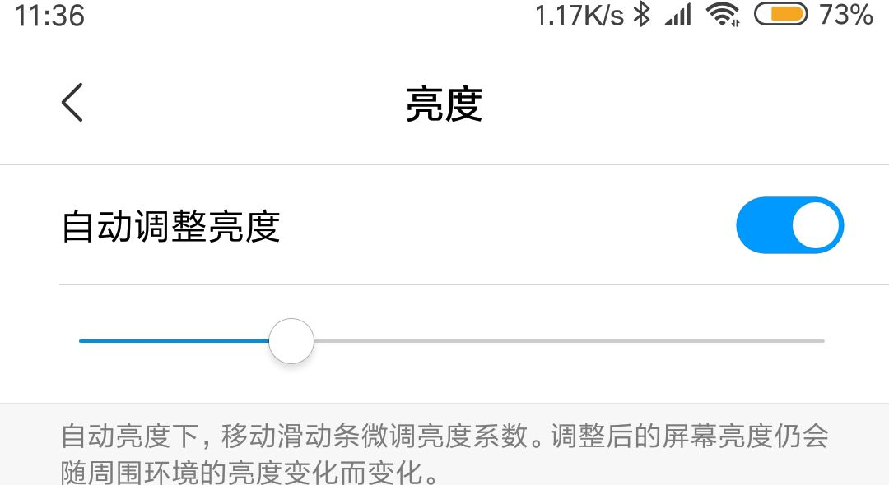
6.USB测试仪

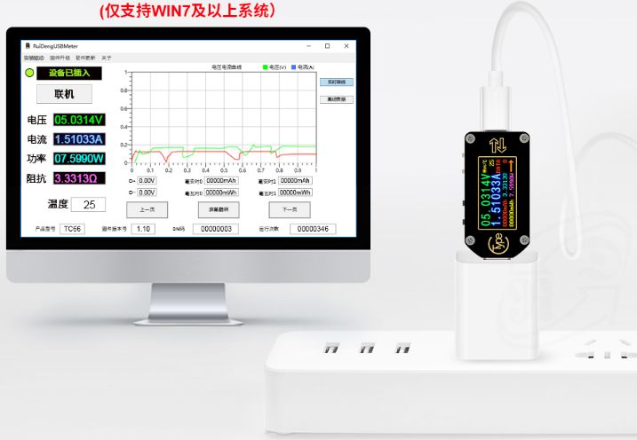

7.脉搏传感器，测量心率

8.摇杆控制

🔸游戏摇杆

🔸大疆无人机无线控制摇杆

🔸手机自拍杆摇杆

