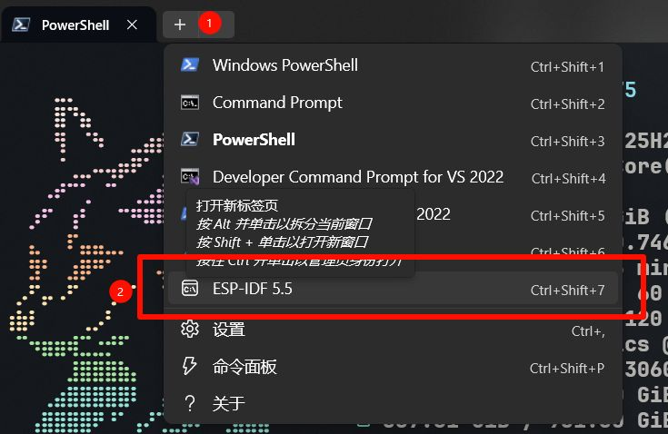

## ESP 安装
## ESP-IDF 命令行

| **功能**     | **命令 (idf.py)**                               | **备注 / 说明**                                                        |
| ---------- | --------------------------------------------- | ------------------------------------------------------------------ |
| **创建新工程**  | `idf.py create-project --path <project name>` | 默认生成的工程目标芯片为 ESP32                                                 |
| **设置目标芯片** | `idf.py set-target <target>`                  | `<target>` 可替换为 `esp32s3`, `esp32p4` 等                             |
| **创建新的组件** | `idf.py create-component <component name>`    | 用于创建外设驱动或自定义模块                                                     |
| **编译工程**   | `idf.py build`                                | 构建当前项目                                                             |
| **监控项目工程** | `idf.py monitor`                              | 查看串口日志输出。 退出监控的快捷键为 **`Ctrl + ]`**                              |
| **配置项目**   | `idf.py menuconfig`                           | 进入图形化配置界面 (Kconfig)                                                |
| **下载程序**   | `idf.py -p COMx flash`                        | **`COMx`** 需替换为实际端口号 (如 Windows 下的 COM3，Linux/Mac 下的 /dev/ttyUSB0) |
| **清除编译文件** | `idf.py fullclean` `idf.py clean`          | `fullclean`: 全部清除 (包含配置) `clean`: 部分清除 (仅构建文件)                  |
> [!tip]
> 使用命令行需打开 ESP-IDF 无法直接在 PowerShell 中运行

## Vscode 开发
