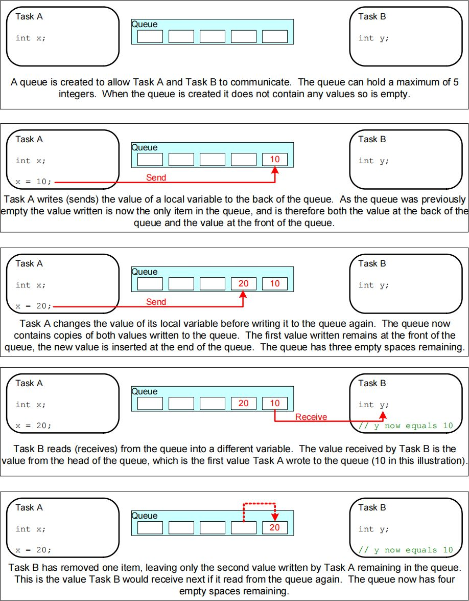
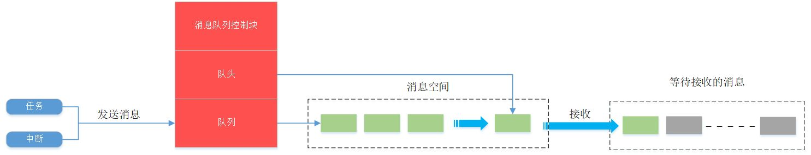

## FreeRTOS 消息队列

在嵌入式实时系统的复杂架构中，任务与任务之间、中断与任务之间的数据交互是系统的“血脉”。FreeRTOS 提供的**消息队列（Queue）**，凭借其线程安全、异步解耦和灵活的阻塞机制，成为了实现这些交互的首选方案。它不仅解决了数据传递的问题，更充当了平滑系统负荷的缓冲地带。

## 概述

**消息队列**是一种常用于任务间通信的数据结构，它允许任务以“发送”和“接收”的方式传递不固定长度的数据消息。

### 核心机制
*   **异步解耦**：发送方只需将数据投入队列，无需等待接收方立即处理；接收方可以在准备好时再去提取数据。
*   **阻塞机制**：
    *   **读阻塞**：当队列为空时，读取任务可以进入**阻塞态**（不消耗 CPU），等待新消息到来。
    *   **写阻塞**：当队列已满时，写入任务也可以进入阻塞态，等待队列腾出空间。
    *   **超时控制**：用户可以指定阻塞的最大时间（`xTicksToWait`），避免死等。
*   **排队策略**：
    *   **FIFO（先进先出）**：默认策略，保证数据处理的顺序性。
    *   **LIFO（后进先出）**：支持将紧急消息发送到队首，优先处理。

### 关键特性
1.  **灵活性**：支持任意类型、任意长度（不超过节点限制）的消息。
2.  **多对多**：一个队列可以被多个任务写入，也可以被多个任务读取（虽然多读场景较少见）。
3.  **内存管理**：队列创建时自动分配内存，删除时释放，无需用户手动管理内部缓冲区。
4.  **拷贝传输**：FreeRTOS 默认采用**值拷贝**（By Value）方式，这意味着写入队列的是数据的副本，而非引用。

> [!NOTE] 值拷贝 vs 引用拷贝
> *   **值拷贝**：安全，原始变量被修改或销毁不影响队列中的数据。适合小数据（如传感器读数、状态码）。
> *   **引用拷贝**：即传递指针。适合大数据（如图像缓冲区、长字符串）。**注意**：传递指针时必须确保接收方处理数据前，该指针指向的内存是有效的（避免传递局部变量地址）。

### 运作机制

#### 内存模型
创建队列时，FreeRTOS 会一次性分配一块连续内存。这块内存包含两部分：
* **队列控制块（Queue Control Block）**：存储头尾指针、消息大小、队列长度等元数据。
* **消息存储区**：大小 = `队列长度` × `单个消息大小`。

这种“一次性分配”策略避免了运行时的内存碎片问题，但也意味着队列容量在创建后是固定的。

#### 阻塞与唤醒
* **入队（Send）**：若队列未满，数据拷贝至队尾（或队首）；若队列已满且设置了阻塞时间，任务挂起。一旦有任务取走数据，等待写入的最高优先级任务会被唤醒。
* **出队（Receive）**：若队列非空，数据拷贝至用户 buffer 并从队列删除；若队列为空且设置了阻塞时间，任务挂起。一旦有新数据写入，等待读取的最高优先级任务会被唤醒。

#### 紧急消息通道
标准 API `xQueueSendToFront` 允许将消息直接插入**队首**。这在处理高优先级事件（如急停指令、故障中断）时非常有用，确保接收方下一次读取时最先获取该消息。


### 应用场景

1.  **任务间数据传输**：例如，采集任务读取 ADC 数据发送到队列，处理任务从队列取出数据进行滤波和计算。
2.  **中断与任务通信**：ISR（中断服务程序）快速响应硬件事件，将数据或标志写入队列，触发后台任务进行耗时处理（推迟处理机制）。
3.  **命令解析**：串口接收中断将字节流拼装成帧放入队列，命令解析任务从队列读取完整指令执行。

## 函数接口

### 动态创建消息队列：`xQueueCreate`
- **函数原型**：
  ```c
  QueueHandle_t xQueueCreate( 
      UBaseType_t uxQueueLength, 
      UBaseType_t uxItemSize 
  );
  ```
- **功能描述**：动态分配内存并创建一个新的队列。
- **参数详解**：
    - `uxQueueLength`：队列深度（最大能容纳的消息个数）。
    - `uxItemSize`：每个消息的大小（字节）。**务必准确**，否则数据存取会越界或截断。
- **返回值**：
    - **成功**：返回队列句柄。
    - **失败**：返回 `NULL`（堆内存不足）。
### 静态创建消息队列：`xQueueCreateStatic`
- **函数原型**：
  ```c
  QueueHandle_t xQueueCreateStatic(
      UBaseType_t uxQueueLength, 
      UBaseType_t uxItemSize, 
      uint8_t *pucQueueStorageBuffer, 
      StaticQueue_t *pxQueueBuffer 
  );
  ```
- **功能描述**：使用用户预分配的静态内存创建一个新的队列。
- **参数详解**：
    - `uxQueueLength`：队列深度。
    - `uxItemSize`：每个消息单元的大小（字节）。
    - `pucQueueStorageBuffer`：指向一个 `uint8_t` 类型的数组，该数组大小至少为 `uxQueueLength * uxItemSize` 字节。当 `uxItemSize` 为 0 时，此参数可为 `NULL`。
    - `pxQueueBuffer`：指向 `StaticQueue_t` 类型的变量，用于存储队列的控制块结构数据。
- **返回值**：
    - **成功**：返回一个有效队列句柄。
    - **失败**：返回 `NULL`（极为罕见，通常仅在参数校验失败时发生）

### 队尾发送消息：`xQueueSend`
- **函数原型**：
  ```c
  BaseType_t xQueueSend( 
      QueueHandle_t xQueue, 
      const void * pvItemToQueue, 
      TickType_t xTicksToWait 
  );
  ```
- **功能描述**：向队列**尾部**发送消息。等同于 `xQueueSendToBack`。
- **参数详解**：
    - `xQueue`：队列句柄。
    - `pvItemToQueue`：数据指针。系统会将该指针指向的内容拷贝 `uxItemSize` 字节到队列。
    - `xTicksToWait`：阻塞超时时间（Tick）。`0` 表示不等待，`portMAX_DELAY` 表示死等（需开启 `INCLUDE_vTaskSuspend`）。
- **返回值**：`pdTRUE`（发送成功）或 `errQUEUE_FULL`（队列满）。

### 队首发送消息（紧急）：`xQueueSendToFront`
- **函数原型**：
  ```c
  BaseType_t xQueueSendToFront( 
      QueueHandle_t xQueue, 
      const void * pvItemToQueue, 
      TickType_t xTicksToWait 
  );
  ```
- **功能描述**：向队列**头部**发送消息，实现 LIFO 或紧急插入。
- **参数详解**：
    - `xQueue`：目标队列的句柄。
    - `pvItemToQueue`：指向要发送数据的指针。
    - `xTicksToWait`：阻塞超时时间（同 `xQueueSend`）。
- **返回值**：`pdTRUE`（发送成功）或 `errQUEUE_FULL`（队列满）。

### 接收并删除消息：`xQueueReceive`
- **函数原型**：
  ```c
  BaseType_t xQueueReceive( 
      QueueHandle_t xQueue, 
      void *pvBuffer, 
      TickType_t xTicksToWait 
  );
  ```
- **功能描述**：从队列头部读取一条消息，并将其**从队列中移除**。
- **参数详解**：
	- `xQueue`：队列句柄。
    - `pvBuffer`：接收缓存区指针。必须确保该缓冲区至少能容纳 `uxItemSize` 字节。
    - `xTicksToWait`：阻塞超时时间（Tick）。
- **返回值**：
	- `pdTRUE`：成功接收到消息。
	- `pdFALSE`：队列为空，未接收到消息。

### 窥视消息（不删除）：`xQueuePeek`
- **函数原型**：
  ```c
  BaseType_t xQueuePeek( 
      QueueHandle_t xQueue, 
      void *pvBuffer, 
      TickType_t xTicksToWait 
  );
  ```
- **功能描述**：从队列头部读取一条消息，但**不从队列中删除它**。下一次读取仍然是这条消息。
- **参数详解**：
    - `xQueue`：目标队列的句柄。
    - `pvBuffer`：指向保存数据的缓冲区。
    - `xTicksToWait`：阻塞超时时间（同 `xQueueReceive`）。
- **返回值**：
    - `pdTRUE`：成功窥视到消息。
    - `pdFALSE`：队列为空。

---

### 中断中的操作（ISR API）
> [!WARNING] 中断安全原则
> 在 ISR 中绝不能使用带阻塞时间的普通 API，必须使用 `FromISR` 后缀的函数，且不能设置阻塞时间。

### 中断发送：`xQueueSendFromISR`
- **函数原型**：
  ```c
  BaseType_t xQueueSendFromISR( 
      QueueHandle_t xQueue, 
      const void *pvItemToQueue, 
      BaseType_t *pxHigherPriorityTaskWoken 
  );
  ```
- **参数详解**：
    - `pxHigherPriorityTaskWoken`：**出参**。若入队操作唤醒了一个优先级高于当前运行任务的任务，该值会被置为 `pdTRUE`。
- **注意事项**：如果不为 `NULL`，需要在 ISR 退出前根据该标志调用 `portYIELD_FROM_ISR()` 进行上下文切换，以确保高优先级任务立即响应。

### 中断接收：`xQueueReceiveFromISR`
- **函数原型**：
  ```c
  BaseType_t xQueueReceiveFromISR( 
      QueueHandle_t xQueue, 
      void *pvBuffer, 
      BaseType_t *pxHigherPriorityTaskWoken 
  );
  ```
- **功能描述**：在中断中读取数据（较少用，通常中断是生产者）。

### 毫秒转节拍宏：`pdMS_TO_TICKS`
- **函数原型**：
  ```c
  TickType_t pdMS_TO_TICKS( uint32_t xTimeInMs );
  ```
- **功能描述**：辅助宏，用于将毫秒（ms）时间转换为系统节拍数（Ticks）。仅在 FreeRTOS V 8.1.0 及以上版本可用。
- **参数详解**：
    - `xTimeInMs`：时间，单位为毫秒。
- **返回值**：
    - 对应的系统节拍数 `TickType_t`。
- **使用示例**：
    ```c
    const TickType_t xTicksToWait = pdMS_TO_TICKS( 100 ); // 等待 100ms
    ```
## 注意事项

1.  **先创建后使用**：务必在使用任何队列操作函数前检查队列是否创建成功。
2.  **缓冲区大小匹配**：`uxItemSize` 必须与实际数据结构大小严格一致。接收端的 buffer 也不得小于此大小，否则会发生内存踩踏。
3.  **大数据的处理**：传输结构体、大数组时，强烈建议**传输指针**而非数据本身，以减少内存拷贝开销。但必须注意指针生命周期问题（不要传栈变量指针）。
4.  **优先级翻转风险**：虽然队列是线程安全的，但如果低优先级任务填满了队列，高优先级任务可能会因为写不进去而阻塞。需要合理设计队列深度。
5.  **独立对象**：队列不属于任何任务，任何知道句柄的任务都可以访问它。

## 实战代码范例

### 任务间通信（Task to Task）
任务 1 构造字符串消息，任务 2 接收并打印。

```c
#define QUEUE_LEN  4
#define QUEUE_SIZE 64 // 消息最大字节数

QueueHandle_t Test_Queue = NULL;

int main(void) {
    // 1. 创建队列
    Test_Queue = xQueueCreate(QUEUE_LEN, QUEUE_SIZE);
    if (Test_Queue == NULL) {
        printf("Queue Creation Failed!\r\n");
    }
    // ... 创建任务 ...
}

/* 发送任务 */
static void app_task1(void* pvParameters) {
    char buf[QUEUE_SIZE] = {0};
    uint32_t task_cnt = 0;

    for(;;) {
        task_cnt++;
        sprintf(buf, "Message from Task1: %d", task_cnt);
        
        // 发送消息，如果满则等待 100 Ticks
        if (xQueueSend(Test_Queue, buf, 100) == pdPASS) {
            printf("[Task1] Send Success\r\n");
        } else {
            printf("[Task1] Send Failed (Full)\r\n");
        }
        
        vTaskDelay(3000);
    }
}

/* 接收任务 */
static void app_task2(void* pvParameters) {
    uint8_t recv_buf[QUEUE_SIZE] = {0};

    for(;;) {
        // 接收消息，如果空则死等 (portMAX_DELAY)
        if (xQueueReceive(Test_Queue, recv_buf, portMAX_DELAY) == pdTRUE) {
            printf("[Task2] Received: %s\r\n", recv_buf);
        }
        
        memset(recv_buf, 0, QUEUE_SIZE);
    }
}
```

### 中断到任务（ISR to Task）
串口中断接收数据，通过队列转发给任务处理。

```c
/* 串口中断服务函数 */
void USART1_IRQHandler(void) {
    uint8_t d;
    BaseType_t xHigherPriorityTaskWoken = pdFALSE;
    uint32_t ulReturn;

    // 进入临界区（视具体移植实现而定，通常ISR不需要全临界区，此处仅为示例）
    ulReturn = taskENTER_CRITICAL_FROM_ISR();

    if(USART_GetITStatus(USART1, USART_IT_RXNE) != RESET) {
        d = USART_ReceiveData(USART1);
        
        // 简单示例：将接收到的单字节发送到队列
        // 注意：实际应用中可能需要缓冲区累积一帧后再发送
        xQueueSendFromISR(Test_Queue, &d, &xHigherPriorityTaskWoken);
        
        USART_ClearITPendingBit(USART1, USART_IT_RXNE);
    }

    taskEXIT_CRITICAL_FROM_ISR(ulReturn);

    // 如果发送导致高优先级任务就绪，立即切换上下文
    portYIELD_FROM_ISR(xHigherPriorityTaskWoken);
}
```

通过合理使用消息队列，我们可以将复杂的系统解耦为若干个独立的生产者和消费者，极大地提高了代码的可维护性和系统的稳定性。