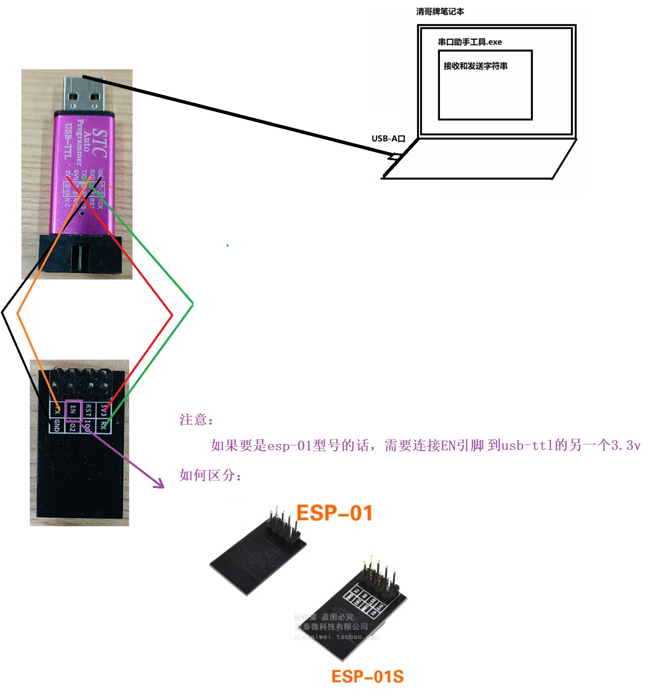
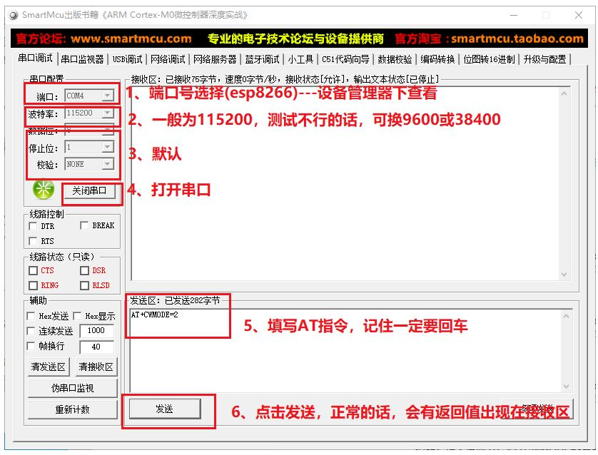
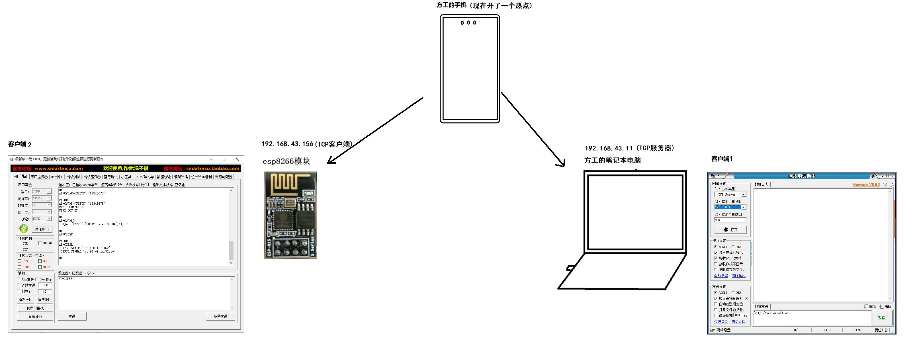
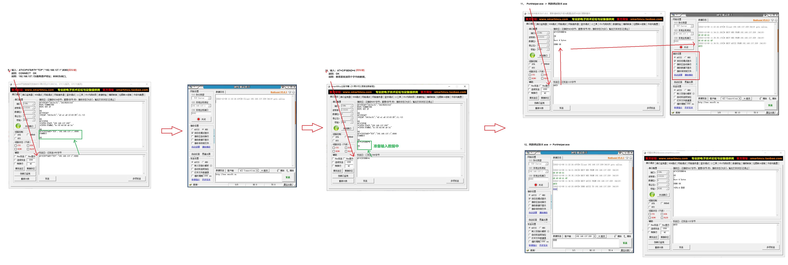
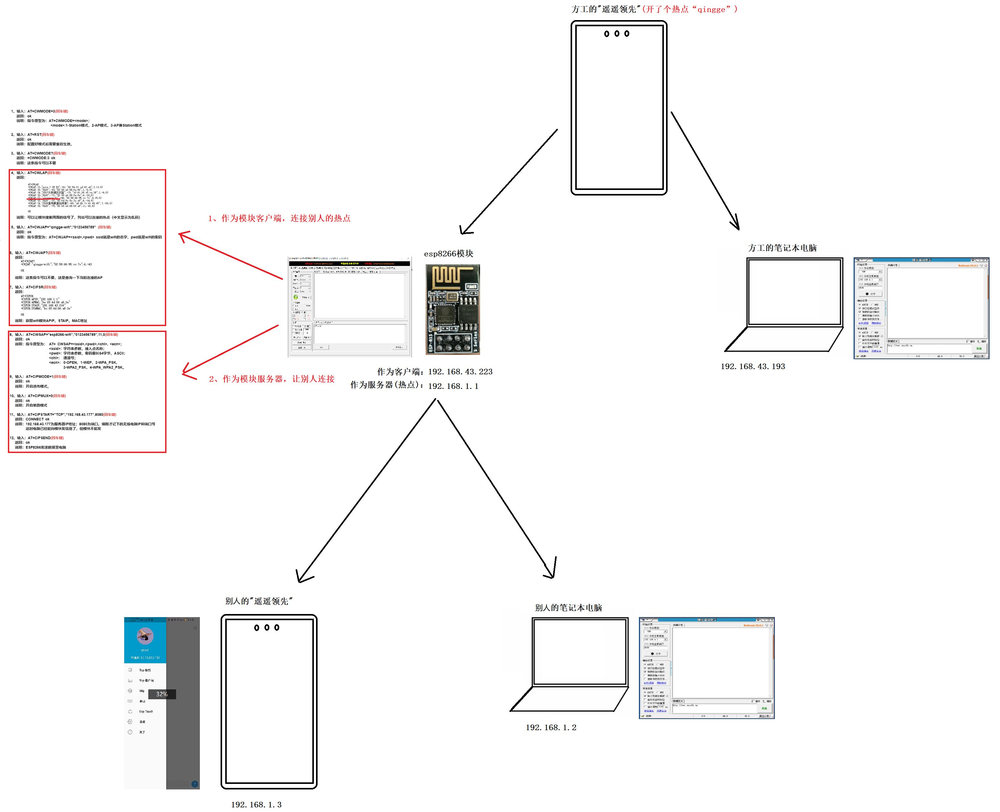
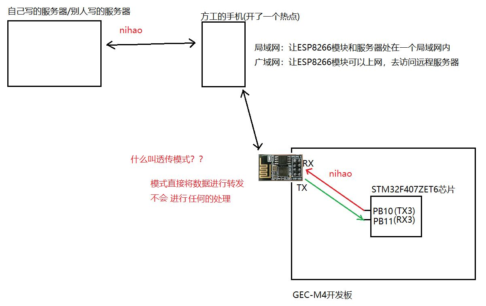

## 深入浅出 ESP8266：从底层硬件连接到多模式 AT 指令实战

在嵌入式开发和物联网（IoT）原型设计中，ESP8266 凭借其极高的性价比和成熟的 AT 指令集，成为了串行通讯转 Wi-Fi 方案的首选。本文将基于实战经验，深度解析 ESP8266 的硬件部署、AT 指令交互逻辑以及三种核心工作模式的应用场景。

---

### 一、 硬件层

在进行软件调试前，稳健的物理连接是成功的一半。ESP8266 对电源质量较为敏感，且 I/O 逻辑电平为 3.3V。

#### 通过 USB-to-TTL 模块直接调试
这是开发初期最常用的方案。使用上位机串口助手直接下发指令：
- **接线逻辑**：遵循交叉连接原则，即 USB-TTL 的 TX 端接 ESP8266 的 RX 端，RX 端接 ESP8266 的 TX 端
- **供电要求**：ESP8266 在连接 Wi-Fi 瞬时的功耗可能激增至 200mA 以上，建议使用独立的 3.3V 稳压模块供电，若 USB-TTL 模块输出电流不足，会导致频繁重启

#### 基于单片机（STM32）
当 ESP8266 作为外设接入单片机系统时：
- **EN 引脚处理**：对于非 ESP-01S 版本的模块（如经典的 ESP-01），必须将 **EN（CH_PD）引脚接 3.3V 高电平**才能激活内部调节器使模块正常工作
- **电平匹配**：若使用 5V 的单片机（如部分 51 单片机或 Arduino Uno），需在 RX/TX 链路上增加电平转换电路或分压电阻，防止长期高压损坏模块
    

> [!NOTE] [此处插入图片：ESP-01 模块与 STM32 开发板连接原理图，标注 EN 引脚连接 3.3V 的细节]

---

### 二、 软件层：串口配置与初始交互

ESP8266 出厂默认通常采用 **115200** 或 **9600** 的波特率。
1. **串口助手设置**：打开串口工具，选择对应的 COM 口。
2. **指令格式**：所有 AT 指令必须以回车换行（CRLF，即 `\r\n`）结尾。在串口助手中，请勾选“发送新行”或“加回车换行”选项
3. **初测指令**：发送 `AT`，若返回 `OK`，则说明物理链路与逻辑配置均正常

---

### STATION 模式（客户端模式）
在 STA 模式下，ESP8266 作为一个终端设备（如手机或笔记本）连接到路由器。
#### 核心配置指令链路
1. **设置模式**：`AT+CWMODE=1`（1: Station, 2: AP, 3: Station+AP）。
2. **重启生效**：`AT+RST`。由于模式切换涉及内核协议栈的重读，重启是保证配置完全生效的必要手段。
3. **确认模式**：发送 `AT+CWMODE?`，若返回 `+CWMODE:1`，说明模式切换成功。
4. **扫描 AP**：`AT+CWLAP`。模块会列出当前环境下的所有 SSID。
5. **连接 Wi-Fi**：`AT+CWJAP="ssid","password"`。
    - _注意_：ESP8266 通常仅支持 2.4GHz 频段，不支持 5GHz 频段
#### 进阶网络配置
- **查询状态**：`AT+CWJAP?` 可查看当前连接的 AP 名称。
- **查询 IP 信息**：`AT+CIFSR`。返回结果包含本地 Station IP（STAIP）和 MAC 地址。
- **设置静态 IP**：`AT+CIPSTA_CUR="192.168.137.100","192.168.137.1","255.255.255.0"`。在某些需要固定地址进行 TCP 通信的场景中，手动分配 IP 可以避免 DHCP 租约过期导致的地址漂移。
    

#### 3.3 通信验证

配置完成后，可通过 PC 端命令行执行 `ping 192.168.137.100`。若有数据包回显，证明网络层已打通。此时，可使用串口助手（模块端）与网络调试助手（PC 端）进行数据收发实验。
连接说明：

互发消息：

---

### 四、 AP 模式（接入点模式）

在此模式下，ESP8266 充当热点，允许其他设备接入，常用于配置界面或点对点通信。
#### 4.1 核心配置指令链路
1. **设置模式**：`AT+CWMODE=2`。
2. **配置热点参数**：`AT+CWSAP="SSID","PWD",11,0`。
    - 参数含义：`SSID`, `密码`, `通道号`, `加密方式`（0:OPEN, 2:WPA_PSK, 3:WPA2_PSK, 4:WPA_WPA2_PSK）。
        
3. **使能多连接**：`AT+CIPMUX=1`。开启服务器模式的前提是必须允许多个客户端接入。
    
4. **启动 Server**：`AT+CIPSERVER=1,8080`。开启 TCP 服务器，监听 8080 端口。
    

#### 4.2 数据交互逻辑

- **发送数据**：`AT+CIPSEND=0,10`。
    
    - `0` 代表连接 ID（由于是多连接，必须指定发给哪个客户端）。
        
    - `10` 代表发送的数据长度。
        
    - 输入该指令后，出现 `>` 符号，此时输入 10 字节数据即可发送。
        

> [!IMPORTANT] ESP8266 作为服务器时，若客户端长时间无心跳，模块会自动断开连接以释放资源，可通过 `AT+CIPSTO` 设置超时时间（0~2880 秒）。

---

### STATION + AP 混合模式

模式 `AT+CWMODE=3` 允许模块同时扮演路由器（AP）和终端（STA）的角色。
- **应用场景**：Wi-Fi 信号中继器或网关。模块可以连接外部路由器获取互联网数据，同时生成一个本地热点供传感器节点接入
- **网络拓扑**：此时模块拥有两套 IP 地址：一套是外部路由器分配给它的 STAIP，另一套是它分配给下级接入设备的网关 IP（默认为 192.168.4.1）

---
#### 透传模式

在传统的 AT 模式下，每次发数据都要带长度参数，这在处理流式数据时效率低下。
- **开启条件**：必须在**单连接模式**（`AT+CIPMUX=0`）下使用。
- **优势**：发送 `AT+CIPMODE=1` 进入透传后，用户发送的所有内容都会被直接转发至远端，无需再使用 `AT+CIPSEND`。这使得 ESP8266 表现得就像一根“隐形的串口线”，非常适合传感器原始数据的实时传输
- **退出方式**：在透传状态下，发送不带回车的 `+++` 序列即可回到指令模式

    

---

**下一步您可以：**

- 如果您需要将 ESP8266 接入云平台（如阿里云 IoT 或 MQTT 协议），我可以为您提供专用的 AT 指令流。
    
- 如果您正在编写 STM32 驱动程序，我可以为您展示如何通过代码解析 `+IPD` 串口回传数据。