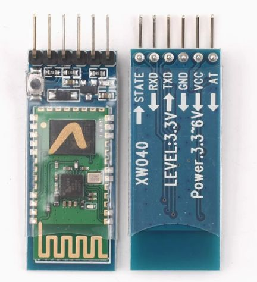
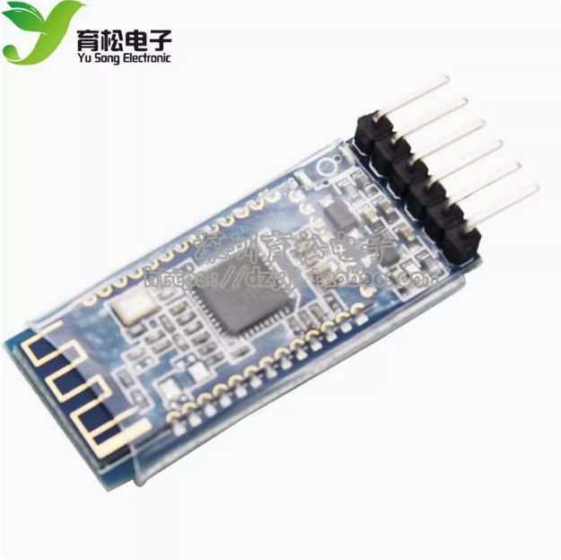
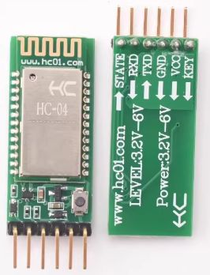
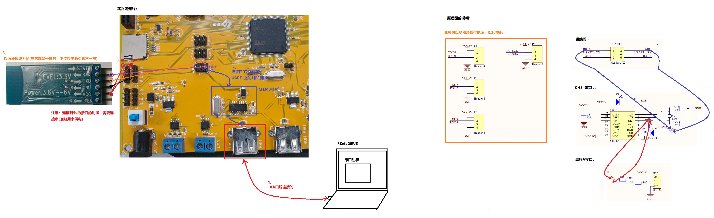
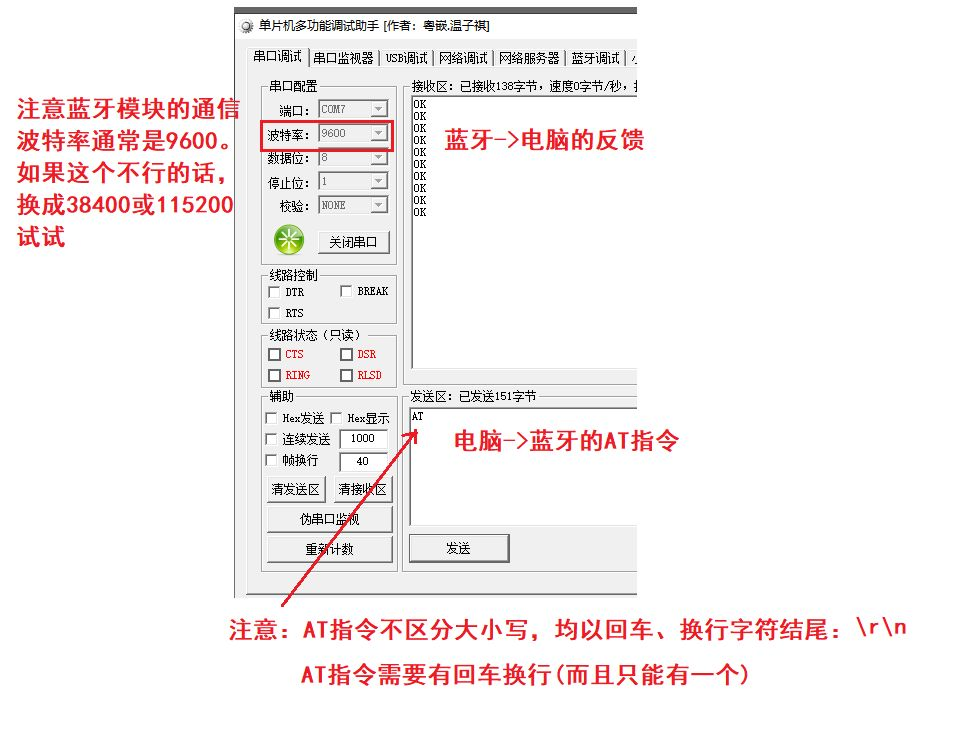
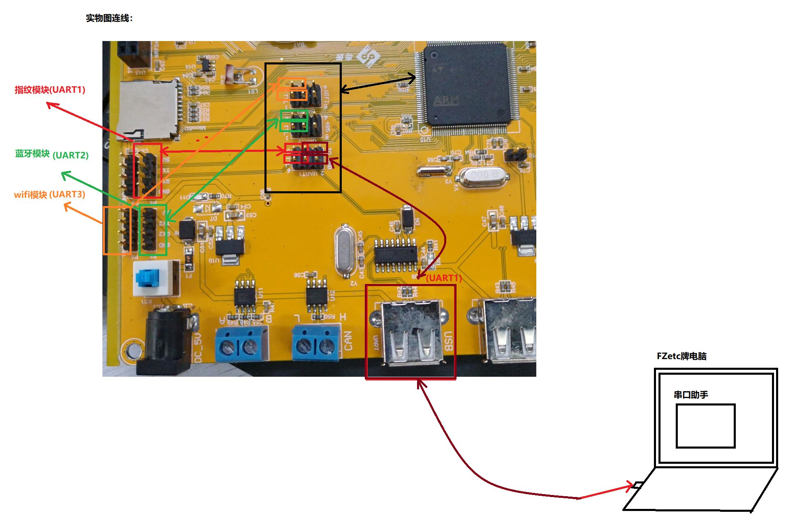
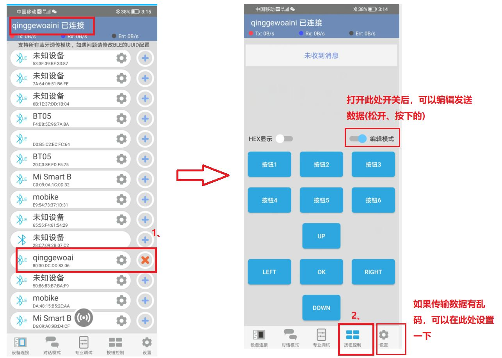

在嵌入式开发中，蓝牙模块是实现无线短距离通信的首选方案。虽然蓝牙协议栈本身极其复杂，但对于开发者而言，由于厂家已经将协议封装在模块内部，其实际开发难度主要在于**串口（UART）通信**以及**模块间的逻辑交互**，而非协议本身。本篇笔记将带你从基础协议选型开始，深入掌握蓝牙模块的配置与实战应用。


## 模块说明
### 蓝牙协议
在选择蓝牙模块之前，必须理解两种核心协议的区别，这直接决定了你的硬件选型和功耗表现

1. SPP（Serial Port Profile，串口协议）：
    是经典蓝牙（Classic Bluetooth）的基石。其核心优势在于模拟传统的物理串口线，数据传输表现为持续的流式数据，稳定性高且简单易用。但缺点是功耗较高，通常用于音频传输、大文件传输或对实时性要求高的工业串口场景
    
2. BLE（Bluetooth Low Energy，低功耗蓝牙）：
    自蓝牙 4.0 以后推出的核心技术，专门为物联网（IoT）设计。它采用间歇性数据交换的方式，数据以数据包形式交互（读/写/通知），灵活性极高且功耗极低，非常适合纽扣电池供电的设备，如传感器、可穿戴设备和 Beacon 基站
核心特性对比表

|**特性**|**SPP (经典蓝牙)**|**BLE (低功耗蓝牙)**|
|---|---|---|
|**蓝牙版本**|经典蓝牙 (2.0/2.1/3.0)|蓝牙 4.0/4.2/5.0/5.1+|
|**核心目标**|稳定、持续的无线数据流|超低功耗、间歇性数据交换|
|**功耗**|高 (适合插电或大电池设备)|**极低** (适合纽扣电池设备)|
|**连接方式**|点对点，虚拟串口|服务器-客户端，基于属性|
|**典型应用**|音频/文件传输、工业串口|物联网、传感器、可穿戴设备|

### 常用模块推荐
- **蓝牙 2.0 模块 (SPP)：** 如经典的主从一体模块 **HC-05**

- **蓝牙 4.0 模块 (BLE)：** 如基于 **CC-2541** 芯片的模块，建议购买带物理按键的版本以便操作

- **蓝牙 5.0 模块：** 如 **HC-04**，通常同时支持 SPP 和 BLE，具备更好的兼容性

    

---

## 三种模式与状态指示

观察 LED 灯的闪烁频率是判断蓝牙工作状态最直观的方法。需要注意的是，不同厂家或不同版本的模块现象可能存在差异
1. **等待连接模式：**
    - **进入方法：** 模块直接供电即可进入 。注意模块通常支持 **3.6V 至 6V** 宽电压供电
    - **现象：** LED 灯**较快闪烁**
2. AT 指令模式：
    此模式用于配置模块的名称、波特率、配对码等关键参数
    - **进入方法：**
        - **HC-05：** 需按住小按键不动。新版本需先按住按键再上电，兼容版上电后按住即可
        - **HC-04 / CC2541：** 通常无需按键，其 AT 指令模式与等待连接模式是并行的
    - **现象：** HC-05 进入后 LED 灯会**缓慢闪烁**（部分版本现象不变），而 HC-04/CC2541 的 LED 灯通常**无变化**
3. **已经连接模式：**
    - **进入方法：** 使用手机端的蓝牙调试器 App 或微信小程序成功连接模块
    - **现象：** **HC-05/04** 表现为 LED 灯**闪烁两次后熄灭**并循环；**CC2541** 则是 LED 灯**常亮**
---

## 获取或配置蓝牙信息 (AT 指令)

在正式开发前，必须先通过电脑串口助手对蓝牙进行初始化配置
1. 硬件连接
你需要通过 USB 转 TTL（如 CH340 芯片）将模块连接至电脑。
- **VCC/GND：** 连接电源，注意若连接到 5V 接口，建议通过串口 A-A 口线辅助供电
- **TXD/RXD：** 交叉连接（模块 TX 接转接头 RX，RX 接 TX）。
    
1. 使用电脑串口助手和蓝牙模块相通信
注意1：先使蓝牙模块进入到AT指令模式下，并实现蓝牙模块和电脑能够相互通信
注意2：不同的蓝牙模块有不同的AT指令，需要查看自己购买的蓝牙模块的资料去执行
1、打开"串口助手"，和蓝牙模块进行通信
2、打开"蓝牙AT指令手册"，依照指令，进行发送获取或修改蓝牙模块的信息

3、不管是哪个蓝牙模块，都可以先发送AT指令测试一下
1. 串口助手设置与测试
- **波特率：** 通常默认为 **9600**。如果失效，请尝试 **38400** 或 **115200** 28
- **发送规范：** AT 指令不区分大小写，但**必须以回车换行符结尾（\r\n）**，且只能有一个回车换行
    

### 核心 AT 指令参考

不同模块的指令集略有不同，建议参考对应的用户手册


| **功能**    | **HC-05 (2.0)**   | **HC-04 (5.0)**   | **CC2541 (4.0)** |
| --------- | ----------------- | ----------------- | ---------------- |
| **测试**    | `AT`              | `AT`              | `AT`             |
| **修改设备名** | `AT+NAME=<Param>` | `AT+NAME=XXX`     | `AT+NAME<Param>` |
| **查询地址**  | `AT+ADDR?`        | `AT+ADDR=?`       | `AT+LADDR`       |
| **修改配对码** | `AT+PSWD=<Param>` | `AT+PIN=1234`     | `AT+PIN<Param>`  |
| **修改波特率** | `AT+UART=<B,S,P>` | `AT+BAUD=19200,E` | `AT+BAUD<Param>` |
| **软件重启**  | `AT+RESET`        | `AT+DEFAULT`      | `AT+RESET`       |

---

## 手机与单片机无线通信
实现单片机控制的关键在于**协议转换**：手机 App 发送指令 -> 蓝牙模块接收并透传 -> 单片机串口接收并解析
1. 硬件连接逻辑
- 连接 A-A 口线给开发板供电
- 将蓝牙模块连接到指定的 UART 接口（如 P5 处的 UART2）
- **跳线帽配置：** 确保 UART2 的跳线帽连接到正确的引脚（如 3-5，4-6）以使能通信电路
    
- **注意：** 即使使用无线通信，也要连接 A-A 口线不是为了通信，是为了给开发板供电

1. 上位机（手机端）准备
- **安卓/鸿蒙：** 在应用市场搜索并下载 **“蓝牙调试器”**
- **苹果 iOS：** 搜索微信小程序 **“蓝牙串口”**
- **技巧：** 开启手机 **定位（GPS）** 功能可以显著增强蓝牙信号的搜索能力
- 在 App 中进入“按钮控制”模式，可以自定义按钮按下时发送的字符串数据（如 `BUZZER_ON#`）

1. 下位机（单片机）程序逻辑
程序的核心在于**波特率匹配** 。如果你的蓝牙模块通过 AT 指令设置了 9600，单片机的程序初始化也必须是 9600
**代码逻辑示例：**
```c
// 一、外设初始化区域
void Hardware_Init(void)
{
    // 设置中断优先级分组为 2（抢占优先级 4 级，响应优先级 4 级），确保系统中断逻辑清晰 
    NVIC_PriorityGroupConfig(NVIC_PriorityGroup_2); 

    // 初始化系统滴答定时器，设置时钟频率（如 168MHz），用于后续程序中的精准延时 
    DELAY_SysTickInit(168); 

    // 基础硬件初始化：配置 LED、按键以及蜂鸣器相关的 GPIO 引脚 
    LED_Init();
    KEY_Init();
    BUZZER_Init();

    // 【关键】初始化蓝牙模块连接的串口（UART2），波特率必须与蓝牙模块 AT 指令设置的 9600 完全一致 
    UART2_Init(9600); 

    // 向串口发送调试字符串，若连接成功，手机端的“蓝牙调试助手”将收到此握手信息 
    UART2_SendStr("This is UART2(蓝牙模块)测试!\r\n");
}

// 二、外设功能工具化区域（主循环）
int main(void)
{
    Hardware_Init(); // 执行上述初始化 

    while(1)
    {
        // 实验：通过接收手机端发送的命令来控制开发板硬件 
        // u2_flag 是在串口接收中断中定义的标志位，当接收到完整的数据包（如以特定字符结尾）时置 1 
        if (u2_flag == 1)
        {
            // 使用自定义库函数 MY_LIB_CmpArray 进行字符串比对 
            // 参数说明：接收缓冲区、对比字符串、字符串长度。若返回 0 则代表指令匹配 
            
            // 检查指令是否为 "BUZZER_ON#"（开启蜂鸣器指令） 
            if (MY_LIB_CmpArray((int8_t *)u2_recvbuf, (int8_t *)"BUZZER_ON#", 10) == 0)
            {
                BUZZER(ON); // 执行开启操作 
            }

            // 检查指令是否为 "BUZZER_OFF#"（关闭蜂鸣器指令） 
            if (MY_LIB_CmpArray((int8_t *)u2_recvbuf, (int8_t *)"BUZZER_OFF#", 11) == 0)
            {
                BUZZER(OFF); // 执行关闭操作 
            }

            // 【重要】指令处理完毕后，必须手动清空接收缓冲区 
            // 同时重置接收计数器 u2_count 和标志位 u2_flag，防止程序重复进入判断逻辑 
            MY_LIB_ClearArray((int8_t *)u2_recvbuf, 128); 
            u2_count = 0; 
            u2_flag = 0; 
        }
    }
}
```

通过这种方式，你可以将原本需要线缆连接的串口实验，轻松升级为跨空间的无线控制实验。